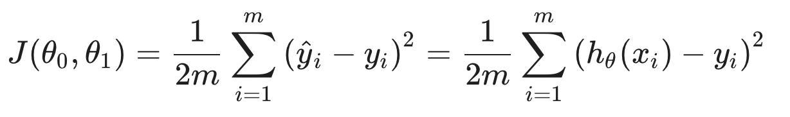
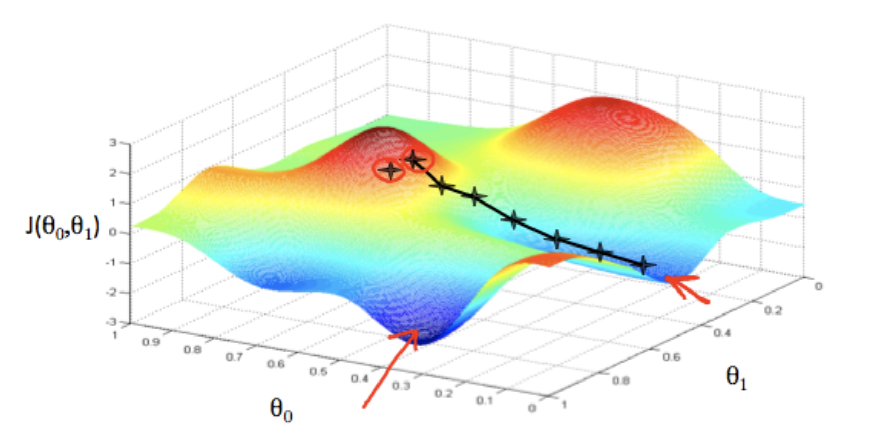
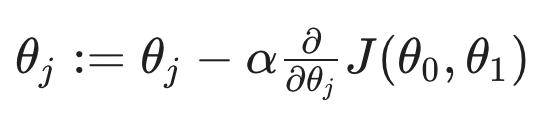

## Machine Learning

Aruthr Samuel(1959) - 컴퓨터가 체스를 스스로 학습하도록 함  
Tom Michell(1998) - 특정 작업(T)에 대한 경험(E)과 성능측정(P)으로부터 컴퓨터 프로그램이 학습하는것

> "A computer program is said to learn from experience E with respect to some class of tasks T and performance measure P, if its performance at tasks in T, as measured by P, improves with experience E."

## Supervised / Unsupervised

- `Supervised Learning` : 알고리즘에게 정답이 포함된 data set(Training Set)을 준 뒤, input과 output의 관계를 찾아 더 많은 정답을 예측해내는 학습방식
  - Regression problem : output의 후보군이 연속적일 때
  - Given a picture of a person, we have to predict their age on the basis of the given picture
  - Classification problem : input의 사례들이 불연속적(이산적)일 때
  - Given a patient with a tumor, we have to predict whether the tumor is malignant or benign.
- `Unsupervised Learning` : 정답이 없는 데이터들을 clustering하여 structure를 규명하는것. 이때 예측의 결과에 기반한 피드백이 존재하지 않는다.
  - Clustering: Take a collection of 1,000,000 different genes, and find a way to automatically group these genes into groups that are somehow similar or related by different variables, such as lifespan, location, roles, and so on.
  - Non-clustering: The "Cocktail Party Algorithm", allows you to find structure in a chaotic environment. (i.e. identifying individual voices and music from a mesh of sounds at a cocktail party).

---

### 표기법

- `x` : input 또는 feature(특성)
- `y` : output 또는 "target" variable(예측값)
- `(x,y)` : 하나의 Training example
- `m` : Training example의 개수(즉, Training Set의 크기)
- `h` : hypothesis, x에서 y까지 도달하는 과정(=지도)

## Cost Function

가설함수의 정확도를 판단할 수 있는 수단이 되는 함수이다.

위의 식을 보면, 실제 input인 x를 가설함수에 적용시켰을때 나오는 값과, 실제의 output이었던 y를 비교한뒤 fancy하게 평균내는 것을 볼 수 있다.  
**이 차이를 최소화하는 h를 찾는것**이 우리의 목적이며, Cost Function은 h의 정확도를 평가하기 위한 수단이다.

위에서 소개한 Cost Function J말고도 다른 대안 비용함수들이 많다. 위에서 소개한 것은 _Squared error function_ 또는 _Mean square function_ 이라고 한다.
이것은 Gradient Descent 계산을 위해 편의적으로 1/2(mean)처리하였다는 것을 의미한다.

## Gradient Descent

### outline

- 임의의 파라미터 θ(들)로부터 시작(일반적으로 default는 모든 파라미터들을 0으로 두는것)
- 기존의 파라미터들을 Cost Function J의 최소값에 도달할 때까지 갱신(하강)한다.
- 최소값에 도달했다는 것은, 해당 파라미터가 주어진 dataset을 가장 잘 표현(비슷하게 묘사)하는 함수의 파라미터라는 것을 의미한다.

### Description

경사하강법은 위와 같이 임의의 지점(파라미터 θ)으로부터 시작해 갱신해나가므로, 위의 그림과 같이 **지역적 최소값**에 도달하게 된다.

### Algorithm

이 때, `α`는 **Learning Rate**를, 그 뒤는 **미분계수**를 의미한다.

<Warning>
  여러개의 파라미터를 갱신할 경우, 반드시 모든 파라미터를 한번에 몰아서
  갱신해야한다. 중간중간 갱신해버리면, Cost Function J의 파라미터가 뒤섞이게
  된다.
</Warning>
