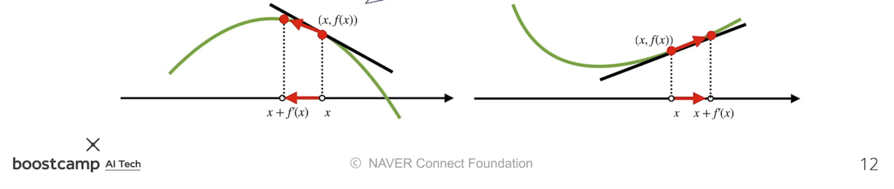
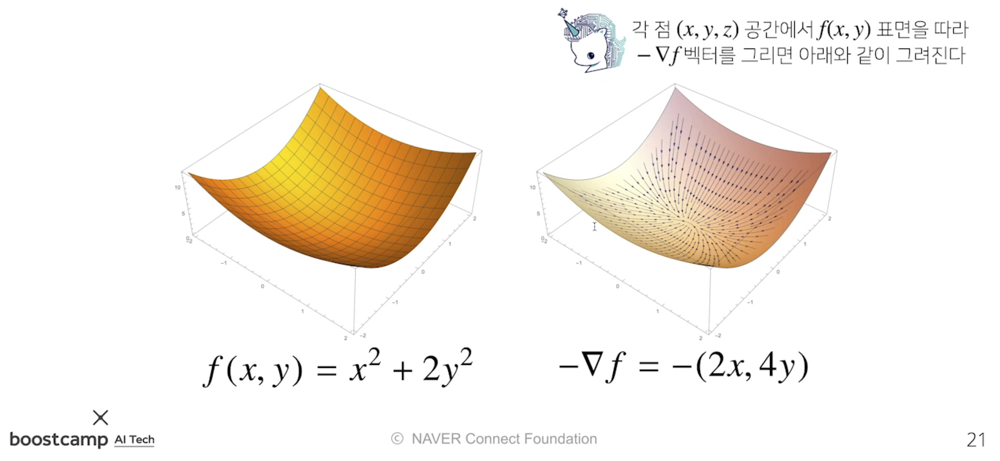
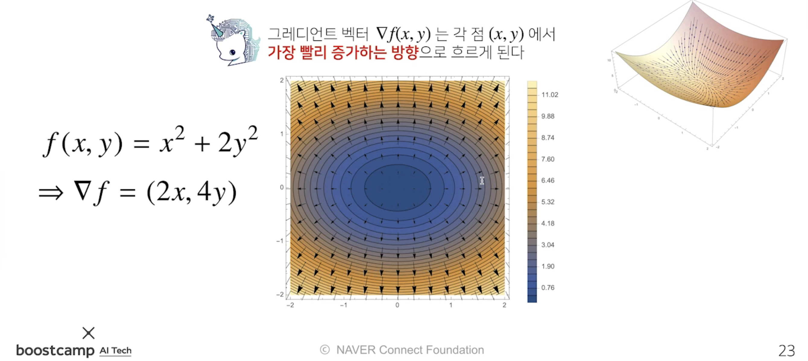
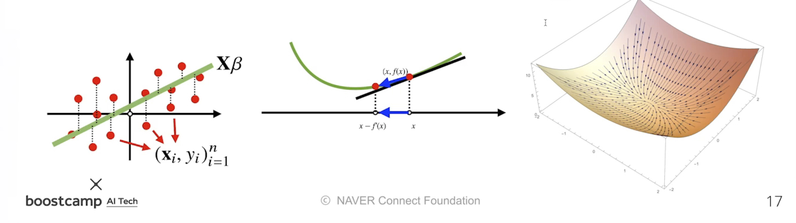
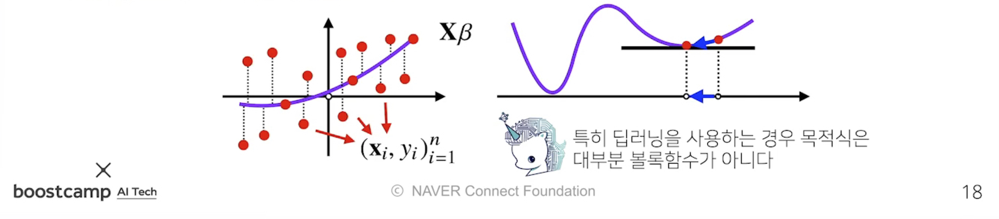
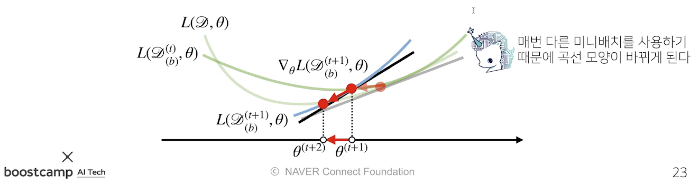
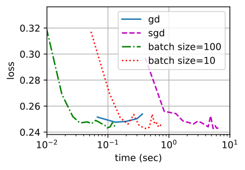

본 정리 내용은 [Naver BoostCamp AI Tech](https://boostcamp.connect.or.kr/)의 edwith에서 수강한 내용을 정리한 것입니다.  
사실과 다른 부분이 있거나, 수정이 필요한 사항은 댓글로 남겨주세요.

---

# 경사하강법

## 미분(differentiation)

**`미분`**은 **변수의 움직임에 따른 함수값의 변화를 측정하기 위한 도구**로, 최적화에서 가장 많이 사용되는 기법이다.

Python은 `sympy.diff`를 이용해 미분을 계산할 수 있다.

```python
import sympy as sym
from sympy.abc import x

sym.diff(sym.poly(3*(x**2) + 5*x + 1), x) # 다항함수를 x로 미분하라
# Poly(6𝑥+5,𝑥,𝑑𝑜𝑚𝑎𝑖𝑛=ℤ)
```
#

### 미분의 의미

미분은 함수 $f$의 주어진 점 $(x,f(x))$에서의 **`접선의 기울기`**를 구하는 과정이다.

한 점에서 접선의 기울기를 알면, 어느 방향으로 움직여야 함수값이 **증가 /** **감소**하는지 알 수 있다.

2차원에서의 그래프를 보면 쉽게 어느 방향으로 움직여야 할 지 알 수 있지만, 10차원, n차원 등의 고차원에서는 이를 추측하기 어렵다. 따라서 미분값을 이용해 값의 변경 방향을 알 수 있다.
#

#
- 이 때, **<U>함수 값을 증가시키고 싶다면 미분값을 더하고, 감소시키고 싶으면 미분 값을 뺀다.</U>**
    - 미분값이 `양수`이면, 증가하는 기울기에 있으므로 `미분값을 더했을 때`  $x + f'(x)>x$ , 오른쪽으로 이동하여 `함수값이 증가`하게 된다.
    - 미분값이 `음수`이면, 감소하는 기울기에 있으므로 `미분값을 더했을 때`  $x + f'(x) < x$ , 왼쪽으로 이동하여 `함수값이 증가`하게 된다.
    - 미분값이 `양수`이면, 증가하는 기울기에 있으므로 `미분값을 뺐을 때`  $x - f'(x)<x$ , 왼쪽으로 이동하여 `함수값이 감소`하게 된다.
    - 미분값이 `음수`이면, 감소하는 기울기에 있으므로 `미분값을 뺐을 때`  $x - f'(x)>x$ , 오른쪽으로 이동하여 `함수값이 감소`하게 된다.

### 미분을 어디에 사용할까? - 경사법

이와 같이,

- 미분값을 더하는 것을 **`경사상승법(gradient ascent)`**라고 하며 함수의 극대값 위치를 구할 때 사용한다.
- 미분값을 빼는 것을 **`경사하강법(gradient descent)`**라고 하며, 함수의 극소값 위치를 구할 때 사용한다.
    - - **`Full Batch Gradient Descent`**이라고도 부른다.
- **`경사상승법`**/**`경사하강법`**은 극값에 도달하면 미분값이 0이므로 더이상 업데이트가 되지 않아 움직임을 멈춘다.
    - AI에서는, 목적함수 최적화가 자동으로 끝났음을 의미한다.

```python
'''
Input: gradient, init, lr, eps
Output: var
'''
# gradient : 미분을 계산하는 함수
# init : 시작점, lr : 학습률, eps : 알고리즘 종료 조건

var = init
grad = gradient(var)
# 컴퓨터로 계산할 때 미분이 정확히 0이되는 것은 불가능하다.
# 따라서, 충분히 작을 때(eps보다 작을때) 종료하는 조건이 필요하다.
while(abs(grad) > eps):
	# lr은 학습률로, 미분을 통해 업데이트하는 '속도'를 조절한다.
	var = var - lr * grad
	# 종료조건이 성립하기 전까지는 미분값을 계속 업데이트한다.
	grad = gradient(var)
```
#

## Gradient 벡터

### 변수가 벡터라면

그런데 입력값이 이차원 공간의 점이 아니라, **n차원 공간의 점인 벡터**라면 어떨까? 그래프를 따라 왼쪽, 오른쪽으로만 이동하는 것이 아니라, **n차원이기 때문에 굉장히 많은 방향으로 이동할 수 있을 것**이다. 이 경우 단순한 미분으로는 함수값의 변화을 측정하기 힘들다.

이처럼 벡터가 입력값인 다변수 함수의 경우, **`편미분(partial differentiation)`**을 사용한다.

$$
\partial_{x_{i}}f(x) = \lim\limits_{h\to0}\frac{f(x+h\bold{e_i}) - f(x)}{h}
$$

이 때, $\bold{e_i}$는 $i$번째 값만 1이고 나머지는 0인 단위벡터($I$) 를 의미한다.

편미분도 `sym.diff` 로 계산이 가능하다. `x`, `y`등의 변수를 여러 개 사용한 다변수 함수(`sim.poly`)를 집어넣으면 된다.

```python
import sympy as sym
from sympy.abc import x,y

sym.diff(sym.poly(3*(x**2) + 5*x*y + 2*y + 1) + sym.cos(2*x + 2*y), x)
# 6𝑥+5𝑦−2sin(2𝑥+2𝑦)
```

#

$$
\nabla f= (\partial_{x_1}f,\partial_{x_2}f,\cdots,\partial_{x_d}f)
$$

각 변수별로 편미분을 계산한 **`gradient 벡터`**를 경사하강법/경사상승법에 이용할 수 있다.

위의 식에서 삼각형을 거꾸로 뒤집어놓은 모양의 기호를 `nabla` 라고하는데, $f'(x)$ 대신 벡터 $\nabla$를 이용해서 변수 $x= (x_1,\cdots,x_d)$를 동시에 업데이트할 수 있다.

3차원공간 상에 다음과 같이 다변수 함수를 표현한다고 생각해보자.
#

#
이 때, 이를 등고선으로 옮기면 다음과 같다.
#


- gradient 벡터 $\nabla f(x,y)$ 는 각 점 $(x,y)$에서 **가장 빨리 증가하는 방향**과 같다.
- gradient 벡터 $-\nabla f$는 $\nabla(-f)$와 같고, 이는 각 점 $(x,y)$에서 **가장 빨리 감소하는 방향**과 같다.

이는 임의의 차원 $d$ 에서도 성립한다.
#

### 변수가 벡터일때의 경사하강법

변수가 벡터로 바뀌었을 때, 경사하강법의 알고리즘은 종료 조건 하나만 바뀌면 된다.

```python
# 경사하강법 with 벡터
'''
Input: gradient, init, lr, eps
Output: var
'''
# gradient : "Gradient 벡터"를 계산하는 함수
# init : 시작점, lr : 학습률, eps : 알고리즘 종료 조건

var = init
grad = gradient(var)
# 절대값(abs) 대신 norm을 계산해서 종료 조건을 설정한다.
while(norm(grad) > eps):
	var = var - lr * grad
	grad = gradient(var)
```
#

## 경사하강법으로 선형회귀 계수 구하기

기존에 무어-펜로즈 역행렬을 이용하여 선형회귀모델을 구했었는데, 이는 경사하강법으로도 구해볼 수 있다.
#

### 풀이

선형회귀의 목적식은 $\Vert y - X\beta\Vert_2$이고,  선형회귀의 목적은 이를 최소화하는 $\beta$를 찾는 것이다.

따라서 목적식을 $\beta$로 미분한다음, 주어진 $\beta$에서 미분값을 뺀다면, 경사하강법 알고리즘으로 최소에 해당하는 점을 구할 수 있다.

#

다음과 같은 Grdient 벡터를 구해보자.
#
$$
\nabla_\beta\Vert y - X\beta\Vert_2 = (\partial_{\beta_1}\Vert y-X\beta\Vert_2,\dots,\partial_{\beta_d}\Vert y-X\beta\Vert_2)
$$
#
이 때 $\beta$ 의 k번째 계수에 해당하는 $\beta_k$를 가지고 목적식을 편미분하는 식을 풀어서 보면 아래와 같은 식이 된다.
#
$$
\partial_{\beta_k}\Vert y-X\beta\Vert_2 = \partial_{\beta_k}\{\frac{1}{n}\displaystyle\sum_{i=1}^n(y_i-\displaystyle\sum_{j=1}^dX_{ij}\beta{j})^2\}^{\frac{1}{2}}
$$

<Primary>
귀찮더라도 위 편미분 과정을 꼭 직접 유도해보도록 하자.
</Primary>

#
여기서 조심할 점은, **일반적인 수학의 $L_2-norm$과 풀이 방식이 살짝 다르다는 것**이다.

여기서 사용하는 $L_2-norm$은 모델 학습에 사용되는 것이므로, n개의 데이터셋을 가지고 있다는 가정하에 출발한다. 따라서 단순히 $\textstyle\sum_{i=1}^n$에 $\sqrt{}{}$을 바로 씌우는 것이 아니라, **<U> $1/n$로 평균 내준 뒤에</U>** 씌워준다.

이 때에 사용되는 loss는 **`RMSE(Root Mean Squared Error)`**이다. 다음과 같은 도출과정을 따른다.
- 벡터의 거리는 $L_2-norm$으로 계산한다.
- **`SE(Sqaured Error)`**는 각 데이터별로 정답과 예측 벡터의 차이를 $L_2-norm$의 제곱으로 계산한다.
- **`MSE (Mean Squared Error)`**는 `SE`를 데이터의 숫자만큼 나누어준다.(평균내기)
- **`RMSE (Root Mean Squared Error)`**는 `MSE`에 제곱근을 취해준다.

사실 정확히 쓰면 기대값 기호를 붙여 $\mathbb{E}[\Vert y-X\beta \Vert_2]$라고 써야하지만,  
norm의 기호가 원래 확장성이 있기도 하고, 관용적으로 **`RSME`**를 $L_2-norm$처럼 쓴다고 한다.


#
이를 계산하여 정리하면 다음과 같다.
#
$$= -\frac{X^T_{\cdot k}(y-X\beta)}{n\Vert y-X\beta\Vert_2}$$
#
- 원래 목적식이었던  $L_2-norm$  $\Vert y - X\beta\Vert_2$는 분모로 간다.
- $L_2-norm$ 을 씌우기 전의 식인 $y-X\beta$와, 행렬 $X$의 $k$번째 열벡터를 전치($T)$시킨 행렬을 곱해준 것이 분자로 가게 된다.
    - 이 때, $X^T_{\cdot k}$는 결국 $X\beta$를 계수 $\beta$에 대해 미분한 결과인 $X^T$과 같다.
- 이 식은 곧 $\beta_k$, 즉  k번째 계수에 대한 편미분과 같다.
#
이제, 목적식을 최소화하는 $\beta$를 구하는 경사하강법 알고리즘을 다음과 같이 표현할 수 있다.

$$\beta^{(t+1)}\larr \beta^{(t)} - \lambda\nabla_\beta\Vert y-X\beta^{(t)}\Vert$$

$$\beta^{(t+1)}\larr \beta^{(t)} + \frac{\lambda}{n}\frac{X^T(y-X\beta^{(t)})}{n\Vert y-X\beta^{(t)}\Vert_2}$$
#
- t번째 단계에서의 $\beta$를 $\beta^{(t)}$로 정의한다.
- **`경사하강법`**은 **함수값을 최소화시키기 위하여 $x$에서 미분값($f'(x))$을 빼는 것으로 업데이트시켜주는 방식**이다.
- 여기에서는 기존의 식을 다변수 함수에 적용시키는 것이다.
- **목적식을 최소화시켜야하므로 $\beta$에서 (편)미분값 $\lambda\nabla_\beta\Vert y-X\beta^{(t)}\Vert$를 빼주는 것으로 업데이트**한다.
- 이때 편미분 값을 위에서 구했던 식으로 치환하면, (기존의 식이 음수였으므로 부호가 양수로 바뀐) 두번째 식을 얻을 수 있다.
#
이와 같이 계산하게되면 사실 제곱근을 계산하는 것이 다소 귀찮은 편인데, 어차피 $L_2-norm$을 최소화하는 것이나 $(L_2-norm)^2$을 최소화하는 것이나 방향은 같다.

따라서 **<U>Gradient 벡터 계산의 편의를 위해 $\Vert y - X\beta\Vert_2$가 아닌 $\Vert y - X\beta\Vert^2_2$를 최소화하기도 한다.</U>**

$$\nabla_\beta\Vert y - X\beta\Vert_2^2 = (\partial_{\beta_1}\Vert y-X\beta\Vert_2^2,\dots,\partial_{\beta_d}\Vert y-X\beta\Vert_2^2)$$

$$= -\frac{2}{n}X^T(y-X\beta)$$
#
이 경우, 경사하강법 알고리즘도 다음과 같이 비교적 간단해지게 된다.

$$\beta^{(t+1)}\larr \beta^{(t)} + \frac{2\lambda}{n}X^T(y-X\beta^{(t)})$$
#

### 경사하강법 기반 선형회귀 알고리즘

실제 값과 계산 값의 차이 $y-X\beta$를 **`Error Term` 이라고 정의하자.**

 $X^T$에 에러텀을 곱한 값이 곧 **`Gradient 벡터`**가 된다는 것을 앞에서 수식으로 증명했으므로,  이것을 이용해서 $\beta$를 업데이트하는 경사하강법 알고리즘을 짜보면 다음과 같다.
#
```python
'''
Input: X, y, lr, T
Output: beta
'''
# norm : L2-노름을 계산하는 함수
# lr: 학습률, T: 학습횟수

# 기존의 eps처럼 gradient 벡터가 특정 값 이하로 떨어질 때까지 수행할수도 있지만,
# 특정 시간동안만 학습하도록 시간을 제한하고 싶다면 횟수 T를 지정해 줄 수도 있다.
for t in range(T):
	# L2-norm의 제곱을 계산해서 beta를 업데이트한다.
	error = y - X @ beta
	grad = - transpose(X) @ error
	beta = beta - lr * grad
```
#
위와 같은 경사하강법 알고리즘을 이용해, 무어-펜로즈 역행렬을 사용하지 않고도 계수 $\beta$를 찾을 수 있다.
#
```python
# numpy를 활용한 경사하강법 수행 예시

import numpy as np

X = np.array([[1,1],[1,2],[2,2],[2,3]])
y = np.dot(X, np.array([1,2])) + 3

beta_gd = [10.1, 15.1, -6.5] # [1,2,3]이 정답 - 지금 값은 무작위 값
# intercept항 추가
# y 절편을 추가하면, y = ax + b의 b가 bias term의 역할을 해서 계산이 용이하다.
X_ = np.array([np.append(x,[1]) for x in X])

for t in range(5000):
    error = y - X_ @ beta_gd
    # error = error / np.linalg.norm(error)
    grad = - np.transpose(X_) @ error
    beta_gd = beta_gd - 0.01 * grad

print(beta_gd)
# [1.00000367 1.99999949 2.99999516]
```

<Warning>

위의 식에서는 학습률과 학습횟수를 크게 다루지 않았지만, 실제 적용에서는 학습률과 학습 횟수가 중요한 hyperparameter가 된다.
학습률과 학습 횟수에 대해서는 이후 구현과정에서 더 상세하게 다뤄보자.

</Warning>

#

### 경사하강법이 수렴하지 않을 때 - 확률적 경사하강법


#
이론적으로, 경사하강법은 미분가능하고 볼록(convex)한 함수에 대해서는, **적절한 학습률과 학습횟수를 선택했을 때 수렴이 보장**되어있다.

특히, 선형회귀의 목적식 $\Vert y - X\beta\Vert_2$는 **회귀계수 $\beta$에 대해 볼록함수**이므로, 알고리즘을 충분히 돌렸을 경우 수렴이 보장된다.

그러나, **비선형회귀** 문제의 경우 목적식이 볼록하지 않을 수 있으므로, **수렴이 항상 보장되지는 않는다**.
#

#
특히 **딥러닝을 사용하는 경우는 목적식이 대부분 볼록함수가 아니므로**,

이 경우 일반적인 경사하강법이 아닌 **`확률적 경사하강법(Stochastic Gradient Descent,SGD)`**을 사용한다.

확률적 경사하강법은 모든 데이터를 사용해서 업데이트 하는 대신에, **데이터 하나 또는 일부를 활용하여 업데이트**하는 방식이다.

- 이 때 데이터 하나만 활용하는 경우는 그냥 `SGD` 라고 부른다.
- 데이터 일부는 **`Mini Batch`** 라고 하며, 미니 배치를 사용하는 경우를 **`Mini Batch SGD`** 라고 부른다.
    - 데이터를 하나만 사용하는것보다 효율이 더 좋다.
    - 따라서 오늘날 `SGD` 는 **미니 배치를 활용하는 경우가 대부분**이며, 이로 인해 `Mini Batch SGD`를 그냥 **`SGD`**라고 축약해 부르기도 한다.
#
볼록함수가 아닌(non-convex) 목적식은 **`SGD`**를 통해 다음과 같이 최적화할 수 있다.

$$\theta^{(t+1)}\larr\theta^{(t)}-\widehat{\nabla_\theta}$$

학습률과 학습횟수를 고려해야하기 때문에 SGD가 만능은 아니지만, **딥러닝의 경우는 SGD가 경사하강법보다 실증적으로 더 낫다**고 시간에 걸쳐 검증된 상태이다.

- 일부만 사용하더라도, 모든 데이터를 활용한 Gradient 벡터와 기댓값이 유사하다는 것이 확률적으로 검증되었다.
- 또한, 더 적은 데이터를 가지고 업데이트할 수 있으므로 **연산자원을 더 효율적으로 활용**할 수 있다.
    - 전체 데이터$(X,y)$를 쓰지 않고 미니배치 $(X_{(b)},y_{(b)})$를 사용해 업데이트하므로 연산량이 $\frac{b}{n}$으로 감소한다.
#

### 확률적 경사하강법의 원리 : 미니배치 연산

`경사하강법(GD)`은 전체 데이터를 이용해서 목적식의 gradient 벡터를 계산한다.
#

#
반면, `SGD`는 미니배치를 가지고 gradient 벡터를 계산한다. 미니배치는 확률적으로 선택된 데이터 묶음이므로 **매 step마다 다른 미니배치를 사용할 때마다 목적식의 모양이 점점 바뀌게 된다**.

- 그렇지만 방향은 얼추 비슷할 것이다.
- 이렇게 목적식의 모양이 바뀌게 되면서, **`경사하강법`에서는 미분값이 0이되는 극소점이 `SGD`에서는 극소값이 아니게 된다.**
- **<U>즉, local minimun(극소점)을 탈출할 수 있다.</U>**
    - 이 원리로 non-convex 함수에서도 최소점을 찾는 데에 활용할 수 있다.
    - 극소점을 탈출할 수 있으므로 global minimum을 탈출할 수도 있다.
        - 이는 `SGD`의 단점 중 하나로, global minimum 근처까지는 빠르게 수렴하지만 정작 정확한 global minimum 극소값에는 도달하지 못하고 진동하는 경우가 많다.
        - 반면, `GD`는 연산량과 시간이 많이 필요하지만 전체 배치를 통해 모든 점에서 일정한 목적식을 사용하여 global minimum으로 `확실히` 수렴 가능하다.(convex function인 경우)
        - 이와 같은 `SGD`의 문제점은 learning rate를 점점 줄여나가는 방식으로 step size를 줄임으로써 어느정도 해결할 수 있다.
- 반대로 말하자면, 일반적인 `GD`은 **매 step 목적식이 바뀌지 않으므로 local minimum 도달시 탈출이 불가능**하다.




<p style="text-align:center;">(출처: Dive into Deep Learning)</p>

#

`SGD`는 볼록이 아닌 목적식에서도 사용 가능하므로 **경사하강법보다 머신러닝 학습에 더 효율적**이다.

- 다만, 경사하강법처럼 정확하게 gradient 벡터를 계산해서 흐르는것이 아니므로, **이동방향이 좀 튀는 경향**이 있다.
- 그렇지만, 결국 데이터를 가지고 gradient 벡터를 계산해서 움직이기 때문에 **최솟점으로 향한다는 것은 같다**.
- 또한, 미니배치를 가지고 연산하므로, 각각의 gradient 벡터 계산에 있어서 **연산속도가 훨씬 빠르다**.

<Primary>

단, SGD에서는 기존의 경사하강법에서 고려했던 학습률(learning rate), 학습횟수(T)에 더해 미니배치 사이즈까지 고려하여 학습해야한다.

</Primary>

#

### 확률적 경사하강법의 원리 : 하드웨어

오늘날 딥러닝의 데이터는 굉장히 많고 사이즈도 크기 때문에, 하드웨어상 경사하강법에 한계가 있다. 일반적인 경사하강법을 사용하여 모든 데이터를 업로드하면, Out-of-memory 오류가 뜨는 경우가 생긴다.

따라서 이러한 점에서  `SGD`는 필수적인 알고리즘으로 사용되고 있다. 미니배치로 쪼갠 데이터를 활용하여 경사하강법을 업데이트할 수 있으므로 **좀 더 빠른 연산이 가능**하고, 하드웨어의 한계를 극복해 **GPU로 병렬연산**하는것이 가능해진다.

왜 CPU가 아닌 GPU로 연산하는것이 좋은지 궁금하다면 다음 링크를 참조하자.

[CPU와 GPU의 차이](https://light-tree.tistory.com/25?category=755497)  
[The Continuing Importance of GPUs For More Than Just Pretty Pictures - MCADCafe Editorial](https://www10.mcadcafe.com/blogs/jeffrowe/2017/03/16/the-continuing-importance-of-gpus-for-more-than-just-pretty-pictures/)