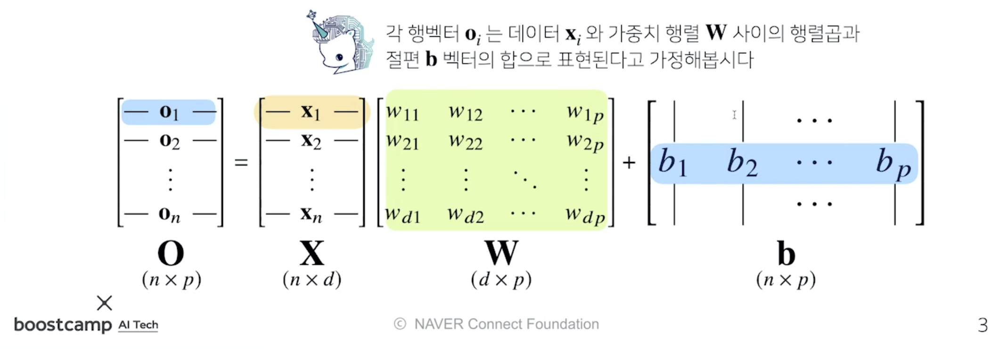
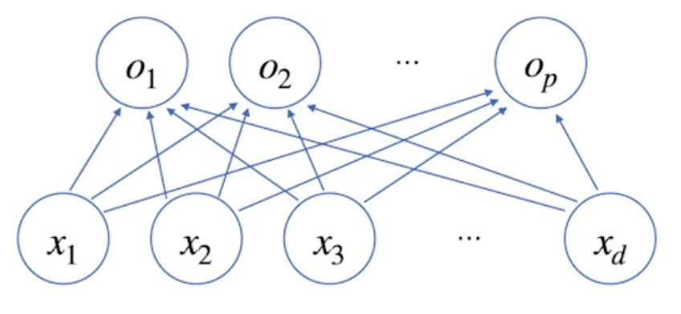
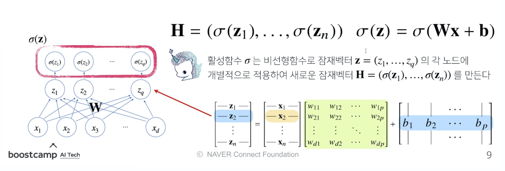
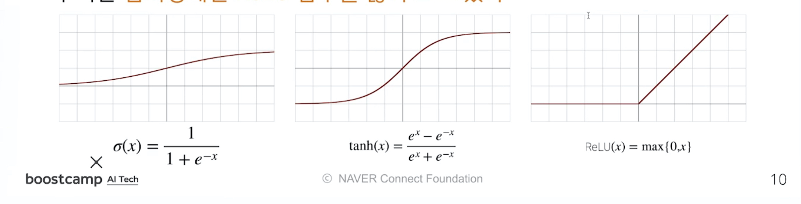
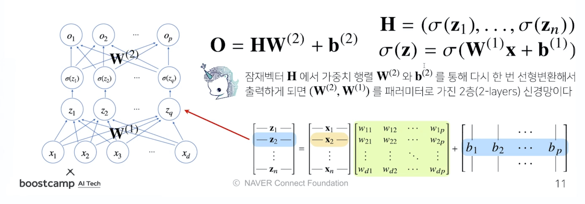
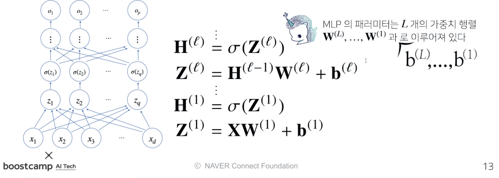
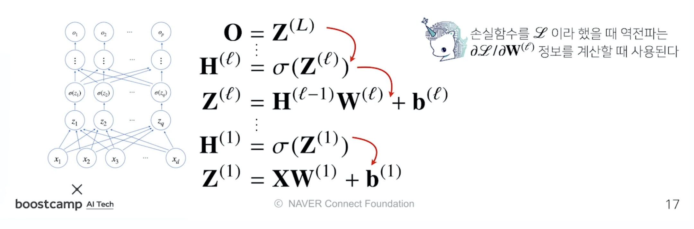
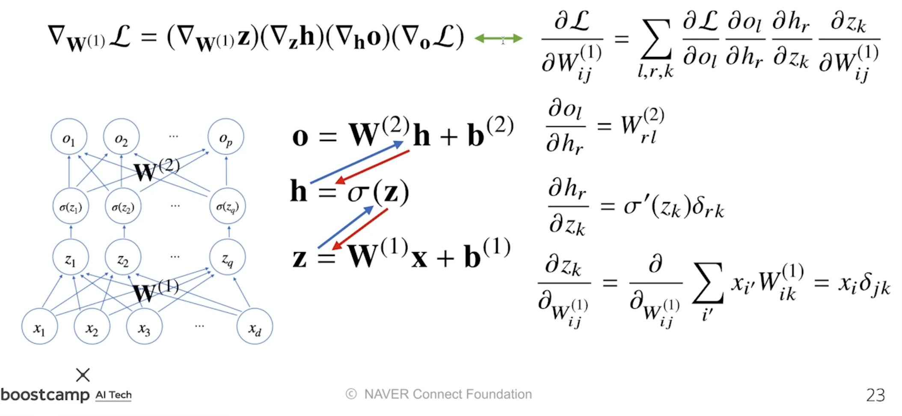

본 정리 내용은 [Naver BoostCamp AI Tech](https://boostcamp.connect.or.kr/)의 edwith에서 수강한 내용을 정리한 것입니다.  
사실과 다른 부분이 있거나, 수정이 필요한 사항은 댓글로 남겨주세요.

---

# 딥러닝의 학습방법

## 선형모델

지난시간까지, 데이터를 선형모델로 해석하여 $y$값과 선형모델 예측값 $\hat{y}$의 차이의 $L2-norm$의 기댓값을 최소화하는 $\beta$를 찾는것이었다.

$$
{\underset{\beta}{min}} \mathbb{E}\Vert y- \hat{y}\Vert_2
$$

그러나, 이러한 선형 모델은 단순한 선형문제를 푸는데에는 사용할 수 있겠지만, 분류(classification)이나 더 복잡한 패턴의 문제를 제대로 예측하기가 어렵다.

따라서, 이제부터는 비선형모델인 **`신경망(Neural Network)`**를 사용해 보자.

신경망은 비선형모델이지만, **내부적으로는 선형모델들의 결합을 기반**으로 만들어져있다.

#

## 신경망의 수식 표현

### 선형 모델



$$
\underset{(n\times p)}{O} = \underset{(n\times d)}{X} \underset{(d\times p)}{W} + 
\underset{(n\times p)}{b}
$$

- **전체 데이터**가 모인 행렬 $X$
    - $X$의 한 **행벡터**는 하나의 점으로 표현되는 **데이터 포인트**이다.
- $X$의 데이터를 출력 $O$로 보내주는 가중치 행렬 $W$
    - $X$의 데이터를 **다른 공간으로 보내주는** 역할을 한다.
- $y$ 절편에 해당하는 행벡터를 모든 행에 복제하여 만든 절편 행렬 $b$
    - 각 행들은 전부 같은 값 $[b_1, b_2, \cdots, b_p]$를 가진다.

#
<U>이 때, 출력벡터 차원(열)은 기존의 $X$ 벡터 차원 $d$ 에서 $p$ 로 바뀌게 된다.</U>



#
이는 **<U>$d$ 개의 변수로 $p$ 개의 선형 모델을 만들어서 $p$ 개의 잠재변수를 설명하는 모델</U>**과 동일한 의미이다.
 

- 위의 그림에서 **화살표**는 가중치 $W$를 의미한다. 즉, 화살표의 갯수는 $d \times p$ 가 된다.

#

### 소프트맥스(softmax) 연산

**`소프트맥스`** 함수는 **모델의 출력을 확률로 해석**할 수 있게 변환해주는 연산이다.

**분류 문제**를 풀 때 선형모델과 소프트맥스 함수를 결합하여 예측할 수 있다.

#
$$softmax(o) = \left ( \frac{exp(o_1)}{\sum_{k=1}^{p}exp(o_k)}, \cdots , \frac{exp(o_p)}{\sum_{k=1}^{p}exp(o_k)} \right )$$
#
- 선형모델의 출력 $O$ 의 행벡터를 softmax함수의 $o$ 로 집어넣는다.
- softmax 함수는 입력을 확률벡터로 변환시켜 출력한다.
    - 주어진 데이터가 특정 클래스에 속할 확률이 얼마인지를 계산한다.

Python으로 구현한 코드는 다음과 같다.

#

```python
def softmax(vec):
	# 수식과 달리, np.max값을 취해주는 과정이 추가되어 있다.
	# softmax는 지수함수를 취하므로, 너무 큰 값이 들어왔을 경우 overflow가 생길 위험이 있다.
	# 이를 방지하기 위해 np.max 값을 vector에다 빼 준 뒤 해당 값을 input으로 적용한다.
	denumerator = np.exp(vec - np.max(vec, axis=-1, keepdims=True))
	numerator = np.sum(denumerator, axis=-1, keepdims=True)
	val = denumerator / numerator
	return val

vec = np.array([[1,2,0], [-1,0,1], [-10,0,10]])
softmax(vec)
'''
array([[2.44728471e-01, 6.65240956e-01, 9.00305732e-02],
       [9.00305732e-02, 2.44728471e-01, 6.65240956e-01],
       [2.06106005e-09, 4.53978686e-05, 9.99954600e-01]])

[1,2,0]이 [0.24, 0.67, 0.09]라는 확률벡터로 바뀌었다.
'''
```

#

**왜 분류문제에 있어서 최종 출력값이 확률값이 되어야하고, 소프트맥스 함수를 사용해야 하는지**에 대해서는 다음 링크를 참고한다.

[해커에게 전해들은 머신러닝 #3](https://tensorflow.blog/%ED%95%B4%EC%BB%A4%EC%97%90%EA%B2%8C-%EC%A0%84%ED%95%B4%EB%93%A4%EC%9D%80-%EB%A8%B8%EC%8B%A0%EB%9F%AC%EB%8B%9D-3/)

#

단, 소프트맥스 함수는 <U>학습 시에만 사용하고, 추론을 할 때에는 사용하지 않는다.</U>

추론을 할 때에는 **출력값에서 최댓값을 가진 주소만 1로 출력**하는 **`원-핫(one-hot) 벡터`**를 사용하여, **주어진 출력 중 최댓값 주소만 가져가는 형태로 구현**하기 때문이다.

#
선형함수에 소프트맥스 함수를 적용시켜 선형 모델을 분류문제에 알맞은 확률 추측 모델로 바꾸었듯이 함수를 합성하여 출력값을 조정할 수 있다면, , **선형 함수에 다른 함수를 합성하면 비선형 문제도 풀 수 있지 않을까?**

#

### 활성함수(activation function)



#

**`활성함수`**는 실수값을 입력으로 받아서 다시 실수값으로 뱉는 **비선형(nonlinear) 함수**이다.

이를 **$\mathbb{R}$ 위에 정의된 비선형함수**라고 하며, 딥러닝에서 매우 중요한 개념이다.

#
- 선형모델을 입력으로 받아서 각각의 원소에 대하여 적용된다.
- 정확히 말하면, 활성함수 $\sigma$는 비선형 함수로, 입력 `잠재벡터` $\bold{z} = (z_1,\cdots,z_q)$의 각 노드에 개별적으로 적용하여 새로운 `잠재 벡터` $\bold{H} = (\sigma(z_1),\cdots,\sigma(z_n))$을 만든다.
    - 이 잠재벡터 $H$를 **`히든(Hidden) 벡터`** 또는 **`뉴런(Neuron)`**이라 부르기도 한다.
    - 이런 뉴런의 집합체를 **`신경망, Neural Network`**라고 부르는 것이다.
- 선형 모델에 활성함수를 한차례 씌워 비선형 모델로 전환한 이런 **기본적인 신경망**을 역사적으로 **`퍼셉트론(Perceptron)`**이라고 부른다.

#
무엇보다 명심해야할 점은, **<U>활성함수를 쓰지 않으면 딥러닝은 선형모델과 차이가 없다</U>**는 것이다.
#
#

#
과거에는 활성함수로 **`시그모이드(sigmoid)`** 함수나 **`하이퍼볼릭탄젠트(tanh)`** 함수를 많이 사용되었으며, 70년정도 된 신경망과 퍼셉트론의 역사에서 큰 역할을 했다.

그러나 오늘날 딥러닝에 가장 많이 쓰이는 함수는 **`ReLU`** 함수로, 언뜻 보면 선형함수처럼 보이지만 전형적인 비선형함수이며 비선형함수로서의 좋은 성질들을 많이 가지고 있다.

왜 ReLU 함수가 시그모이드, tanh 함수보다 나은지에 대해서는 다음 링크를 참조하자.

[What are the advantages of ReLU over sigmoid function in deep neural networks?](https://stats.stackexchange.com/questions/126238/what-are-the-advantages-of-relu-over-sigmoid-function-in-deep-neural-networks)

[딥러닝에서 사용하는 활성화함수](https://reniew.github.io/12/)
#
요약하자면 다음과 같다.

- **시그모이드 함수와 tanh 함수는, Gradient Vanishing 가능성이 비교적 높다.**
    - 시그모이드 함수는 미분값(gradient 값)의 최대가 $\frac{1}{4}(x=0)$ 밖에 되지 않고, 어느 정도 input값이 올라가면 거의 0에 수렴한다. 이 경우 $|x|$값이 커질수록 backpropagation 과정에서 미분값이 소실될 가능성이 크다.
    - tanh 함수도 비슷한 문제가 있다.
- **시그모이드 함수는 함수값 중심이 0이 아니다.**
    - 모든 파라미터의 미분값이 같은 부호를 가지게 되어, 같은 방향으로 update되게 된다.
    - 이는 학습을 지그재그형태로 만들어 학습이 느려지는 원인이 된다.
- **시그모이드 함수는 exp 함수 사용시 비용이 크다.**

#
### 신경망

**`신경망`**은 **`선형모델`**과 **`활성함수`**를 합성한 함수이다.

위에서 짚었던 활성함수 개념을 토대로, 신경망을 층층이 만들어 보자.
#

#
**2층 신경망(2-layer NN) 구현하기**

1. $X$를 가중치 행렬 $W^{(1)}$와 $b^{(1)}$로 선형변환시켜 $Z$라는 출력을 받는다.
2. $Z$에 활성함수 $\sigma$를 씌워서 히든벡터 $H$를 만든다. - 이 때 활성함수는 Z의 각 원소$z_k$에 개별적으로 적용된다.
3. 히든 벡터 $H$를 다시 가중치 행렬 $W^{(2)}$와 $b^{(2)}$를 통해 선형변환해서 출력한다.
#

#
**`다층(multi-layer) 퍼셉트론, MLP`**는 이처럼 **[선형변환 - 활성함수 합성] 사이클을 n회 반복하여 신경망이 여러층 합성된 함수**이다.

- MLP의 파라미터는 $L$개의 가중치 행렬 $W^{(L)},\dots,W^{(1)}$과 $y$절편 $b^{(L)},\dots,b^{(1)}$로 이루어져 있다.
- 이 때 $\ell = 1,\dots,L$ 까지의 순차적인 신경망 계산을 **`순전파(forward propagation)`**이라고 부른다.
#
### 층을 여러개 쌓는 이유

이론적으로는 2층 신경망으로도 임의의 연속함수를 근사할 수 있다.

- 이를 `universal approximation theorem`이라고 한다.
#
그러나 층이 깊을수록 **목적함수를 근사하는데 필요한 뉴런(노드)의 숫자가 훨씬 빨리 줄어들어 좀 더 효율적으로 학습이 가능**하다. 즉, 바꾸어 말하면 **<U>적은 수의 뉴런으로도 층을 더 깊게 쌓으면 훨씬 더 복잡한 함수를 표현할 수 있다.</U>**

- 층이 얇으면 필요한 뉴런의 숫자가 기하급수적으로 늘어나, 넓은(wide) 신경망이 되어야한다.

<Warning>

주의할 점은, 층이 깊을수록 최적화가 더 어려워져 학습하기가 어려워진다는 것이다. 이 부분에 대해서는 합성곱신경망(Convolution Neural Network) 파트의 Residual Block에서 자세히 설명한다.

</Warning>

#
## 딥러닝의 학습 원리

### 역전파 알고리즘

앞서 말했던 **`순전파(forward propagation)`**는 입력값 $X$를 받아서 선형모델과 활성함수를 반복적으로 적용하여 출력하는 연산이었다.

이 때, 가중치 $W$를 학습시키려면 각각의 가중치에 대한 gradient 벡터를 계산해야한다.

- 이는 [선형회귀에서의 경사하강법](https://blogik.netlify.app/BoostCamp/U_stage/gradient_descent/#%EA%B2%BD%EC%82%AC%ED%95%98%EA%B0%95%EB%B2%95%EC%9C%BC%EB%A1%9C-%EC%84%A0%ED%98%95%ED%9A%8C%EA%B7%80-%EA%B3%84%EC%88%98-%EA%B5%AC%ED%95%98%EA%B8%B0)에서 $\beta$를 구하던 것과 같은 개념이다.

#
이 과정을 **`역전파(backpropagation)`** 알고리즘으로 수행한다.

- 각 층에 존재하는 파라미터들에 대한 미분을 계산해서, 그 미분 값을 가지고 파라미터를 업데이트한다.

#
가중치를 업데이트할 때, **행렬의 모든 원소개수만큼, 또 $y$절편의 모든 원소 개수만큼 경사하강법이 적용**된다. 따라서 기존의 선형모델보다 훨씬 더 많은 파라미터들에 대해 경사하강법을 적용하게 된다.

또, 선형모델은 한 층에 대해서만 계산하는 모델이므로 gradient 벡터를 한번에 계산할 수 있었지만, 딥러닝은 여러 층에 걸쳐 순차적으로 계산하기 때문에 gradient 벡터를 한번에 계산할 수 없다.

따라서 **`역전파`** 알고리즘은 **`순전파`**와 비슷하게 **<U>역순차적으로 층마다 미분을 계산하여 적용</U>**시킨다.

#

### 역전파 알고리즘 원리 이해하기

#



#
`손실함수`를 $\mathscr{L}$이라고 했을 때, 각각의 가중치 행렬 $W^{(\mathscr{L})}$마다 손실함수에 대한 미분을 계산할 때 **`역전파`** 알고리즘을 사용한다.

- 이 때, 각 층에서 계산된 gradient 벡터들은 **밑의 층으로 전달**되는 flow 형태이다.
    - 저층에 있는 gradient 벡터를 계산할 때는 위층에 있는 gradient 벡터가 필요하다.
- 즉, **위층에서 아래층으로 내려오면서** 업데이트하는 방식이다.

#
$$
\frac{\partial\mathcal{L}}{\partial W^{(\ell)}} = \frac{\partial\mathcal{L}}{\partial O}\times\cdots\times\frac{\partial Z^{(\ell)}}{\partial W^{(\ell)}}
$$
$$
\frac{\partial\mathcal{L}}{\partial b^{(\ell)}} = \frac{\partial\mathcal{L}}{\partial O}\times\cdots\times\frac{\partial Z^{(\ell)}}{\partial b^{(\ell)}}
$$
#
이 원리를 사용할 때 **합성함수의 미분법**인 **`연쇄법칙`**을 사용하여 gradient 벡터를 전달한다.
#
**`연쇄법칙(chain-rule)`**은 합성함수를 미분하는 방식이다. 오늘날의 딥러닝 프레임워크들은 이러한 연쇄법칙을 기반으로 한 **`자동 미분(auto-differentiation)`**을 수행하여 신경망을 학습시킨다.

#
### 연쇄법칙 예제

$$
z = (x+y)^2
$$

위와 같은 함수가 있을 때, $z$를 $x$에 대해서 어떻게 미분할 수 있는가?

일단, 위의 함수를 다음과 같이 두 함수의 결합으로 표현할 수 있다.

$$
z = w^2 \\
w = x+y
$$

이 함수들을 토대로 다음과 같이 연쇄적인 미분값의 곱으로 $\frac{\partial z}{\partial x}$를 표현할 수 있다.

$$
\frac{\partial z}{\partial x} = \frac{\partial z}{\partial w}\frac{\partial w}{\partial x}
$$

위의 식의 두 미분값을 따로 떼내어 두 함수에 적용시키면 다음과 같다.

$$
\frac{\partial z}{\partial w}= 2w\\
\frac{\partial w}{\partial x} = 1 \left ( ,\frac{\partial w}{\partial y} = 1 \right )
$$

이 두 미분값의 곱, $2w \cdot 1 = 2(x+y)$이  $z$의 $x$에 대한 미분값이다.

위와 같은 합성함수미분의 연쇄법칙 과정을 **`역전파`**에 적용시킬 수 있다.

<Warning>

단, 이 방식은 각 뉴런의 값(텐서 값)이 컴퓨터 메모리에 저장되어야 역전파 알고리즘에 사용할 수 있다. 즉, x에 대해 미분하고싶다면 x와 y값을 알고있어야만 미분 가능하다. 따라서 역전파는 순전파보다 다소 메모리를 많이 사용하게 되는 방법이다.

</Warning>

#
### 2층 신경망 예제



위에서 배운 연쇄법칙을 이용하여 2층 신경망에서의 역전파 과정을 수식으로 정리해볼 수 있다.

위의 그림에서, **파란 화살표**는 **`순전파`**, **빨간 화살표**는 **`역전파`**를 의미한다.  

#
$$
\frac{\partial\mathcal{L}}{\partial\bold{W}^{(1)}} = ?
$$

첫번째 층에 해당하는 $W^{(1)}$에 대해서 경사하강법을 사용하고 싶을 때, 어떻게 gradient 벡터를 계산하는가?

- $W^{(1)}$은 행렬이므로 각 성분에 대한 편미분을 계산해주어야한다.

#
각각의 연쇄법칙을 순서대로 적용할 때, 미분값이 각 층마다 계산되므로, 경사하강법에서 실제 가중치 행렬 $W^{(1)}$에 적용시킬 gradient 벡터를 찾아낼 수 있다.

딥러닝을 학습시킬때는 이렇게 계산한 각각의 가중치 행렬에 대한 gradient 벡터를  **`SGD`**에 이용하여, **데이터를 바꾸어가면서(mini batch) 파라미터들을 학습**시킨다. 이로써 주어진 목적식을 최소화하는 파라미터들을 찾을 수 있다.
#
### 레퍼런스

순전파와 역전파의 개념을 좀 더 명확히 알고싶다면, 다음 레퍼런스를 참고하자.

[4.7. Forward Propagation, Backward Propagation, and Computational Graphs - Dive into Deep Learning 0.16.1 documentation](https://d2l.ai/chapter_multilayer-perceptrons/backprop.html)

[3.14. 순전파(forward propagation), 역전파(back propagation), 연산 그래프 - Dive into Deep Learning documentation](https://ko.d2l.ai/chapter_deep-learning-basics/backprop.html)