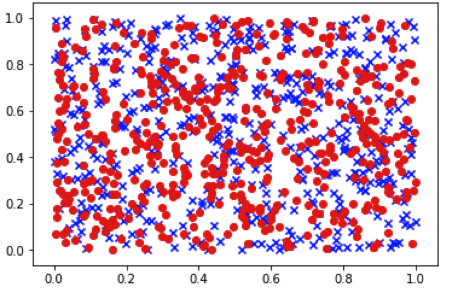
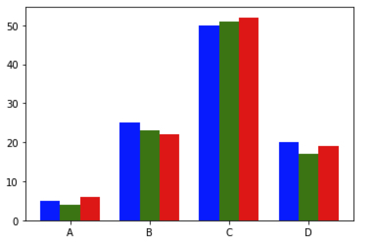
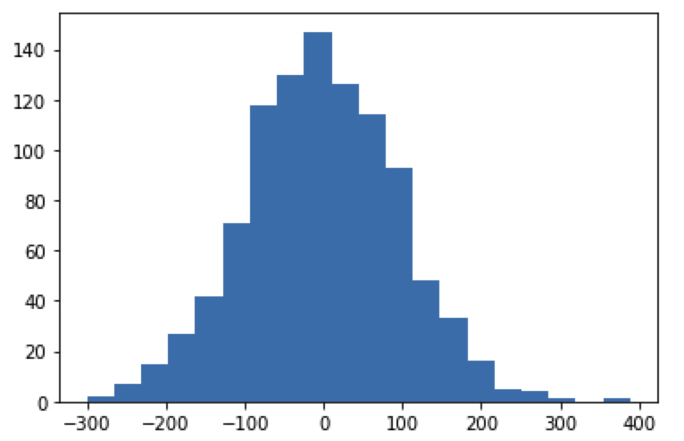
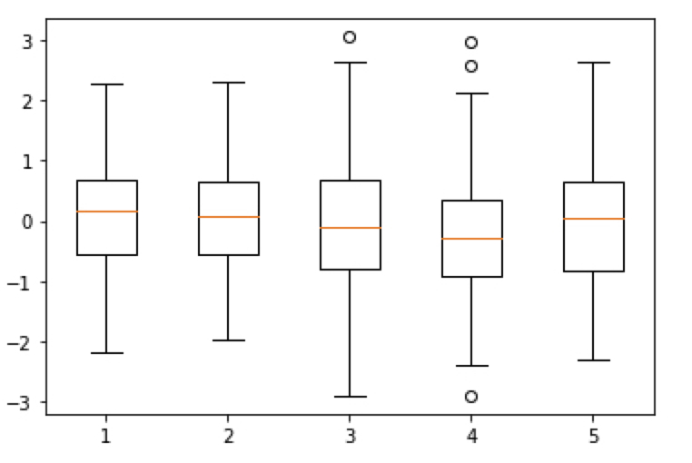

본 정리 내용은 [Naver BoostCamp AI Tech](https://boostcamp.connect.or.kr/)의 edwith에서 수강한 내용을 정리한 것입니다.  
사실과 다른 부분이 있거나, 수정이 필요한 사항은 댓글로 남겨주세요.

---

# 데이터 시각화

## matplotlib

파이썬의 대표적인 시각화도구로, 다양한 그래프를 지원하며 `pandas`를 연동하므로 쉽게 사용할 수 있다.

- `pyplot` 객체(일종의 그림판)를 사용하여 데이터를 표시한다.
- `pyplot` 객체에 `figure`들을 쌓은 다음, `show`를 통해 show하고 flush(메모리에서 뱉어냄)한다.

**`matplotlib`**의 큰 단점은, argument를 kwargs로 받는다는 것이다.

고정된 argument가 없거나 문서화가 잘 안되어있어서, 매번 `shift`+`tap`을 눌러 argument들을 확인 후 사용해야한다.

- 그냥 매번 구글링하는것을 추천한다.

### Figure & Axes

Matplotlib는 **`Axes`**를 담은 **`Figure`**를 `pyplot` 객체위에 올려서 표현한다.

- `Figure`를 구성할 때에는 x값의 순서를 고려해주어야한다. x값에 다라 따라 순차적으로 y값이 출력되기 때문이다. 만약 x값이 뒤죽박죽으로 섞여있다면, 선이 마구잡이로 그려진다.

`Axes`는 subplot을 그리는 개념이라고 생각하면 된다.

#

```bash
fig = plt.figure() # pyplot 위에 figure 객체를 쌓고 이를 반환함.
fig.set_size_inches(5,2) # 크기 지정
ax_1 = fig.add_subplot(1,2,1) # 파라미터는 앞에서부터 row, column, figure의 순서
ax_2 = fig.add_subplot(1,2,2)

ax_1.plot(X_1, Y_1, c='b') # c -> color
ax_2.plot(X_2, Y_2, c='g')
```

### 기초 사용법

- `plt.plot` 메서드 파라미터
    - `color` , `c`: 색상 지정
        - hex코드나 영어로 색상을 지정해 줄 수 있다.
    - `linestyle`, `ls` : 선 형태 지정
        - `dashed`, `dashdot` 등의 옵션이 있다.

- `plt.title` : 플롯에 제목 추가
    - Latex 형식의 표현도 가능하다.
- `plt.legend` : 범례 표시
    - `shadow`, `fancybox`, `loc` 등 지정
- `plt.grid` : 보조선을 그음
    - 투명도, 선 모양 등을 설정할 수 있다.
    - `plt.style.use("ggplot")` : `R`에서 많이 쓰이는 형태의 grid 표시
        - 이외에도 style은 다양하니 찾아보자.
- `plt.xlim` : x축 범위 한계 지정
- `plt.ylim` : y축 범위 한계 지정
- `plt.text` : plot에 텍스트 추가
    - `plt.annotate` : 텍스트 추가하고, 화살표를 표시 할 수 있다
- `plt.savefig('file_name.png')` : 특정 파일명으로 figure 저장
    - `show`로 flush 하기 전에 저장할 수 있다.

## matplotlib graph

### scatter

**산점도**를 표시한다.

- X, Y 데이터가 파라미터로 들어가지만, Figure를 만들때처럼 X 값의 순서가 중요하지는 않다.
- 마커의 형태를 선택할 수 있으니, 구글링해서 찾아보자.
- `s` 옵션으로 데이터 크기를 지정하고, 데이터 크기를 비교할 수 있다.

```bash
data_1 = np.random.rand(512, 2)
data_2 = np.random.rand(512, 2)

plt.scatter(data_1[:,0], data_1[:,1], c="b", marker="x")
plt.scatter(data_2[:,0], data_2[:,1], c="r", marker="o")
# 한 subplot 위에 여러 scatter를 쌓을수도 있다.

plt.show()
```



#

### bar chart

`bar` 함수를 사용하여, 막대 차트를 그린다.

```bash
data = [[5., 25., 50., 20.],
        [4., 23., 51., 17],
        [6., 22., 52., 19]]

X = np.arange(0,8,2)

plt.bar(X + 0.00, data[0], color = 'b', width = 0.50) # 폭이 0.5
plt.bar(X + 0.50, data[1], color = 'g', width = 0.50) # x축 시작위치로, 이전 bar만큼의 폭은 건너뜀
plt.bar(X + 1.0, data[2], color = 'r', width = 0.50)
plt.xticks(X+0.50, ("A","B","C", "D")) # 시퀀스 타입으로 넣어야 들어간다.
plt.show()

# 마찬가지로, 막대차트의 y축 방향으로 여러 차트를 쌓아 보여줄수도 있다.
# 여러 variation은 구글링해보기.
```



#

### histogram

도수분포표를 그림으로 나타내주는 히스토그램을 그린다.

```bash
X = np.random.normal(0,100,1000)
plt.hist(X, bins=20) # bins는 꺾인 구간.
plt.show()
```



#

값들의 분포상태를 알 수 있는 박스플롯을 그릴수도 있다.

- 박스는, 데이터가 몰려있는 구간을 나타낸다.
- 선은, 어느정도의 데이터가 분포하는 구간을 나타낸다.(박스의 길이에 일정량을 곱하여 길이를 정한다)
- 점은, outlier를 의미한다.

```bash
data = np.random.randn(100,5)
plt.boxplot(data)
plt.show()
```



#
## seaborn

통계 데이터 시각화 도구로, `matplotlib`를 좀 더 쉽고 다루기 위해 지원해주는 wrapper library이다.

- matplotlib와 같은 기본적인 plot을 지원한다.
- 손쉬운 설정으로 데이터를 (예쁘게) 산출한다.
- `basic plot`과 `multi plot`이 있다.
    - basic plot
        - `lineplot`, `scatterplot`, `countplot` 등
    - multi plot
        - 주로 많이 사용한다.

[튜토리얼](https://seaborn.pydata.org/tutorial.html)이 굉장히 잘되어있는 편이라 읽어보는 것을 추천한다.

### basic plot

`matplotlib`에 비해 사용법이 간단하다.

x와 y 파라미터에 직접 시퀀스형 자료를 넣어도 되지만, 최근에는 `pandas` 자료형도 지원한다.

```bash
import numpy as np
import pandas as pd
import matplotlib.pyplot as plt
import seaborn as sns

sns.set(style="darkgrid")
tips = sns.load_dataset('tips')
fmri = sns.load_dataset('fmri')

# line plot

# x : x축 이름, y : y축 이름, data : pandas 데이터
# x축이 정렬되어있지 않아도 정렬해서 보여준다.
sns.lineplot(x='timepoint', y='signal', data=fmri)

# hue 라는 파라미터를 넣어 catergory별로 나누어서 데이터를 시각화할수도 있다.
# 아래는, 'event' 항목에 들어가있는 값들을 카테고리별로 분류해서 시각화하겠다는 것.
sns.lineplot(x='timepoint', y='signal', hue=event, data=fmri) 

# count plot - 카테고리형 데이터를 위해 사용
sns.coutplot(x='smoker', hue='time', data=tips)

# bar plot - estimator로 원하는 통계치를 시각화 할수있음.
sns.barplot(x='day', y='total_bill', data=tips, estimator=np.std)
```

### multi plot

이외에도 여러 plot이 있다.

- `Violinplot` - `boxplot`에 distribution을 함께 표현한다.
- `Stripplot` - scatter와 category 정보를 함께 표현한다.
- `Swarmplot` - 분포와 scatter를 표현한다.
- `Pointplot` - 카테고리별로 numeri의 평균, 신뢰구간을 표시한다.
- `regplot` - scatter과 (회귀)선형함수를 함께 표시한다.

또, `FacetGrid` 로 카테고리데이터를 결합분포로 볼 수 있다.