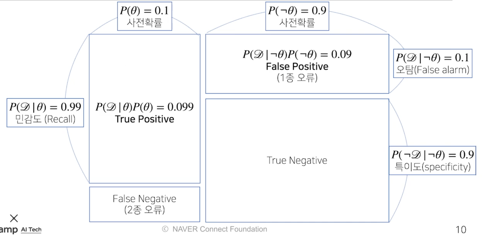
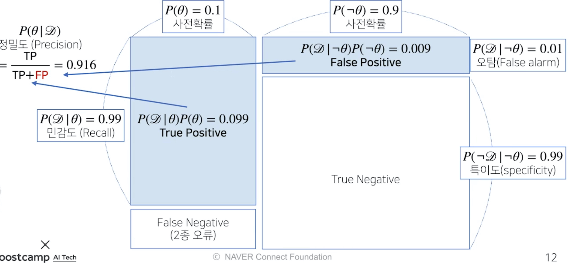
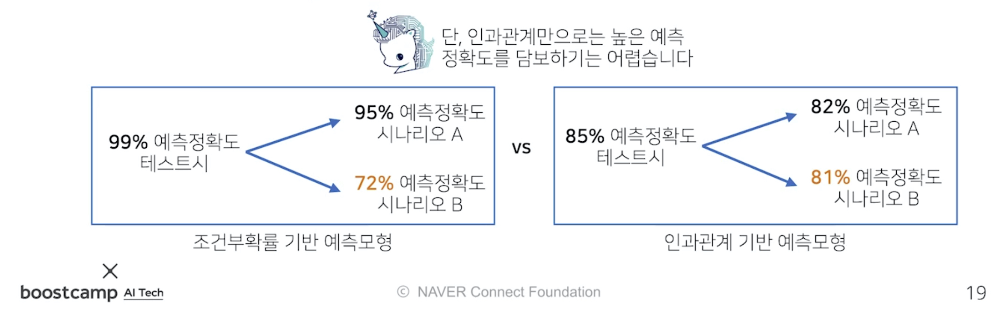
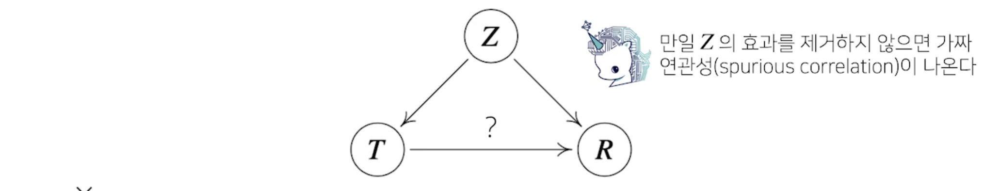
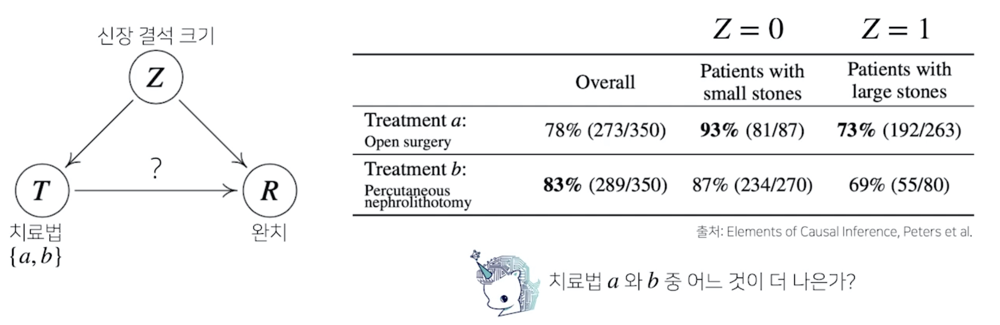
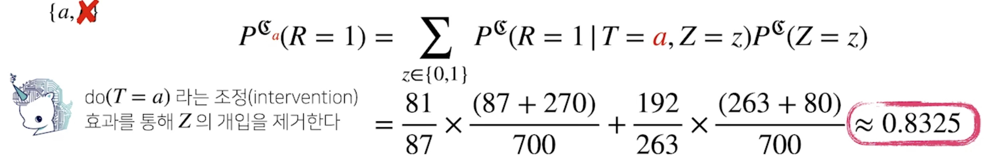
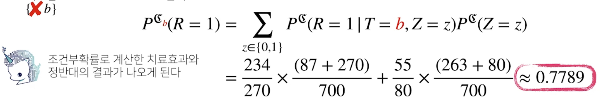

본 정리 내용은 [Naver BoostCamp AI Tech](https://boostcamp.connect.or.kr/)의 edwith에서 학습한 내용을 정리한 것입니다.  
사실과 다른 부분이 있거나, 수정이 필요한 사항은 댓글로 남겨주세요.

---

# 베이즈 정리

이전에 배웠던 통계학은 **`빈도주의(frequent statistics)`**에 해당하는 내용이었다.

- 빈도주의란, 우리가 익숙한 확률에 대한 전통적인 관점이다.
- 그 사건이 일어날 횟수의 장기적인 비율(경향)을 연역적으로 정의한 것이다.

이번에는 딥러닝과 좀 더 직접적인 연관이 있는 `**베이즈 정리**`에 대해 알아보자. `**베이즈 정리**`는 **모델의 모수를 추정할 때 사용하는 기법**이다. **데이터가 새로 추가될 때 정보를 업데이트하는 이론적 방법**이기도 하다.

- 베이지안은, 확률에 대한 새로운 관점이다.
- 빈도주의와 달리 확률을 **'주장에 대한 신뢰도'**로 판단한다.
- 이 과정에서, 반복의 개념은 사용되지 않는다.

### 먼저 알아 둘 것 - 조건부 확률

베이즈 정리는 조건부확률을 이용하여 정보를 갱신하는 방법을 알려준다.

$$
P(A\cap B) = P(B)P(A|B)
$$

조건부확률 $P(A|B)$는 사건 $B$ 가 일어난 상황에서 사건 $A$ 가 발생할 확률을 의미한다.

## 베이즈 정리란?

$$
P(B|A) = \frac{P(A \cap B)}{P(A)} = P(B)\frac{P(A|B)}{P(A)}
$$

A가 조건부로 주어졌을 때 B가 일어날 확률 $P(B|A)$는 B가 조건부로 주어졌을 때 A가 일어날 확률 $P(A|B)$에 $P(B)$를 곱하고, $P(A)$를 나누는것과 같다.

이 때 위의 식을 잘 살펴보면, A라는 새로운 정보가 주어졌을 때, $P(B)$로부터 $P(B|A)$를  계산하는 방법을 알 수 있다. 즉, **새로운 정보를 토대로 어떤 사건이 발생했다는 주장에 대한 신뢰도를 갱신**해 나갈 수 있을 것이다. 이것이 **`베이즈 정리`**이다.

$$
P(\theta|\mathcal{D}) = P(\theta)\frac{P(\mathcal{D}|\theta)}{P(\mathcal{D})}
$$

- 좌변
    - 여기서 $\mathcal{D}$는 **새로 관찰하는 데이터(즉, 새로운 정보)**를 의미한다.
    - $\theta$는 **Hypothesis**, 또는 **모델링하는 이벤트**, 또는 모델에서 계산하고 싶어하는 **모수(parameter)**를 의미한다.
    - $P(\theta|\mathcal{D})$는 **`사후확률(posterior probability)`**로, **데이터가 주어져 있을 때, hypothesis가 성립할 확률**을 의미한다. 즉, **갱신하고 난 후의 신뢰도**를 의미한다.
- 우변
    - $P(\theta)$는 **`사전확률(prior distribution)`**로, 모델링하고자 하는 타겟(모수 등)에 대해 **데이터를 분석하기 전에 가정한 확률분포**를 의미한다. 즉, **갱신하기 전의 신뢰도**를 의미한다.
    - $P(\mathcal{D}|\theta)$는 **`가능도(likelihood)`**로, **현재 주어진 [모수/가정]에서 데이터 $\mathcal{D}$가 관찰될 확률**을 의미한다.
    - $P(\mathcal{D})$는 **`Evidence`**를 의미한다.

이 때 , 베이즈 정리를 적용하여 현재의 가정(신뢰도)에서 새로운 데이터에 대한 신뢰도를 얻어낼 수 있다.

### 베이즈 정리 예제 - 코로나 바이러스 99

좀 더 이해하기 쉽게 코로나 바이러스의 예제를 들어보자.

COVID-99의 **발병률이 10%**로 알려져 있다. COVID-99에 **실제로 걸렸을 때 검진될 확률은 99%, 실제로 걸리지 않았을 때 오검진될 확률이 1%**라고 하자.

**어떤 사람이 질병에 걸렸다고 검진 결과가 나왔을 때 정말 COVID-99에 감염되었을 확률**은?

- `사전확률`, `민감도(재현율,Recall)`, `오탐율(False alarm)`을 가지고 `정밀도(Precision)`을 계산하는 문제이다.

- 기존에 알려져있는 발병률은 사전확률 $P(\theta)$로 볼 수 있으며, 사전에 정의된 것이므로 관찰 불가하다.
- 검진될 확률과 오검진된 확률을 각각 가능도 $P(\mathcal{D}|\theta) = 0.99$, $P(\mathcal{D}|\neg\theta) = 0.01$로 볼 수 있다.
    - $\mathcal{D}$는 테스트 결과라고 정의하므로 관찰 가능하다.

여기서 베이즈 정리에 필요한 식에 빠진 것은 $P(\mathcal{D})$, Evidence다. Evidence는 어떻게 계산할 수 있을까?

$$
P(\mathcal{D})=\sum_\theta P(\mathcal{D}|\theta)P(\theta) = 0.99 \times 0.1 + 0.001 \times 0.9 = 0.108
$$

- 가능도를 가지고 계산할 수 있다. `주변분포(marginal distribution)`를 계산하는 방법과 **조건부확률의 정의**를 이용하면 된다.
- 쉽게 풀이하면, <U>[실제로 감염되었을 확률 *  검진될 확률] + [실제로 감염되지 않았을 확률 * 오검진될 확률]</U>이라고 볼 수 있다.
    - 만약 $P(\mathcal{D}|\neg\theta)$를 모르면 이 문제는 풀기 어렵다.

위의 식들을 종합해, 갱신된 신뢰도, 즉 문제의 정답은 다음과 같다.

$$
P(\theta|\mathcal{D}) = 0.1 \times \frac{0.99}{0.108} \approx 0.916
$$

- 이 때, **오탐율(False alarm)이 오르면 테스트 정밀도(Precision)가 당연히 떨어진다.**
- 예를 들어 오탐율 $P(\mathcal{D}|\neg\theta)$이 0.01이 아닌 0.1이라면, 정밀도는 0.916이 아닌 0.524가 된다.
    - 이처럼, **아무리 민감도가 높더라도 오탐율이 높아지면 정밀도가 크게 떨어진다.**

### 조건부 확률의 시각화

[일치여부(신뢰성) + 판단결과] 형태로 표시한다.

- **음성이 나왔을 때 양성으로 판단**하는 것을 **`False Positive`**라고 하고, `1종 오류`로 친다.
- **양성이 나왔을 때 음성으로 판단**하는것을 **`False Negative`**라고 하고 `2종 오류`로 친다.

데이터 분석의 성격에 따라 1종 오류와 2종 오류 중 어느 것을 우선하여 줄일 지가 달라진다.

특히 2종 오류(False Negative)같은 경우 의료 분야에서 아주 심각한 문제이다. 누군가가 큰 병에 걸렸는데 이를 오진할 경우, 목숨까지 위험할 수 있다.

이에 비해 1종 오류(False Negative)는 비교적 위험성이 떨어지므로, 보통은 오탐율(False Alarm)을 희생하더라도, 민감도(Recall)을 최대한 줄이는 방식으로 설계하곤 한다.

정밀도를 계산할 때에는, True Positive와 False Negative를 더한 것, 즉 양성판정률을 분모로 삼는다. 따라서 오탐율이 낮을수록 분모가 커지므로 정밀도가 높아지고, 민감도가 커질수록 분자가 커지므로 정밀도가 높아진다.

이처럼 **정밀도는 오탐율과 민감도에 영향을 받는다.**

위의 코로나 바이러스 99 예제에서, 앞서서 COVID-99 양성 판정을 받은 사람이 두 번째 검진에도 양성이 나왔을 때, 진짜 COVID-99에 걸렸을 확률은 얼마나 될까?

이전에 계산한 사후확률을 사전확률로 활용하여, 베이즈 정리로 다시 한번 정보를 업데이트해보자.

$$
P(\mathcal{D}^*) = 0.99 \times 0.524 + 0.1 \times 0.476 \approx 0.566 \\
P(\theta|\mathcal{D}^*) = 0.524 \times \frac{0.99}{0.566} \approx 0.917
$$

이처럼 한번의 검진율로는 0.524밖에 되지 않았던 신뢰성이, 한번 더 정보를 업데이트함으로써 0.917까지 높아지게 되었다. 세번째 검사까지 하면 0.991까지 업데이트된다.

이처럼 베이즈 정리는 **데이터를 추가할 때마다 업데이트된 신뢰성을 얻을 수 있으므로 아주 유효한 방식**이다.

## 조건부확률 → 인과관계?

조건부 확률을 사용할 때 범하기 쉬운 오류가 있다. **조건부 확률이 `인과관계`로 이어진다고 생각하는 오류**이다.

조건부 확률은 유용한 통계적 해석을 제공하지만, 인과관계(Causality)를 추론할 때 함부로 사용해서는 안된다. **<U>데이터가 아무리 많아져도 조건부 확률만을 가지고 인과관계를 추론하는 것은 불가능</U>**하다.

### 인과관계

**`인과관계`**는 **데이터 분포의 변화에 강건**한 예측모형을 만들 때 필요하다.

데이터 분포의 상황이 바뀌는 경우가 있다.

- 새로운 정책 / 치료법등을 도입했을 때

이 경우 조건부 확률만을 가지고 예측 모형을 만들었을 때, **시나리오에 따라 예측정확도의 변동성이 크다**. 이에 비해 인과관계 기반 예측모형은 **시나리오가 변한다고 하더라도 정확도가 크게 변하지 않는다**. 다만, 인과관계만 고려해서는 높은 예측 정확도를 담보하기 어렵다.

인과관계를 알아내기 위해서는, **`중첩요인(confounding factor)`** $Z$의 효과를 제거하고 원인에 해당하는 변수 $T$만의 인과관계를 계산해야 한다. 

간단한 예로, 키와 지능의 연관성을 들어볼 수 있다.

일반적으로 키와 지능은 상관관계가 없는 특징이라고 여겨진다. 그러나 전체인구통계에서, 키와 지능을 살펴보면 이상하게도 키가 클수록 지능이 높다는 것을 알 수 있다.

그렇다면 과연 키와 지능은 인과관계가 있는 것일까? 키가 클수록 지능이 높아지게 되는걸까?

- 그렇지 않다. 이는 '나이'라는 중첩요인 $Z$를 제거하지 않았기 때문이다.
- 성장기에서, 나이가 많아지면 키도 커지고 지능도 높아진다.
- 키 → 지능으로 바로 연결되는 것이 아니라, 모든 조사대상의 나이를 동일하게 맞추어 나이라는 중첩요인을 제거한 뒤 조사해야한다.
    - 그러지 않으면 `가짜 연관성(spurious correlation)`이 나온다.

### 인과관계 추론 예제 : 치료법에 따른 완치율

신장결석에 대한 치료법이 두 개가 있다. 두 치료법을 따랐을 때, 신장결석 크기에 따른 완치율 통계 결과가 다음과 같이 나와있다면, 어떤 치료법을 고르는 것이 더 나을까?

전체적인 치료법의 성공률(overall)을 보면 b가 더 나아 보인다.

그러나, 실제로는 신장결석 여부와 관계없이 각각의 환자군에서 a가 모두 성공률이 더 높다. 어떻게 이런 결과가 나오게 된 것일까?

이는 [심슨의 역설](https://bioinformaticsandme.tistory.com/117)이라고 불리는 아주 유명한 패러독스로, 부분이 크다고해서 전체도 큰것은 아니라는 것을 나타낸다. 이를 명확히 꿰뚫어보기 위해서는 전체를 부분별로 각각 나누어 보아, 정확한 원인분석을 해야한다.

위의 예제로 따지자면, 단순히 치료법에 따른 조건부확률만 계산해서는 안되고, 신장 결석 크기에 따른 중첩효과를 제거해야한다.

**`조정(intervention)`**과정을 통해 중첩효과 $Z$의 개입을 제거하여, 신장결석 크기와 관계없이 치료법 a와 b를 선택했을때의 완치율을 알 수 있다.  이는 조건부 확률을 사용하는 베이즈 정리와는 달리, **인과관계로 예측**하는 것이다.

제거하고 나면, 치료법 a는 약 0.83, 치료법 b는 약 0.78로 치료법 a를 선택하는 것이 더 나은 방법이라는 것을 확인할 수 있다.

이처럼 **중첩효과를 제거함으로써 데이터 분석 시에 좀 더 안정적인 정책 분석이나 예측모형의 설계가 가능**하다.

따라서 단순히 조건부확률만으로 데이터 분석을 하는 것은 위험하고, **데이터에서 추론할 수 있는 사실 관계들이나 변수들끼리의 관계, 도메인 지식 등을 활용함**으로써 강건한 데이터모형을 만들 수 있다.