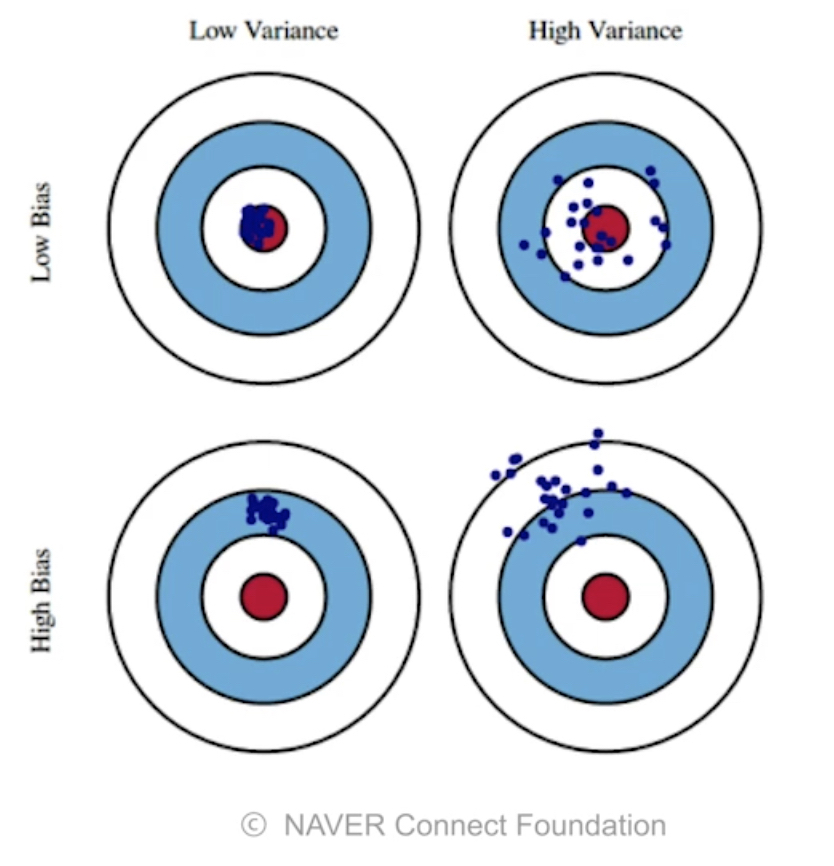
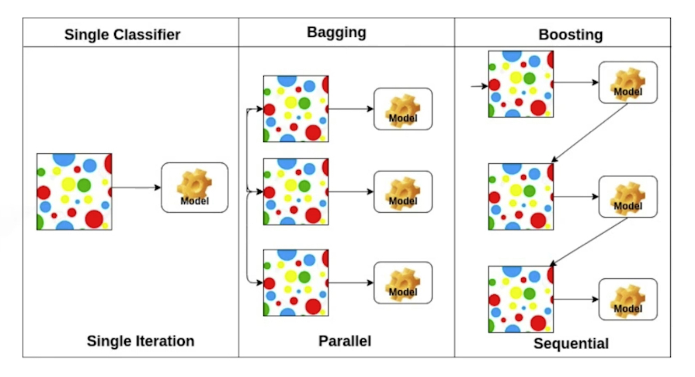
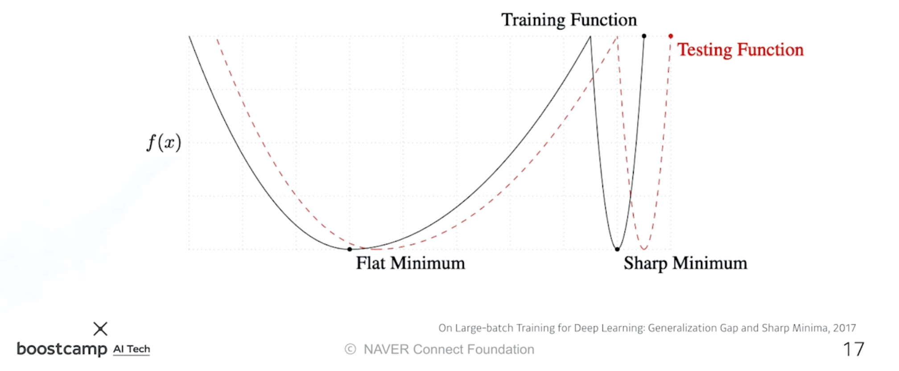
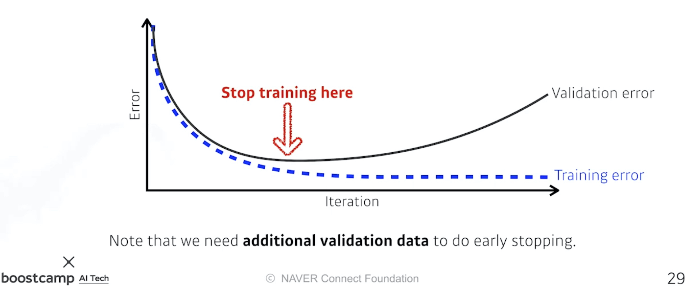
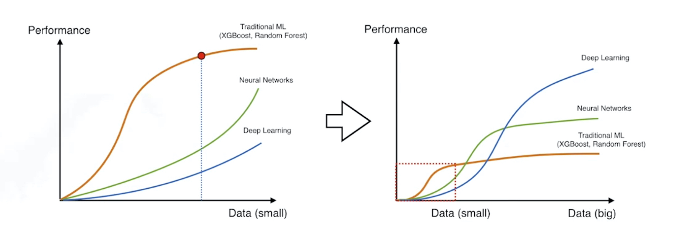
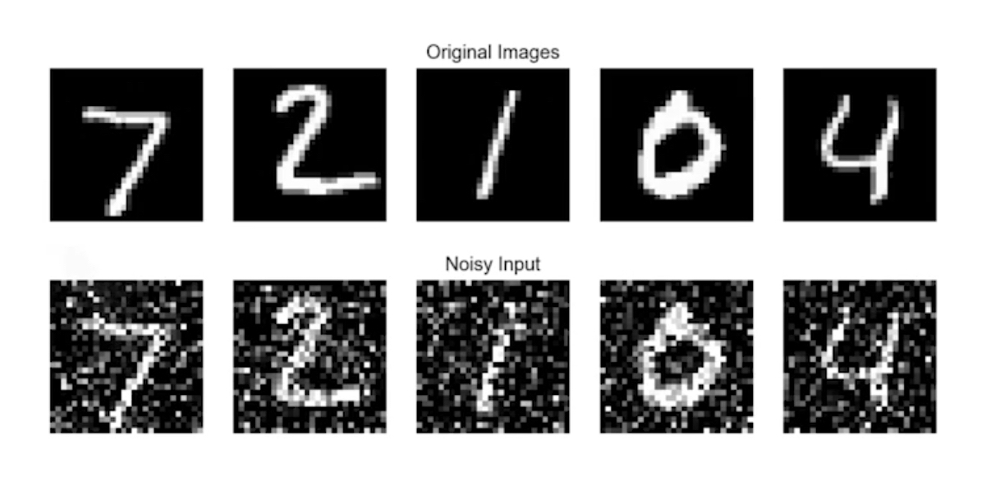

본 정리 내용은 [Naver BoostCamp AI Tech](https://boostcamp.connect.or.kr/)의 edwith에서 학습한 내용을 정리한 것입니다.  
사실과 다른 부분이 있거나, 수정이 필요한 사항은 댓글로 남겨주세요.

---

# Optimization

## 용어 정리

### Generalization

많은 경우에 일반화 성능을 높이는 것이 학습의 목적이 된다.

**`Generalization Gap`**은 **학습오류(Training Error)와 테스트오류(Test Error)사이의 간극**을 의미한다. 좋은 **`일반화 성능(Generalization Performace)`**이 보장되어있다는 것은 이 갭이 작다는 말이다. 이는 곧, **해당 모델의 (테스트 데이터에 대한) 성능이 학습데이터와 비슷할 것**임을 나타낸다.

그런데, 학습 데이터의 자체가 좋지 않아 모델의 성능이 떨어지는 경우가 있을수도 있다. 이 경우에도 학습 데이터와 테스트 데이터의 차이가 적다면 일반화 성능은 좋다고 표현한다. **<U>따라서, 일반화 성능이 좋다고해서 모델의 성능이 좋다는 것을 의미하지는 않는다.</U>**

### Under-fitting vs over-fitting

**`오버피팅(Overfitting, 과적합)`**은 학습 데이터에 대해서는 잘 동작하지만, 테스트 데이터에는 잘 동작하지 않는 것을 의미한다.

반대로, **`언더피팅(Underfitting, 과소적합)`**은 모델의 구성이 너무 간단하거나 학습을 너무 적게 해서 학습 데이터도 잘 맞추지 못하는 것을 의미한다.

이는 개념적인 이야기라서, 해당 모델이 오버피팅/언더피팅임을 판단하는 기준은 절대적이지 않다.

### Cross-validation

데이터를 분리하여, 학습데이터는 학습만, 테스트 데이터는 모델의 성능을 테스트하는 validation만 수행한다.

**`교차검증(Cross-validation)`**은 학습데이터와 테스트 데이터를 분리하여 검증하는 기술을 의미하는데, 가장 대표적인 것으로 `k-fold validation`이 있다.

`K-fold validation`은 테스트 데이터를 제외한 학습 데이터를 k개로 나누어서, k-1개로 학습을 시키고 나머지 한 개로 validation을 하는 기법이다. 이 때 성능을 제대로 검증하기 위해 validation으로 사용하는 하나를 매번 바꿔가며 테스트해본다.

신경망은 최적의 `파라미터`를 구하기 위한 학습과정에서 **`하이퍼파라미터(Hyperparameter)`**가 필요하다.

- `파라미터`
    - 가중치와 bias, CNN의 필터 등
    - 구하고자 하는 값들
- `하이퍼파라미터`
    - 학습률(learning rate), 손실함수(loss function), 신경망의 크기 등
    - 직접 정하는 값들

처음에는 어떤 하이퍼파라미터가 좋은지 모르기 때문에, 교차검증으로 하이퍼파라미터를 먼저 찾고나서 모든 학습 데이터를 사용해 파라미터를 구한다.

<Warning>

테스트 데이터는 절대로 학습에 사용하지 않는다. 테스트 데이터는 오로지 테스트만을 위해 사용할 뿐, 학습에 사용되는 것은 그 자체로 cheating으로 본다.

</Warning>

### Bias-variance tradeoff

**`분산(Variance)`**은 **input을 넣었을 때 얼마나 output이 일관적으로 나오는가**를 나타낸다. 일반적으로 Variance가 낮은 모델들은 간단한 모델들이다. 이에 비해 Variance가 높은 모델들은 input에 따라 output이 비교적 크게 바뀌므로, 오버피팅될 가능성이 높다.

사격에서의 탄착군 형성을 생각해보자. **<U>중요한 것은 과녁 중심을 얼마나 맞히느냐가 아니라 탄착지점이 얼마나 모여있느냐</U>**이다. 탄착군이 모여있으면, 가늠쇠를 조정하여 탄착군을 과녁 중앙으로 shift하면 된다.

**`편향(Bias)`**은 분산과 관계없이, **평균값이 목표치(True Target)에 얼마나 접근했는가**를 나타낸다. 탄착군이 형성되지 않더라도, 점들의 평균치가 과녁 중앙에 가까이 갔다면 편향이 낮은 것이다.

$$
\textrm{Given}\ D = \{(x_i,t_i)\}^N_{i=1}, \quad\textrm{Where}\quad t = f(x) + \epsilon \quad \textrm{and} \quad  \epsilon \sim \mathcal{N}(0,\sigma^2)
$$

Bias and Variance의 트레이드오프 관계는 오래된 주제이다. 아래의 식은 학습데이터에 노이즈가 껴 있음을 가정하고 있다.

$$
\mathbb{E}\Big[(t-\hat{f})^2\Big] =  \mathbb{E}\Big[(t-f+f-\hat{f})^2\Big]\\
= \dots\\
= \mathbb{E}\Big[(f-\mathbb{E}[\hat{f}])^2\Big] + \mathbb{E}\Big[(\mathbb{E}[\hat{f}]-\hat{f})^2\Big]+\mathbb{E}[\epsilon]
$$

- $t$는 True Target, 즉  목표치(정답)을 의미한다.
- 첫 식은 cost를 의미한다.
- 마지막 식에서 각 항은 왼쪽부터 차례대로 bias$^2$, variance, noise를 의미한다.

Cost를 최소화하기 위해 총 세 파트, [bias$^2$, variance, noise]를 줄여야하는데, 이 중 **bias와 variance는 한 쪽을 줄이면 다른 한 쪽이 늘어나는 관계**이다. 근본적으로 **둘 모두를 줄이기는 힘들다**는 fundamental이 존재한다.

### Bootstrapping

'부츠 끈을 들어서 하늘을 날겠다'라는 의미의 bootstrap라는 어원에서 유래하였다. '지금 가지고 있는 것으로 어떻게든 활용하여 해결하겠다'라고 볼 수 있는데, 통계학에서는 가설검증이나 metric 계산 이전에 랜덤샘플링을 적용하는 방법을 일컫는다.

서로 다른 학습데이터를 사용했을 때 모델의 예측은 차이가 나게 되는데, 이 **예측의 통계(또는 일치도)를 보고 전체적인 모델의 불확실성(uncertainty)를 예측**하고자 할 때 **`부트스트래핑`**을 사용한다.

여러가지로 활용될 수 있지만, 일반적으로는 **학습데이터가 고정되어있을 때 서브샘플링을 통해 여러 학습데이터를 만들고 여러 모델과 metric을 만들어 사용하겠다**는 말이다.

### Bagging and Boosting

**`Bagging`**(**B**ootstrapping **agg**regat**ing**)은 학습데이터가 고정되어있을 때, 학습데이터를 다 사용하는 것이 아니라 랜덤샘플링한 여러개로 만들어 여러개의 모델을 만든 뒤 이 모델들의 output을 평균낸다는 것을 의미한다. 부트스트래핑과 관련있는 말이며, **`앙상블(Ensemble)`**이라고 불리기도 한다.

직관적으로는 모든 데이터를 학습데이터로 썼을 때 가장 좋은 성능의 모델이 나올 것 같지만, 실제로는 **오히려 데이터들을 서브샘플링 한 뒤 여러 모델의 예측을 평균낸 것이 더 성능이 좋은 경우가 많다.** 

**`Boosting`**은  조금 다른 방법이다.

학습데이터를 여러 개로 샘플링한 뒤, 하나의 모델을 가지고 각 샘플링 데이터들을 차례대로 학습시킨다. 해당 모델이 제대로 예측하지 못하는 데이터들에 대해서는, **해당 데이터들만 따로 학습시키는 모델을 새로 만든다**. 이 개개의 모델들을 `weak learner`라고 부른다.

이렇게 여러개의 모델을 만든 뒤 sequential하게 합쳐서 하나의 strong learner를 만드는 것을 부스팅이라고 한다. 

## Practical Gradient Descent Method

### 경사하강법 - 배치 방식에 따라

- `Stochastic Gradient Descent(SGD)`
    - 한번에 하나의 샘플로만 gradient를 구해서 업데이트하는 방식
- `Mini-batch Gradient Descent`
    - 한번에 데이터의 일부(일반적으로 배치 사이즈)로 gradient를 구해서 업데이트하는 방식
    - 가장 많이 사용하는 방식
- `Batch Gradient Descent`
    - 한번에 모든 데이터로 gradient를 구해서 업데이트하는 방식

### 배치사이즈는 얼마나 커야하는가?

몇몇 논문의 실험 결과 **배치사이즈가 너무 커지면** `Sharp Minimum`에 빠지게 되고, 이는 곧 테스트 데이터에 대한 좋지 않은 성능으로 연결된다는 것이 밝혀졌다.

반대로, 배치사이즈가 작을수록 noise의 영향력이 커지므로 Sharp Minimum에서 탈출할 확률이 높다.

해당 실험을 다룬 [On Large-batch Training for Deep Learning : Generalization Gap and Sharp Minima, 2017](https://arxiv.org/pdf/1609.04836.pdf) 논문을 참조해보자.

자세한 설명은 아래 글을 참조한다.

[Small Batch Size in Deep Learning](https://iamseungjun.tistory.com/3)

### Gradient Descent Methods

1. **`(Stochastic) Gradient Descent`**
    - 가장 기본적인 경사하강법
    - learning rate를 정하는 것이 어렵다.
2. **`Momentum`**
    - 관성처럼, **이전 배치에서의 방향성을 어느정도 유지**하는 방식
    - 모멘텀 $\beta$과 현재 gradient $g$를 합친 accumulation를 이용해 업데이트한다.
    - **<U>gradient가 요동치더라도 이전의 관성이 남아있기 때문에 어느정도 학습이 잘 된다.</U>**
3. **`Nesterov Accelerated Gradient(NAG)`**
    - Lookahead gradient를 계산한다.
    - 기존의 모멘텀은 관성으로 인해 local minimum 부근에서 수렴(converging)하지 못하는 문제가 있었지만, NAG는 모멘텀으로 업데이트 시 발생하는 변화를 미리 체크한 뒤 모멘텀을 결정하므로 좀 더 minimum에 빠르게 수렴할 수 있다.
4. **`Adagrad`**
    - 이전까지의 모멘텀방식과 다른 ADA(adaptive) 방식
    - $G$에 지금까지의 gradient$^2$ 합을 저장시키고, 역수에 집어넣는다. 따라서 많이 변한 파라미터는 적게 변화하게되고, 적게 변한 파라미터는 많이 변화하게 된다.
    - G가 계속 커지기 때문에, 분모가 점점 커지므로 learning rate가 0에 수렴해 학습이 멈춘다는 문제가 있다.
5. **`Adadelta`**
    - Adagrad에서 $G$가 계속 커지는 문제를 exponential moving average를 통해 해결하려는 방식
        - 지수이동평균은 최근 데이터에 가중치를 부여하고, 과거의 데이터일수록 영향력이 작아지는 형태를 띈다.
        - 단, Adadelta에서는 윈도우사이즈만큼의 local average를 구한다.
    - 시간을 기준으로 window를 잡아, 최근에 gradient가 많이 변했으면 적게 변화시키고, 적게 변화했으면 많이 변화시킨다.
    - 윈도우 사이즈만큼의 gradient 정보를 들고 있어야하는데, GPT-3같은 천억개 수준의 파라미터를 가진 모델의 정보를 다 들고 있을 수 없다는 문제가 있다.
    - learning rate가 없다는 특징이 있는데, 이 때문에 변화를 주기가 어려우므로 잘 사용되지 않는다.
6. **`RMSprop`**
    - 제프리 힌턴이 딥러닝 강의를 하다가 언급했던 경험을 바탕으로 구현한 방식
    - adadelta처럼 exponential moving average를 이용하지만, 대신 분자에 $\eta$라는 stepsize(learning rate)를 넣는다.
    - adagrad랑 adadelta랑 섞어놓은 듯한, 과거에 많이 사용되었던 방식이다.
7. **`Adam`**
    - Adaptive와 Momentum 방식들을 합친 것으로, 가장 많이 사용하는 방식이다.
    - 모멘텀 $m$과 gradient$^2$값들의 합 $v$을 사용한다.
    - $\epsilon$은 division by zero를 막기 위한 하이퍼파라미터인데, 아주 작은 값을 넣는다. 실제로는 이 값을 잘 조정하는것이 practical한 성능에 큰 영향을 주는 것으로 나타났다.
        - 0이 아니면서 0에 얼마나 가깝게 만드는가?

더 자세한 설명은 다음 글을 참조하자.

[Gradient Descent Optimization Algorithms 정리](http://shuuki4.github.io/deep%20learning/2016/05/20/Gradient-Descent-Algorithm-Overview.html)

## Regularization

학습을 방해하도록 규제함으로써, 모델이 학습 데이터에만 피팅되는것이 아니라 테스트 데이터에서도 잘 동작하도록 만드는 것, 즉 오버피팅을 피하도록 하는 것을 **`정규화(regularization)`**이라고 한다.

### Early Stopping

 

validation 에러와 학습 에러의 차이가 날 정도로 학습하기 전에 학습을 멈추어 버리는것을 **`Early stopping`**이라고 한다.

### Parameter Norm Penalty

**`Parameter Norm Penalty`**는 신경망의 파라미터가 너무 커지지 않도록 조절하는 것을 의미한다.

신경망 파라미터의 숫자들이 너무 커지지 않도록 하기 위해 파라미터 값들(의 제곱의 합)을 줄여준다.

파라미터의 크기가 크지않은, 즉 부드러운(smooth) 함수일수록 일반화성능(Generalization Performance)이 좋을것이라는 가정에 기초하고 있다.

### Data Augmentation

일반적으로 데이터가 많으면 모델의 성능이 더 좋다. 거꾸로 말하면, 데이터가 없으면 딥러닝 모델은 다른 머신러닝 방법론에 비하여 열등하다.

그러나 데이터셋이 어느정도 커지게 되면, 딥러닝 모델은 기존의 머신러닝 방법론들이 따라갈 수 없는 표현력을 가지게 된다. 결국 관건은 데이터의 양이다.

**`Data Augmentation`**은 어떤 식으로든 내가 **가지고 있는 데이터를 변형시켜서 데이터 풀을 늘리는 방법**을 의미한다. 단, 변화는 이미지의 레이블이 바뀌지 않는 한도 내에서 수행해야한다.

- 예를 들어, MNIST 데이터에서 6을 변형시키겠다고 뒤집어 9로 만드는것은 잘못된 data augmentation이다.

### Noise Robustness

**`Noise Robustness`**는 입력데이터에 Noise를 집어넣는것이다. Data Augmentation과 다른점은, **단순히 입력에만 Noise를 집어넣는 것이 아니라 weight에도 집어넣는 것**을 의미한다.

정확한 원리가 규명되지는 않았고, 실험결과 상 데이터 풀이 많아질 뿐 아니라, weight 값을 흔들어 모델의 성능에 도움이 된다고 밝혀졌다.

### Label Smoothing

Data Augmentation과 비슷하지만, **`Label Smoothing`**은 랜덤한 학습 데이터를 두 개 뽑아서 조작하여 사용한다는 차이점이 있다.

- `Mix-up`
    - 두 데이터를 섞어서(blending) 사용한다.
    - ex - 강아지와 고양이 그림을 겹쳐서 섞음
- `CutMix`
    - 두 데이터를 섞는것이 아니라 파트별로 잘라붙인 하나의 데이터를 만든다.
    - ex - 강아지 사진의 머리부분과 고양이 사진의 몸부분을 잘라 붙인 사진을 만든다.

이를 통해 **decision boundary를 더 부드럽게 만들어준다**.

### Dropout

**`Dropout`**은 순전파의 각 과정에서 신경망의 가중치 중 특정 비율을 0으로 바꾸는 것을 의미한다.

이를 통해 각각의 뉴런들이 좀 더 robust한 feature를 담을 수 있다고 한다.

### Batch Normalization

**`Batch Normalization`**은 **각 레이어의 statistics(활성화값, 또는 출력값)를 정규화**시키는 것을 의미한다.

Internal Covariate Shift를 줄인다고 논문에서 이야기하는데, 최근의 많은 논문들은 이에 동의하지않아 논란이 있다.

그러나, 적용 시 일반적으로 성능이 많이 높아진다는 실험 결과가 있다. 특히, 층이 깊을수록 더 그렇다고 한다.

[Group Normalization, 2018 논문](https://arxiv.org/pdf/1803.08494.pdf)을 참고해보자.

풀이한 글은 아래를 참조하자.

[Group Normalization](https://blog.lunit.io/2018/04/12/group-normalization/)