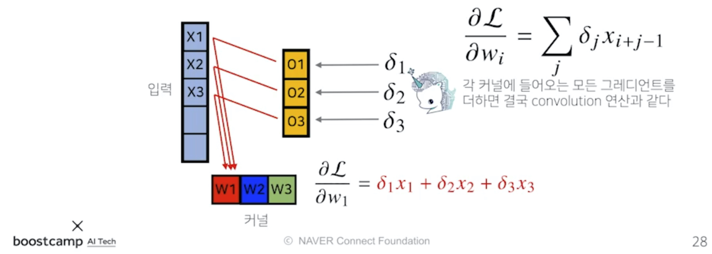

본 정리 내용은 [Naver BoostCamp AI Tech](https://boostcamp.connect.or.kr/)의 edwith에서 학습한 내용을 정리한 것입니다.  
사실과 다른 부분이 있거나, 수정이 필요한 사항은 댓글로 남겨주세요.

---

# CNN

기존의 `다층신경망(MLP)`는 각 뉴런들이 선형모델과 활성함수로 **모두 연결된(fully connected)** 구조였다.

이런 다층신경망의 경우는 **각 성분 $h_i = \sigma(\sum^p_{j=1}W_{ij}x_j)$에 대응하는 가중치 행 $W_i$가 필요**했다.

## Convolution 연산 이해하기

**`Convolution 연산`**은 기존의 MLP 방식과는 달리, **`커널(kernel, 필터)`**을 **입력벡터 상에서 움직여가면서** 선형 모델과 합성함수가 적용되는 구조이다.

$$h_i = \sigma\Bigg(\sum^k_{j=1}V_jx_{i+j-1}\Bigg)$$

- $h_i$는 $i$번째 히든레이어를 의미한다.
- $k$는 커널(필터) 사이즈를 의미한다.
- $V$는 가중치 행렬, 즉 커널을 의미한다. $V$는 모든 $j$에 대해서 같다.
    - 이것이 기존 방식과의 가장 큰 차이점이다.

### 수학적 의미

Convolution 연산의 수학적 의미는 **커널을 이용해 신호(signal)을 국소적으로 증폭 혹은 감소시켜 정보를 추출 또는 필터링** 하는 것이다. 엄밀히 말하면 CNN에서 사용하는 연산은 convolution이 아니고 **`cross-correlation`**이라고 부르지만, 관습적으로 Convolution으로 부르곤 한다.

$$\textrm{continuous} \quad [f*g](x) = \int_\mathbb{R^d}f(z)g(x+z)dz = \int_\mathbb{R^d}f(x+z)g(z)dz = [g*f](x)$$

$$\textrm{discrete} \quad [f*g](i) = \sum_{a\in \mathbb{Z^d}}f(a)g(i+a) = \sum_{a\in\mathbb{Z^d}}f(i+a)g(a) = [g*f](i)$$

- $x+z$ 또는 $i+a$가 들어간 함수값은 신호를 의미한다.
- $z$ 또는 $a$만 들어간 함수 값은 커널을 의미한다.

연속변수이든 이산변수이든, 합과 적분의 차이를 제외하고는 연산이 거의 동일하다.

CNN을 수식만으로 이해하기는 어려우므로, graphical하게 이해해보자.

커널은 **정의역 내에서 움직여도 변하지 않고(translation invariant), 주어진 신호에 국소적(local)으로 적용**된다. 이를 `locality`가 있다고 말한다.

### 영상처리

위 링크에서와 같이, Convolution Network의 적용 커널에 따라 하나의 이미지를 여러 형태로 차용할 수 있다.

### 다차원에서의 Convolution 연산

**<U>데이터의 성격에 따라 사용하는 커널을 다르게</U>** 하며, 다차원으로 Convolution 연산을 할 수 있다.

$$\textrm {1D-conv} \quad [f*q](i) = \sum^d_{p=1}f(p)g(i+p)\\
\textrm {2D-conv} \quad [f*q](i,j) = \sum_{p,q}f(p,q)g(i+p,j+q) \\
\textrm {3D-conv} \quad [f*q](i,j,k) = \sum_{p,q,r}f(p,q,r)g(i+p,j+q,k+r)$$

- 여기서 $f$는 커널, $g$는 입력을 뜻한다.
- 데이터의 종류
    - 1차원 데이터 - 음성, 텍스트 등
    - 2차원 데이터 - 흑백 영상 등
    - 3차원 데이터 - 컬러 영상 등

다만, 중요한 것은 **$i,j,k$ 위치가 바뀌더라도 커널 $f$의 값은 바뀌지 않는다**는 점이다.

## 2차원 Convolution 연산 이해하기

2차원에서는 1차원과 달리 입력데이터의 형태가 **행렬형태**이다. 따라서 1차원에서처럼 한쪽 방향으로 한칸씩 움직이면서 커널을 이동시켰던것과 달리, **커널을 x축과 y축 방향으로 한칸씩 움직여가며 적용**시킨다.

입력 크기를 $(H,W)$, 커널 크기를 $(K_H,K_W)$, 출력 크기를 $(O_H,O_W)$라 하면, 출력 크기는 다음과 같이 계산한다.

$$O_H = H-K_H+1\\
O_W = W-K_W+1$$

가령, 28x28 입력을 3x3 커널로 2차원 Convolution 연산을 하면 26x26이 된다.

그러나 실제로 이미지 분석을 하는 경우에는, 2차원이지만 채널이 여러개라 마치 3차원 같은 입력데이터(ex-RGB)가 들어오게 된다. 이런 경우는 2차원 Convolution을 만들어 적용하는데, **<U>입력값의 채널 개수만큼 커널 채널을 만들어주는 것</U>**이 포인트이다. 즉, 입력값의 채널 개수와 커널의 채널 개수가 같아야한다.

입력 채널 개수와 커널 채널 개수를 같게하여 합성곱연산을 수행하면, 각 채널의 연산들이 모두 더해지기 때문에 채널이 1이 되어 출력 값의 크기는 ($O_H,O_W,1)$이 된다.

만약 출력 채널의 개수를 여러개로 만들고 싶다면 어떻게 하면 될까? **<U>커널 텐서 자체의 개수를 여러개로 하면된다.</U>**

위와 같이 3차원 커널의 개수를 $O_C$개 사용하면, 출력도 3차원 텐서로 얻을 수 있다. 이것이 오늘날의 CNN 연산에서 사용하는 Convolution 연산의 기본적인 형태이다.

## Convolution 연산의 역전파 이해하기

Convolution 연산도 선형변환인 것은 마찬가지이다. 따라서 기존의 역전파 방식과 동일한 방식으로 진행한다.

다만, Convolution 연산은 **커널이 모든 입력 데이터에 공통으로 적용**되므로, **<U>역전파를 계산할 때(Convolution 연산에 미분할 때)에도 Convolution 연산이 나오게 된다.</U>**

$$\frac{\partial}{\partial x}[f*g](x) = \frac{\partial}{\partial x}\int_{\mathbb{R}^d}f(y)g(x-y)dy \\
= \int_{\mathbb{R}^d}f(y)\frac{\partial g}{\partial x}(x-y)dy \\
= [f*g'](x)$$

$\partial x$는 시그널 $g(x-y)$에 적용되어, $g'$에 대한 합성곱연산이 된다.

이를 그림으로 이해해보자.

순전파에서, 입력값 $X_3$는 출력값 $O_1$으로 갈 때에는 커널의 $W_3$, $O_2$로 갈 때에는 $W_2$, $O_3$로 갈 때에는 $W_1$파트를 사용했다.반대로, **<U>역전파 과정에서 들어온 미분값 $\delta_1$는 순전파 시 적용된 가중치, 즉 커널의 $W_3$에 곱해져서 Gradient로 전달된다.</U>**

이와 같이 역전파 단계에서는, 입력 단계에서 곱해졌던 커널(파트)을 통해 입력값에 Gradient를 전달한다. 그러면 입력값에서 각각의 커널들에는 어떻게 전달될까?

$O_1$에서 $X_3$로 전달된 $\delta_1$값은, 기존에 적용되었던 커널 $W_3$으로 다시 전달되므로 커널 $W_3$은 $\delta_1x_3$으로 업데이트된다. 마찬가지로 $W_2$와 $W_1$도 각각 $\delta_2x_3,\delta_3x_3$으로 업데이트된다.

그런데, 각각의 커널들은 $X_3$뿐만 아니라 다른 입력값에 대해서도 동일하게 적용되었으므로, 각 커널로 들어오는 Gradient를 모두 합해줘야한다.

$$\frac{\partial\mathcal{L}}{\partial w_1} = \delta_1x_1 + \delta_2x_2 + \delta_3x_3$$

이렇게 각 커널로 들어오는 모든 gradient들을 다 더하면 결국 convolution 연산과 동일한 연산이 이루어진다.

$$\frac{\partial\mathcal{L}}{\partial w_i} = \sum_j\delta_jx_{i+j-1}$$