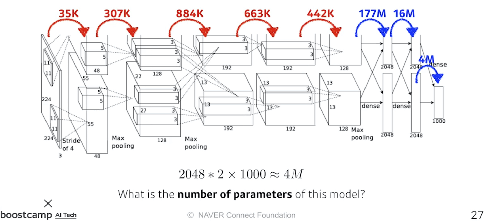
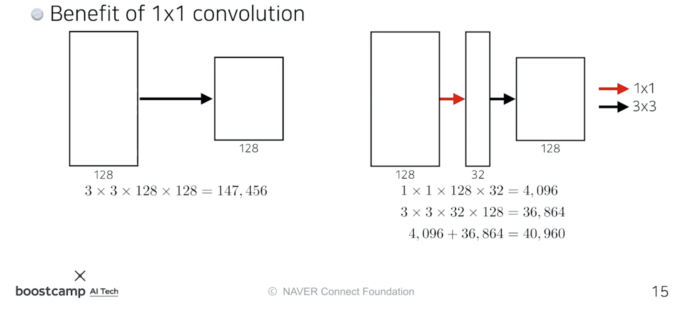
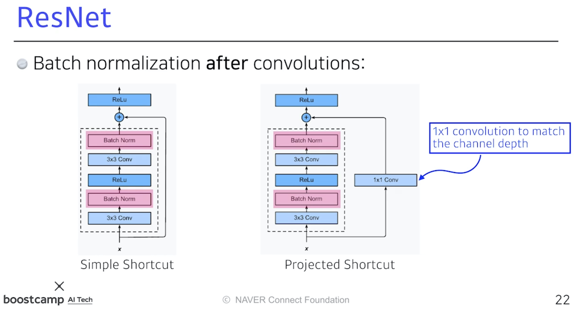
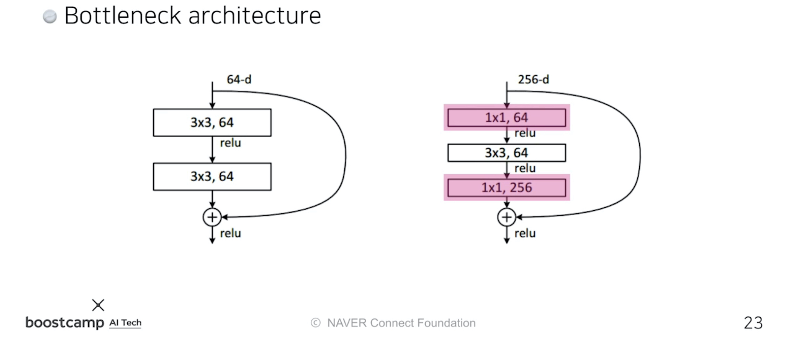
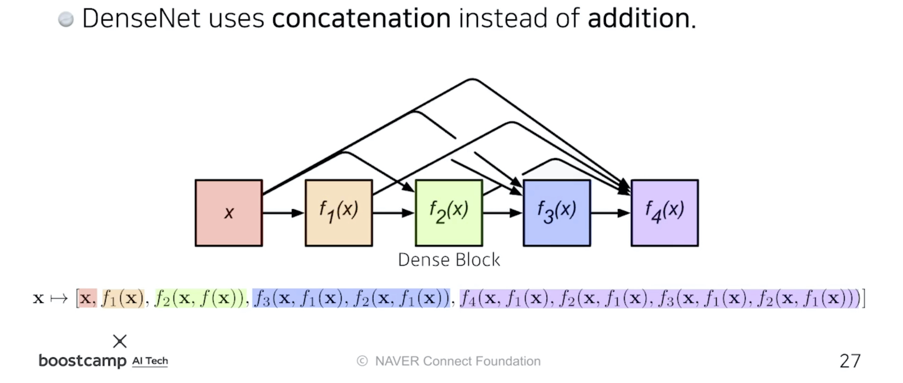

본 정리 내용은 [Naver BoostCamp AI Tech](https://boostcamp.connect.or.kr/)의 edwith에서 학습한 내용을 정리한 것입니다.  
사실과 다른 부분이 있거나, 수정이 필요한 사항은 댓글로 남겨주세요.

---

# Convolution Neural Network Basic

## 원리

**`CNN`**은 `합성곱 계층(convolution layer)`과 `풀링 계층(pooling layer)`, 그리고 `전연결 계층(fully-connected layer)`으로 이루어져 있는 신경망으로, 이미지 등을 처리하는데에 자주 사용되는 모델이다.

- 합성곱 계층, 풀링 계층 : feature를 추출한다.
- 전연결 계층 : 분류/회귀 문제에 대해 decision making한다(출력값을 만든다)

그러나 모델의 파라미터가 너무 많아지면 Generalization 이슈가 생기기 때문에, **최근에는 전연결계층을 없애려고 하는 추세**이다.

<Primary>

아래에서 풀이하는 CNN은 편의상 편향(bias)을 설명하지 않았지만, 실제로는 편향도 고려하여 연산에 추가하여야 한다는 것을 유의하자.

</Primary>

#

### Stride

**`Stride`**는 '넓게 걷는다'라는 뜻으로, **매번 커널을 찍을때 얼마나 이동할것인가**를 의미한다. stride가 클수록 output의 사이즈는 작아지게 된다.

#
### Padding

**`패딩(Padding)`**은 입력 값의 가장자리를 커널로 찍기 위해 **덧대는 공간**이다. 일반적으로 해당 패딩 위치에 0을 넣는 제로패딩을 사용한다.

커널의 크기를 어떻게 하느냐에 따라 패딩의 크기가 달라지기도 한다. 예를 들어, 3x3 커널에서는 패딩을 1칸만 추가해도 가장자리를 찍을 수 있겠지만, 5x5 커널에서는 모서리를 커널의 중심으로 두고 가장자리에 커널을 찍기위해 패딩을 2칸은 추가해야할 것이다.
#
## Convolution 파라미터 개수 구하기

### 두 계층 간의 파라미터 개수

만약 (H,W,C)가 (40,50,128)인 입력값을 convolution연산하여 (40,50,64)의 출력값을 만들었다면, 그 사이에 들어가있는 파라미터는 몇개나 될까?

- 패딩은 1, 스트라이드는 1, 커널의 크기는 3x3이라고 한다.

커널의 채널 크기는 입력값의 채널수와 같으므로, 커널은 (3,3,128)이 될 것이다. 커널의 갯수는 출력값의 채널 수와 같아야하므로 64개가 될 것이다.

**패딩, 스트라이드 등은 파라미터 개수와 무관하다**. 파라미터 개수는 커널 (내부) 값들의 개수이므로, 3x3x128x64 = 73,728개가 된다.

#
### Fully Connected Layer가 있다면

위에서 Fully Connected Layer가 있다면 파라미터 개수가 너무 많아져 Generalization 이슈가 생길 수 있다고 했는데, 일반적인 Convolution에 비해 왜 파라미터 개수가 많아질까?
#

#
위의 그림은 AlexNet의 파라미터 개수를 나타낸다. 잘 보면 Fully Connected Layer인 Dense Layer에 진입하는 순간 파라미터의 개수가 엄청나게 커지는 것을 볼 수 있다. 이는 **전연결시에 모든 입력 노드(값)들을 다음 계층의 노드들과 연결하여 파라미터를 생성하기 때문**이다.

이와 다르게 Covolution 연산에서 사용하는 파라미터, 커널은 모든 채널과 input에 대해 동일하게 동작하는 `공유 파라미터(shared parameter)`이다. 따라서 전연결 계층에 비해 파라미터 개수가 훨씬 줄어들게 되어 결과적으로 Generalization이 잘 되는 특징을 가진다. 이 때문에 **최근 CNN의 트렌드는 앞단의 Convolution Layer를 깊게 쌓고, 뒤쪽의 Fully Connected Layer를 최대한 줄이는 것**이다. 이를 통해 네트워크의 깊이는 깊어지지만, 파라미터 개수는 오히려 줄어들어, 적은 연산으로도 더 뛰어난 성능을 낼 수 있게 된다.

#
## 1x1 Convolution

가끔 Convolution 연산을 보다보면, 1x1의 커널로 연산하는 경우가 있다. 1x1로 연산한다면 H와 W의 값을 조정할수도 없을텐데 왜 하는것일까?

**`차원축소(Demension Reduction)`** 때문이다. 기존의 H,W라는 공간차원은 그대로 유지한 채, **채널만 줄이기 위해 사용**한다. 이를 통해 **<U>깊이(depth)를 늘리는 도중에 파라미터의 개수를 감소</U>**시킬수 있게 된다.

아주 자주 사용하는 테크닉으로, 예시로 bottleneck architecture 등이 있다.

#
## CNN의 변천사

### AlexNet

[Imagenet Classification with Deep Convolutional NN 논문](https://kr.nvidia.com/content/tesla/pdf/machine-learning/imagenet-classification-with-deep-convolutional-nn.pdf)

[ILSVRC](http://www.image-net.org/challenges/LSVRC/#:~:text=The%20ImageNet%20Large%20Scale%20Visual,image%20classification%20at%20large%20scale.&text=Another%20motivation%20is%20to%20measure,indexing%20for%20retrieval%20and%20annotation.)에서 2012년 우승한 모델이다.

여러 필터 중 하나로 11x11을 사용했는데, 이렇게 하면 하나의 커널이 볼 수 있는 영역은 커지지만, 상대적으로 더 많은 파라미터가 필요하므로 그렇게 좋은 선택은 아니다.

모델의 핵심 포인트는 다음과 같다.

- Rectified Linear Unit(ReLU) 활성함수 사용
    - 선형 모델의 프로퍼티를 보존 :  $x>0$이면 gradient가 선형모델과 동일하다.
    - 경사하강법으로 최적화하기 쉽다.
    - 일반화 성능이 좋다(실험결과)
    - **기울기 소실 문제(Vanishing Gradient Problem)을 해결하였다.**
- GPU Inplementation (2개의 GPU 사용) - 당시 하드웨어 기술의 메모리 부족으로 인하여 2개의 GPU를 사용하였다.
- Local response normalization, Overlapping pooling
    - 지금은 잘 사용되지 않는다.
- Data augmentation
- Dropout(p=0.5)

#
### VGGNet

[Very Deep Convolutional Networks For Large-Scale Image Recognition 논문](https://arxiv.org/pdf/1409.1556.pdf%20http://arxiv.org/abs/1409.1556.pdf)

2014년도 ILSVRC에서 준우승한 모델이다.

모델의 핵심포인트는 다음과 같다.

- 3x3 필터(스트라이드 1)을 사용하고 depth를 늘렸다.
- 전연결계층에서 1x1 convolution 연산을 사용했다.
- Dropout(p=0.5)
- 계층 수에 따라 VGG16, VGG19로 나뉜다.

모든 레이어에서 **필터를 3x3으로 통일**하였다. 이것은 어떤 의미를 가질까?

필터가 크다는 것은, 순전파 과정에서 하나의 convolution feature 값을 얻기 위해 고려할 수 있는 입력의 spatial dimension, 즉 **`수용영역(Receptive Field)`**이 커진다는 말이다.

만약 3x3 필터를 두 번 사용하게 된다면, 결국 5x5를 한번 사용하는것과 **<U>수용영역 차원에서는 동일</U>**하다. 3x3을 하나의 셀로 축소시킨것을 다시 3x3개 모아서 축소시키기 때문이다.

그러나 파라미터 개수에는 큰 차이가 있다. 입력, 출력의 채널이 각각 (128,128)이라고 생각해보자.

$$
\begin{aligned}
3\times 3\times 128\times 128 +3\times3\times 128\times 128 &=\bold{294,912}\\
5\times 5\times 128\times 128 &= \bold{409,600}
\end{aligned}
$$

따라서 **<U>같은 수용영역을 커버하면서 파라미터의 개수를 줄이기 위해서</U>**는 3x3으로 계층을 한번 더 쌓는것이 낫다.

이러한 이유로 최근에는 대부분 필터의 크기가 3x3, 커봤자 7x7을 넘지 않는다.

#
### GoogLeNet

[Christian et al, "Going Deeper with Convolutions", CVPR, 2015 논문](https://arxiv.org/pdf/1409.4842.pdf)

2014년도 ILSVRC에서 우승한 모델이다.

22단으로 이루어져 있으며, 비슷한 네트워크가 전체 네트워크 내부에 여러번 들어가 있다. 이를 `Network in Network,NiN` 구조라고 부른다.

입력값이 Convolution 연산으로 들어가기전에 1x1 Conv를 거치는데, 이를 **`Inception Block`**이라고 하며 GoogLeNet 모델에서 가장 중요한 부분이다. Inception Block을 이용하여 파라미터 숫자를 줄일 수 있게 된다. 왜 그럴까?

1x1 Convolution이 **채널방향으로(channel-wise) 차원을 축소하는 효과가 있기 때문**이다.

입력과 출력의 채널도 같고 , 수용영역도 같지만 1x1 convolution을 중간에 추가하는 것만으로  **파라미터의 개수는 1/3보다 더 줄어들었다.**

#
### ResNet

[Deep Residual Learning, CVPR, 2016 논문](https://openaccess.thecvf.com/content_cvpr_2016/papers/He_Deep_Residual_Learning_CVPR_2016_paper.pdf)

2015년도 ILSVRC에서 우승한 모델이다.

신경망의 깊이가 깊을수록, 학습하기는 더 어려워진다.

- 오버피팅은 일반적으로 파라미터 개수가 너무 많을 경우 일어난다.
- 그러나 깊이가 깊은 경우에는 오버피팅이 일어나지 않음에도 불구하고 학습에러에 비해 테스트에러가 훨씬 크게 나온다.

그래서 ResNet은 **`identity map(skip connection)`**이라는 것을 추가했다. **입력값으로 들어온 x를 convolution layer 한 층의 출력값에 더해주는 것**이다. 이렇게 만든 block을 **`Residual Block`**이라고 한다.

기존의 신경망은 입력값 x를 목표 출력값 y로 매핑하는 함수 H(x)를 얻는것이 목표였는데, ResNet은 F(x)+x를 최소화시키는것이 목표다. 이 때 x는 정해진 상수이므로 F(x)를 최소화해야한다. F(x) = H(x)-x, 즉 **`잔차(Residual)`**이므로 잔차를 최소화한다고 하여 ResNet이라는 이름이 붙게 된다.

자세한 설명은 아래 링크를 참고하자.

[(7) ResNet (Residual Connection)](https://itrepo.tistory.com/36)

[[CNN 알고리즘들] ResNet의 구조](https://blueskyvision.tistory.com/644)

#
이렇게 학습시키게 되면, **이미 배웠던 내용 x를 제외한 차이점(f(x))만을 학습**하면 되므로 학습이 더 잘이루어지게 된다.
#

#
이 때, 위의 Simple Shortcut과 같은 방식으로 진행하려면 두번의 conv를 거치고 난 뒤 BN까지 진행하고 나서의 (채널)차원이 기존의 입력값 x와 같아야한다. 만약 차원이 다르다면, 이를 맞춰주기 위해 1x1 Conv로 채널을 맞춰주게 된다. 이를 `Projected Shortcut`이라고 한다.

- Projected Shortcut이 자주 사용되지는 않으며, 일반적으로 `Simple Shortcut`을 많이 사용한다.

또, ResNet은 Batch Normalization이 Convolution 뒤에 일어난다는 특징이 있다. 다만, Batch Normalization을 ReLu 뒤에 넣는것이 더 학습효과가 좋다는 논쟁도 있다. 논문에서는 위의 이미지와 같은 순서로 수행한다.
#

#
3x3 Conv를 수행할 때, Conv의 파라미터 개수는 [3x3x입력채널x출력채널]이다. 그렇다면 **1x1 Conv로 입력채널을 줄여서 넣고, 출력 후에는 채널을 늘릴 수도 있을 것**이다. 이를 **`Bottleneck architecture`**라고 한다.

#
### DenseNet

ResNet의 Residual Block에서 x값을 더해(addition)주면 두 값이 섞이게 된다. 그래서 이 과정을 **`연쇄적으로 잇는 것(concatenation)`으로 대체**한다.
#

#
문제는 concatenation 하면 할수록 **채널수가 점점 기하급수적으로 커진다**는데에 있다. 채널 수가 많아지면 Conv 연산 시 파라미터수가 자연스레 많아지므로, 이를 해결하기 위해 중간에 채널숫자를 줄여주는 **`Transition Block`**을 끼워넣는다.

- **`Dense Block`**
    - 각 층은 모든 이전층의 feature map을 concatenate한다.
    - 채널의 수는 기하급수적으로 커지게 된다.
- **`Transition Block`**
    - BatchNorm → 1x1 Conv → 2x2 AvgPooling
    - 채널 차원을 축소한다.(Dimension Reduction)