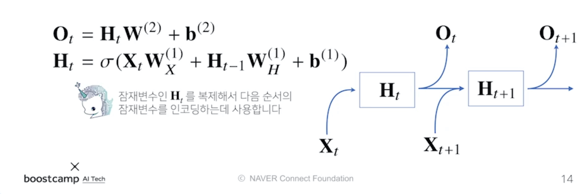
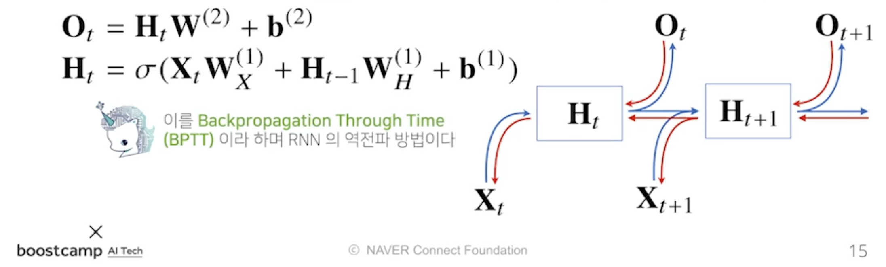
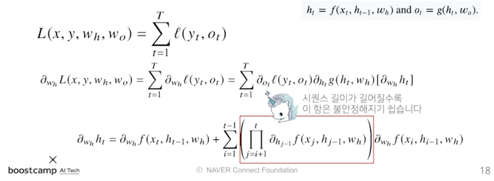

본 정리 내용은 [Naver BoostCamp AI Tech](https://boostcamp.connect.or.kr/)의 edwith에서 학습한 내용을 정리한 것입니다.  
사실과 다른 부분이 있거나, 수정이 필요한 사항은 댓글로 남겨주세요.

---

# Recurrent Neural Network

**`Recurrent Neural Network(RNN, 순환신경망)`**는 이전까지 다뤘던 CNN 등과는 달리, **시계열 데이터(Time-Series Data) 또는 시퀀스 데이터(Sequence Data)를 다루는 데에 주로 사용되는 모델**이다.

## 시퀀스 데이터

### 시퀀스 데이터란

**`시퀀스 데이터`**란 **순차적으로 들어오는 데이터**를 일컫는다. 소리, 문자열, 주가 등이 있다.

시퀀스 데이터에서는 정보들이 시간 순서대로 종합되어서 시점별로 나타난다. 따라서 **이벤트의 발생 순서가 데이터의 중요한 요소로서 동작**한다.

기존의 데이터에 비해 시퀀스 데이터에서 유의할 점은, **<U>독립동등분포(independant identically distributed, i.i.d)를 위배하기 쉽다</U>**는 것이다. 맥락과 순서가 중요하기 때문에, 순서를 바꾸거나 과거 정보에 손실이 발생하면, 데이터의 확률 분포가 바뀌거나 미래 예측의 정확도가 떨어지게 된다.

### 시퀀스 데이터를 다루는 방법

이전 시퀀스의 정보를 가지고 앞으로 발생할 데이터의 확률분포를 다루기 위하여, `조건부확률`을 이용할 수 있다.

$$
\begin{aligned}
P(X1_,\dots,X_t)&=P(X_t|X_1,\dots,X_{t-1})P(X_1,\dots,X_{t-1})\\
&= P(X_t|X_1,\dots,X_{t-2})P(X_1,\dots,X_{t-2})\times P(X_1,\dots,X_{t-2})\\
&=\prod^t_{s=1}P(X_s|X_{s-1},\dots,X_1)
\end{aligned}
$$

현재 시점인 $t$  까지의 확률분포를 알기 위해, $t-1$까지의 확률분포를 구한다. $t-1$의 확률분포를 구하기 위해 $t-2$까지의 확률분포를 구한다. 이를 반복하여 최초까지 내려가면, 최초의 시점부터 순차적으로 조건부확률을 곱하는 식으로 일반화할 수 있다.

$$
X_t \sim P(X_t|X_{t-1},\dots,X_1)
$$

다만, 위의 조건부확률과는 달리 시퀀스 데이터를 분석할 때 일반적으로는 과거의 **모든 정보(즉, 최초시점부터의 모든 정보)를 사용하지는 않는다**. 최근 어느 시점까지의 정보를 이용하거나, 몇 개의 과거 정보들을 truncation하기도 한다. 필요성에 따라서 어느 시점까지 데이터를 활용할 지 모델링이 달라질 수 있다.

$$
X_{t+1} \sim P(X_{t+1}| \textcolor{red}{X_t,X_{t-1}\dots,X_1})
$$

따라서, $X_{t+1}$을 예측하기 위한 **조건부확률에 들어가는 데이터 길이 $X_{t},X_{t-1},\dots,X_1$는 가변적**이므로, 시퀀스 데이터를 다루기 위해서는 길이가 가변적인 데이터를 다룰 수 있는 모델이 필요하다.

가변적인 길이나 아니라 고정된 길이 $\tau$만큼의 시퀀스만 사용하는 경우 **`AR 모델`**, 즉 **`자기회귀모델(Autoregressive Model)`**이라고 부른다. 다만, $\tau$의 길이는 직접 정해주어야하는 하이퍼파라미터가 되므로, $\tau$를 결정할 때에는 어느정도의 설계자의 사전지식이 필요하게 된다.

또, 문제에 따라 먼 과거의 정보들을 고려해야 하기도하고, $\tau$가 바뀌는 경우가 있다. 이런 경우 사용되는 방법이 RNN의 기본 모형인 **`잠재 AR 모델(Latent Autoregressive Models)`**, 즉 **`잠재자기회귀모델`**이다.

$$
_t \sim P(X_t|X_{t-1},\textcolor{red}{\dots,X_1}) \textcolor{red}{\rarr H_t}\\
X_{t+1} \sim P(X_{t+1}|X_t,\textcolor{red}{X_{t-1}\dots,X_1})\textcolor{red}{\rarr H_{t+1}}
$$

이 경우 $X_t$ 를 예측하기 위해 직전정보인 $t-1$ 시점의 정보 $X_{t-1}$를 제외한 나머지 $X_{t-2},\dots$의 정보들을 $H_t$라는 **`잠재변수`**로 인코딩하여 이용한다.

따라서, 직전 시점의 정보와 잠재변수$H$ 두 가지만 가지고 예측할 수 있기 때문에 고정된 길이의 데이터를 가지고 모델링 할 수 있게 된다.

$$
H_t = \textrm{Net}_\theta(H_{t-1}, X_{t-1})
$$

이 때 잠재변수 $H_t$를 신경망을 통해 반복 사용하여 시퀀스 데이터의 패턴을 학습하는 모델을 **`RNN`**이라고 한다.

## RNN 이해하기

### RNN의 순전파

가장 기본적인 RNN 모형은 MLP와 유사한 모형이다.

$$
\begin{aligned}
O_t &= H_tW^{(2)} + b^{(2)}\\
H_t &= \sigma(X_tW^{(1)}+b^{(1)})
\end{aligned}
$$

이 때, $W^{(1)}$과 $W^{(2)}$는 시퀀스와 상관없이 불변인 가중치 행렬이다.

이 모델의 문제점은, 입력이 현재 시점($t$)과 관련된 것만 들어오기 때문에, **예측할 때 과거 정보를 다룰 수 없다**는 것이다. 따라서 과거 정보를 다루기 위해 RNN에서는 과거의 잠재변수 $H_t$를 복제하여 다음 순서의 잠재변수를 인코딩하는 데에 사용한다.

$$
\begin{aligned}
O_t &= H_tW^{(2)} + b^{(2)}\\
H_t &= \sigma(X_tW_X^{(1)}+H_{t_1}W_H^{(1)}+b^{(1)})
\end{aligned}
$$

유의할 점은, **가중치 행렬 $W$가 세 개 나온다**는 것이다.

- $W_X^{(1)}$ : 입력 데이터에서 선형 모델을 통해 잠재변수로 인코딩하는 가중치 행렬
- $W_H^{(1)}$ : 이전 시점으로 잠재변수로부터 정보를 받아서 현재시점의 잠재변수로 인코딩하는 가중치 행렬
- $W^{(2)}$ : 만든 잠재변수를 출력값으로 만들어주는 가중치 행렬

<Primary>

세 가중치 행렬은 시점 t에 따라 변하지 않음을 명심하자. 위의 세 가중치 행렬들은 동일하게 각각의 시점에서 활용되어 모델링에 사용된다.
</Primary>

### RNN의 역전파

RNN의 역전파는 **잠재변수의 연결그래프에 따라 순차적으로 계산**한다. 이를 **`Backpropagation Through Time(BPTT)`**이라고 한다.

RNN의 모든 시점에서의 예측이 전부 이루어진 다음, 마지막 시점의 Gradient가 타고 올라와서 과거까지 흐른다. **<U>RNN은 모든 시간 스텝에서 파라미터 $W$를 공유하므로, 한 시점에서 오류가 역전파되면 이것이 모든 이전시점으로 시간을 거슬러 퍼지게 된다.</U>** 그래서 BPTT라는 이름이 붙었다.

위의 그림에서 빨간 선이 역전파과정인데, $H_t$의 역전파에 들어오는 Gradient는 $H_{t+1}$과 $O_t$에서 각각 하나씩 총 두개가 있다. 

### BPTT 이해하기

BPTT를 통해 RNN의 가중치행렬 미분을 계산해보면, 아래와 같은 미분의 곱으로 이루어진 항이 계산된다.

최종적으로 나오게 되는 Product Term(빨간색 박스가 나타내는 항)은 $i+1$부터 $t$ 시점까지의 모든 잠재변수에 대한 미분값이 곱해지는데, 이 때 **<U>시퀀스의 길이(즉, 시점간의 거리)가 길어질수록 해당 항이 불안정해지기 쉬워진다.</U>**

- 매 시점마다 1보다 큰 수가 곱해진다면 미분값이 아주 커진다.
- 매 시점마다 1보다 작은 수가 곱해진다면 미분값이 아주 작아진다.

가장 주의해야 하는 것은 작은 수의 미분값이 곱해져 **Gradient가 0으로 소실되는 현상(`Vanishing Gradient`)**이다. 이 경우 과거시점으로 갈 수록 Gradient가 점점 작아지기 때문에 과거 시점의 정보가 제대로 반영이 되지 않아 유실된다. 이러면 긴 시퀀스를 분석해야하거나 문맥적인 부분이 중요한 모델의 경우 좋은 결과를 얻을 수 없다.

따라서 시퀀스 길이가 너무 길어지는 경우 길이를 끊는 것이 필요한데, 이를 **`truncated BPTT`**라고 부른다. 과거의 일정 시점마다 블럭을 나눠서 해당 블럭 단위로만 backpropagation 연산을 하는 방법이다.

그러나 이 방법이 완전히 기울기 소실 문제를 해결하지 못하므로, 일반적으로는 Vanilla RNN을 사용하지 않고 좀 더 발전한 RNN( `LSTM`, `GRU`)을 사용한다.