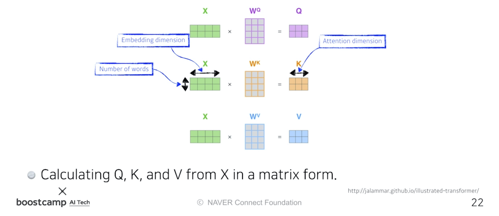

본 정리 내용은 [Naver BoostCamp AI Tech](https://boostcamp.connect.or.kr/)의 edwith에서 학습한 내용을 정리한 것입니다.  
사실과 다른 부분이 있거나, 수정이 필요한 사항은 댓글로 남겨주세요.

---

# Transformer

## Sequential Model의 한계점

`RNN`에서 다루었던 Sequential Model들은 완벽한 구성성분을 가진 특정 데이터가 아니면 학습하기가 어려웠다.

- 문장을 학습시킨다고 할 때
    - Original Sequence
        - 나는 오늘 학교에 가서 학식을 먹었다.
    - Trimmed Sequence - 문장마다 길이가 다르다.
        - 나는 오늘 학교에 갔다.
    - Ommited Sequence - 문장성분이 누락되어 있을 수 있다.
        - 오늘 학식 먹었다.
    - Permuted Sequence - 성분의 순서가 permute 될 수 있다.
        - 오늘 학교 가서 학식 먹었지, 나는.

이런 문제를 해결하고자 등장한 것이 **`Transformer`** 구조이다.

## Transformer 구조

### Transformer란?

[Attention is All you Need, 2017](https://arxiv.org/pdf/1706.03762.pdf)

재귀적으로 Input이 들어가는 RNN 모델과 달리, Transfomer는 **`attention`**이라고 불리는 구조를 활용하여 sequence를 해석하는 모델이다.

최초에는 `신경망기계번역(Neural Machine Translation, NMT)` 문제에 사용되었지만, 시퀀스 데이터를 처리하고 인코딩하는 방법이므로, NMT 문제 뿐 아니라 **여러 분야에 사용될 수 있다**. 이미지 분류, detection, visual translation 등 활용도가 넓다.

아래의 내용들은 Jay Almmar의 Transformer에 관련된 글을 얕게 풀이한다. 더 깊은 내용이 궁금하다면 해당 블로그를 참조하자.

[The Illustrated Transformer](http://jalammar.github.io/illustrated-transformer/)

### 형태

불어를 입력값으로 주면, 번역한 영어를 내뱉는 `seq2seq(Sequence-to-Sequence)` 모델이 있다고 하자.

기존의 RNN 구조는 단어의 개수만큼 재귀적으로 수행해야만 했다. 그러나, Transformer는 **재귀적 수행이 없고, 한번에 N개의 단어를 모두 처리할 수 있다**. 물론 Generation 시에는 autoregressive하게 단어마다 수행한다.

또, 동일한 구조를 갖지만, 파라미터가 다르게 학습되는 **`인코더(Encoder)`**와 **`디코더(Decoder)`**가 stack되어있다.

여기서 중요한 포인트는 다음과 같다.

1. 어떻게 N개의 단어를 한번에 처리할 수 있는가?
2. 인코더와 디코더 간에 어떤 정보를 주고받는가?
3. 디코더가 어떻게 Generation 할 수 있는가?

특히 그 중 1번에 집중해서 살펴보기로 한다.

### 구조 뜯어 보기

인코더는 **`Self-Attention`**과 **`Feed Forward Neural Network`**라는 두개의 층을 모아놓은 것으로 이루어져 있다. 인코더는 **모든 단어 벡터를 한번에 입력으로 받으며, 출력값을 바로 다음 인코더로 전달**한다. 이 중 Feed Forward Nerual Network는 MLP과 별 다른 차이가 없다.

**`Self-Attention`**은 `Attention 메커니즘`의 핵심이라고 할 수 있다. Self-Attention에서 Feed Forward 층으로 넘어갈 때,  문장에서 특정 단어만 보는 것이 아니라 **<U>문장의 모든 단어를 모두 활용</U>**한다. 따라서  Self-Attention 층에서 output을 내보낼 때, 모든 단어들과의 dependancy가 생기게 된다.

- Feed Forward Neural Network는 input된 단어들에 대해 독립적 / 병렬적으로 수행하므로 dependacy가 없다.

"The animal didn't cross the street because it was too tired."라는 문장이 있다고 했을 때, it이 무엇을 의미하는 지 알아내는 것은 문장 해석의 중요한 포인트이다.

이 때 Self Attention을 사용하면 **문장 내에서 it에 대응하는 단어들을 모두 고려**하여 가장 가능성이 높은 'animal'로 학습하게 된다.  따라서 기계가 문장 내부에서 단어의 의미를 비교적 더 잘 이해할 수 있다고 표현할 수 있다.

Self Attention 구조는 마치 3개의 신경망처럼 작동한다. 하나의 입력(**`단어 임베딩, word embedding`**)이 주어졌을 때마다 **각 신경망을 통해서 다음과 같은 3개의 벡터를 만들어낸다**. 이 3개의 벡터를 이용하여 입력받은 단어 $X$를 새로운 벡터로 바꿔주게 된다.

1. **`Query`**
2. **`Key`**
3. **`Value`**

단어가 주어지면, 해당 단어에 대한 Query 벡터와 나머지 모든 단어에 대한 Key 벡터를 구한 뒤 내적하여 **`Score 벡터`**를 구한다. 이 score들은 **$i$번째 단어가 다른 단어와 얼마나 유사도(관계)가 있는지 계산하는 역할**을 한다. 즉, 신경망은 **<U>해당 단어와 나머지 단어 사이에 얼마나 interaction이 일어나야하는지를 학습할 수 있다.</U>** 어떤 단어를 더 주의(attention)깊게 볼 지 정하는 것이므로 attention이라는 이름이 붙여졌다.

계산된 Score 벡터에 `Normalize`를 한다. 이 때 나누어주는 8이라는 숫자는 Key 벡터의 dimension과 관련이 있다. Key 벡터를 몇 차원($d_k)$으로 만드는가는 직접 정해주는 하이퍼파라미터이며, Normalize 시 $\sqrt{d_k}$를 나눠주어 score의 range를 조정해 준다. 이후 Normalize 된 Score에 Softmax를 취해 이를 **`attention rate`**로 바꾸어 준다.

이 <U>**attention rate와 각각의 단어에서 나오는 Value 벡터들의 가중합(weighted sum)**이 최종적으로 해당 단어의 **`인코딩된 벡터(encoded vector)`**가 된다.</U>

이 때 유의할 사항들이 몇 가지 있다.

- Score 벡터를 구하기 위해 Query 벡터와 Key 벡터를 내적해야 하므로, **Query와 Key 벡터의 차원은 같아야한다.**
- **Value 벡터는 차원이 달라도 된다**. Value 벡터는 attention rate와 가중합을 계산하기만 하면 되기 때문이다.
- 최종적으로 산출되는 (특정 단어의) **인코딩된 벡터는 Value 벡터의 차원과 동일**하다.

이를 행렬로 표현하면 다음과 같다.

- $X$의 각 row는 하나의 단어를 의미하고, column은 단어의 임베딩을 의미한다.
- $Q,K,V$는 각각 Query 벡터, Key 벡터, Value 벡터를 의미한다.

길게 설명했던 Self Attention의 과정을 matrix간의 계산으로 표현하면 위와 같은 짧은 식으로 도출된다.

이 때 softmax는 Row-wise하게 적용해야하며, $dim(V)$-여기서는 3-와 $dim(Z)$가 같고, $dim(Q)$와 $dim(K)$와는 다를 수 있다는 점을 주목해야한다.

### 원리

그렇다면 도대체 왜 이러한 **`어텐션 메커니즘(Attention Mechanism)`**이 잘 작동하는 것일까?

어떤 이미지가 주어졌다고 생각하자. 이 이미지를 MLP나 CNN에 집어넣으면, 입력이 Fix되어 있으므로 출력이 고정된다.

그러나 Transformer는 네트워크가 Fix되어있다고 하더라도, 인코딩하려는 단어와 **그 옆의 단어들에 따라** 인코딩 결과값이 달라진다. 따라서 결과적으로 MLP보다 좀 더 유연한 모델이 된다. 단순히 **<U>입력된 단어에 따라 출력이 고정되는 것이 아니라, 옆에 주어진 다른 입력(단어)들을 모두 고려하므로 출력이 변화할 여지가 있기 때문</U>**이다.

물론, 더 많은 것을 고려하므로 더 많은 연산($n^2)$이 필요하게 된다. 예를 들어 1000개의 단어가 주어지면 한번에 1000^2의 입력을 처리해야한다. 반면, RNN은 1000개의 단어가 주어지면 그냥 연산을 1000번 수행하면 된다. **너무 긴 입력이 주어지면 메모리 부족으로 한번에 계산할 수 없다는 한계를 가진다.** 

정리하자면,

1. 기존의 RNN에 비해 훨씬 더 많은 문맥정보들을 파악할 수 있다.
2. 연산자원이 비교적 많이($n^2)$ 든다.

### Multi-headed attention

**`Multi-headed attention(MHA)`**은 앞에서 이야기했던 attention 과정을 여러번 수행한다. **하나의 임베딩 벡터(입력)에 대해서 (Query,Key,Value) 벡터 셋을 여러 개 만든다**. 이 때문에 multi-headed(머리가 여러개)라는 이름이 붙었다.

MHA로 $n$ 개의 헤드를 사용해 $n$ 개의 인코딩된 벡터가 나오게 되면, 이 값을 concatenate하여 다음 인코더로 넘겨준다. 이 때, 여러 번의 인코더를 타야 하므로, 인코딩된 벡터(출력값)의 차원을 인코딩 하기 전의 입력값 차원과 동일하게 맞춰줄 필요가 있다. 그런데 MHA의 (concatenate 된) 출력 벡터는 기존의 입력값에 비해 $n$ 배의 차원이 되었으므로, 이를 적절한 행렬 $W^O$와의 행렬곱을 통해 기존의 크기로 변환시켜준다.

그러나 **실제 구현은 위와 같은 방식으로 이루어지지 않는다**. 원래 주어진 임베딩 단어의 차원이 100차원이고 10개의 head를 사용한다면, 이를 10개로 나눈다. 즉, 10차원짜리 입력만을 가지고 Query, Key, Value 벡터를 만들게 된다. 이는 구현된 코드를 보고 직접 확인해보자.

### Positional Encoding

Transformer 모델은 마치 bias처럼 입력에 특정 값을 더해주는 **`Positional Encoding`**도 수행한다. 왜 이런 Positional Encoding이 필요한 것일까?

Transformer 모델은 여러 단어들을 동시에 고려하도록 설계되었지만, **sequential한 정보가 포함되어있지 않기 때문**이다. [a,b,c,d]로 이루어진 문장구조나, [a,d,b,c]로 이루어진 문장 구조나 동일하게 단어간의 attention만을 측정할 뿐이므로, **순서에 독립적(order-independent)**이다.

그러나 실제 문장에는 어떤 단어가 먼저 나왔고 그렇지 않은지가 중요하다. 이미지에서도 마찬가지다. 따라서 주어진 입력에 대해 어떤 값을 더함으로써 이러한 문제를 해결한다.

이에 대해서는 자세히 설명된 다음 블로그 글을 참고하자.

[positional encoding이란 무엇인가](https://skyjwoo.tistory.com/entry/positional-encoding%EC%9D%B4%EB%9E%80-%EB%AC%B4%EC%97%87%EC%9D%B8%EA%B0%80)

위에서 이야기했던 Transformer 모델의 Encoder 과정들을 다음과 같은 도식으로 표현할 수 있다.

#

## Decoder

이제  Decoder를 살펴보자.

인코더에서 디코더로 넘어갈 때, 어떤 정보들이 전달될까?

### 원리

Input에 있는 값들을 디코더에 있는, 즉 출력하고자 하는 단어들에 매핑하는 `Attention Map`을 만드려면,  Key 벡터와 Value 벡터가 필요하다. 마지막 인코더 층(가장 상위 인코더)의 출력값은 여러 단어들의 [Key 벡터, Value 벡터] 시리즈로 제공되고, 이 값들을 각 Decoder 내부의 '**`Encoder-Decoder Attention`**' 계층에서 해석하여 입력 시퀀스의 적절한 위치를 잡아주게 된다.

- 이 Encoder-Decoder Attention Layer는 MHA와 동일한 방식으로 동작하지만, **Query 벡터를 이전 Decoder에서 받아오고 Key, Value 벡터를 인코더 스택에서 받아온다**는 차이가 있다.

디코더의 마지막 층에서는, **디코더 스택의 출력물을 단어들의 분포로 만들어 내보낸다**. 이 단어들을 매번 샘플링하는 형식으로 모델의 출력이 만들어진다.

모든 출력이 끝나면, `EOS(End Of Sentence) 토큰`이 나와 종료를 알린다.

## Transformer의 활용

최근에는 Transformer의 활용이 시퀀스 데이터에만 머무르지 않고, 이미지 영역 등 다양한 분야에 사용되고 있다.

### Vision Transformer

[An Image is Worth 16x16 Words: Transformers for Image Recognition at Scale](https://arxiv.org/pdf/2010.11929.pdf)

Transformer 모델에서 인코더를 차용해 이미지 분류 시에 사용한다.

### DALL-E

[DALL·E: Creating Images from Text](https://openai.com/blog/dall-e/)

문장이 주어지면 이에 맞는 이미지를 만들어낸다.  Transformer의 decoder만 이용하여 만들었다.(GPT-3를 활용했다고 한다)

---

개인적으로 3주간 공부하면서 가장 어려운 파트였다. 개념 상 이해해야 하는 부분도 많았고, 특히 최근에 가장 많이 사용되는 모델링이어서 제대로 이해하고싶은 마음에 이것저것 찾아보는데 무엇하나 명확하게 그림이 그려지지 않아서 더 어려웠다. 아쉬운대로 넘어가지만, 추후에 좀 더 자세히 살펴보며 보강해가야겠다.