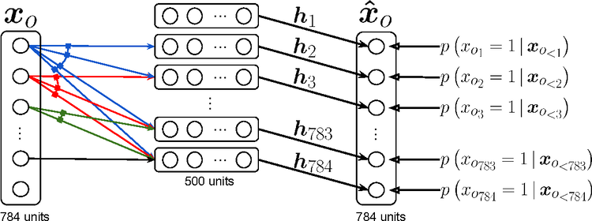
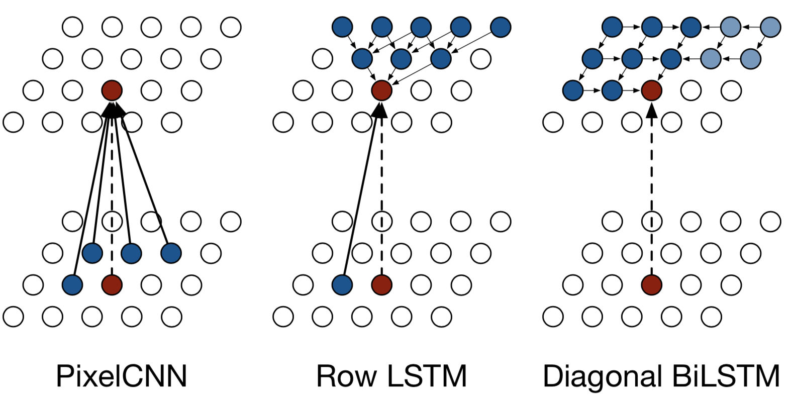
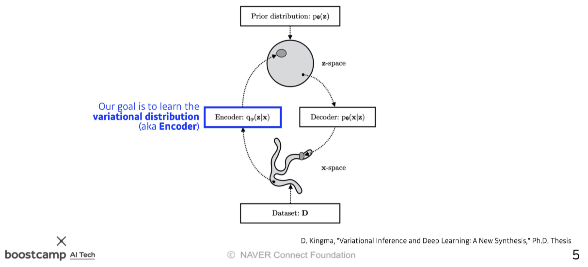
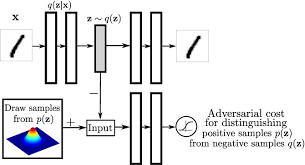
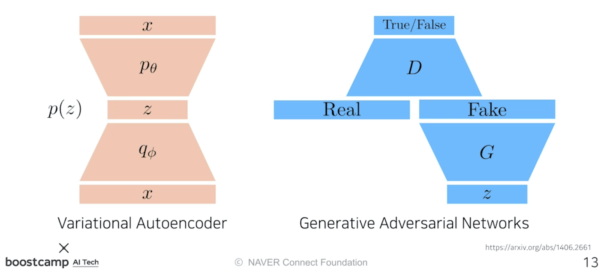
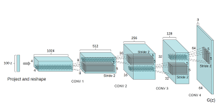
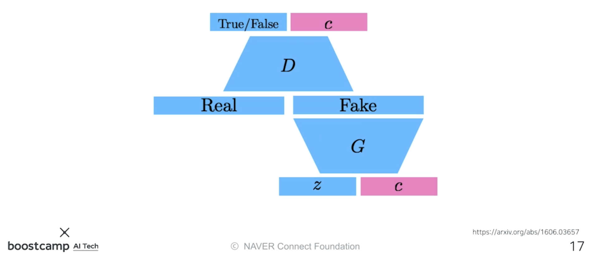
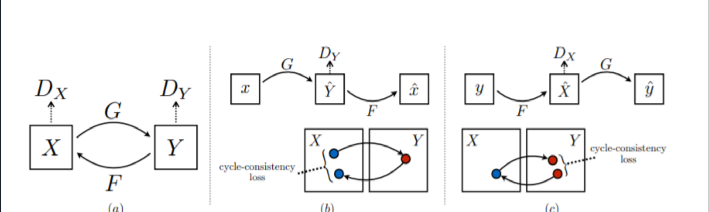

본 정리 내용은 [Naver BoostCamp AI Tech](https://boostcamp.connect.or.kr/)의 edwith에서 학습한 내용을 정리한 것입니다.  
사실과 다른 부분이 있거나, 수정이 필요한 사항은 댓글로 남겨주세요.

---

# Generative Models

시작하기 앞서서, Generative Models를 다룬 스탠퍼드대 CS236 강의 블로그를 소개한다.

 필요할 때 syllabus와 슬라이드를 참고하자.

[Deep Generative Models](https://deepgenerativemodels.github.io/)

#
우리는 **`생성 모델(Generative Model)`**을 생각하면 대부분 **`적대적 생성모델(GAN)`**을 떠올린다. 그러나 그럴듯한 이미지나 문장을 만드는 것이 생성 모델의 전부는 아니다.
#
## 생성모델의 학습방법

개(dog)의 이미지가 여러 장 주어졌다고 하자.

생성모델의 `확률분포(probability distribution)` $p(x)$를 학습함으로써 할 수 있는 것은 다음과 같다. 

- **`Generation`** : 확률분포 $p(x)$와 유사한 어떤 새로운 $x_{new}$를 만들어서 ($x_{new} \sim p(x)$), 개와 유사한 이미지를 만들어낼 수 있다. (sampling)
- **`Density estimation`** : 어떤 이미지 $x$가 개인지 아닌지 판별해낼 수 있다. $p(x)$가 높게 나온다면 개이고, $p(x)$가 낮게 나온다면 개가 아니다. (anomaly detection)
    - 엄밀한 의미의 생성 모델은 **`Discriminator`** 모델까지 포함하고 있다. 어떤 이미지가 특정 레이블에 속하는 지 아닌지 판단할 수 있어야 한다.
    - **<U>이처럼 Discriminator를 포함한 생성 모델을 `명시적 모델(Explicit Model)`이라고 하며, Generation만 할 수 있는 모델을 `암시적 모델(Implicit Model)`이라고 한다.</U>**
- `Unsupervised representation learning` : 이미지들 사이에서 feature(특징,공통점)을 찾아낼 수 있다.(feature learning)
#
그렇다면 $p(x)$는 무엇일까? $p(x)$는 $x$를 집어넣었을 때 나오는 값일수도 있고, $x$를 샘플링할 수 있는 어떤 모델일수도 있다. 이 $p(x)$를 알기 위해서는 먼저 확률에 대한 간단한 선행지식이 필요하다.
#
### Basic Discrete Distributions

**`베르누이 분포(Bernoulli distribution)`** : 앞, 또는 뒤만 나오는 동전 던지기와 같다.(0,1)

- $D$= [앞면(Head), 뒷면(Tails)]
- 앞면이 나올 확률이 $P(X=Heads)=p$ 라면, 뒷면이 나올 확률은 $P(X=Tails) = 1-p$이다.
- 이를 $X \sim Ber(p)$로 표현한다.
- 파라미터는 1개(p 하나)

**`카테고리 분포(Categorical Distribution)`** : $m$ 개의 면을 가지는 주사위를 던지는 것과 같다.

- $D$ = [1, 2, ... , m]
- 주사위를 던져 $i$ 가 나올 확률을 $P(Y=i)=p_i$라고 한다면, $\sum^m_{i=1}p_i=1$이다.
- 이를 $Y \sim Cat(p_1, \cdots,p_m)$이라고 한다.
- 파라미터는 m-1개
#
### 예시

RGB 픽셀 하나의 `결합분포(joint distribution)`를 모델링한다고 생각하자.

- $(r,g,b) \sim p(R,G,B)$
- 가능한 색상의 종류(경우의 수) :  $256\times 256\times 256$ 개
- 필요한 파라미터의 개수 : $255\times 255\times 255$개

단 하나의 RGB 픽셀을 표현하기 위한 **파라미터 숫자가 굉장히 많다**.

이번엔 $n$개의 binary pixels(하나의 binary image) $X_1,\dots,X_n$이 있다고 치자.

- 가능한 경우의 수 : $2\times 2\times \cdots \times 2 = 2^n$ 개
- 필요한 파라미터의 개수 : $2^n - 1$개

이처럼, 바이너리 이미지를 나타내는 데에도 **너무 많은 파라미터가 필요**하다.

그러나 파라미터의 개수가 늘어나면 모델의 학습은 일반적으로 잘 되지 않는다. 이 파라미터를 줄일 방법은 없을까?
#
### Structure Through Independence

위의 binary image 사례에서, 모든 픽셀 $X_1,\dots,X_n$가 각각 **독립적이라고 가정(independance assumption)**하면, 다음과 같다.

$$
p(x_1, \dots, x_n)= p(x_1)p(x_2)\cdots p(x_n)
$$

- 가능한 경우의 수 : $2^n$ 개
- $p(x_1,\dots,x_n)$을 구하기 위해 필요한 파라미터의 개수 : $n$  개
#
동일하게 $2^n$개의 경우의 수를 나타낼 수 있지만, $n$ 개의 파라미터만 있으면 된다.

당연히 말이 안되는 가정이긴 하다. 이미지사진이므로 각 픽셀사이의 분포는 아무래도 인접할수록 비슷할 확률이 높은데, 이를 완전히 무시한 가정이기 때문에, 적당한 분포를 모델링하기에는 좋지 않다.
#
### Conditional Independence

**기존의 Fully Dependant 모델링과 Independent 모델링의 중간점으로 타협한 것**이 **`Conditional Independence`**이다.
#
Conditional Indepence는 다음과 같은 3가지 핵심 룰로 동작한다.

- **`연쇄법칙(Chain rule)`**

    $$
    p(x_1,\dots,x_n) = p(x_1)p(x_2|x_1)p(x_3|x_1,x_2)\cdots p(x_n|x_1,\cdots,x_{n-1})
    $$

- **`베이즈 정리(Bayes' rule)`**

    $$
    p(x|y) = \frac{p(x,y)}{p(y)}=\frac{p(y|x)p(x)}{p(y)}
    $$

- **`조건부독립`**

    $$
    \textrm{if} \ x \perp y |z, \  \textrm{then} \ p(x|y,z) = p(x|z)
    $$

    - $z$가 주어졌을 때 $x$와 $y$가 독립적이라면, $y,z$가 주어졌을 때 $x$가 일어날 확률은 그냥 $z$만 주어지더라도 $x$ 가 일어날 확률과 같다. 즉 $y$는 상관이 없다.
    - 이것으로 연쇄법칙의 conditional 부분을 날릴 수 있다.
#
조건부 독립이 잘 이해되지 않는다면, 적절한 예시를 들어 잘 설명해놓은 다음 글을 참고한다.

[조건부 독립 ( Conditional Independence )](https://actruce.com/conditional-independence/)
#
그럼 binary 이미지 예제에서 연쇄법칙을 이용한다고 가정해보자.

필요한 파라미터의 개수는 몇개일까?

- $p(x_1)$ : 1개
- $p(x_2|x_1)$ : 2개 (하나는 $p(x_2|x_1)=0$, 나머지 하나는 $p(x_2|x_1)=1$
- $p(x_3|x_1,x_2)$ : 4개 (입력 $x_1,x_2$를 모두 고려한다)

따라서 , 최종적으로 필요한 파라미터의 개수는 $1+2+2^2+\cdots+2^{n-1} = 2^n-1$로, Fully Dependant 모델과 같다.
#
이제, `Markov assumption`을 가정해보자. 즉, $X_{i+1}$는 $X_{i}$에만 dependant하고, $X_1,\dots,X_{i-1}$ 까지에는 independent하다고 가정한다.($X_{i+1}\perp X_1,\dots, X_{i-1}|X_i$)

$$
p(x_1,\dots,x_n) = p(x_1)p(x_2|x_1)p(x_3|x_2)\cdots p(x_n|x_{n-1})
$$

이 경우 파라미터 개수는 $2n-1$이다.

따라서, Markov assumption을 적용시킴으로써 **파라미터의 개수를 지수차원에서 끌어내릴 수 있다**.
#
**`Autoregressive Model`**은 이 conditional independance를 잘 활용한 모델이다.
#
### Auto-regressive Model

28x28크기의 바이너리 이미지(픽셀들의 모음)이 있다고 하자.

우리는 $x \in \{0,1\}^{784}$인 $x$에 대해  $p(x)=p(x_1,\dots,x_{784})$를 구해야한다. 이 때 $p(x)$를 어떻게 파라미터로 표현할 수 있을까?
#
- 연쇄법칙을 이용해 결합분포를 나눈다.
- $p(x_{1:784})=p(x_1)p(x_2|x_1)p(x_3|x_{1:2})\cdots$
- 이것을 **`AR모델(Autoregressive Model, 자기회귀모델)`**이라고 한다.
    - AR모델은 **하나의 정보가 이전 정보에 dependant한 것**을 의미한다. 바꿔말하면, Markov assumption처럼 직전 정보에만 dependant한것도 AR모델이고, 거꾸로 $x_1\dots,x_{i-1}$까지에 모두 dependant한 것도 AR모델이다.
    - **이전의 $n$개 정보들을 고려하는 모델**을 **`AR(n) 모델`**이라고 부른다.
- 이 때, 주의할 점은 바이너리 픽셀들을 1부터 784까지 순서를 매겼듯이 **랜덤한 variable들에 각각 순서를 매겨야 한다**는 것이다.
    - 이 순서를 어떻게 정하느냐에 따라 모델의 성능이 달라질수도 있다.
#
어떤 식으로 Coditional Indepedency를 주는가에 따라 연쇄법칙을 이용해 결합분포를 나누는 방식에 차이가 생기므로, 결과적으로 AR모델의 structure가 달라진다.
#
## 생성모델의 종류

### NADE : Neural Autoregressive Density Estimator

$$
p(x_i|x_{1:i-1}) = \sigma(\alpha_ih_i+b_i) \ \textrm{where}\ h_i=\sigma(W_{<i}x_{1:i-1}+c)
$$

$i$번째 픽셀 $x_i$는 그 이전까지의 모든 픽셀들에 대해 dependant하다. 픽셀의 순서가 뒤로 갈수록 받는 입력($x_{1:i-1}$)의 수가 많아지므로, **weight의 길이가 가변적**이다. 그 이외에는 AR모델과 동일하다.
#
**`NADE`**는 `explicit 모델`로, **주어진 입력값의 확률(density)를 계산할 수 있다.**

- 784 픽셀의 바이너리 이미지라고 가정하면, 각 조건부 확률 $p(x_i|x_{1:i-1})$이 독립적으로 계산될 때 결합분포를 다음과 같이 계산할 수 있다.

$$
p(x_1,\dots,x_{784})=p(x_1)p(x_2|x_1)\cdots p(x_{784}|x_{1:783})
$$

- 각각의 $p(x_i|x_{1:i-1})$을 차례차례 계산해 대입하면, 전체 확률을 알 수 있게 된다.

NADE는 이 확률을 토대로 해당 이미지를 판별하는 **discriminator 역할을 수행할 수 있다**. 그래서 논문 제목에 `Density Estimator`라는 단어가 붙었다.

- "Density Estimator"라는 단어는 explicit model을 표현할 때 많이 사용되는 단어이다.
#
위의 예제에서는 이산변수인 바이너리 픽셀이기때문에 `sigmoid`를 통과시킬 수 있었지만, 임의의 연속변수를 모델링할 때는 `가우시안 혼합(Gaussian mixture) 모델`을 이용할 수 있다.

### Pixel RNN

**`Pixel RNN`**은 AR 모델을 만들기 위해 RNN을 활용하는 방법이다.
#
$n\times n$ 사이즈의 RGB 모델이 있다면,

$$
p(x) = \prod^{n^2}_{i=1}\textcolor{red}{p(x_{i,R}|x_{<i})}\textcolor{green}{p(x_{i,G}|x_{<i},x_{i,R})}\textcolor{blue}{p(x_{i,B}|x_{<i},x_{i,R},x_{i,G})}
$$

위와 같이 $i$번째 확률을 R,G,B 순으로 구해주고, 앞의 색상 확률들을 조건부로 넣어준다.
#
기존 모델은 $1,\dots,i-1$번째 입력을 고려하기 위해  AR 모델을 **전연결계층(dense layer)을 가진 신경망**으로 만들었다면,  **`Pixel RNN`**은 **RNN을 이용한다**는 차이점이 있다.
#

#
이 때 입력의 순서(ordering)를 어떻게 하느냐에 따라 두가지 방법으로 나뉜다.

- Row LSTM - $i$번째 픽셀을 만들 때 위쪽 row와 바로 직전 픽셀을 활용한다.
- Diagonal BiLSTM - $i$번째 픽셀을 만들 때 이전의 모든 픽셀들을 활용한다.
#
Pixel RNN의 정확한 동작 방식에 대해서는 다음 블로그를 참고하자.

[PR-024: Pixel Recurrent Neural Network](http://ai-hub.kr/post/98/)
#
## Latent Variable Models

이번에는 좀 더 실용적으로 많이 사용되는(practical) 생성모델들에 대해 알아보자.
#
### Variational Auto-encoder

[Digital Academic Repository - University of Amsterdam](https://dare.uva.nl/search?identifier=8e55e07f-e4be-458f-a929-2f9bc2d169e8)

<Primary>

Variational Auto-encoder와 달리, 그냥 Auto-encoder는 생성 모델이 아니다. Variational auto-encoder와 그냥 auto-encoder에 어떤 차이점이 있는지에 유의하면서 살펴보도록 하자.

</Primary>

#
- **`Variational Inference(VI, 변분추론)`**
    - **<U>VI의 목적은 `사후분포(posterior distribution)`과 비슷한(근사하는) `variational distribution`을 찾는(최적화하는)것이다.</U>**
        - `사후분포` : $p_{\theta}(z|x)$
            - 관측값 $x$가 주어졌을 때 특정확률변수 $z$의 분포. 이 $z$ 를 **`잠재벡터(latent)`**라고 부른다.
            - 이를 거꾸로 뒤집은 $p_\theta(x|z)$ 를 `Likelihood(가능도,우도)`라고 부른다.
        - `variational distribution`: $q_\theta(z|x)$
            - <U>일반적으로 사후분포를 정확히 구하는 것은 거의 불가능에 가까우므로, variational distribution을 구해서 사후분포에 근사하도록 최적화시킨다.</U>
            - <U>실제 사후분포와의 `쿨백 라이블러 발산(KL Divergence)`이 최소화되는 varitional distribution을 찾는다.</U>

#

#

그런데, 사후분포가 어떤지도 모르면서 사후분포에 근사하는 값을 찾겠다는 것은 어불성설이 아닌가? 그래서 사용하는것이 **`ELBO(Evidence Lower BOund) 방법`**이다.

#
$$
\begin{aligned}
p_\theta(D) &= \mathbb{E}_{q_\phi(z|x)}[\ln\ p_\theta(x)]\\
&= \mathbb{E}_{q_\phi(z|x)}\bigg[\ln\ \frac{p_\theta(x,z)}{p_\theta(z|x)}\bigg]\\
&= \mathbb{E}_{q_\phi(z|x)}\bigg[\ln\ \frac{p_\theta(x,z)q_{\theta}(z|x)}{q_{\theta}(z|x)p_\theta(z|x)}\bigg]\\
&= \mathbb{E}_{q_\phi(z|x)}\bigg[\ln\ \frac{p_\theta(x,z)}{q_\theta(z|x)}\bigg] +\mathbb{E}_{q_\phi(z|x)}\bigg[\ln\ \frac{q_\theta(x|z)}{p_\theta(z|x)}\bigg]\\
&= \underbrace{\mathbb{E}_{q_\phi(z|x)}\bigg[\ln\ \frac{p_\theta(x,z)}{q_\theta(z|x)}\bigg]}_{\textcolor{blue}{ELBO\uparrow}} +\underbrace{D_{KL}(q_{\theta}(z|x)\Vert p_\theta(z|x)}_{\textcolor{red}{Objective\downarrow}}\\
\end{aligned}
$$

변분추론의 목적은 **사후분포와 variance distribution의 KL divergence를 줄이는 것**이었다. 그런데 사후분포가 무엇인지 모르므로 KL divergence를 어떻게 조작해서 줄여야할 지 모른다.

$$
p_\theta(D)=\textcolor{blue}{ELBO}+\textcolor{red}{D_{KL}}
$$

사후분포는 ELBO항과 KL Divergence 항의 합으로 유도할 수 있는데, 이 경우 **<U>KL Divergence를 최소화하기 위해 반대급부로 ELBO 항을 최대화시키는 테크닉이 `ELBO법`</U>**이다. 이 ELBO항은 구할 수 있으므로(tractable) 이런 방식이 가능하게 된다. 이 기법을 `Sandwitch method`라고도 부른다.

#
이번엔 이 ELBO 항을 나눠보도록 하자.

$$
\begin{aligned}
\underbrace{\mathbb{E}_{q_\phi(z|x)}\bigg[\ln\ \frac{p_\theta(x,z)}{q_\theta(z|x)}\bigg]}_{\textcolor{blue}{ELBO\uparrow}}
&= \int \ln\frac{p_\theta(x|z)p(z)}{q_\phi(z|x)}q_\phi(z|x)dz \\
&= \underbrace{\mathbb{E}_{q_\phi (z|x)}[p_\theta(x|z)]}_{Reconstruction \ Term}-\underbrace{D_{KL}(q_\phi(z|x)\Vert p(z))}_{Prior\  Fitting\ Term}
\end{aligned}
$$

- **`Reconstruction Term`**
    - 오토인코더의 reconstruction loss를 최소화한다.
    - reconstruction loss는 입력값 $x$가 인코더를 통해 잠재공간(latent space)으로 이동했다가 다시 디코더로 돌아오는 과정에서 일어나는 loss를 의미한다.
    - 즉, 이상적인 샘플링함수로부터 **얼마나 잘 복원했는지**를 나타낸다.
- **`Prior Fitting Term(Regularization Term)`**
    - 입력값 $x$를 잠재공간(latent space)에 점으로 표현했을 때  점들이 이루는 분포-즉 잠재분포(latent distribution)- 로 하여금 사전분포(prior distribution)과 비슷해지도록 강제한다.
    - 이상적인 샘플링함수의 값이 **최대한 사전분포(prior)와 유사한 값을 만들어내도록 condition을 부여**한다.

#
다시 한번 VAE에 대해 되짚어보자.

- **목적 : 가지고 있는 이미지 입력값(즉, 관측 데이터) $x$를 잘 표현할 수 있는 잠재공간(latent space)를 찾는 것**
- **그러나 사후분포를 정확히 예측할 수 없으므로, 잠재분포를 사후분포에 근사시키기 위하여 variational inference라는 테크닉을 사용함**
- **이를 적용한 오토인코더 모델이 Variational Auto-Encoder(VAE)**

#
그렇기 때문에 `VAE`가 Genarative Model이 될 수 있다. **사전분포와 비슷한 잠재분포를 이루도록 새로운 이미지 $x_{new}$를 만들기 때문**이다.

반면, 그냥 `AutoEncoder`는 단순히 입력값을 인코딩하여 잠재공간(latent space)로 보냈다가 다시 디코딩하여 어떤 출력값을 얻어내는 모델이므로, **Generative Model이라고 볼 수 없다**.

#
단, VAE에는 **몇 가지 한계점**이 존재한다.

- **Intractable한 모델이다.**
    - VAE는 어떤 입력이 주어졌을 때 likelihood를 측정하여 판별할 수 없다. 즉, explicit한 모델이 아니다.
- **Prior Fitting Term이 미분가능해야한다.**
    - KL Divergence는 그 자체로 적분이 들어가있고, 이 적분이 intractable한 경우가 많다. 따라서 `Gaussian prior distribution`을 제외하고는 Closed Form이 잘 나오지 않는다.
        - Closed Form은 수학적으로 유한한 Term으로 표현할 수 있는 항(또는 식)을 의미한다.
    - 그런데 SGD나 Adam같은 Optimizer를 사용하려면 KL Divergence를 포함한 Prior Fitting Term이 미분가능해야한다.
    - 따라서 대부분의 VAE는 Gaussian prior distribution를 사용한다. 그것이 Closed Form이 나오는 몇 안되는 분포이기 때문이다.
- **일반적으로 `isotropic Gaussian`을 사용한다.**
    - 모든 output dimension이 independent한 Gaussian Distribution이다.

        $$
        D_{KL}(q_\phi(z|x)\Vert \mathcal{N}(0,1)) = \frac{1}{2}\sum^D_{i=1}(\sigma^2_{z_i}+\mu^2_{z_i}-\ln(\sigma^2_{z_i})-1)
        $$

    - Gaussian prior distribution일 경우 $D_{KL}$은 위와 같다. 이 식을 loss function에 집어넣어 학습시키면 원하는 결과가 나온다.

#
변분추론의 과정이 잘 이해되지 않는다면, 다음 블로그를 참고하자.

[변분추론(Variational Inference)](https://ratsgo.github.io/generative%20model/2017/12/19/vi/)

AutoEncoder의 모든 것을 아주 잘 설명한 이활석님의 유튜브 강의도 참고해보자.

[오토인코더의 모든 것 - 1/3](https://www.youtube.com/watch?v=o_peo6U7IRM&feature=youtu.be&ab_channel=naverd2)

해당 영상을 정리한 강의노트도 참고해보자.

[[정리노트] [AutoEncoder의 모든것] Chap4. Variational AutoEncoder란 무엇인가(feat. 자세히 알아보자)](https://deepinsight.tistory.com/127)

마지막으로, 머리카락으로 예시를 잘 들어놓은 다음 블로그의 글도 참고해보자.

[초짜 대학원생의 입장에서 이해하는 Auto-Encoding Variational Bayes (VAE) (1)](http://jaejunyoo.blogspot.com/2017/04/auto-encoding-variational-bayes-vae-1.html)

#
### Adversarial Auto-encoder

앞에서 살펴보았던 Variational Auto-encoder(VAE)의 문제점은, prior fitting term을 미분하기 위해 KL Divergence가 사용된다는 것이었다. 이는 곧 VAE가 사용할 수 있는 사전분포를 Gaussian prior distributtion에 한정시키므로, 다른 분포인 경우에는 활용하기가 힘들었다.

그렇다면 **Gaussian Distribution이 아닌 다른 prior distribution을 활용할 수 없을까**? 이런 의도에서 나온 것이 **`Adversarial Auto-encoder(AAE)`**다.  사실, AAE는 **VAE의 prior fitting term을 GAN objective로 바꿔버린 것**에 불과하다.

#

#
AAE는 잠재분포(latent distribution)를 샘플링한 어떤 분포라도 prior distribution에 맞출 수 있다. 

성능도 VAE에 비해서 좋은 경우가 많다.

## GAN

**`GAN(Generative Adversarial Network)`**이라는 방법론은 재미있는 아이디어에서 시작한다.

#
위조 지폐를 판별하는 경찰(Discriminator)과, 경찰을 속이려는 위조지폐범(Generator)이 있다고 하자.

경찰은 본인이 가지고 있는 진짜 지폐와 위조 지폐를 비교하여 판독하는데, 이 과정을 거듭할수록 '진짜'와 '가짜'에 대한 판별을 더욱 더 잘하게 된다.

반면, 위조지폐범은 더욱 더 정교하게 '진짜' 같은 '가짜'를 만들어 경찰을 속이려 하면서, '진짜'와 닮은 지폐를 만들어 낼 수 있게 된다.

#
위 과정의 반복을 통해 **궁극적으로 Generator 성능을 더 높이는 것이 GAN의 목적**이다. 그러나 GAN의 장점은, 무엇보다도 **<U>Generator를 학습시키는 Discriminator가 점차 좋아진다</U>**는 데에 있다. 

#
$$
\underset{G}{\min}\ \underset{D}{\max}\ V(D,G) = \mathbb{E}_{x\sim p_{data}(x)}[\log D(x)] + \mathbb{E}_{z\sim p_z(z)}[\log(1- D(G(z)))]
$$

위의 식은 GAN의 알고리즘을 나타내며, 우변은 `Loss(생성값과 실제값의 오차)`이다. **<U>Generator는 이 Loss를 최소화하려고 하고, Discriminator는 이 Loss를 최대화하려고 한다.</U>**

#
### GAN vs VAE

#
VAE는 다음과 같은 cycle로 $x$를 생성했다.

- 학습과정
    - 입력값 $x$를 인코더를 통해 latent vector $z$로 만들고, 이 $z$를 다시 디코딩하여 원래 $x$로 복원시키도록 인코더와 디코더의 파라미터를 학습한다.
- 생성과정
    - 잠재분포(latent distribution) $p_\theta(z)$를 샘플링한 뒤 디코딩을 하여 $x_{new}$를 출력한다.

#
GAN은 다음과 같은 방식을 취한다.

- 학습과정
    - z라는 잠재분포(latent distribution)에서 출발하여 Generator를 통해 Fake를 만들어낸다.
    - Discriminator는 기존의 레이블과 Fake 이미지를 비교하여 판독하며 분류기를 학습한다.
    - Generator는 Discriminator가 Fake 이미지에 대해 True가 나오도록 위조기를 업데이트하여 학습한다.

#
### GAN의 목표

GAN은 결국 generator와 discriminator 간의 `minimax 게임`과 같다.

- `minimax 알고리즘` : 적대적 상황에서 메리트를 최대로, 위기를 최소로 만드는 것을 모티브로 하는 알고리즘
    - 즉, 게임 내에서 두 적대적 모델이 각 턴마다 최적의 결정을 만들어내기 위해 서로 경쟁한다.

#
Discriminator의 알고리즘을 수식으로 나타내면 다음과 같다. GAN 모델의 알고리즘에서 $z$를 제외하고 만든 식이다.

$$
\underset{D}{\max}\ V(G,D) = \mathbb{E}_{x\sim p_{data}}[\log D(x)] + \mathbb{E}_{x\sim p_G}[\log(1- D(x))]
$$

- Generator가 고정되어있을 때 이 **Disciminator를 최적화(optimalization)시키는 form**은 다음과 같다.

    $$
    D^*_G(x) = \frac{p_{data}(x)}{p_{data}(x)+p_G(x)}
    $$

#
Generator 알고리즘은 다음과 같다. **동일한 Loss에 대해서,  Dicriminator는 최대화하려고 했다면 Generator는 최소화하려고 한다.**

$$
\underset{G}{\min}\ V(G,D) = \mathbb{E}_{x\sim p_{data}}[\log D(x)] + \mathbb{E}_{x\sim p_G}[\log(1- D(x))]
$$

#
Optimal Discriminator를 Generator의 수식에 적용시키면, 다음과 같은 식을 유도할 수 있다.

$$
\begin{aligned}
V(G,D^*_G(x)) 
&= \mathbb{E}_{x\sim p_{data}}[\log \frac{p_{data}(x)}{p_{data}(x)+p_G(x)}] + \mathbb{E}_{x\sim p_G}[\log\frac{p_G(x)}{p_{data}(x)+p_G(x)}]\\
&= \mathbb{E}_{x\sim p_{data}}[\log \frac{p_{data}(x)}{\frac{p_{data}(x)+p_G(x)}{2}}] + \mathbb{E}_{x\sim p_G}[\log\frac{p_G(x)}{\frac{p_{data}(x)+p_G(x)}{2}}] - \log 4\\
&= \underbrace{D_{KL}\bigg[p_{data},\frac{p_{data}+p_G}{2}\bigg]+D_{KL}\bigg[p_{G},\frac{p_{data}+p_G}{2}\bigg]}_{2\times \textrm{Jenson-Shannon Divergence(JSD)}} - \log4\\
&= 2D_{JSD}[p_{data},p_G]-log4
\end{aligned}
$$

이 수식을 통해, GAN의 목적은 **실제 데이터의 분포와 학습한 데이터의 분포 사이에 `Jenson-Shannon Divergence(JSD)`를 최소화하는 것**임을 알 수 있다.

#
단, 이 수식은 **Discriminator가 Optimal하다는 가정 하에**, Generator 알고리즘에 대입해야 나오는 식이다. 

실제로는 Discriminator가 Optimal Discriminator에 수렴한다는 것을 보장하기힘들고, 이 때 Ganerator가 위의 식과 같이 전개될 수 없다. 따라서 이론적으로는 타당하나 현실적으로는 JSD를 줄이는 방식을 사용하기 힘들기는 하다.
#
### DCGAN

최초에 이안 굿펠로우(Ian Goodfellow)가 발표한 GAN 모델은 MLP모델이었는데, 이를 이미지 도메인으로 개량한 것이 DCGAN이다.

벡터를 늘리기 위해 Generator에는 Deconvolution을 활용했고, Discriminator에는 Convolution 연산을 수행했다. 알고리즘적으로 개량된 것은 없지만, 하이퍼파라미터나 테크닉에 대한 실험적 결과를 수록하고 있다. 
#
### Info-GAN

Info-GAN은 단순히 $z$를 이용해 이미지만 만들어내는 것이 아니라, $c$라는 클래스를 집어넣는 방식이다.

C라는 나오는 컨디션벡터(원-핫벡터)를 제공하여 Generator의 multi-model distribution 학습을 돕는다.
#
### Text2Image

Text2Image는 문장이 주어지면 이미지를 만드는 모델이다.

문장을 입력으로 받아 Conditional GAN을 통해 이미지를 출력해낸다.

OpenAI에서 제공한 DALL-E의 원조 격이다.
#
### CycleGAN

CycleGAN은 이미지 사이의 도메인을 바꿀 수 있는 모델이다.

어떤 이미지가 주어지면, 그 이미지를 주어진 조건에 알맞은 형태로 변형시킨다. 예를 들어, 그냥 말 사진을 얼룩말 사진으로 바꿔버린다던가, 사진을 고흐의 화풍으로 그려내는 일을 할 수 있다.

#
이 CycleGAN은 **`Cycle-consistency loss`**라는 아주 중요한 알고리즘을 활용하고 있다.

#
일반적으로는 이미지를 다른 도메인으로 변경하려면 원래 도메인(ex-달리는 말)과 변경하려는 도메인(ex-달리는 얼룩말)의 사진이 모두 필요하다. 그런데 Cycle-consistency loss는 임의의 말 이미지(ex-물 먹는 말, 서 있는 말)들과 임의의 얼룩말 이미지(ex- 물 먹는 얼룩말, 서 있는 얼룩말)들을 잔뜩 모아두고, 이를 이용해 하나의 이미지를 다른 도메인의 이미지로 그냥 변형시켜준다.

이 과정에서 **총 두개의 GAN모델이 사용**된다.

#
### Star-GAN

네이버 AI 인턴으로 일하고 있던 대학원생 최윤제님이 개발한 모델이다. 

Star-GAN은 단순한 이미지를 원하는 형태로 control할 수 있게 만들어주는 모델이다. 예를 들어 짧은 머리의 20대 남성의 사진을 중년 남성, 또는 여성, 긴 머리의 남성 등으로 만들 수 있다.

후속 논문이 계속 나오고 있을 정도로 실용적인 기술이기도 하다.
#
### Progressive-GAN

Progressive-GAN은 고해상도의 이미지를 잘 만들 수 있는 GAN이다. 

최초에 4x4같은 작은 사이즈부터 시작해 점차 HD size까지 픽셀을 키워나가며 해상도를 점진적으로 상승(progressive)하므로 이런 이름이 붙었다.