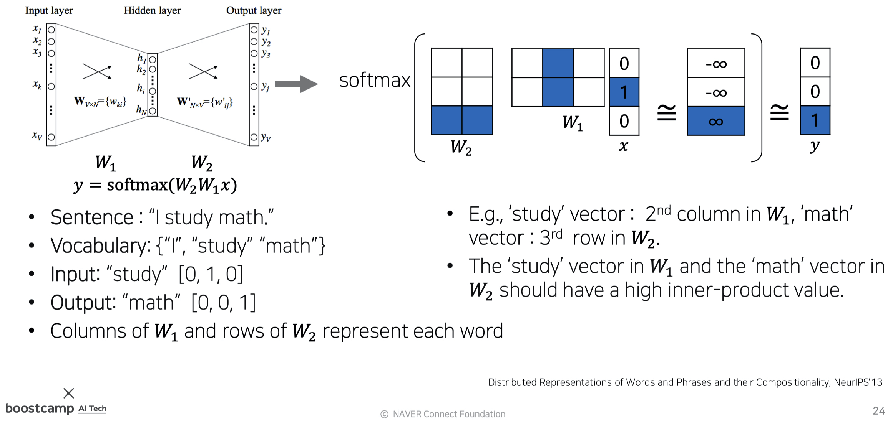
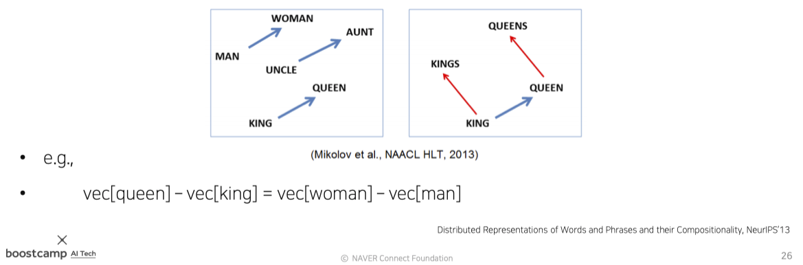

본 정리 내용은 [Naver BoostCamp AI Tech](https://boostcamp.connect.or.kr/)의 edwith에서 학습한 내용을 정리한 것입니다.  
사실과 다른 부분이 있거나, 수정이 필요한 사항은 댓글로 남겨주세요.

---

# Word Embedding

**`단어 임베딩(Word Embedding)`**이란, **단어를 하나의 벡터로 표현함으로써, n차원의 점으로 나타내는 방식**이다. 임베딩에서 단어의 의미를 잘 반영했다고 가정할 때, 약 두 단어가 서로 유사한 단어라면 두 점 간의 거리가 작을 것이고, 그렇지 않다면 크게 된다.

## Word2Vec

**`Word2Vec`**은 단어 임베딩을 학습하는 대표적 방법이다.

Word2Vec은 같은 문장 내에 나타난 **인접한 단어들간의 의미가 비슷할 것이라고 가정**한다.
#
### 학습 방식

1. 주어진 문장을 Tokenize한다.
2. unique words를 모아서 Vocabulary를 구성한다.
3. 각 단어를 Vocab size만큼의 dimension을 가지는 원-핫벡터로 표현한다.
4. Sliding Window 기법을 적용하여, 한 단어를 중심으로 앞 뒤로 나타난 각 word와 함께 입출력 쌍을 구성한다.
    - e.g. `"I study math"` → `[(I,study), (study,I), (study,math), (math,study)]`
5. 원-핫벡터 size만큼의 입/출력 size를 갖는 2-layer nn를 만든다.  이 때, **입력노드와 출력노드 사이의 hidden layer의 노드 수는** `hyperparameter`로, 워드 임베딩을 수행할 좌표공간의 차원수로 설정한다.
    - 따라서 weight는 (#hidden nodes, #input nodes), (#output nodes, #hidden nodes)의 shape가 된다.
6. 입력값을 넣어 linear 변환을 하고, softmax 함수를 적용시켜 확률분포 벡터($\hat{y}$)를 만든다.
    - 이 때 입력값 $x$는 원-핫벡터이므로, $Wx$ **내적 시에 해당 단어와 관련있는 단어들만 1이 곱해져 반영되고, 그렇지 않은 단어들은 0이 되어 반영되지 않는다.**
    - 따라서 실제로 구현할 때는 이 레이어를 **`Embedding Layer`**라고 부르고, **일일이 행렬곱하는 대신 반영될 column만 바로 뽑아온다**(위의 사진에서 $W_1$의 파란 컬럼)
7. 확률분포벡터와 ground truth(정답 레이블)를 비교하여 거리가 가까워지도록 **`softmax loss`**를 적용시킨다.
    - 이 때, ground truth값과 비슷해지도록 하려면, 이론적으로는 softmax 함수의 logit값, 즉 linear 변환을 모두 통과한 값이  정답 클래스만 $\infin$가 되고, 나머지는 모두 $-\infin$가 되어야한다.

파라미터를 모두 학습시키고 난 뒤, $W_1$과 $W_2$ 임베딩 벡터 둘 중 아무것이나 Word2Vec의 모델로 사용해도 된다. **<U>이는 Word2Vec이 기본적으로 단어간의 관계도를 측정하는 방식이기 때문에, 순서 상관없이 단어와 단어 간의 weight vector만 있으면 되기 때문</U>**이다. 그러나, 컨벤션으로는 $W_1$를 많이 사용한다. 또, output이 나오면 **`PCA(Principal Component Analysis)`**를 통해서 2차원으로 차원축소하여 scatter plot 형태로 시각화하곤 한다.

다른 예시가 보고싶다면, 다음 사이트를 참조해보자. 워드 임베딩 과정을 시각적으로 보여주는 사이트이다.

[wevi](https://ronxin.github.io/wevi/)
#
### 성질(property)

각 단어 벡터, 또는 공간상의 벡터 포인트는 단어간의 관계를 나타낸다. **같은 관계를 가진다면 같은 형태의 vector로 표시**된다.

우리말로 Word2Vec을 학습시켜놓은 사이트를 참고해보자.

[Korean Word2Vec](https://word2vec.kr/search/)

또, Word2Vec을 이용하여  여러 단어들 중 가장 상이한 단어를 골라내는 `Word Intrusion Dectection`을 수행할 수도 있다. 여러 단어가 주어지면, 한 단어를 중심으로 다른 단어들의 유클리드 거리를 계산하여 평균낸다. 모든 단어에 대해 이를 수행하였을 때, 유클리드 거리 평균이 가장 먼 단어, 즉 가장 관계가 없는 단어를 찾아 솎아낼 수 있다.

[dhammack/Word2VecExample](https://github.com/dhammack/Word2VecExample)
#
### 적용

Word2Vec은 자연어 처리 대부분의 분야에서 성능 개선에 사용되고 있다.

- 단어 유사도
- 기계 번역(Machine Translation)
- 형태소 분석(Part-of-speech(POS) tagging)
- 개체명 인식(Named entity recognition,NER)
- 감정 분석
- 군집화
- 어휘 의미 구성(semantic lexicon building)

또, 이미지를 설명하는 캡션을 생성하는 `Image Captioning` 분야에도 사용된다.
#
# GloVe

**`Glove : Gloval Vectors for Word Presentation`**는 Word2Vec와 함께 워드 임베딩의 가장 대표적인 기법 중 하나이다.

Word2Vec과 다른 GloVe의 차이점은 **<U>학습과정에서 두 단어가 한 윈도우 내에서 몇번이나 동시 등장했는가</U>**를 사전에 기록해둔다는 것이다.

$$
J(\theta) = \frac{1}{2}\sum^W_{i,j=1}f(P_{i,j})(\textcolor{blue}{u^T_i}\textcolor{red}{v_j} - log\textcolor{Green}{P_{ij}})^2
$$

- $\textcolor{blue}{u_i^T}$ : 입력 word의 임베딩 벡터
- $\textcolor{red}{v_j}$ : 출력 word의 임베딩 벡터
- $\textcolor{Green}{P_{ij}}$ : 두 단어가 한 윈도우 내에서 동시 출현한 count

위의 비용함수 $J(\theta)$에서 cost를 최소화하려면, **입력/출력 단어의 내적값(관계도)이 동시 출현한 count와 비슷해지도록 조정**해야한다.

Word2Vec은 특정 입출력 단어쌍이 자주 등장할수록 여러번에 걸쳐 학습되게 하여, 학습이 빈번할수록 두 임베딩 벡터간의 내적값이 더 커지도록 만들었다.

반면, GloVe는 **단어쌍이 동시에 등장한 횟수를 미리 계산하고, 이 count를 학습과정에서 $logP_{i,j}$라는 ground truth로 사용함으로써 계산과정의 중복을 제거**하였다. 따라서 <U>학습시간이 Word2Vec보다 더 빠르며, 더 적은 데이터에도 잘 동작</U>한다.

또한, GloVe는 추천 시스템에 사용되는 핵심 로직인 `co-occurence matrix`의 `low rank matrix factorization`의 task로도 이해할 수 있다. 

[GloVe: Global Vectors for Word Representation](https://nlp.stanford.edu/projects/glove/)