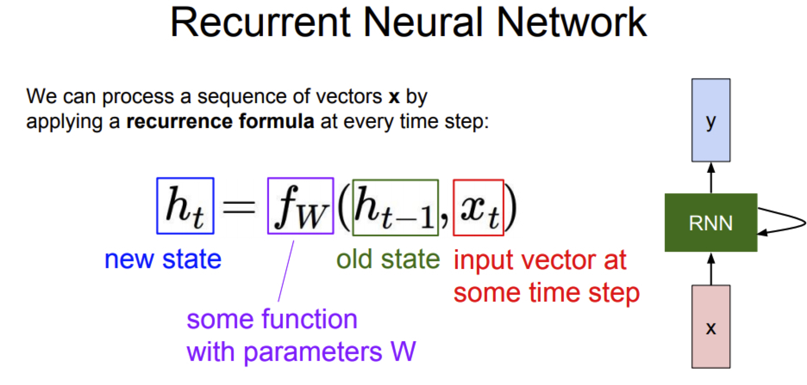
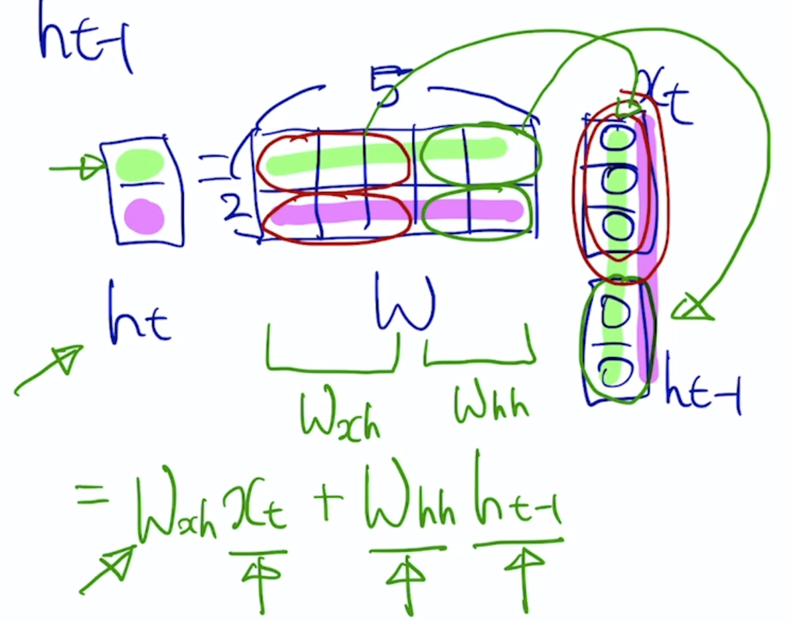
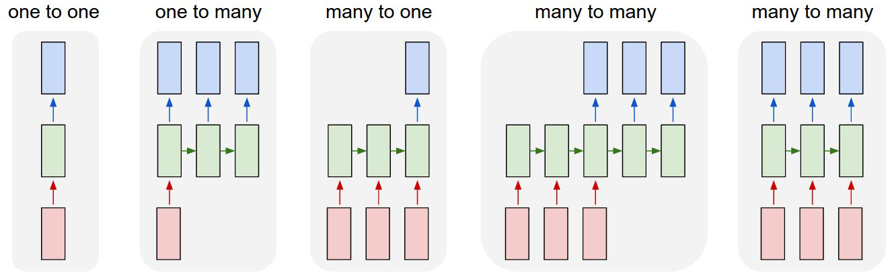
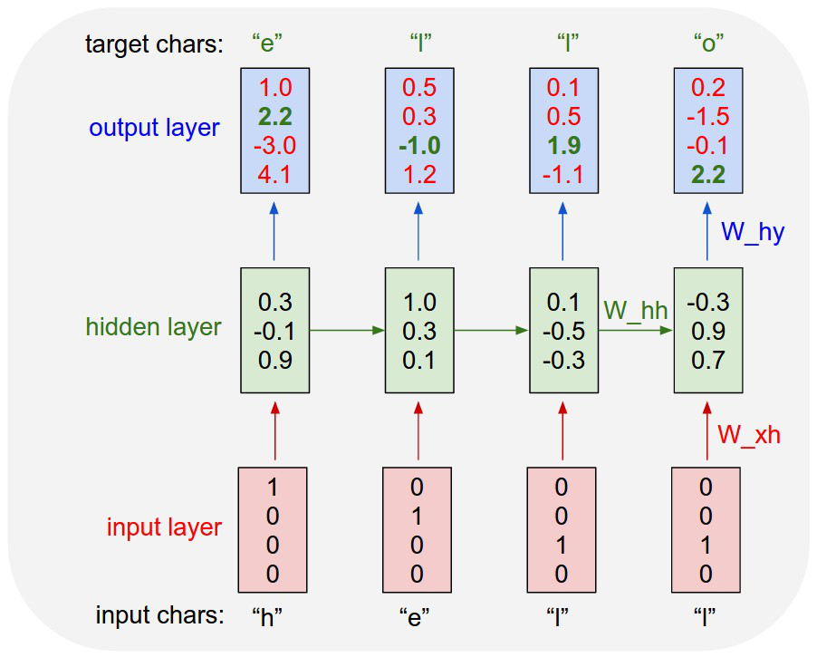
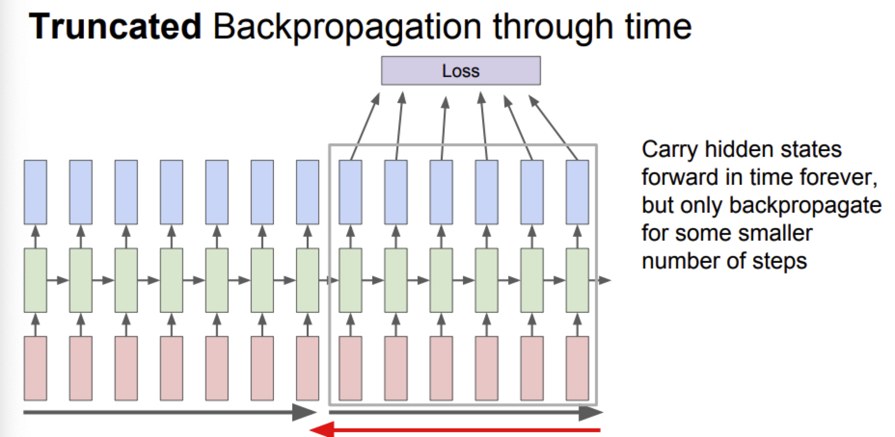

본 정리 내용은 [Naver BoostCamp AI Tech](https://boostcamp.connect.or.kr/)의 edwith에서 학습한 내용을 정리한 것입니다.  
사실과 다른 부분이 있거나, 수정이 필요한 사항은 댓글로 남겨주세요.

---

# RNN

## 구조

RNN의 가장 큰 특징은 **매 timestep $t$마다 동일한 function $f$와 파라미터 셋 $W$가 사용된다**는 것이다.

매 순간 $t$마다 새로운 단어(혹은 형태소)를 입력으로 받아 $t+1$에 연결되는 hidden state $h_t$를 내보내는데, 이 때 $h_t$를 이용하여 해당 시점에서의 예측값 $y_t$를 내보내는 경우도 있다. 단어의 형태소를 판단하는 RNN의 사례를 들 수 있다.

또, 매 순간 $y_t$를 출력하지 않고 $h_t$를 잘 쌓아뒀다가 마지막 순간에 $y_t$를 단 한번 출력하고 끝나는 경우도 있을것이다. 부정/긍정문을 판단하는 RNN을 예로 들 수 있다.

이 과정에서 사용되는 모든 파라미터 $W$와 function $f$는 매 timestep마다 동일하다. 또한, $h_t$의 dimension은 hyperparameter로, 모든 timestep에서 동일한 형태를 가진다.

이 때, 이를 수식으로 풀이하면 다음과 같다.

$$
h_t = f_W(h_{t-1},x_t)\\
\begin{aligned}
h_t &= \tanh(\textcolor{blue}{W_{hh}}h_{t-1} + \textcolor{red}{W_{xh}}x_t)\\
y_t &= \textcolor{green}{W_{hy}}h_t
\end{aligned}
$$

여기서 $\textcolor{blue}{W_{hh}}$와 $\textcolor{red}{W_{xh}}$이 어떤 형태인지는 다음 그림을 살펴보도록 하자.

위의 그림과 같이,  $x_t$와 $h_{t-1}$을 합친 벡터에 적용되는 선형변환 $W$를 두 파트로 나눌 수 있다. 하나는 $x_t$에 적용되어 $h_t$를 만들 때 사용되는 $\textcolor{red}{W_{xh}}$과 , 나머지 하나는 $h_{t-1}$에 적용되어 $h_t$를 만들 때 사용되는 $\textcolor{blue}{W_{hh}}$이다. 각각의 파라미터로 선형변환하고 난 뒤, 두 값을 합쳐 비선형변환($\tanh$)을 적용시켜 $h_t$를 완성한다.

완성된 $h_t$에서 추가적인 변환으로 해당 시점의 예측값 $y_t$를 뽑아낼 수도 있다. $h_t$에서 $y_t$로 가는 변환이므로 이 때 사용되는 파라미터를 $\textcolor{green}{W_{hy}}$라고 한다.

<Primary>

위의 식에서는 편의 상 bias항을 고려하지 않았지만, 실제로 계산할 때에는 bias항이 추가됨을 유의하자.

</Primary>

여기서 출력된 $y_t$가 `이진 분류(binary classification)`이면 `sigmoid`를 적용시키고, `다중 분류(multiple classification)`이면 `softmax`를 적용시켜 예측값(또는 확률값)으로 나타낼 수 있다.

sigmoid와 softmax의 차이에 대해서는 다음 글을 참조해보자.

[#수학 : 시그모이드 함수(Sigmoid) / 소프트맥스함수(Softmax)](https://m.blog.naver.com/th9231/221989350922)

 

#

## 종류

- **`One-to-one`**
    - 입력과 출력이 단 하나 → 시퀀스 데이터가 아닌 모델 구조
    - 이전 timestep의 hidden state $h_{t-1}$가 들어오지 않고, 입력으로 받은 값을 그대로 출력하므로, 시퀀스 데이터가 아님
- **`One-to-many`**
    - 입력이 하나의 timestep으로 이루어지고, 출력이 여러 timestep으로 이루어지는 모델 구조
    - Task 사례 : `Image Captioning`
        - 단일 입력($x$ : 이미지)을 받고, 캡션을 달기 위하여 필요한 단어($y$)들을 순차적으로 생성(출력)
    - 이 경우 최초의 단일 입력 이후에 빈 입력을 넣기 위하여 같은 사이즈의 zero 벡터/행렬/텐서가 들어가게 된다.
- **`Many-to-one`**
    - 입력이 여러 timestep으로 이루어지고, 출력이 마지막 timestep 하나로 이루어지는 모델 구조
    - Task 사례 : `긍정/부정문 판단`
        - 문장 시퀀스 데이터를 받다가 마지막 순간에 문장의 긍정/부정을 판단하는 이진분류를 수행하여 출력
- **`Many-to-many`**
    - 입력과 출력이 모두 시퀀스 형태
    - Task 1 : `기계 번역(Machine Translation)`
        - 텍스트(또는 문장)의 입력이 끝나는 시점부터 해석한 정보를 바탕으로 번역된 문장의 단어를 하나씩 출력
    - Task 2 : `Part-of-Speech(POS) tagging`
        - 각 단어별로 형태소/성분을 분석하므로, 모든 timestep에서 입력과 출력이 다 일어난다.

#

# Language Model

언어모델(Language Model)은 주어진 문자열이나 단어의 순서를 바탕으로 다음 단어를 예측하는 task이다.

언어모델링은 철자(character) 단위나 단어(word) 단위 두 가지 경우 모두 수행할 수 있다.

# 

## Character Language Model

철자(character)가 주어졌을 때, 단어내의 다음 철자를 예상하는 언어 모델링을 생각해보자. 이는 매 timestep마다 다음 철자($y$)를 출력해야하므로, `Many-to-many` task에 해당한다.

#

### 과정

 

1. 학습 시퀀스 데이터에서 unique한 철자를 모아 사전을 구축한다.
2. 해당 철자들을 `len(vocab)`만큼의 차원을 가지는 원-핫 벡터로 변환한다.
3. $h_t$를 만들어내기 위해 변환을 수행한다. 이 때 $h_0$는 hidden state의 dimension을 가지는 영벡터/행렬/텐서로 한다.
4. 선형변환($W_{hy}h_t+b$) 시킨 후, 다중 분류이므로 Softmax를 적용하여 $y_t$로 내보낸다. 
    - 이 때 선형변환된 값을 Logit으로 여긴다. output layer에서 나온 값 중 하나를 골라 다음에 나올 철자로 예측하기 때문이다.
        - Logit : log와 odds의 합성으로, 딥러닝에서는 일반적인 0~1 구간의 확률값이 아니라 $-\infin$ ~ $\infin$ 의 범위에 있는 날확률값을 의미한다. 다중 분류에서 Softmax 함수의 입력값으로 자주 사용된다.
        - Logit의 개념을 잘 모르겠다면 [로짓(Logit)이란?](https://haje01.github.io/2019/11/19/logit.html#:~:text=%EC%A6%89%2C%20%EC%98%A4%EC%A6%88%EC%97%90%20%EC%9E%90%EC%97%B0%EB%A1%9C%EA%B7%B8,log%20%2B%20odds%EC%97%90%EC%84%9C%20%EB%82%98%EC%98%A8%20%EB%A7%90.&text=%ED%99%95%EB%A5%A0%EC%9D%98%20%EB%B2%94%EC%9C%84%EB%8A%94%20%5B0,%E2%88%92%E2%88%9E%2C%E2%88%9E%5D%20%EC%9D%B4%EB%8B%A4.)을 참고하자.
        - [logit과 sigmoid, softmax의 관계](https://opentutorials.org/module/3653/22995#:~:text=logit%EC%9D%80%20'logistic'%20%EA%B3%BC%20%2B,%EA%B7%B8%EB%8C%80%EB%A1%9C%20%EA%B0%80%EC%A0%B8%EC%98%A8%EB%8B%A4%EA%B3%A0%20%EB%B3%B4%EC%8B%9C%EB%A9%B4%20%EB%90%98%EA%B2%A0%EC%8A%B5%EB%8B%88%EB%8B%A4.)도 참고하자.
5. 첫 출력을 보면 'h' 다음 'e'가 와야하는데 실제로는 'o'가 4.1을 받아 출력되었음을 알 수 있는데, 이와 같은 잘못된 결과에 페널티를 주고 올바른 결과인 'e'가 더 높은 값을 얻도록 하기 위해 Softmax-loss를 적용하여 업데이트한다.

해당 모델의 학습결과는 여기서 확인하자.

[The Unreasonable Effectiveness of Recurrent Neural Networks](http://karpathy.github.io/2015/05/21/rnn-effectiveness/)

#

### RNN의 역전파 알고리즘, BPTT

RNN에서의 순전파는 각 timestep마다 Loss를 모두 계산하고, 역전파(Backpropagation through time, BPTT)는 $(W_{hh},W_{xh},W_{hy})$를 모두 연산해야하므로, 단어/철자 수가 수천/수만을 넘어가는 텍스트 데이터에서는 계산할 양이 매우 방대해진다.

따라서 이를 현실적으로 수행하기 어렵기 때문에, 시퀀스 데이터의 일부를 잘라내어 한번에 학습할 수 있는 길이를 제한시키는 **`truncation`**을 사용한다.

#

### Searching for Interpretable Cells

그렇다면, RNN 모델에서 시퀀스 데이터에서 문맥을 이해하고, 해석가능한(interpretable) 정보는 어느 셀에 담겨있을까?

RNN에서 필요로하는 정보를 저장하는 공간은 결국 매 timestep마다 업데이트되는 hidden state vector,  $h_t$이다.

위의 이미지는 학습시킨 RNN 모델에서 특정 hidden state vector의 dimension을 고정해놓고, 해당 dimension 값의 변화를 추적한 이미지이다. 따옴표(quote)를 기준으로 해당 dimension의 hidden state 값이 확연히 바뀌는 것을 알 수 있는데, 이는 hidden state가 따옴표가 열렸는지 닫혔는지를 해석하는 방식을 학습했다고 이해할 수 있다.

#

## RNN 모델의 문제점

### Vanishing/Exploding Gradient Problem

앞서 살펴본 (vanilla, original) RNN 모델은 훌륭하게 문맥을 파악했다. 그러나, 해당 RNN 모델의 학습 방식에는 한계가 있다.

매 $t$마다 동일한 matrix $W$를 곱해주기때문에, 역전파 과정에서 **`기울기 소실(Vanishing Gradient)`**이나 **`기울기 폭발(Exploding Gradient)`**이 생기게 된다. 이 경우 gradient가 뒤로 전파될수록 영향력이 사라지거나, 너무 커다란 영향을 미치게 된다. 따라서, `long-term dependancy` 문제가 제시된다.

이 문제를 해결하기 위해 `LSTM`과 `GRU`같은 RNN의 발전된 형태가 나오게 되었다.

---

### Reference

[cs231n_2017_lecture10.pdf](http://cs231n.stanford.edu/slides/2017/cs231n_2017_lecture10.pdf)

[The Unreasonable Effectiveness of Recurrent Neural Networks](http://karpathy.github.io/2015/05/21/rnn-effectiveness/)