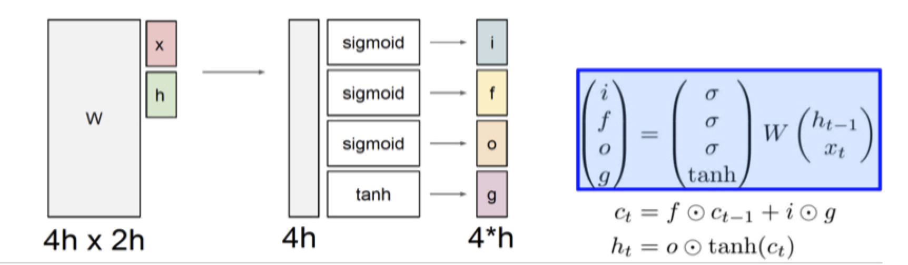

본 정리 내용은 [Naver BoostCamp AI Tech](https://boostcamp.connect.or.kr/)의 edwith에서 학습한 내용을 정리한 것입니다.  
사실과 다른 부분이 있거나, 수정이 필요한 사항은 댓글로 남겨주세요.

---

# LSTM & GRU

## LSTM

**`Long Short-Term Memory(LSTM)`**은 기존 RNN모델에서 **`Vanishing/Exploding Gradient`** 문제를 해결하고, **`long-term depandancy`** 문제를 개선한 모델이다.

hidden state를 단기(short-term)기억소자로 볼 수 있고, 보다 먼 timestep(long-term)의 정보까지 잘 반영하도록 만들었기 때문에 이러한 이름이 붙었다.

#

### 구조

기존의 RNN 모델이 다음과 같은 형태였다면,

$$
h_t = f_w(x_t,h_{t-1})
$$

LSTM 모델의 형태는 다음과 같다.

$$
\{C_t,h_t\} = LSTM(x_t,C_{t-1},h_{t-1})
$$

- $C_t$ : **Cell State Vector**
- $h_t$ : **Hidden State Vector**

이 중 **$C_t$가 좀 더 완전하고 통합적인 정보를 제공**한다. **$h_t$는 $C_t$를 한번 더 가공(필터링)해서 해당 timestep에서 노출할 필요가 있는 정보들만 남긴 형태**라고 볼 수 있다.

LSTM은 **주어진 $x_t$와  $h_{t-1}$을 바탕으로 4개의 게이트(gate)를 이용해 $C_{t-1}$를 수정하고 $h_t$를 계산**한다.

먼저, $x_t$와 $h_{t-1}$을 붙여 $W$를 이용하여 **벡터로 선형변환**시키고, 변환시킨 벡터를 4개로 쪼개어 각각 sigmoid와 tanh를 취해 **4개의 게이트**를 만든다.

- **`i`** : `Input gate`, 셀에 해당 정보를 써 넣을 것인가?

    $$
    i_t = \sigma(W_i\cdot[h_{t-1},x_t] + b_i)
    $$

- **`f`** : `Forget gate`, 셀에서 정보를 얼마나 잊을 것인가? 거꾸로 말하자면, 얼마나 보존할 것인가?

    $$
    f_t = \sigma(W_f\cdot[h_{t-1},x_t] + b_f)
    $$

- **`o`** : `Output gate`, 현재 Cell($C_t$)를 출력값 $h_t$로 가공할 때 얼마나 필터링 할 것인가?

    $$
    o_t = \sigma(W_O[h_{t-1},x_t]+b_O)
    $$

    - $o_t$는 sigmoid를 거치므로  0~1 사이의 값이 된다.

    $$
    h_t =o_t \odot \tanh(C_t)
    $$

    - 최종 출력값 $h_t$는 tanh를 거친 $C_t$에 0과 1사이의 적절한 $o_t$와 element-wise product함으로써  Cell state 정보를 일정 비율로 작게 만들어(filtering) 내보내는 값이다.
        - **<U>$C_t$는 이전까지의 모든 과거 정보를 담은 벡터, $h_t$는 해당 time step에서 예측값에 사용하기 위해 지금 당장 필요한 정보만을 ($C_t$로부터) 필터링한 값이다.</U>**

- **`g`** : `Gate gate`, 현재 cell에 해당 정보를 얼마나(how much) 기록할것인가?

    $$
    \begin{aligned}
    \tilde{C_t}&=\tanh(W_C\cdot[h_{t-1},x_t]+b_c)\\
    C_t &= f_t \odot C_{t-1} + i_t \odot \tilde{C_t}
    \end{aligned}
    $$

    - $\tilde C_t$는 Gate gate 값이며, 현재 timestep에서 만들어진 정보를 의미한다.
    - $i_t \odot \tilde{C_t}$ : 현재 정보를 기억할 게이트 값으로, Gate gate 값 $\tilde{C_t}$이 Input gate 값 $i_t$과 elemen-wise product된다.
        - 이 때, Gate gate 값 $\tilde{C_t}$은 tanh연산을 거쳤으므로 범위가 -1~1이다. 따라서, $i_t \odot \tilde{C_t}$를 Cell state에 반영시키되, $\tilde{C_t}$가 반영의 방향(증감)을 정한다고 볼 수 있다.
    - 이후, 이전 Cell state가 forget gate 값 $f_t$와 더해져 새로운 $C_t$를 만든다.

sigmoid 사용 : **`i`, `f`, `o`**

- 0과 1 사이의 값을 가지는 sigmoid의 특성 상 기존의 벡터 값을 일정 부분만 떼내어 보존하는 역할을 한다.

tanh 사용 : **`g`**

- -1과 1 사이의 값을 가지는 tanh의 특성 상 현재 timestep에서 계산되는 유의미한 정보(증/감)를 담는 역할을 한다.(vanilla rnn에서의 마지막 tanh와 같음)

#

## GRU

**`Gated Recurrent Unit(GRU)`**은 LSTM의 모델 구조를 경량화하여 메모리 요구량을 줄이고 빠른 학습이 가능하도록 만든 모델이다.

#

### 구조

기존의 LSTM이 $C_t$와 $h_t$를 이원화하여 가져가는 모델이었다면, **GRU는 두 state vector를 합쳐 $h_t$ 하나만 남겨놓았다**. 이때, 일원화된 $h_t$는 LSTM에서의 핵심적인 역할을 하던 Cell state vector $C_t$에 의미적으로 더 유사한 값이다.

$$
\begin{aligned}
C_t &= \textcolor{red}{f_t}\cdot C_{t-1}+\textcolor{blue}{i_t}\cdot \textcolor{green}{\tilde{C_t}} \quad \textnormal{in LSTM} \\
h_t &= \textcolor{red}{(1-z_t)}\cdot h_{t-1} + \textcolor{blue}{z_t} \cdot \textcolor{green}{\tilde{h_t}} \quad \textnormal{in GRU}
\end{aligned}
$$

기존 LSTM에서는 input gate와 forget gate 값을 이용했다면, GRU에서는 input gate에 해당하는 $z_t$만 남겨두고, **<U>forget gate $f_t$를 $(1-z_t)$로 바꾸어 처리</U>**한다. 

현재 값인 $\tilde{h_t}$와  과거의 정보를 통합한 값인 $h_{t-1}$의 비율을 조정하여, 합쳐서 1이 되도록 만들면서, **현재와 과거 값 간의 가중평균**을 내게 된다.

- **<U>이 과정에서 게이트도 하나(fortget gate) 줄이게 되어, 계산양과 메모리 요구량을 줄여 경량화</U>**하였다.
#
## LSTM과 GRU의 역전파

기존의 RNN은 역전파 과정에서 $W_{hh}$를 계속 곱해주었기 때문에 Vanishing/Exploding Gradient 문제가 생겼었다.

그러나,  LSTM(과 GRU)의 역전파는 **Cell State Vector $C_{t-1}$에 그 때 그 때 다른 값으로 이루어지는 $f_t$를 곱하고, 필요로 하는 정보 $\tilde{C_t}$ 관련 항을 더해주어 Vanishing/Exploding Gradient를 막았다.**

또한, 이러한 **덧셈 연산이 역전파과정에서 Gradient를 복사하여 매번 전달해주는 역할**을 하므로,, RNN에 비해 멀리있는 timestep의 gradient까지 큰 변형없이 전달하게 되어 결과적으로 **long-term depandency를 어느정도 확보**하였다.
다만, LSTM과 GRU는 Long Term Dependency 문제를 완벽하게 해결하지는 못했다. 멀리 있는 정보는 곱해져 최근으로 오면서 점점 소실되게 된다.

2017년 등장한 attention 구조를 활용한 transformer가 이러한 문제를 근본적으로 해결하게 되었다.

#
## RNN/LSTM/GRU 요약

- `RNN`은 다양한 길이를 가질 수 있는 **시퀀스 데이터에 특화된 딥러닝 모델**이다.
    - 아키텍쳐 디자인에 유연성을 제공한다.
- `Vanilla RNN`은 구조가 간단하지만 Vanishing/Exploding Gradient 문제 때문에 실제로 많이 사용되지는 않는다.
- `LSTM`과 `GRU`는 실제 많이 사용하고 있으며, Vanishing/Exploding Gradient 문제를 **덧셈연산으로 해결한 모델**이다.
    - `Cliping Gradient` 같은 방법으로 해결할 수도 있다고 한다.

---

### Reference

[Understanding LSTM Networks](http://colah.github.io/posts/2015-08-Understanding-LSTMs/)

[RNN vs LSTM: Vanishing Gradients](https://imgur.com/gallery/vaNahKE)