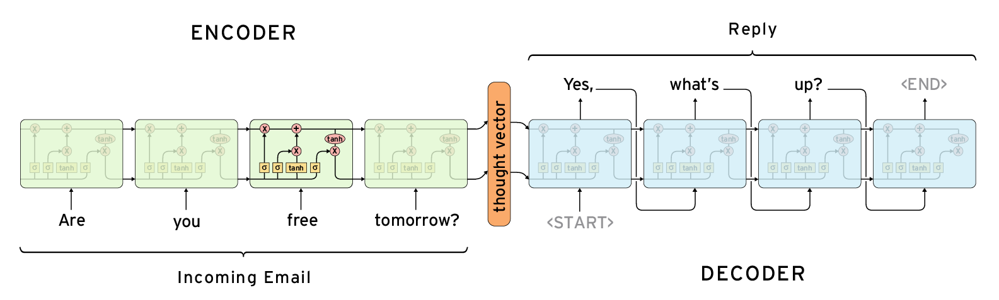

본 정리 내용은 [Naver BoostCamp AI Tech](https://boostcamp.connect.or.kr/)의 edwith에서 학습한 내용을 정리한 것입니다.  
사실과 다른 부분이 있거나, 수정이 필요한 사항은 댓글로 남겨주세요.

---

# Seq2Seq

RNN의 Many-to-Many 형태에 해당한다.

인코더(Encoder)와 디코더(Decoder)로 구성되어 있으며, 인코더와 디코더는 별개의 파라미터를 가진 서로 다른 RNN 모델(이미지에서는 LSTM)이다.

인코더의 마지막 $h_n$은 디코더의 $h_0$가 되며, 디코더는 첫 입력으로 <SOS> 토큰을 받고, 마지막 출력으로 <EOS>토큰을 낸 뒤 생성을 마친다.

따라서, 인코더의 모든 정보들은 $h_0$이라는 하나의 hidden state vector에 담겨서 디코더에 반영된다.

#

## Seq2Seq with attention

### 기존 Seq2Seq의 한계

기존의 Seq2Seq 모델은 RNN의 특성상 $h_t$의 dimension이 정해져 있어서, 아무리 시퀀스 데이터의 단어가 많아지더라도 그 정보들을 모두 압축하여 같은 크기의 $h_t$에 욱여넣어야했다.

또, LSTM에서 아무리 Long-term Dependency 문제를 해결했다고 하더라도, 마지막 time step을 기준으로 할 때 훨씬 이전에 있는 time step의 정보들을 모델을 거치면서 점점 변질되거나 소실되어 정보를 잘 저장하지 못하는 문제가 발생했다.

이에 대한 대안으로 입력값의 순서를 바꾸는 경우(i.e. I go home → go I home)도 연구되곤 했다.

#

### Attention Module 적용

)

이와 달리, attention 모듈을 활용한 Seq2Seq 모델은, $h_0$ 하나에 모든 인코더의 hidden state vector을 반영하는것이 아니라, 각 time step의 모든 $h_t$를 전부 디코더에 제공한다. 디코더는 단어를 하나씩 생성하며, 그 때 그 때 필요한 $h_t$들을 선별하여 사용하게 된다.

#

### 과정

위의 이미지의 과정을 풀어보자.

1. 프랑스어를 인코더에 집어넣고, 마지막으로 나오는 출력값 $h_4^{(e)}$을 디코더가 $h_0$로 받는다.
2. 디코더는 입력값 $x_1$로 Start Token에 해당하는 워드 임베딩 벡터를 받는다.
3. 디코더는 $x_1$과 $h_0$를 이용하여 디코더의 hidden state vector $h_1^{(d)}$를 얻는다.
4. 인코더의 각 time step에서 나온 $h_1^{(e)},h_2^{(e)},h_3^{(e)},h_4^{(e)}$ 각각에 대해 $h_1^{(d)}$를 내적하여, 다음 단어 예측에 사용할 Attention Score를 매긴다.
5. Attention Score를 logit 벡터로 생각하고 softmax 함수를 적용하여, 각각의 $h_t^{(e)}$에 대응되는 확률값(Attention Distribution)을 뽑아낸다.
    - 이 때, Attention Distribution은 확률값이므로 합이 1이 되는데,  이렇게 합이 1인 형태의 가중치를 Attention Module 내에서는 **`Attention Vector`**라고 부른다.
6. 해당 확률값들은 $h_t^{(e)}$에 적용될 가중치로 사용할 수 있다. 이미지에서는, 다음 단어 생성에 $h_1^{(e)}$가 가장 많이 사용될 것이라는 것을 보여주고 있다. 각 가중치와 $h_t^{(e)}$를 곱한 뒤 합산하여 가중평균(Attention Output, **`context vector`**)을 낸다.
    - 이 때, 위의 이미지에서 Attention scores, Attention distribution이 있는 부분들을 묶어 **`Attention Module`**로 말할 수 있으며, Attention 모듈의 입력은 각각의 $h_t^{(e)}$와 $h_1^{(d)}$가 되고, 출력은 Attention output이 된다.
7. Attention output과 $h_1^{(d)}$이 concat되어서 output layer의 입력으로 들어가고, output layer는 $\hat{y_1}$ 값, 즉 'the'라는 글자를 내보낸다.

이 과정을 반복하면 아래와 같은 이미지가 된다.

결국, 디코더의 hidden state vector $h_t^{(d)}$는 다음과 같은 두가지 역할을 한다.

1. $\hat{y_t}$를 도출하는 output layer의 input중 하나
2. 인코더의 $[h_1^{(e)},\dots,h_n^{(e)}]$를 각각 얼마나 반영하여 Attention output을 낼 지 (가중치를) 결정

### Backpropagation

Seq2Seq with attention의 역전파 과정에서는, Encoder 단에서 잘못 가져온 $[h_1^{(e)},\dots,h_n^{(e)}]$의 가중치들을 다시 재조정하여, 원하는 정보가 잘 선택 될 수 있도록 $h_t^{(d)}$를 학습한다.

### Teacher Forcing

처음에 모델이 작동할 때, 기존에 주어진 파라미터 정보가 얼마 없으므로 모델이 잘못된 예측을 할 수 있다.

- i.e. I want to go home → go to home ....

학습과정에서는 모델이 잘못된 예측을 하더라도 다음 input에 ground truth인 정답 input값을 집어넣어주어 파라미터를 학습시킬 수 있다.  이를 **`Teacher Forcing`**이라고 한다.

그러나 실제 inference 과정에서는 ground truth를 줄 수 없으므로, 학습 환경과 실제 추론 환경이 다르게 되어 파라미터가 제대로 최적화되지 않는다. 이를 피하기 위해 일정 부분까지는 파라미터를 teacher forcing으로 학습시키다가, 이후에는 완전한 inference로 학습하기도 한다.

### Attention Scores 메커니즘

위에서 Attention Score는 $h_t^{(e)}$와 $h_t^{(d)}$의 유사도 역할을 하며, 이를 구하기 위해 내적을 했었다.

단순히 내적(dot product)을 하는 방식 외에도 Attention Scores를 구하는 다양한 방식들이 제안되었다.

- **`generalized dot product`**
    - 디코더의 $h_t$와 인코더 중 한 단어의 hidden state vector $\bar{h}_s$를 내적하는 과정에서, 중간에 하나의 가중치행렬($W_a)$을 추가한다.
    - 정사각행렬 내부의 원소들을 새로운 파라미터로 두어, Attention scores를 구하는 방법을 학습시킬 수 있다.
- **`concat`**
    - 디코더의 $h_t$와 인코더 중 한 단어의 hidden state vector $\bar{h}_s$를 concat($;)$하여 입력값으로 주고, scalar 값을 도출하는 새로운 신경망을 추가한다.
    - 이 경우 가중치 $W_a$를 곱한 뒤 비선형 변환 $\tanh$를 거치고, 마지막으로 선형변환인 $v_a^T$를 거쳐 스칼라 값(score)을 출력한다.

## Attention의 의의

- 신경망기계번역(NMT)의 성능을 획기적으로 개선하였다.
    - 디코더의 매 time step마다 source의 특정 정보들을 활용할 수 있게 되었기 때문이다.
- 인코더의 마지막 $h_n$만을 디코더에 이용할 수 있으므로 적은 양의 파라미터에 과거의 정보들이 모두 욱여넣어지는 `bottlenect problem`을 해결했다.
    - $h_n$ 뿐만 아니라 인코더에서 각 time step의 hidden state vector를 모두 활용하기 때문이다.
- Vanishing Gradient 문제를 해결했다.
    - 잘못된 단어를 생성하였을 때 이를 고치기 위해 backpropagation한다고 생각해보자.
        - 먼 거리의 가중치를 업데이트하기 위해서 기존에는 time step을 차례로 거슬러 올라가야 하며, 이 과정에서 정보(gradient)가 소실될 수 있었다.
    - 그러나, Attention이 있을 때는 어떤 time step도 거치지 않고 Attention 모듈의 파라미터를 통해 backpropagation하므로, 먼 거리에 있는 가중치도 정보를 소실하지 않고 바로 업데이트할 수 있게 되었다.
- 해석가능성을 제공해준다.
    - Attention distribution 수치를 확인하여 디코더가 인코더의 어느 부분에 집중했는지 확인할 수 있다.
    - Attention 모듈 신경망은 언제 어떤 단어에 집중해야 하는지도 스스로 학습한다.

---

### Reference

[Overview - seq2seq](https://google.github.io/seq2seq/)

[Machine Translation, Seq2seq, & Attention](https://www.cs.ox.ac.uk/files/11802/Lecture14NLP6.pdf)