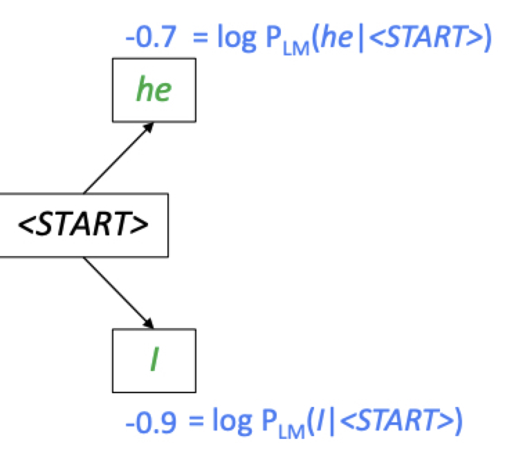
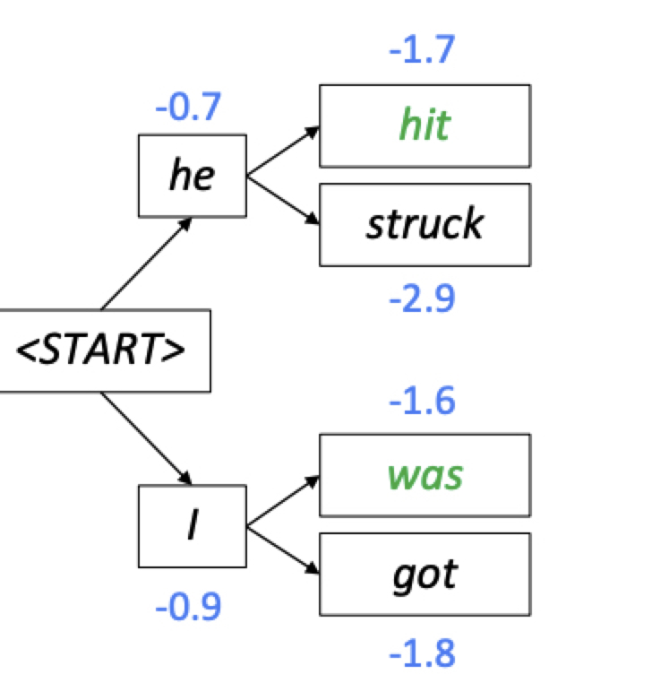
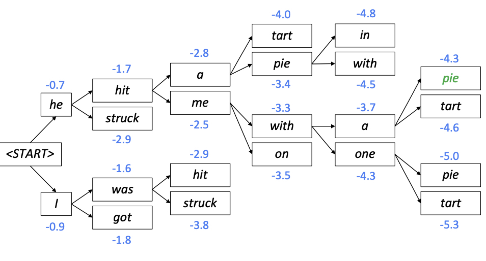

본 정리 내용은 [Naver BoostCamp AI Tech](https://boostcamp.connect.or.kr/)의 edwith에서 학습한 내용을 정리한 것입니다.  
사실과 다른 부분이 있거나, 수정이 필요한 사항은 댓글로 남겨주세요.

---

# Beam Search

## 한계 인식

### Seq2Seq의 문제점

기존의 seq2seq 모델은 매 time step마다 가장 높은 확률을 가지는 단 하나의 다음 단어를 예측하는 task를 학습한다. 이를 **`Greedy Decoding`**이라고 한다.

그러나 이 방식은 시퀀스로서의 문장 전체를 보고 예측하는 것이 아니라, 근시안적으로 현재 time step에서 가장 좋아보이는 값을 예측하므로, 잘못 예측한 단어를 한번 내놓으면 되돌릴 수 없다.

#

### Exhaustive search

번역의 형태를 수식으로 표현하면 다음과 같다.

$$
\begin{aligned}
P(y|x) &= \textcolor{orange}{P(y_1|x)}\textcolor{purple}{P(y_2|y_1,x)P(y_3|y_2,y_1,x)\dots P(y_T|y_1,\dots,y_{T-1},x)} \\
&= \prod^t_1P(y_t|y_1,\dots,y_{t-1},x)
\end{aligned}
$$

입력 시퀀스 $x$가 주어졌을 때, 가장 그럴듯한 출력 시퀀스 $y$를 얻기 위해서는 `joint probability`, 즉 우변의 모든 항들이 다 곱해졌을 때($\prod^t_1P(y_t|y_1,\dots,y_{t-1},x)$) 가장 큰 값이 나와야 한다.

그러나, 기존의 Seq2Seq 값은 첫번째 단어인 $y_1$의 확률 $\textcolor{orange}{P(y_1|x)}$를 구할 때, 뒤의 확률들을 고려할 여력이 없기 때문에, 단순히$\textcolor{orange}{P(y_1|x)}$을 최대화시키는 greedy한 방식을 취하게 된다.

그러나 전체적인 관점에서 만약 $\textcolor{orange}{P(y_1|x)}$가 지금 당장은 작더라도, $\textcolor{purple}{P(y_2|y_1,x)P(y_3|y_2,y_1,x)\dots P(y_T|y_1,\dots,y_{T-1},x)}$가 더 커져서 결과적으로 최대의 확률을 얻을 수 있게 만드는 것이 이상적인 방법일 것이다.

이 방법을 어떻게 구현할 수 있을까? 직접 모든 가능한 시퀀스 $y$를 계산해볼까? (**`Exhaustive Search`** - Brute Force 방식)

- 이는 매 step $t$마다 vocabulary 크기인 $V^t$의 가짓수만큼(즉, $V_n^t$를 선택했을때의 확률들) 모두 고려해야한다는 말이다. $O(V^t)$는 당연히 기하급수적으로 증가하므로 현실적으로 불가능하다.

이에 대해 차선책으로 나온 방식이 **`Beam Search`**이다.

#

## Beam Search

### Beam Search란?

매 step $t$ 마다 하나의 단어만을 고려하는 `Greedy`와, 매 step $t$마다 모든 단어를 고려하는 `Exhaustive`의 절충안으로, **`Beam Search`** 는 정해놓은 $\textcolor{red}{k}$개만의 단어를 고려한다. 이 $k$개의 경우에 해당하는 decoding output을 `hypothesis` 라고 부른다.

- $k$는 `beam size`라고 부르며, 일반적으로 약 5~10개이다.

최대화하고자 하는 beam 값, 즉 hypothesis는 joint probability인데, 이 값에 log를 취하게 되면 각각의 확률들을 덧셈으로 표현할 수 있게 된다. 

$$score(y_1,\dots,y_t)= logP_{LM}(y_1,\dots,y_t|x) = \sum^t_{i=1}logP_{LM}(y_i|y_1,\dots,y_{i-1},x)$$

$\log$함수는 원래 단조증가하는 형태이기 때문에, $\log(x)$의 $x$가 커지면 커질수록 더 큰 값을 가지게 된다. 따라서, 로그함수를 취한 값으로도 동일하게 hypothesis를 최대화할 수 있다.

이와 같은 방식으로 Beam Search는 globally optimal solution, 전역 최적해를 가져다 주지는 않지만, exhaustive search보다는 훨씬 나은 효율을 보여준다.

#

### 동작 예시

아래의 예시는 $k$가 2인 예시이다.

여기서 log를 취한 값이 음수가 나옴을 알 수 있는데, log 함수의 입력값이 0과 1사이의 범위를 가지는 확률값이기 때문이다. 음수이더라도, log 함수는 단조증가 형태이므로 더 높은 확률값을 가지면 더 높은 score로 연결됨을 알 수 있다.

- i.e.  ['he'의 확률값 > 'I'의 확률값] → [-0.7 > -0.9]

이렇게 매번 score가 가장 높은 $k$개만을 골라 다음 search를 진행하므로, 고려해야할 경우의 수가 너무 크게 늘어나지 않는다.

이 과정이 마무리 되면, 나온 모든 값들 중 최종 score가 높은 하나의 시나리오를 뽑고, 해당 시나리오를 output으로 하는 decoding을 출력하게 된다.

### Stopping Criterion

Beam Search 디코딩에서, 여러 hyptothesis(시나리오)들은 서로 다른 time step에서 `<END>`토큰을 생성하게 된다. 즉, 끝나는 시기가 각각 다르다.

`<END>` 토큰을 생성한 hypothesis는 완료 상태가 되어 따로 저장된다. 이후 모든 hypothesis가 끝나면 score를 비교한다.

### Finishing up

최종 score는 결국 다음과 같이 도출된다.

$$
score(y_1,\dots,y_t) = \log P_{LM}(y_1,\dots,y_t|x) = \sum^t_{i=1}\log P_LM(y_i|y_1,\dots,y_{i-1},x)
$$

그런데 score는 joint probability에 log함수를 취하여 음수들의 덧셈연산으로 바꾼 것인데,  확률값은 0과 1 사이이므로 **log 함수값들을 합치면 점점 음수가 더해진다**. 따라서 길이가 길 수록 더 많은 j, **<U>긴 hyphothesis가 더 낮은 score를 가지는 문제가 생긴다.</U>**

따라서 이를 해결하기 위하여 각 hyphotesis를 가지고있는 단어의 개수(즉, 길이)로 나누어 score를 normalize 시켜줄 수 있다.(`Normalize by length`)

$$
score(y_1,\dots,y_t) = \textcolor{red}{\frac{1}{t}}\sum^t_{i=1}\log P_{LM}(y_i|y_1,\dots,y_{i-1},x)
$$

# BLEU

**`BLEU`**는 자연어 생성모델에서 모델의 품질(결과의 정확도)를 평가하는 방식이다.

기존의 Seq2Seq with attention 등의 모델을 통해 자연어 생성 task를 수행하여 문장을 만들었을 때, target 문장과 비교하여 정확도를 측정할 수 있다.

그런데 만약 time step별로 정답 문장과 예측 문장의 단어들을 비교하면, **중간에 한 단어를 빼먹거나 한 단어를 추가로 잘못 생성하기만 했어도 한칸씩 밀려서 정확도가 굉장히 낮아지게 된다**. 이는 문장 전체를 비교하고 유사도를 평가하는 것이 아니므로 잘못된 방식이 될 것이다.

따라서 정확도를 측정하기 위해서는, 생성한 sequence 문장과 ground truth 문장 사이의 **전체적인 유사도를 평가할 필요가 있다**. 이를 위한 방식으로, **`precision`**과 **`recall`** 방식을 생각 해 볼 수 있다.

## Precision과 Recall

**`precision(정밀도)`** : 예측값 중에 얼마나 정답이 많은가? - 예측의 정확도

**`recall(재현율)`** : 정답의 정보들을 얼마나 빠짐없이 재현했는가? - 정답의 재현도

예를 들어, 다음과 같은 두 문장을 생각해보자.

**Reference**(정답) : `She put my name with yellow hearts`

**Predicted**(예측) : `She took my name and gave yellow letters`

$$
precision = \frac{\#(correct\_words)}{length\_of\_prediction} = \frac{4}{8} = 50\%\\
recall = \frac{\#(correct\_words)}{length\_of\_reference} = \frac{4}{7} = 57\%
$$

모델의 품질을 평가하기 위해 precision과 recall이라는 각기 다른 두 값을 평균내서 나타낼수도 있을 것이다.

이 때, 평균의 종류는 3가지가 있는데, 다음과 같다.

$$
\begin{aligned}
산술평균 &= \frac{a+b}{2} \\
기하평균 &= \sqrt[2]{a+b} \\
조화평균 &= \frac{1}{\frac{\frac{1}{a}+\frac{1}{b}}{2}}\\
\end{aligned}\\
산술평균\geq 기하평균 \geq 조화평균
$$

내분점의 관점에서 보자면, 조화평균과 기하평균은 작은 값에 더 가중치를 많이 두는 방식이다.

- 1:1 내분점(산술평균)보다 작은 쪽에 치우쳐져 있기 때문이다.

### F-measure

$$
F-measure = \frac{precision\times recall}{\frac{1}{2}(precision+recall)} = \frac{0.5\times0.57}{0.5\times(0.5+0.57)} = 0.53
$$

**`F-measure`**는 precision과 recall을 이용할 때 조화평균을 이용하는 방식으로, 좀 더 작은 쪽에 가중치를 두어서 평가하는 방식이 된다.

#

그러나 위에서 제시한 품질평가방법들은 **순서를 고려하지 않으므로**, 정답 단어들이 뒤죽박죽 섞여있더라도 정확하다고 평가하는 오류를 가진다.

이를 해결하기 위해 BLEU 스코어가 나왔다.

## BLUE score

### BLUE score란?

**`BiLingual Evaluation Understudy(BLEU)`**는 기존의 정확도 평가 방식에 추가적으로 순서까지 고려한 평가방식이다.

$$
BLEU = \underbrace{min(1,\frac{length\_of\_prediction}{length\_of\_reference})}_{\text{brevity penalty}}\underbrace{(\prod^n_{i=1}precision_i)^{\frac{1}{n}}}_{\text{n-gram}}
$$

'정답 문장의 단어들과 겹치는 개별 단어가 얼마나 있는가'를 반영하면서도, 추가적으로 <U>'n개의 연속된 단어(**`n-gram`**)가 얼마나 정답 문장의 단어연속체와 겹치는가'를 평가에 반영</U>한다.

- 이 때 **n은 일반적으로 1-4개 정도**이다.
- precision만 반영하고, recall은 관여되지 않는다.
    - 예시 : The horse is very fast.
    - 위의 문장에서 very가 빠진다고 해서 번역의 질이 크게 떨어지지 않는다.
    - 다만, 어떤 단어(horse)를 아예 다른 단어(morse)로 나타냈을 경우 문장의 의미가 달라져버리는 경우가 생기기 때문에 precision은 고려한다.
- precision의 곱들을 기하평균 취한다.
    - 산술평균에 비해 작은 쪽에 좀 더 가중치를 주기 위해서이다.
    - 조화평균을 쓰지 않은것은 작은 쪽에 지나치게 큰 가중치를 주기 때문이다.

**`brevity penalty`**는 **<U>정답 문장에 비해 너무 적은 문장을 생성했을 경우 더 작은 값을 곱해주어 페널티를 주는것</U>**이다.

- 예측 문장의 길이가 정답 문장의 길이보다 짧으면, 1보다 작은 수를 곱하므로 정확도가 낮아진다.
- 반대로 생각해보면, 정답문장의 모든 단어들이 존재하면 예측문장에 존재하면, 예측 문장의 길이가 정답 문장의 길이보다 길더라도, 최대 1밖에 곱해지지 않는다. 그런 점에서 recall의 최댓값으로 1이 나오는것과 동일하게 볼 수 있으므로, recall을 어느정도 고려한 모델이 된다.

---

### Reference

[NMT - cs234n](https://web.stanford.edu/class/cs224n/slides/cs224n-2019-lecture08-nmt.pdf)