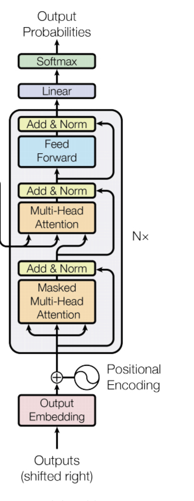

본 정리 내용은 [Naver BoostCamp AI Tech](https://boostcamp.connect.or.kr/)의 edwith에서 학습한 내용을 정리한 것입니다.  
사실과 다른 부분이 있거나, 수정이 필요한 사항은 댓글로 남겨주세요.

---

# Transformer

기존에는 Attention 모듈이 RNN이나 CNN 모듈의 Add-on 모듈로 사용되어왔다.

그러나 2017년 발표된 논문 ['Attention is all you need'](https://arxiv.org/pdf/1706.03762.pdf)는 기존의 RNN과 CNN을 모두 걷어내고, **오로지 Attention만으로 구축하여 시퀀스 데이터를 입출력할 수 있는 Transformer 모델을 구축**하였다.

## 기존 RNN 모델의 한계

RNN은 정보가 여러 time step을 거치면서, 멀리있는 정보가 유실/변질 되는 long-term dependecy 문제가 있었다. 

### Bi-Directional RNNs

기존 RNN은 단방향으로 정보를 전달하기 때문에 어느정도 먼 거리의 정보를 반영하기 어려웠는데, 이를 해결하고자 **양방향으로 RNN을 병렬 구성한 `Bi-Directional RNN`**이 나오게 되었다.(Forward RNN, Backward RNN)

이 때 동일한 time step에서의 hidden state vector $h^f_t$와 $h^b_t$는 concat되어 인코딩 벡터를 구성한다.

## Transformer

## 인코더 구조

1. Input으로 주어진 3개의 벡터(I, go, home)는 각각 본인의 차례에서 선형변환($W^Q$)되어 query 벡터로 기능하고, 자기 자신을 포함한 input 벡터들을 선형변환($W^K$)한 key 벡터들과 내적하여 새로운 벡터를 만들어낸다.
    - 이미지에서 [3.8,-0.2,5.9]
    - 이는 각 벡터간의 유사도를 검사하여, input된 단어들간의 관계를 정의한다.
2. 이후, 이 벡터는 softmax를 거쳐 확률로 변환하여 가중치 벡터를 만든다.
3. 다시 기존의 input 벡터들을 선형변환($W^V$)한 value 벡터와 가중평균내어 총합이 1이 되는 벡터(attention output vector)를 구성하고, 이것이 곧 해당 input 벡터의 인코딩 벡터가 된다.
    - 구해진 유사도를 바탕으로 가중평균을 내는 과정이다.

이 과정을 통해 나온 인코딩 벡터 값으로 여러 input 중 어떤 input에 어느 정도 비율로 집중(attention)해야 할 지 알 수 있게 된다.

<Warning>

이 때, 선형변환(W)을 거치지 않고 input 벡터를 그대로 사용하면, 당연하게도 자기 자신과의 내적이 가장 커지기 때문에, 결과로 나온 h에서는 자기자신에 대한 attention이 가장 커져 정보의 유효성이 부족해지는 문제가 생길 수 있다.

</Warning>

이러한 transformer의 구조는 **정보가 위치한 거리와 관계없이 유사도를 측정하여 attention을 분배함**으로써 기존의 RNN구조가 가지는 **<U>Long-term Dependency 문제를 근본적으로 해결</U>**했다고 할 수 있다.

### 뜯어보기

Transformer 모델에서 핵심적 역할을 하는 세 벡터, **`Query`**(이하 **Q**)와 **`Key`**(이하 **K**), **`Value`**(이하 **V**)에 대해서 살펴보자.

Output은 V들의 가중평균인데, 이 가중평균은 결국 **Q와 K의 내적**으로 구성된다.

- 이 때,  **<U>Q와 K는 내적 가능해야하므로 반드시 같은 차원이어야 한다. ($d_k$)</U>**
- **Q,K의 차원과 V의 차원($d_v$)은 같을 필요가 없다**. V는 결국 상수배해서 가중평균 낼 것이기 때문이다.

$$A(q,K,V) = \sum_i\frac{\exp(q\cdot k_i)}{\sum_j\exp(q\cdot k_j)}v_i$$

- Attention 모듈의 input은 하나의 query 벡터, 모든 Key(를 concat한) 벡터와 모든 Value(를 concat한) 벡터가 된다.
- 분자는 i번째 key와 query 사이의 유사도, 즉 **두 단어간의 유사도**가 된다. 여기에 해당 단어의 value 벡터를 곱한다.
- 분모는 모든 key에 대한 유사도의 총합이 된다.
- 따라서, (해당 단어의 유사도 / 전체 단어의 유사도 총합) 형태가 되므로 가중평균을 구성하게 된다. 이 때 출력 벡터는 value 벡터의 크기가 될 것이다.

그렇다면 query를 여러개 쌓아 행렬 Q를 만든 뒤 한번에 표현해보도록 하자.

$$
A(Q,K,V) = \text{softmax}(QK^T)V
$$

이를 행렬의 형태로 표현하면 다음 이미지와 같다.

- $\vert Q\vert$ : 쿼리의 개수
- $d_k$ : 쿼리의 차원
- Q와 K의 **내적을 위해서는 K가 transpose되어야 한다**. 내적의 결과로 나오는 $|Q|\times|K|$ 행렬에서 **i번째 row는 i번째 query에 대한 input 벡터들의 유사도를 나타내는 row**가 된다. 이 연산이 끝나면 softmax를 이용하여 가중치 벡터로 변환된다.
- 가중치 벡터와 V 벡터와의 내적을 통해 나온 $|Q|\times d_K$ 출력 행렬은 다시 기존의 Q와 동일한 형태를 이루며, **출력 행렬의 i번째 row는 input Q의 i번째 row(query)에 대한 attention의 output**이 된다.

### Scaled Dot-Product Attention

위의 경우는 2차원 행렬을 가정하고 수행했지만, 실제로 연산을 수행할 때에는 q와 k가 **n차원**일 수 있다.

이때, dimension이 커지면 커질수록 **q와 k의 내적값의 쏠림현상**이 심해져서, attention이 효율적으로 학습되지 못한다.

- 이는 서로 독립인 random variable끼리 곱했을 때 분산이 1이되고, 이 곱들을 서로 더했을 때 분산이 고스란히 더해지기 때문이다. 내적 수행 과정에서는 차원이 클수록 random variable 값끼리 더 많이 곱하고 더해지게 되는데, 이 과정에서 분산이 너무 커진다. 이는 곧 내적값의 차이가 크게 나는 것을 의미한다.
- 이를 직관적으로 생각해보자. 2차원 평면상에 떨어져있던 여러 점들이, 3차원 공간으로 이동하면, 점들간의 거리는 어떻게 될까? 높이(z)라는 새로운 축이 생겼으므로, 당연히 점들간의 거리는 평면상보다 대체로 멀어지고, 최선의 경우(세 점들이 같은 평면에 있을 때)에야  동일한 거리를 가지게 된다.
- 따라서, 차원이 늘어난다는 것은 대체로 공간상의 점좌표로 표현되는 vector간의 거리가 sparse해 진다는 것, 즉 분산이 늘어난다는 것을 직관적으로 이해할 수 있다.

$$
A(Q,K,V) = \text{softmax}\Bigg(\frac{QK^T}{\sqrt{d_k}}\Bigg)
$$

이런 문제를 해결하기 위해, 분산을 일정하게 유지하기 위한 방법으로 Q와 K의 내적을 **차원($d_k$)의 제곱근으로 나누어주는 테크닉**이 있다. 이 경우 분산이 분산의 제곱배만큼 축소되기 때문에, 차원이 몇차원이든 **분산을 항상 1로 일정하게 Scaling**할 수 있다.

## Multi-Head Attention

**`Multi-Head Attention`**은 기존의 Attention 모듈을 좀 더 유용하게 확장한 모듈이다.

$$
\text{MultiHead}(Q,K,V) = \mathrm{Concat(head_1,\dots,head_n)}W^O\\
\mathrm{Where\ head_i = Attention}(QW_i^Q,KW_i^K,VW_i^V)
$$

Multi-head attention은 **여러개의 attention 모듈을 동시에 사용**한다. 이 때 각 attention 모듈의 선형변환 파라미터 $W_i$(head)는 모듈마다 각각 다르다. 이 각기 다른 version의 모듈들을 이용하여 낸 output들을 **concat**($\times i)$한 뒤, $W^O$로 선형변환하여 하나의 output을 만드는 형태이다.

이런 Multi-head attention을 사용하는 이유는, 동일한 입력문 기준으로도 **필요에 따라 중점을 두어야 할 단어들이 다를 경우가 있기 때문**이다.

- 가령, I am going to eat dinner라는 문장이 있다고 하자.
- 어떤 때는 '내가' 먹었다는 사실에 주목해야 해서 'I'에 집중해야 할 수도 있고, 어떤 때는 '저녁'을 먹었다는 사실에 주목하기 위해 'dinner'에 집중해야 할 수도 있다.

### attention의 연산량

- $n$ : sequnce 길이
- $d$ : query / key 차원
- $k$ : 합성곱 연산의 커널 사이즈
- $r$ : restricted self-attention의 이웃 사이즈

위와 같을 때, 기존 layer들의 연산량은 다음과 같다.

- **`Complexity per Layer`**
    - Total Computational Complexity per Layer를 의미하는 것으로, 총 연산양의 복잡도를 의미한다. 논문 원문에서는 (연산양에 따른) 시간복잡도를 의미한 듯 한데, 공간복잡도로 해석해도 큰 무리는 없는 듯하다. 연산을 처리하는 디바이스가 1개인 상황을 가정한다고 생각하면 얼추 들어맞는다.
    - **Self-attention**
        - $Q \times K^T = (n \times d) \times (d \times n)$
        - Q와 K를 내적하므로 각 길이 $n$을 제곱하고, 이를 모든 dimension마다 계산해야 하므로 $d$를 곱해야한다.  - $O(n^2\cdot d)$
    - **Recurrent**
        - time step의 개수가 $n$이고, 매 time step마다 $(d\times d)$ 크기의 $W_{hh}$를 곱한다. - $O(n\cdot d^2)$이 때 $W_{hh}$의 dimension $d$는 hidden state vector의 크기로, 하이퍼파라미터이므로 직접 정해줄 수 있다.
- **`Sequential Operations`**
    - 해당 연산을 얼마의 시간내에 끝낼 수 있는가를 나타낸 것으로, 연산양 자체는 무한히 많은 GPU의 병렬연산으로 한번에 처리할 수 있음을 가정한다.
    - **Self-attention**
        - 시퀀스의 길이 $n$이 길어질수록 지수배로 연산복잡도가 늘어난다.
        - 이는 모든 Q와 K의 내적값을 모두 저장하고 있어야하기 때문이다.따라서 **일반적인 Recurrent보다 훨씬 많은 메모리를 필요**로 하게 된다.
        - 그러나 GPU는 이런 형태의 행렬 연산 병렬화에 특화되어 있고, 따라서 무한히 많은 GPU를 가지고만 있기만 하다면 이를 병렬화하여 계산할 수 있으므로, 시간 복잡도는 $O(1)$이 된다.
    - **Recurrent**
        - 이전 time step의 $h_{t-1}$이 제공되어야 그것을 input으로 다음 $h_t$를 계산할 수 있기 때문에, 불가피하게 시간 복잡도는 $O(n)$이 된다.
- **`Maximum Path Length`** - 두 단어 간의 경로 거리
    - **Self-attention**
        - 두 단어간의 유사도를 구할 때, 행렬 연산으로 바로 곱할 수 있으므로 $O(1)$이다.
    - **Recurrent**
        - 어떤 단어 a가 어느정도 떨어진 단어 b에 도달하기까지 recurrent cell을 하나씩 통과해야하기 때문에 $O(n)$이 된다.

### Block-Based Model

처음에 시작해 Multi-Head Attention으로 가는 세개의 화살표는 각각 Q,K,V를 의미한다. 각 head마다 들어가게 된다.

그 연산 이후에 진행되는 **Add&Norm** 구간은 무엇일까?

- Add - **`Residual Connection`**
    - CV 쪽에서 깊은 레이어를 만들 때 graident vanishing을 해결하면서 더 깊은 층을 쌓도록 하는 효과적인 모델이다.
    - 주어진 input vector를 Multi-Head Attention의 encoding output에 그대로 더하여 새로운 output을 만들어서, 학습시에 Multi-Head Attention이 **입력 벡터 대비 정답 벡터와의 '차이나는 정보'만 학습**하도록 할 수 있다.
    - 이 때, **Multi-Head Attention output과 input 벡터의 크기가 완전히 동일하도록 유지**해야 더할 수 있다.
- Norm - **`Normalization`**
    - 일반적으로 신경망에서 사용되는 normalization은, (평균,분산)을 (0,1)로 만든 뒤, 원하는 평균과 분산을 주입할 수 있도록 하는 `선형변환(affine transformation)`으로 이루어진다.
    - `Batch Norm`
        - 각 원소에 평균을 빼고, 표준편차로 나눈다. → (평균,분산)==(0,1)
        - affine transforamtion하여 원하는 평균과 분산으로 만든다.
            - ex ) $y= \textcolor{red}2x +\textcolor{Green}3 \rarr (평균,분산) = (\textcolor{Green}3,\textcolor{red}2)$
            - 이 때 2와 3은 Optimization 과정에서 최적화 대상인 파라미터가 된다.
    - `Layer Norm`
        - Batch Norm과 마찬가지 방법으로 수행하되, 여러 layer가 붙어있는 행렬을 대상으로, 한 layer마다 수행한다.
        - affine transformation은 각 layer의 동일한 node 기준으로 수행한다.(normalization이 column 단위였다면 affine transformation은 row 별)
        - Batch Norm과는 일부 차이점이 있지만, 큰 틀에서 **학습을 안정화**한다는 점은 동일하다.

Add&Norm 구간을 거치고 나온 output은 다시 fully connected layer(Feed Forward)에 통과시켜 Word의 인코딩 벡터를 변환한다. 이후 다시 Add&Norm을 한번 더 수행하는 것까지를 끝으로 Transformer의 (self-attention 모듈을 포함한) **`Block Based Model`**이 완성된다.

### Positional Encoding

RNN과 달리 self-attention 모듈 기반의 Block Based Model로 인코딩하는 경우, 순서를 고려하지 않기 때문에 input 단어들의 순서가 바뀌어도 output은 동일하다. 이는 K와 Q간의 유사도를 구하고 V로 가중치를 구해 가중합(이때 softmax를 통과한 값이므로 가중합 자체가 가중평균이다)을 도출하는 과정에서, sequence를 고려하지 않기 때문이다.

**`Positional Encoding`**은 이를 해결하기위해 벡터 내의 특정 원소에 해당 word의 순서를 알아볼 수 있는 , 마치 **<U>지문과도 같은 unique한 값을 추가하여 sequence를 고려하는 것</U>**을 말한다.

- 이 때, unique한 값은 여러 주기함수의 출력 함수값을 합쳐 사용한다. 주기함수는 입력값 x의 위치에 따라 출력값이 변하기 때문이다.
- 단, 하나의 주기함수만 사용하면 동일한 함수값을 가지는 구간이 생기므로, **서로 다른 여러 주기함수의 출력값들을 모두 합쳐서 사용**한다.

이렇게 특수한 값을 추가하여 인코딩하게 되면, input 단어의 순서가 바뀌었을 때 output 값도 달라지게 되어 순서를 구별할 수 있는 모델이 된다.

### Learning Rate Scheduler

기존의 모델에서 학습률(learning rate)는 하이퍼파라미터로, 학습 내내 고정되어있는 값이었다. 그러나 학습의 과정동안 효율적인 학습률은 계속 바뀌기 마련이므로, 이를 학습 과정 내에서 효과적으로 바꾸어 줄 수 있는 방식으로 **`Learning Rate Scheduler`**가 나오게 되었다.

## 디코더 구조

Outputs가 디코더의 입력으로 들어올 때, 기존의 ground truth 문장에서 앞쪽에는 `<SOS>` 토큰을 붙여 들어오므로, 한칸 밀린(shfited right) 형태로 들어오게 된다.

디코더에서 Attention 모듈을 포함한 한차례의 과정을 거친 후 다음 Multi-Head Attention으로 갈 때, 디코더의 hidden state vector를 입력 Q로 넘겨준다. 그런데, 나머지 K와 V 입력은 외부, 즉 인코더의 최종 출력으로부터 온다. 즉, 이 부분은 디코더의 hidden state vector를  기준, 즉 Q로 해서 인코더의 hidden state vector K, V 를 가중하여 가져오는, **인코더와 디코더간의 Attention 모듈**이 된다.

이 후 이미지에 나온 대로의 연산을 거치다가, 디코더의 최종 output 값이 Linear Layer와 Softmax를 거쳐 확률분포의 형태로 출력된다. 이 값은 Softmax-with-loss 손실함수를 통해 학습된다.

### Masked Self-Attention

Self-Attention 모델에서, 임의의 단어 a는 Q와 K의 내적을 통해 자신과 모든 단어들의 관계를 다 알수 있다. 이 때, 학습 당시에는 배치 프로세싱을 위해 a 뒤의 단어들까지 모두 고려하도록 학습이 진행되나, 사실 **실제 디코딩 상황을 고려한다면 a 뒤의 단어를 알아서는 안된다**. 이는 뒤의 단어를 추론해야 하는 상황에서 뒤에 어떤 단어가 있는지 미리 알고있는, 일종의 cheating 상황이기 때문이다. 이러면 당연히 학습은 제대로 되지 않게 된다.

디코더 과정의 이미지 중 **`Masked Self-attention`**은 이를 해결하기 위한 방법으로, 기존의 attention 모듈에서 Q, K 내적과 softmax를 통과한 값에서 현재 단어 a의 뒤에 있는 단어들을 key 값으로 계산된 셀들을 모두 삭제한다. `Mask` 라는 단어는 이처럼 **뒤쪽의 정보를 가린다(mask)**는 의미다.

위의 이미지는 [I go home → 나는 집에 간다] 라는 번역을 수행하는 사례인데, Q,K의 내적을 통해 얻은 정사각 행렬을 표현하고 있다. 이 때 주대각선 위쪽의 값들은 query보다 key가 뒤쪽의 단어들인 경우로, 이 셀들의 정보를 그대로 둔 채로 학습시키지 못하도록 해당 값들을 0으로 대체한다. 그 이후, 남은 주대각선 이하의 셀들만 가지고, row단위로 총합이 1이 되도록 normalize 한 정보를 최종 output으로 내보낸다.

---

### Reference

[The Illustrated Transformer](http://jalammar.github.io/illustrated-transformer/) - [한국번역](https://nlpinkorean.github.io/illustrated-transformer/)

[Group Normalization](https://openaccess.thecvf.com/content_ECCV_2018/papers/Yuxin_Wu_Group_Normalization_ECCV_2018_paper.pdf)

[Transformer: All you need is Attention (설명/요약/정리)](https://lv99.tistory.com/26)

[📃 Review of "Attention Is All You Need"](https://jeongukjae.github.io/posts/attention-is-all-you-need-review/)