본 정리 내용은 [Naver BoostCamp AI Tech](https://boostcamp.connect.or.kr/)의 edwith에서 학습한 내용을 정리한 것입니다.  
사실과 다른 부분이 있거나, 수정이 필요한 사항은 댓글로 남겨주세요.

---

# Self-supervised Pre-training Models

## 최신 발전 동향

- Transformer 및 self-attention 모델은 현재 자연어처리 뿐만 아니라 다른 분야에까지 좋은 성능을 내고있다.
- 최근에는 스택을 깊게 쌓은 형태의 transformer 모델들이 `전이 학습` 등을 통하여 성능을 획기적으로 향상시킨 사례가 나오고 있다.
    - `BERT`, `GPT-3`, `XLNet`, `ALBERT`, `RoBERTa`, `Reformer`, `T5`, `ELECTRA`...
- 분야도 넓혀가고 있는 중
    - 추천 시스템, 신약 개발, 컴퓨터 비젼...
- 그러나 단어를 하나하나씩 생성한다는 `greedy decoding` 형태를 아직 벗어나지 못하고 있는것도 사실이다.

## GPT-1

일론머스크가 참여한 비영리 재단 Open AI에서 개발한 자연어 처리 모델이다.

하나의 task 뿐만 아니라 **자연어 처리와 관련된 여러 task를 모두 커버할 수 있다**는 것이 특징이다.

### 모델 구조와 작동 과정

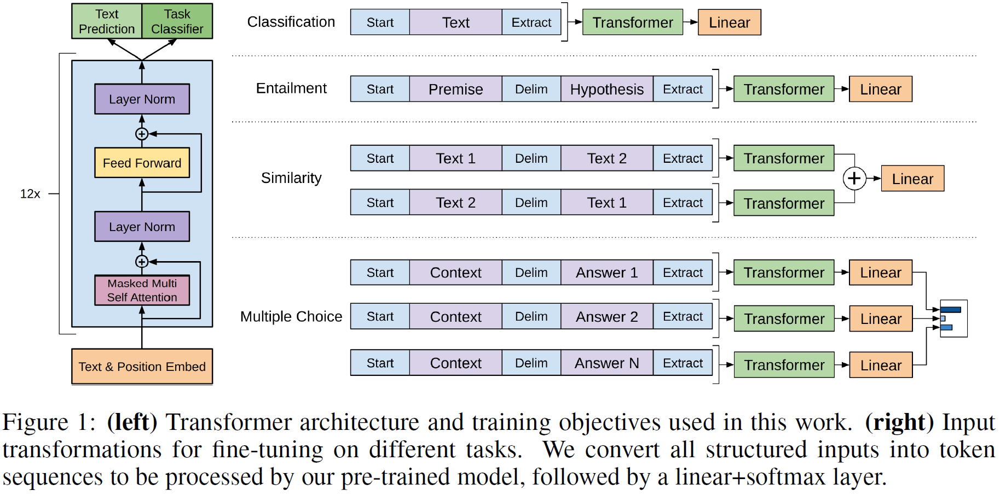

입력 출력 시퀀스가 별도로 있지 않고, **대량의 웹 데이터**로부터 추출한 문장을 토대로 기존의 **Language Modeling Task 방식**으로 12개의 self-attention 블록이 학습되는 형식이다.

그러나 단순히 Lauguage Modeling 뿐만 아니라 다른 Task도 다룰 수 있게 하기 위해 새로운 Task Clasiffier 프레임워크를 제안하고 있다.

문장을 넣을 때 기존에 문장 뒤에 넣어주던 `<EOS>` 토큰과 조금 다른 `<Extract>` 토큰을 넣어인코딩한다. 인코딩 후 Extract 토큰에 해당하는 인코더의 output을 디코더에 input으로 넣어주어 (linear transformation을 거쳐) task를 위한 정보를 파악한다.

예를 들어 이미지에 나온 내포(Entailment)관계에서는, 문장 A(전제,premise)가 참이면 B(가설,hypothesis)도 참인 경우가 있다. 이 경우 두 문장을 하나의 sequence로 만들되, 문장 사이에는 Delimeter(구분자)를 넣어 분리하여 input으로 삼는다.

Extract 토큰은 처음에는 그냥 단순히 문장 마지막에 추가한 토큰이었지만, Self-attention 학습과정 중에 query로 사용되어 학습된다. 결과적으로는 **task에 필요한 정보들을 입력문장으로부터 적절하게 취합/추출할 수 있는 토큰**이 된다.

### Transfer Learning

대량의 일반적인 task 데이터와 소량의 특정 task 데이터가 있는 경우, 통합적으로 학습한 GPT-1 모델을 **`전이학습(Transfer Learning)`**형태로 활용한다.

위의 아키텍쳐 이미지에서, 기존의 학습모델은 그대로 두고, output 부분에 main task 분류를 위한 추가적인 레이어(Task Classifier)를 하나 덧붙이는 방식으로 새로운 task에 대한 학습을 시켜줄 수 있다.  이 때 새로 들어오는 레이어는 random intialization을 거친 값으로, 빠르게 학습되어야하는 백지 파라미터이다. 따라서 **기학습된 본체의 학습률을 크게 줄이고 추가된 레이어와 함께 학습시킴**으로써, Task Classifier 레이어를 빠르게 다른 Task에 적용시킬 수 있게 된다.

### Self-supervised Learning

Main task에 사용되는 데이터는 별도의 레이블이 필요하다. 그러나 **기존의 pretrain된 main task 데이터는 별도의 레이블이 필요하지 않은 데이터**이기 때문에, 데이터를 대량으로 확보하고 학습하기 편하다. 이처럼 **레이블이 필요하지 않은 데이터에서 학습하는 것을** **`자기지도학습(Self-supervised Learning)`**이라고 한다.

레이블링이 필요하지 않은 대규모 데이터로부터 얻은 지식을, 소량의 데이터가 있는 task에 전이학습 형태로 제공하여 성능을 향상시킬 수 있다.

## BERT

**`Bidectional Trasnformer(BERT)`** 모델은 현재까지도 가장 널리 쓰이는 pretraining 모델로, GPT-1과 마찬가지로 **Language Modeling 방식으로 학습**시킨 모델이다.

기존에 다음 단어를 예측하는 등의 간단한 자기지도학습을 `Bi-LSTM(ELMo)`으로 하려는 시도가 있었으나, 지금은 BERT로 다 대체되었다.

### Masked Language Model

사실 언어는 앞 뒤 문맥을 다 봐야하는 것인데, 기존의 Language Model은 왼쪽(전) 또는 오른쪽(후)만의 정보를 이용해왔다. 이런 동기에서 나온것이 BERT의 pre-training 방식인 **`Masked Language Model(MLM)`**이다.

방식은 이렇다. 데이터가 주어지면, 이 문장 데이터 중 일정 비율($k$%)을 `[MASK]` 토큰을 이용하여 Mask 처리하여, 나머지 단어들만을 가지고 이를 맞추는 연습을 한다.이 때 **Masking 할 비율 $k$가 얼마이느냐는 Hyperparameter**이다.

- $k$가 너무 낮으면, 학습 시간 대비 훈련량이 적어 효율이 떨어지거나 학습 속도가 느려질 수 있다.
- $k$가 너무 높으면, 문맥을 제대로 파악할 수 없다.

문제는, pre-training 과정에서는 [MASK] 토큰이 어느 정도 비율로 있었는데, **실제 데이터에서는 [MASK] 토큰이 나올 일이 없다**는 것이다. 따라서 학습과정과 실제 데이터간의 괴리가 발생한다. 이런 차이점이 학습을 방해하거나 전이학습의 효과를 저해한다.

이를 해결하기 위해, 마스킹할 $k$%의 단어들 전부가 아니라 어느 정도만 [MASK] 토큰으로 바꾸는 방식을 생각해볼 수 있다.

- 전체 문장이 총 1000개의 단어이고, 이 중 15%(150개)가 모델이 맞추어내야 하는 단어라고 생각하면,
    - 150개 중 120개는 [MASK]로 바꾼다.
    - 150개 중 15개는 랜덤한 단어로 바꾼다.
        - 이 경우 문법적으로나 맥락으로 이 단어가 옳은지 확인해야 하므로, 학습의 난이도가 조금 더 올라간다.
    - 150개 중 나머지 15개는 원본을 유지한다.
        - 이 경우는 모델이 소신있게 '이 단어가 맞아'라고 판단한 셈이 된다.

### Next Sentence Prediction

BERT가 도입한 또 다른 pre-training 기법으로 **`Next Sentence Prediction`**이 있다.

두 문장을 뽑아 구분자 `[SEP]`을 문장끝에 넣은 뒤, 연속적으로 문장들을 잇는다. 그리고 GPT-1에서의 Extraction 토큰 역할을 하는  `[CLS]`  토큰을 이은 문장 가장 앞에 넣어 만든 시퀀스를 가지고, 두 문장이 서로 인접한(다음에 오는) 문장인지, 아니면 관계가 없는 문장인지 판단하는 이진분류를 수행한다.

### 요약

- 모델 구조
    - (L,H,A) = (Self-attention Block, Incoding Vector Dimension ,Attention Head)
    - BERT BASE : L=12, H=768, A=12
    - BERT LLARGE : L=24, H=1024, A=16
- Input representation
    - WordPiece embeddings
        - 입력 시퀀스를 word 별로 하는 것이 아니라 subword 단위로 임베딩하여 인코딩한다.
    - Learned positional embedding
        - 단어의 위치정보를 임베딩시에 matrix도 넣어준다.(positional encoding처럼)
    - [CLS] - Clasffication token
    - Packed Sentence Embedding [SEP]
    - Segment Embedding
        - 두 문장을 묶어 하나의 세그먼트로 만들 때, 몇번째 문장인지에 해당하는 세그먼트 임베딩을 추가하여 넣어줌으로써 문장을 구별할 수 있게 한다.
- Pre-trained task
    - Masked Lanugage Model
    - Next Sentence Prediction

#

### Fine-tuning Process

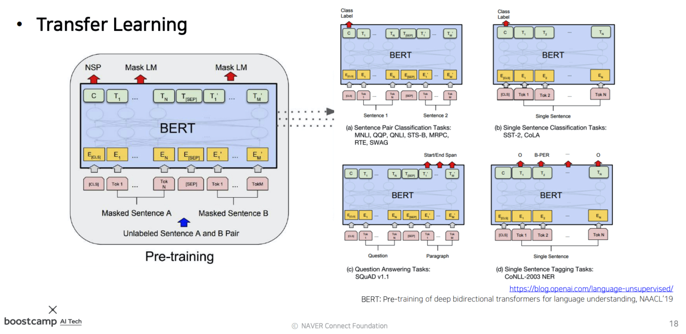

기존에 특정 Task를 처리하도록 pre-train된 모델을, 다른 task를 수행할 수 있도록 조정하여 주는 과정을 **`미세조정 과정(Fine-tuning Process)`**이라고 한다. 기존의 모델구조를 거의 바꾸지 않고도 추가적으로 작은 조정만으로 다른 task를 수행할 수 있기 때문이다.

#

### GPT vs BERT

**`OpenAI GPT`**

- **Unidirectional -** 다음 단어를 예측하는것이 task이기 때문에, 다음 단어에 접근을 허용하면 안된다.
- BookCorpus 데이터로 학습(80억개 단어)
- 배치 사이즈 32,000개 단어
- 모든 fine-tuning experiments에 대하여 5e-5라는 동일한 학습률 적용

**`BERT`**

- **Bidirectional -** [MASK] 토큰으로 치환된 단어를 예측하기 위하여 앞뒤 문맥을 모두 사용한다.
- BookCorpus와 Wikipedia 데이터로 학습(250억개 단어)
- [SEP], [CLS], 세그먼트 임베딩
- 배치 사이즈 128,000개 단어
- task에 따라 각기 다른 학습률 적용

일반적으로 기존의 모델들에 비해 BERT가 성능이 전반적으로 좋았다(GLUE 데이터 참조)

### 기계독해기반 질의응답

**`Machine Reading Comprehension(MRC)`**, 즉 **`Question Answering`**은 질문만 주어지고 답을 예측하는 task가 아니라, 주어진 질문을 '잘' 이해하고, 이에 맞는 정답을 예측해내는 task이다.

이 때 기계가 비교적 독해하기 어려운 질문들을 크라우드소싱으로 모아놓은 데이터셋 **`SQuAD(Stanford Question Answering Data)`**가 있다. 출제자가 지정해놓은 정답에 해당하는 문구가 존재하는 문장이 있고, 기계가 독해하여 문맥에 맞는 정답을 추론한다.

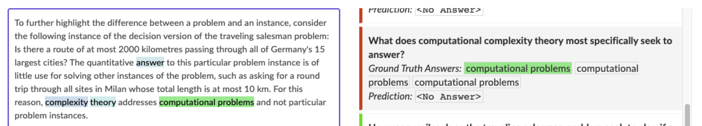

위 그림은 SQuAD 2.0으로,  답에 해당하는 문구를 찾기 위해 다음 과정을 수행한다.

1. 답이 있는지 없는지 판단한다. 답이 있다면 다음으로 넘어가고, 그렇지 않으면 종료한다.
    - 질문과 문단을 종합적으로 보고 판단하므로, CLS토큰을 활용한다.
        - 질문과 문단을 concat해서 BERT로 인코딩하여 CLS 토큰을 얻는다.
        - 주어진 질문과 문단 쌍에서 답이 없다면(ground truth가 No Answer라면) CLS 토큰을 이진분류하는 output layer에 통과시켜, 크로스 엔트로피로 학습하게 된다.
    - CLS 토큰을 통해 답이 있는지 없는지부터 예측 하고, 답이 있는 경우에만 다음 단계로 넘어간다.
2. 단어를 벡터로 변환한다.
3. 각 벡터를 scalar 값으로 변환시켜주는 Fully Connected Layer에 통과시킨다(이 Layer는 모든 벡터에 공통이다)
    - 이 때 Fully Connected Layer의 파라미터가 Random Initialization부터 fine-tuning되는 파라미터이다.
4. 단어에 해당하는 스칼라 값들을 모두 softmax에 통과시켜 ground truth의 첫번째에 해당하는 단어를 찾는다.(가장 확률이 높은 단어를 찾으면 된다.)
    - Softmax-with-loss로 학습시킨다.
5. 정답이 끝나는 지점을 예측할 Fully Connected Layer를 새로 만들고,  Ending word의 포지션을 예측시킨다.(3-4와 동일)

**`SWAG`** 에서는 주어진 문장이 있을 때, 다음에 나타날 문장을 객관식으로 고르는 형태의 QA다. 이 경우에도 CLS 토큰을 사용한다.

- 4가지 선택지를 모두 하나씩 질문과 concat하여 벡터화하고, Fully Connected Layer를 통과시켜 예측 스칼라값으로 만든다.
- 4개의 스칼라값을 모두 softmax에 통과시켜, 정답에 해당하는 값의 확률을 높이도록 학습시킨다.

### Ablation Study

[알고리즘이나 모델의 feature를 제거하면서, 그 행위가 성능에 끼치는 영향을 평가하는 방식](https://fintecuriosity-11.tistory.com/73)을 Ablation Study라고 한다.

- **Big models help a lot**
    - Layer를 점점 더 쌓고, 파라미터를 늘릴수록, 즉 Big model일수록 더 좋더라는 이야기.
    - 데이터셋이 3600개밖에 없더라도 파라미터를 110M→340M 개로 늘리니까 더 좋아졌다.
    - GPU 리소스를 늘리면 늘릴수록 더 높아지더라. 점근선(asymptote)의 형태가 아니더라! 최대한 많이 리소스를 늘려라.

# Advanced Self-supervised Pre-training Models

GPT-1과 BERT 이후에 나온 자기지도 사전학습 모델을 알아보자.

## GPT-2

**`GPT-2`**는 GPT-1에 비해 다음과 같은 점이 발전되었다.

- Layer를 훨씬 더 많이 쌓았다. 다만 학습 방식은 Language Modeling으로 동일하다.
- 학습 데이터가 40GB로 늘어났다. 게다가 데이터의 퀄리티도 좀 더 신경써서 준비했다고 한다.
- Language Model이 메인 task 이외의 down-stream task들을 zero-shot setting, 즉 파라미터나 아키텍쳐 조작을 전혀 하지 않고도 수행가능하다는 것을 입증했다.

모티베이션이 된 논문은 다음과 같다.

[The Natural Language Decathlon : Multitask Learning as Question Answering](https://arxiv.org/pdf/1806.08730.pdf)

- **모든 종류의 자연어 처리 task들이 Question-Answering task로서 처리될 수 있다**는 점을 시사하였다.

### 데이터셋

- Reddit
    - 외부링크를 포함한 모든 웹 텍스트를 수집했다.
    - 총 45M개의 링크를 사용했다.
        - 사람이 직접 큐레이팅/필터링한 웹페이지만 수집하였다.
        - 3개 이상의 추천을 받은 게시글들만 수집하였다.
- 8M 크기의 위키피디아 문서
- 링크로부터 content를 추출하기 위하여 dragnet과 newspaper를 사용했다고 한다.

### 전처리

**`Byte Pair Encoding(BPE)`**를 사용하였다.

### (GPT-1 대비) 구조상의 변화

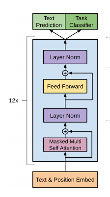

- Layer Normalization이 각 sub-block의 입력쪽으로 옮겨졌다(pre-activation residual network와 비슷한 형태).
- 마지막 self-attention block에서 Layer Normalization이 하나 추가되었다.
- 각 Layer를 random initialization할 때, Layer의 깊이에 비례해서 값이 더 작아지도록 초기화하였다. 따라서 위쪽에 있는 Layer가 하는 역할이 좀 더 축소되도록 하였다.

### Zero-Shot Setting

**`Zero-Shot Setting`**이란, **데이터가 없이도 해당 task의 수행을 할 수 있음**을 일컫는 용어이다.

- Question Answering
    - Task별 학습을 시키지 않고 pre-training만 시킨 GPT-2에 질문(Question)을 준 뒤, 다음에 나올 문장을 예측하라고 했더니, $F_1$ 스코어가 55가 나왔다고 한다. 잘 학습된 BERT 모델이 89의 $F_1$스코어를 기록하는 것을 생각해보면, 학습도 시키지 않은 것 치고는 준수한 성능이다.
- Summarization
    - CNN과 일간 메일 데이터셋에서 TL;DR(Too Long, Didn't Read) 이라는 어구를 기준으로 요약이 있었는데, 이 때문에 TL;DR을 GPT-3에 입력으로 주면 요약을 해 준다.
- Translation
    - Summarization과 같은 방식으로, [In French, In Korean, ...]이라는 어구가 있으면 번역까지 수행해준다고 한다.

## GPT-3

가장 최근에 나온 GPT 모델로, 모델의 구조에 변화가 있었다기보다는, **이전과 비교할 수 없을 정도의 attention block을 쌓아 파라미터수를 어마어마하게 많이 늘렸다(150B)**. 또, **배치사이즈도 3.2M정도가 되도록 최대한 키우자 더 좋은 성능**을 보였다고 한다.

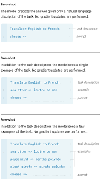

GPT-2에 비해 눈에 띄는 특징은 다음과 같다.

- GPT-2에서는 '가능성'정도로만 보였던 `Zero-shot setting`이 놀라운 수준으로 발전하였다.
    - 학습에서 전혀 활용하지 않았던 텍스트를 translation 했을때도 정상적으로 기능한다.
- 하고자 하는 task(예를 들자면 번역)를 주고, 예시를 주면, 자연어 생성 task로 인식하여 정확도를 평가하고 스스로 학습한다. 이를 **`One-shot`**이라고 한다. 데이터를 단 한 쌍(예시)만 주었다는 말이다.
    - 신기한 점은, 모델 자체의 파라미터를 변경시켜가며 학습한 것이 아니라, 데이터를 input 텍스트의 일부로서 제시했는데도 task를 수행했다는 것이다!
- 동일한 맥락으로, 몇 개 안되는 예시 데이터를 주고 task를 수행하도록 하는 Few-shot이 가능해졌다.

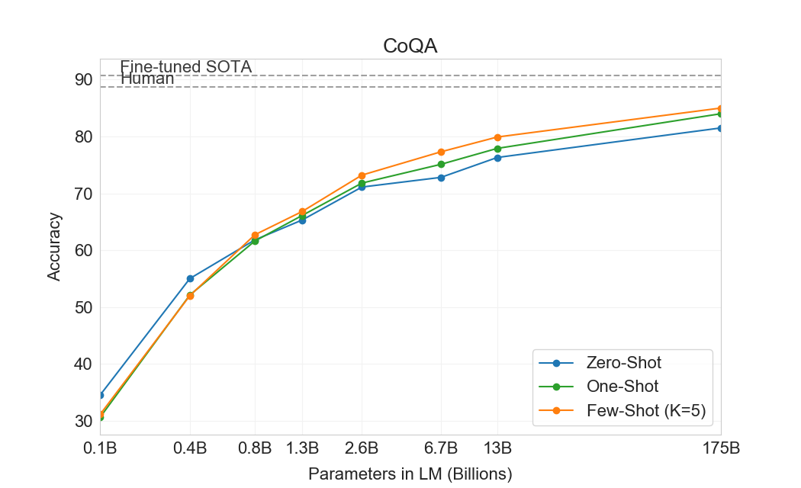

연구 결과에 따르면, 모델 사이즈를 키우면 키울수록, **`Zero/One/Few shot`**의 성능이 계속해서 오른다고 한다.

## ALBERT

 **`A Lite BERT(ALBERT)`**는  기존의 BERT를 경량화 시킨 모델이다. GPT와 같이 모델이 굉장히 거대해지고 리소스와 연산량이 많아지는 형태와는 달리, 오히려 복잡했던 BERT를 개선하는 데에 집중했다. 모델 사이즈를 줄이고, 학습시간과 리소스를 줄이면서도 성능은 크게 떨어뜨리지 않는 경량화 형태의 Pre-trained Model이다.

- BERT에서 큰 버젼과 작은 버젼이 있듯이, ALBERT에도 모델 파라미터 사이즈에 따라 좀 더 큰 모델과 작은 모델이 있다. 물론 더 큰 모델을 사용할 때 좀 더 좋은 성능을 낸다.

이해하기 쉽게 잘 정리된 글이 있으니 아래의 내용들이 이해가 가지 않는다면 이 링크를 참조하자.

[[ALBERT 논문 Review] ALBERT: A LITE BERT FOR SELF-SUPERVISED LEARNING OF LANGUAGE REPRESENTATIONS](https://y-rok.github.io/nlp/2019/10/23/albert.html)

### Factorized Embedding Parameterization

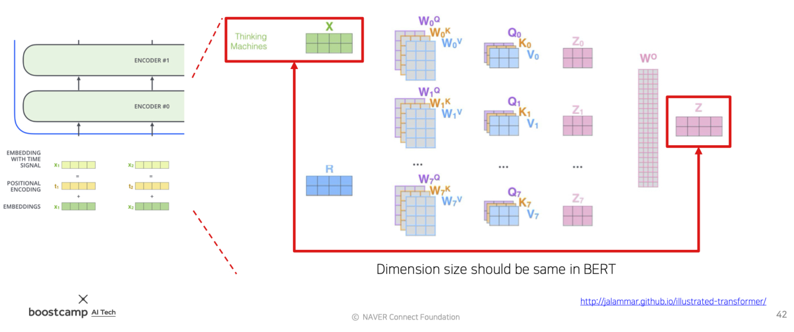

기존의 BERT에서 Embedding vector 사이즈 $E$는 hidden vector size $H$와 항상 같아야했다. 여러 Attention Block을 쌓기 때문에, 같은 크기로 들어가고 나가야 다음 블록에 동일한 형태로 전달될 수 있다.

문제는, 단어간의 관계를 인코딩하여 저장해야하므로 많은 정보가 들어가는 dependent 벡터 $H$의 크기를 맞추기 위해, **단어간의 관계를 생각하지 않아도 되는 independent 벡터 $E$가 필요 이상으로 커진다**는 것이다.

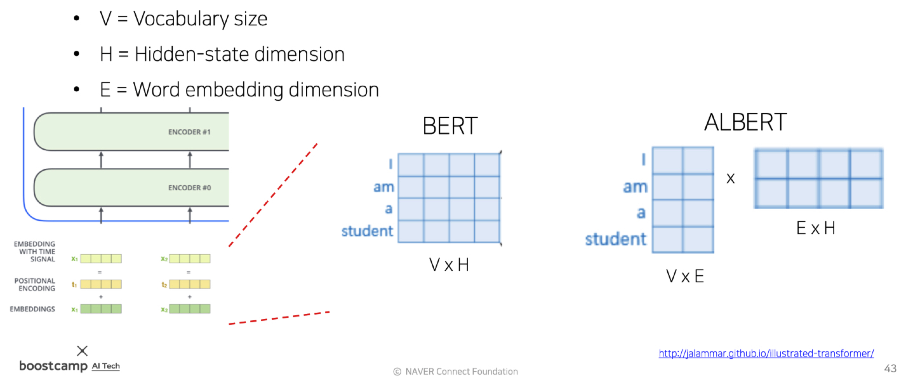

위 이미지를 보면, BERT에서는 원래 4x1 사이즈의 임베딩 벡터가 H에 맞춰주기 위하여 4x4로 늘어나는 것을 볼 수 있다.

이를 해결하기위해 ALBERT는 **<U>Embedding Matrix를 위의 이미지처럼 두 Matrix의 곱으로 쪼갠다</U>**. 가령 H(=4)에 맞추기 위하여 4x4였던 행렬을, 4x2 크기의 행렬로 두고 추가적으로 Layer를 하나 더 두어, Word별로 구성되는 2차원 벡터를 4차원으로 선형변환(W)시켜주도록 한다.  이 때 W는 H의 크기로 변환될 수 있도록 적당한 크기를 가지면 된다.

- **`row-rank matrix factorization`**이라고 하는 기법이다.
- 위의 예제에서는 잘 와닿지 않지만, H의 크기가 100이고 쪼갠 Matrix의 column length는 10이라고 생각해보자. 파라미터 수가 확 줄어듦이 체감될 것이다.

### Cross-layer Parameter Sharing

Self-attention block들이 가지는 학습 파라미터들에는 무엇들이 있을까?

- 임베딩된 input 벡터가 Query, Key, Value 각각의 역할을 하도록 변형시켜주는 $[W^Q,W^K,W^V]$
    - multi head라면 행렬 세트가 총 head개가 된다.
- $Z^t$들을 concat한 후  다시 원래의 Hidden State Vector 크기의 $Z$로 줄여주기 위한 $W^O$

물론, 각각의 Self Attention block마다 이 파라미터값은 모두 다를것이다.

그런데 ALBERT는 서로 다른 Layer, 즉 **서로 다른 Self-Attention Block에 존재하는 파라미터들을 서로 공유**하는 방법을 제시한다. 이를 **`Cross-layer Parameter Sharing`**이라고 한다.

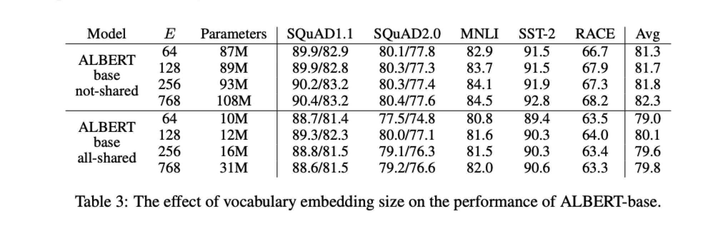

- **`Shared-FFN`** : Layer 간에 feed-forward network의 파라미터만 공유한다.
- **`Shared-attention`** : Layer 간에 attention 파라미터들만 공유한다.
- **`All-shared`** : 둘 다 공유한다.

이처럼 파라미터를 공유하였을 때, **파라미터의 개수는 크게 줄었음에도 불구하고 모델의 성능은 그다지 크게 떨어지지 않았음을 입증**하였다.

### Sentence Order Prediction

BERT 이후의 후속연구에서, BERT 모델이 기존에 pretraining하던 `Next Sentence Prediction task`는 사실 너무 쉬워서 그다지 실효성이 없는 것으로 드러났다.

- 두 문장의 출처가 다르다면, 사실상 전혀 다른 내용일 확률이 높다.
- 따라서 그냥 비슷한 단어나 문맥이 많이 등장했는가 정도로 선후관계를 파악하게 된다.
- 이는 선후 관계보다는 topic prediction에 가깝다.

ALBERT에서는 해당 task의 pretraining을 빼고 좀 더 유의미한 task들을 집어넣어, 모델의 성능을 확장했다.

- 두 독립적인 문장을 가져와 선후관계를 파악하는 것이 아니라, 항상 연속적인 두 문장을 가져온다.
- 그 문장을 원래의 순서대로 concat했을 때 정방향으로 예측하고, 역순으로 concat했을 때 역방향으로 예측하도록 학습시킨다.(이진분류)
- 이를 `negative sample`이라고 하는데, 인접 문장이므로 순서와 관계없이 비슷한 단어가 당연히 많이 등장한다.
    - 따라서 정말로 논리적인 흐름을 주의깊게 파악해야 task를 풀 수 있는 pretraining 형태가 되었다.

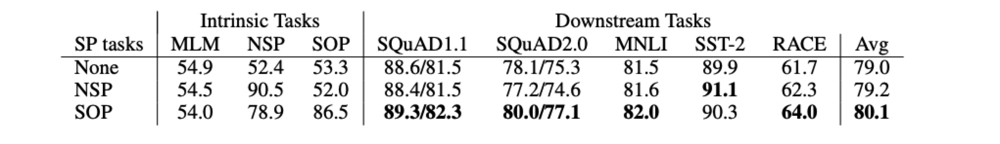

논문에 첨부된 위의 실험결과를 보면, Next Sentence Prediction(NSP)를 사용했을때는 아예 사용하지 않았을 때와 별 차이가 없거나 오히려 성능이 떨어지기까지 한다. 이에 비해 **`Sentence Order Prediction(SOP)`**는 좀 더 좋은 개선된 성능을 보여주고 있다.

## ELECTRA

2020년에 발표된 논문으로, GPT의 standard한 LM이나, BERT의 Masked LM task에서 나아가, **GAN 형태의 모델링**을 제시하고 있다.

MLM(Masked language Modeling)을 통해 마스킹된 단어를 복원해주는 모델-**`Generator`**를 하나 두고, 또 Generator가 복원한 단어들을 받아 이 단어가 원본인지 또는 generator에 의해 복원된 단어인지를 예측하는 모델-**`Discriminator`**를 둔다.

- generator는 BERT의 형태로 볼 수 있다.
- 이 때 Generator와 Discriminator이라는 구조를 Generative Adversarial Network(GAN)형태로 볼 수 있다.

이렇게 모델 학습을 진행할 경우에, Pre-train된 모델로서 사용할 수 있는 부분이 Generator와 Discriminator 두 부분이 된다. 이 중 **`ELECTRA`**는 Discriminator를 가져다가 downstream task에 맞게 fine-tuning하여 사용하는 방식이다.

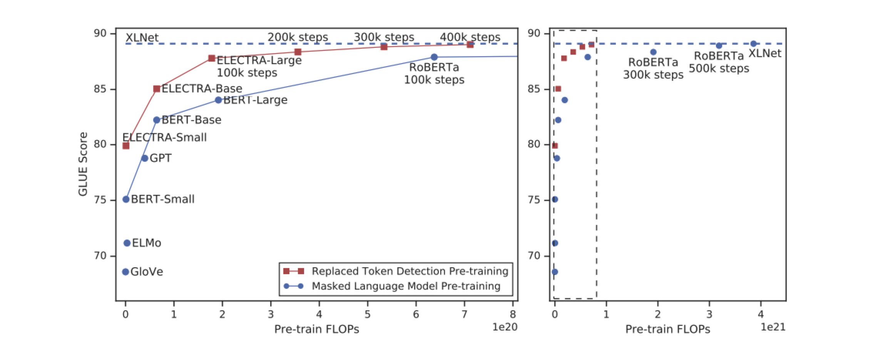

ELECTRA의 논문에 따르면, **대부분의 BERT 모델보다 동일한 학습량 대비 성능이 더 좋다**고 한다.

## Light-weight Models

이외에도 최근의 모델 연구동향은 경량화 기술에 주목하고 있다. GPT-3같은 대형 모델의 성능은 놀랍지만, 연구나 활용을 하기에는 오히려 접근이 힘들다는 문제가 있다.

기존의 정확도를 유지하면서도 파라미터수나 레이어 수를 줄임으로써 모델의 크기와 학습속도를 빠르게 하려는 노력들이 이어지는 중이다. 이를 통해 클라우드나 서버를 통한 AI 적용이 아니라 휴대폰이나 IOT기기에서도 딥러닝이 가능하게 할 수 있다.

### DistillBERT

[Huggingface](https://huggingface.co/)에서 2019년도 발표한 모델로,  Teacher 모델과 Student 모델로 이루어져있다. 큰 사이즈의 Teacher 모델이 기존의 방식으로 학습을 수행한 후, Student 모델은 더 적은 파라미터로 Teacher 모델의 수행방식을 모사하여 비슷한 성능을 낸다.

- Teacher 모델이 예측한 결과를 Student 모델이 softmax에 주는 ground-truth로 삼아 학습한다.

### TinyBERT

2020년 발표된 `TinyBERT` 역시 BERT를 경량화시킨 모델이지만, 좀 더 발전된 형태이다.

- DistillBERT과 마찬가지로 target distribution을 모사한 뒤, Student 모델에서 이를 ground-truth로 삼고 학습한다.
- 추가적으로, Student 모델이 Teacher 모델의 Attention Matrix와 Hidden state Vector까지도 유사하도록 모사한다.
    - 최종 결과물뿐만 아니라 **중간 결과물까지도 비슷하도록 모사**한다고 볼 수 있다.
    - MSE-Loss를 사용한다.

이 때, Student 모델의 벡터 크기가 일반적으로 Teacher 모델의 벡터보다 작기 때문에 이를 욱여넣는 과정에서 전정보의 손실이 발생할 수 있다.

이를 방지하고자 TinyBERT는 벡터간의 크기 변환 과정에 Fully Connected Layer를 두어, 기존의 정보를 어느정도 유지하면서 더 적은 벡터로 이를 모사할 수 있게 된다.

## Fusing Knowledge Graph into Language Model

기존의 Pritrained 모델과 지식(knowledge) 그래프를 조합한 최신 연구동향이다.

BERT가 2018년도에 등장한 이후, BERT가 정말로 언어적인 이해를 제대로 하고 있는 것인지 분석하는 연구들이 이어지면서, BERT가 데이터셋에 나와있지 않은 종류의 문장들은 잘 이해하지 못한다는것이 드러났다.

주어진 문장에서 나타나는 지식 뿐만 아니라, 외부 지식(또는 상식)도 자연어 처리에서 중요한데, 이를 연구하는 분야가 **`Knowledge Graph`** 분야이다.

- 개체간의 관계, 개념등을 잘 정의하고, 정형화해서 만들어 둔 것을 Knowledge Graph라고 한다.

Knowledge graph를 어떻게 BERT등에 적용시킬 수 있을까에 대한 연구 동향으로 ERNIE, KagNET등이 있다.

---

### Reference

논문

- [Language Models are Few-Shot Learners](https://arxiv.org/pdf/2005.14165.pdf)
- [ALBERT: A LITE BERT FOR SELF-SUPERVISED LEARNING OF LANGUAGE REPRESENTATIONS](https://arxiv.org/pdf/1909.11942.pdf)
- [ELECTRA: PRE-TRAINING TEXT ENCODERS AS DISCRIMINATORS RATHER THAN GENERATORS](https://openreview.net/pdf?id=r1xMH1BtvB)
- [DistilBERT, a distilled version of BERT: smaller, faster, cheaper and lighter](https://arxiv.org/pdf/1910.01108.pdf)
- [TinyBERT: Distilling BERT for Natural Language Understanding](https://arxiv.org/pdf/1909.10351.pdf)

[Improving Language Understanding with Unsupervised Learning](https://openai.com/blog/language-unsupervised/)

[The Stanford Question Answering Dataset](https://rajpurkar.github.io/SQuAD-explorer/)

[GPT-2: How to Build "The AI That's Too Dangerous to Release"](https://blog.floydhub.com/gpt2/)

[Better Language Models and Their Implications](https://openai.com/blog/better-language-models/)

[The Illustrated Transformer](http://jalammar.github.io/illustrated-transformer/)