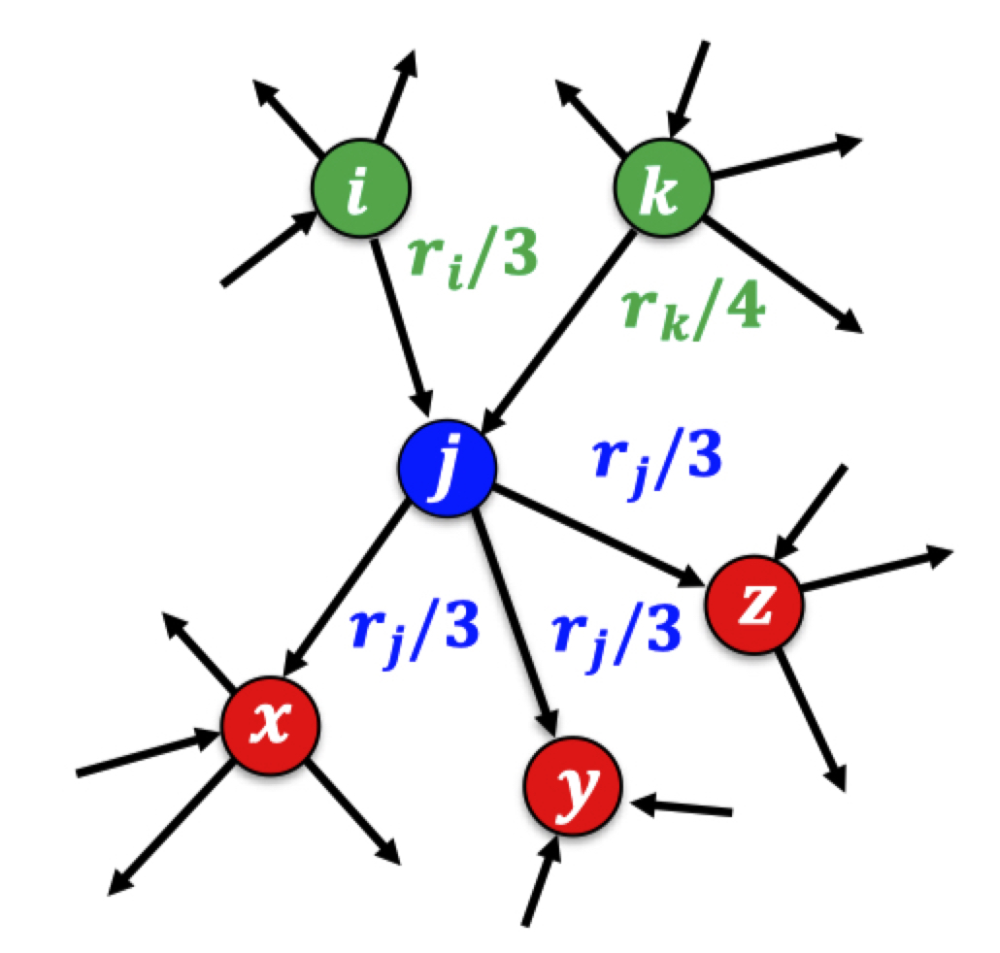
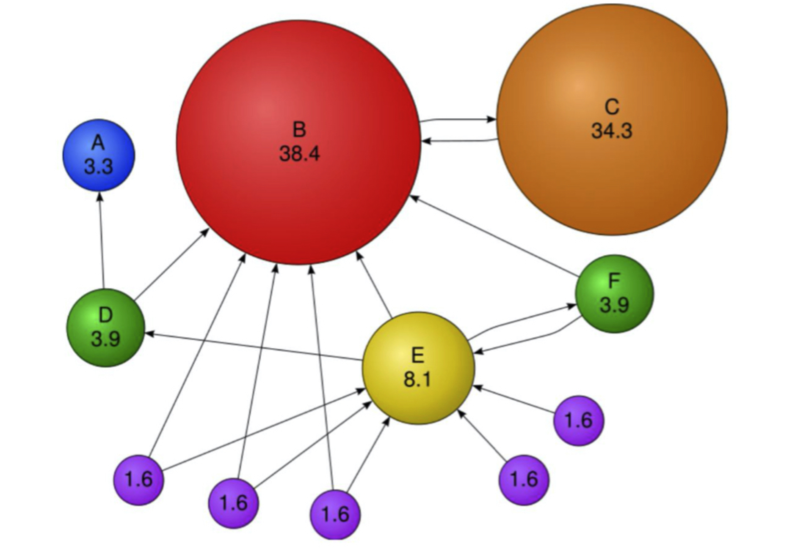

본 정리 내용은 [Naver BoostCamp AI Tech](https://boostcamp.connect.or.kr/)의 edwith에서 학습한 내용을 정리한 것입니다.  
사실과 다른 부분이 있거나, 수정이 필요한 사항은 댓글로 남겨주세요.

---

# PageRank 알고리즘

웹은 웹페이지와 하이퍼링크로 구성된 방향성 있는 그래프(Digraph)이다.

- 하이퍼링크는 웹페이지에서 나가는 간선에 해당한다.

### 구글 이전의 검색엔진

웹에서 방대한 양의 자료를 어떻게 하면 효율적으로 검색할 수 있을까? 이에 대해 구글 이전의 검색엔진은 다음과 같은 방식들을 시도했다.

- **웹을 하나의 거대한 디렉토리로 보고, 카테고리별로 정리하기**
    - 그러나, 웹페이지의 수가 너무 많기 때문에 카테고리의 수와 깊이가 무한정 커질수밖에 없었다.
    - 또, 카테고리의 구분이 모호하여 저장과 검색이 어려웠다.
- **키워드에 의존한 검색엔진**
    - 해당 키워드를 (여러 번) 포함한 웹페이지를 반환한다.
    - 그러나, 검색엔진에 노출되기 위해 관련성 없는 단어들을 넣은 악의적인 웹페이지에 취약했다.

이러한 문제점들을 해결하기 위해, 구글의 창업자, 당시 스탠포드 박사과정이었던 래리 페이지와 세르게이 브린은 *[The PageRank Citation Ranking : Bringing Order to Web](http://ilpubs.stanford.edu:8090/422/1/1999-66.pdf)* 라는 논문을 내어 PageRank 알고리즘을 제안한다.

#

## 페이지 랭크 알고리즘

**`페이지랭크(PageRank) 알고리즘`** 의 여러 정의와 원리에 대해서 알아보자.

### 정의 - 투표 관점

**`투표`**를 기반으로 사용자 키워드와 관련성이 높고 신뢰할 수 있는 웹페이지를 찾는다.

이 때, 투표는 **'하이퍼링크'**를 의미한다. 어떤 웹페이지 $u$가 다른 웹페이지 $v$로의 하이퍼링크를 포함한다면, $v$가 유용하다고 생각했기 때문일 것이다. 따라서, <U>하이퍼링크로 많이 참조된(즉, 들어오는 간선이 많은) 웹페이지일수록 투표를 많이 받은 웹페이지</U>로 볼 수 있다.

그러나, 들어오는 간선을 세는것만으로 충분할까? 만약 그렇게 한다면, 하이퍼링크를 많이 참조해 둔 웹페이지를 이곳 저곳 만들어 뿌려두는 것으로 악용할 수 있을 것이다. 따라서 이런 경우를 걸러내기 위해, **'가중 투표'**를 실시한다. 관련성이 높고 신뢰할 수 있는 웹사이트의 투표에 더 가중치를 두어 계산한다.

- 이 때 '관련성'과 '신뢰성'의 개념도 결국 투표로 결정될 수 있으므로, 재귀(recursion)와 연립방정식을 통해 이를 구현한다.
    - 어떤 페이지의 신뢰성(페이지랭크)는 결국 다른 페이지의 신뢰성(페이지랭크)에 따라 결정되는데, 이 과정이 재귀적으로 반복된다.

위의 이미지에서 웹페이지 $j$의 페이지랭크 점수 $r_j$를 구하면,  $r_j=r_i/3+r_k/4$이다.

이를 수식으로 일반화하면 다음과 같은 식이 된다.

$$
r_j = \sum_{i\in N_{in}(j)}\frac{r_i}{d_{out}(i)}
$$

그런데 이 때, 내가 참조(out)하는 페이지가 나를 참조(in)하고 있을수도 있다. 이 경우 $r_i$에 $r_j$가 포함되므로, 결국 해당 페이지의 페이지랭크를 구하려고 하는 데 해당 페이지의 페이지랭크를 알아야하는 방식이 된다.

#

### 정의 - Random Walk 관점

**임의 보행(Random Walk)**을 통해 웹을 서핑하는 웹 서퍼를 가정한다. 즉, 웹서퍼는 현재 웹페이지의 하이퍼링크 중 하나를 균일한 확률로 클릭한다.

**웹 서퍼가 $t$번째 방문한 웹페이지가 웹페이지 $i$일 확률**을 $p_i(t)$라고 할 때, $p(t)$는 **길이가 웹페이지 수와 같은 확률 분포 벡터**가 된다. 

- 즉, ($i$로 들어오는 간선이 있는) 모든 페이지에서 웹페이지 $i$를  클릭할 확률 $p_i(t)$를 모두 모아놓은 벡터이다. 당연히 길이가 웹페이지 수와 같아진다.

이를 일반화하면 다음과 같다.

$$
p_j(t+1) = \sum_{i\in N_{in}(j)}\textcolor{green}{\frac{\textcolor{blue}{p_i(t)}}{d_{out}(i)}}
$$

- $\textcolor{crimson}{t+1}$번째에 $\textcolor{crimson}{j}$를 방문하기 위해서는 $\textcolor{crimson}{t}$번째에 $\textcolor{crimson}{j}$에 들어오는 이웃($\textcolor{crimson}{i}$)에 있어야 한다. - $\textcolor{blue}{p_i(t)}$
- 페이지 $\textcolor{crimson}{i}$에서 나가는 간선 중 $\textcolor{crimson}{j}$로 향하는 간선(하이퍼링크)을 클릭할 확률은 $\textcolor{green}{1/d_{out}(i)}$이다.
- 따라서, $\textcolor{crimson}{t}$번째에 $\textcolor{crimson}{i}$에 있다가 $\textcolor{crimson}{t+1}$번째에 $\textcolor{crimson}{j}$로 옮겨올 확률은 $\textcolor{green}{\textcolor{blue}{p_i(t)}/d_{out}(i)}$가 된다.
- 이를 $\textcolor{crimson}{j}$로 들어오는 모든 간선(하이퍼링크)에 대해서 계산하여 합치면, $\textcolor{crimson}{t+1}$번째에 페이지 $\textcolor{crimson}{j}$에 들어올 확률이 된다.

이 때, 웹 서퍼가 충분히 많이 서핑을 하게 되면(즉, $t$가 무한히 커지면) 확률 분포는 $p(t)$에 수렴하게 된다. 다시말해, $\textcolor{red}{p(t)=p(t+1)=p}$가 성립하게 된다.

수렴한 확률분포 $\textcolor{red}{p}$를 정상 분포(Stationary Distribution)이라고 부르고, 이를 통해 위의 수식을 다음과 같이 바꿀 수 있다.

$$
p_j(t+1) = \sum_{i\in N_{in}(j)}\frac{p_i(t)}{d_{out}(i)} \Rarr \textcolor{red}{p_j = \sum_{i\in N_{in}(j)}\frac{p_i}{d_{out}(i)}}
$$

이 수식은 투표 관점에서 정의했던 페이지 랭크 점수와 동일하다.

$$
\underbrace{r_j = \sum_{i\in N_{in}(j)}\frac{r_i}{d_{out}(i)}}_{투표 관점\ 페이지랭크점수\ r} \quad\quad \underbrace{p_j = \sum_{i\in N_{in}(j)}\frac{p_i}{d_{out}(i)}}_{임의보행관점\ 정상분포\ p}
$$

## 페이지 랭크의 계산

### 반복곱

페이지랭크를 정의대로 계산하기 위해 **`반복곱(Power Iteration)`**을 사용한다.

1. 각 웹페이지 $i$의 페이지랭크 점수 $r_j^{(0)}$를 동일하게 $1/{\#page\_num}$로 초기화한다.
2. 아래 식을 이용하여 각 웹페이지의 페이지랭크 점수를 갱신한다.

    $$
    r_j^{(t+1)} = \sum_{i\in N_{in}(j)}\frac{r_i^{(t)}}{d_{out}(i)}
    $$

3. 페이지랭크 점수가 수렴($r^{(t)}\approx r^{(t+1)}$)하였으면 종료하고, 아니면 2를 다시 수행한다.

### 문제점

그런데, 이 반복곱이 항상 수렴한다고 보장할 수 있을까?

- 수렴하지 않고 진동하는 경우도 있다.
- 이는 들어오는 간선은 있지만, 나가는 간선은 없는 정점 집합인 **`스파이더 트랩(Spider Trap)`**에 의한 문제이다. ($a\rightleftarrows b$ 의 무한 반복)

또, 수렴한다고 하더라도 "합리적인" 점수로 수렴하는 것을 보장할 수 있을까?

- 페이지 랭크의 점수가 0으로 수렴하는 경우도 있다.
- 들어오는 간선은 있지만, 나가는 간선은 없는 **`막다른 정점(Dead End)`**에 의한 문제이다.

### 해결책

위에서 제기된 문제들을 해결하기 위해, **`순간이동(Teleport)`**를 도입하여 탈출 시나리오를 끼워넣는다.

예를 들어, Random Walk 관점에서는 다음과 같이 행동한다.

1. 현재 웹페이지에 하이퍼링크가 있는지 확인한다.
    1. 없다면, 임의의 웹페이지로 순간이동하고, 처음부터 다시 시작한다.
    2. 있다면, 앞면이 나올 확률이 $\alpha$인 동전을 던진다.
2. 동전이 앞면이라면, 하이퍼링크 중 하나를 Random Walk로 클릭한다.
3. 동전이 뒷면이라면, 임의의 웹페이지로 순간이동한다.

순간이동을 통한 탈출로 spider trap이나 dead end에 갇히는 일이 없어졌다. 

이 때 $\alpha$를 **`감폭비율(Damping Factor)`**이라고 부른다.

<Info>

감폭비율은 일반적으로 0.8정도를 사용한다.

</Info>

이제, 페이지랭크 점수 계산을 순간이동을 도입시켜 수정해보자.

1. 각 막다른 정점에서 (자신을 포함한) 모든 다른 정점으로 가는 간선을 추가한다.
2. 아래 수식을 사용하여 반복곱을 수행한다.

$$
r_j = \underbrace{\textcolor{blue}{\sum_{i\in N_{in}(j)}\bigg(\alpha\frac{r_i}{d_{out}(i)}\bigg)}}_{by\ 하이퍼링크} + \underbrace{\textcolor{red}{(1-\alpha)\frac{1}{|V|}}}_{by\ 순간이동}
$$

위의 이미지는 수정된 페이지 랭크의 예시이다. 다음과 같은 특이점을 발견할 수 있다.

- B는 여러 페이지로부터 투표(참조)를 받았으므로 점수가 높다.
- 점수가 낮은 페이지(보라색)들은 들어오는 간선이 없다. 그럼에도 불구하고 점수가 존재하는 이유는, 순간이동을 통해 들어올 가능성이 존재하기 때문이다.
- C는 들어오는 간선이 하나밖에 없음에도, 신뢰성이 높은 페이지 B가 참조하는 단 하나의 링크이기때문에 점수가 높다.