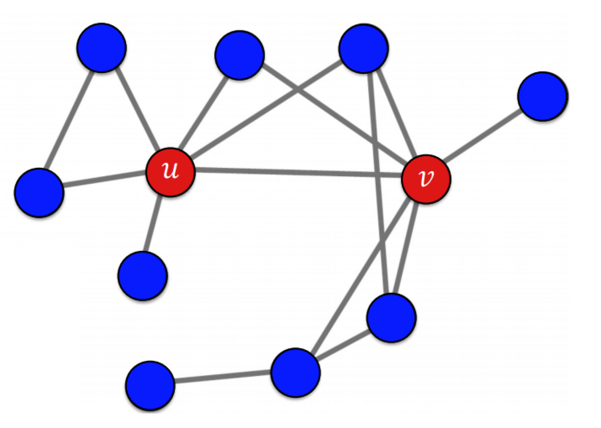
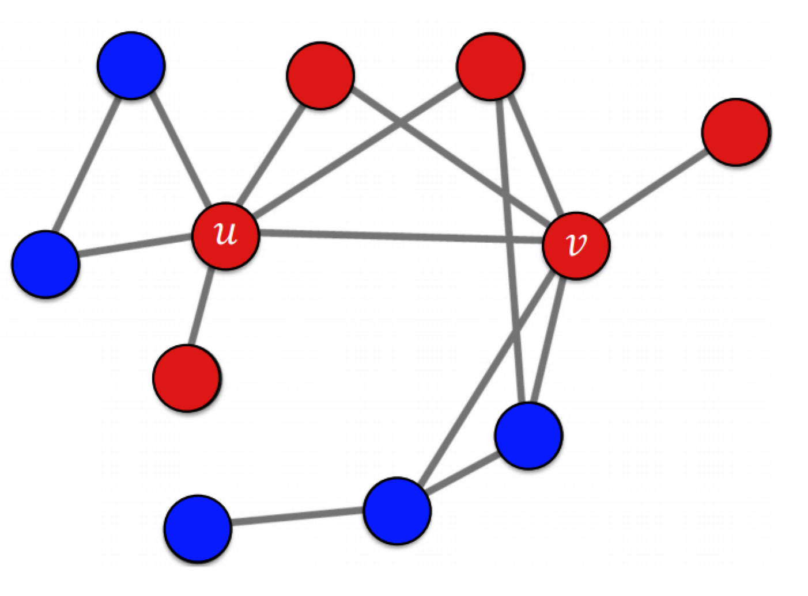

본 정리 내용은 [Naver BoostCamp AI Tech](https://boostcamp.connect.or.kr/)의 edwith에서 학습한 내용을 정리한 것입니다.  
사실과 다른 부분이 있거나, 수정이 필요한 사항은 댓글로 남겨주세요.

---

# 전파 모델

### 그래프를 통한 정보 전파

온라인 소셜네트워크를 통해 전파되는 정보가 대표적인 예시이다.

- 트위터, 페이스북등을 통한 뉴스 전파
- 아이스버킷 챌린지, 펭귄 문제 등

또는 컴퓨터 네트워크의 고장 전파 상황도 예로 들 수 있다.

- 특정 장비의 고장은 다른 장비의 과부하로 이어져, 고장이 전파되는 양상을 띈다.
- 이는 파워그리드에서 정전이 퍼져나가는 현상과 유사하다.

사회에서의 질병 전파도 마찬가지이다.

- 코로나 19, 메르스, 사스
#
## 의사결정 기반의 전파 모형

### 언제 사용하는가?

주변 사람의 의사결정이 본인의 의사결정에 영향을 미친다. 주변사람들의 의사결정을 고려하여 각자 의사결정을 내리는 경우 **`의사결정 기반의 전파 모형`**을 사용한다.

- 친구들이 모두 페이스북 메신저를 사용하면, 카카오톡 대신 페이스북 메신저를 사용하게 될 것이다.

의사결정 기반의 전파 모형 중 가장 간단한 것으로 **선형 임계치 모형(Linear Threshold Model)**을 살펴보자.
#
### 선형 임계치 모형

친구 관계의 두 사람 $u$와 $v$가 있다고 할 때, 두 사람이 호환되지 않는 기술 A와 B 중 하나를 선택하여 사용하는 경우를 생각해보자.

1. 두 사람 모두 A를 사용하면, 행복이 a만큼 증가한다.
2. 두 사람 모두 B를 사용하면, 행복이 b만큼 증가한다.
3. 두 사람이 각각 다른 기술을 사용하면, 행복이 증가하지 않는다(서로 교류할 수 없기 때문에)

이를 확대시켜 사회에서 적용시켜보면, 각자는 본인과 연결된 수많은 vertex가 어떤 기술을 사용하는지 고려하여 결정을 내리게 된다.

만약 $u$의 주위에 A를 사용하는 사람이 5명이고, B를 사용하는 사람이 8명이라고 생각해보자. $u$의 선택에 따라 행복은 5a가 될수도, 8b가 될수도 있다. 각자는 행복을 최대화하는 선택을 한다는 가정하에, 5a와 8b중 더 큰것을 고를 것이다.

이를 일반화하여, $p$ 비율의 이웃이 A를 선택했을 때 $1-p$ 비율의 이웃이 B를 선택했다고 가정하자. 이 때 A를 선택할 확률은 $ap$ > $b(1-p)$이다.

정리하면, $p>\frac{b}{a+b}$일때 A를 선택하며, 이때 편의상 $\frac{b}{a+b}$를 임계치 $q$라고 한다. 이 모형을 **`선형 임계치 모형`**이라고 한다.

- 각 정점은 이웃 중 A를 선택한 비율이 임계치 $q$를 넘을 때에만 A를 선택한다.

그런데, 주위 사람들이 다 B를 쓰더라도, 이와 관계없이 A를 고수하는 얼리어답터 vertex $u$와 $v$가 있다고 생각해보자. 이 두 vertex가 다른 정점들의 선택에 어떤 영향을 미칠까?

임계치가 55%일때, $u$와 $v$의 선택을 고려하면 정점들의 선택은 다음과 같이 바뀐다.

순식간에 주변 노드들의 영향을 받아 A기술을 선택하는 비율이 늘었다. 이 전파를 끝까지 지속해보면,

위와 같이 두개의 정점을 제외하고는 모두 A 기술을 쓰는 것으로 판도가 뒤바뀐다. 이 때 남은 두 노드는 임계치를 넘지 않았기 때문에 바뀌지 않는다.

#

## 확률적 전파 모형

### 언제 사용하는가?

의사결정 기반의 전파 모형은 전파 과정을 간단하게 표현할 수 있지만, '의지'나 '결정'이 들어가지 않은 전파에 대해서는 적합하지 않다. 예를 들어, 코로나 19 바이러스에 걸리는 상황을 가정해보자. A기술과 B기술을 선택하는것과 달리, 코로나 19 바이러스는 아무도 걸리기로 '결정'하지 않을 것이다.

이처럼 코로나 전파는 의사결정이 아닌 확률적 과정이기 때문에, **`확률적 전파 모형`**을 고려해야 한다.

확률적 전파 모형의 가장 간단한 것으로 **독립 전파 모형(Independent Cascade Model)**이 있다.
#
### 독립적 전파 모형

방향성이 있고 가중치가 있는 그래프를 가정할 때, 각 간선 $(u,v)$의 가중치 $p_{uv}$는 $u$가 감염되었을 때 $v$를 감염시킬 확률이다.

- 이 때 $v$는 감염되지 않았다고 가정한다.

서로 다른 이웃이 전염되는 확률은 독립적이므로, 최초 감염자들로부터 전파가 늘어남에 따라 전파확률이 기하급수적으로 늘어나게 된다.

- 이 때 첫 감염자를 seed 집합이라고 한다.

이러한 형태를 가지는 모델을 **`독립적 전파 모형`**이라고 한다. 이 때 감염자의 회복을 가정하는 SIS, SIR등의 다른 전파모형도 있다.
#
## 바이럴 마케팅과 전파 최대화 문제

**`바이럴 마케팅`**은 **소비자들로 하여금 긍정적인 입소문을 내도록 하여 제품을 홍보하는 기법**으로, 홍보의 시작점이 아주 중요하다. **시작점이 어디인지 따라서 입소문의 전파 범위가 영향을 받기 때문**이다. 이 시작점으로 소셜 인플루언서들이 자주 채택되는데, 이는 인플루언서들이 높은 광고비를 받는 이유 중 하나다.
#
### 시드 집합의 중요성

앞서 설명한 모형에서, 시드집합은 전파 크기에 큰 영향을 미쳤다. 그런데 만약 시드 집합이 막다른 정점에 있었다면, 전파가 거의 이루어지지 않게 된다. 따라서 **전파 크기를 최대화시키기 위해서는 이 시드집합을 잘 골라야 한다.**

이처럼 그래프, 전파 모형, 시드 집합의 크기가 주어졌을 때 전파를 최대화하는 시드집합을 찾는 문제를 **`전파 최대화 (Influence Maximization)`** 문제라고 부른다.
#
### 전파 최대화 문제

그래프의 $|V|$개의 정점이 있을 경우, 시드 집합 크기가 $k$개로 제한되더라도 경우의 수는 $_{|V|}C_k$가 된다. 이는 굉장히 큰 수치이고, 이론적으로 많은 전파 모형에 의해 전파 최대화 문제는 NP-hard임이 증명되었으므로 **최고의 시드를 바로 구하기는 어렵다.**

- 정점의 수가 1000개, 시드 집합의 크기가 10개라고 칠 때 경우의 수는 몇 해(垓)를 넘어간다.

대신에, 최고의 시드 집합에 근사하는 **`휴리스틱(heuristics)`**을 사용해 볼 수 있다.

- 휴리스틱이란, **이론적으로는 증명할 수 없지만 실험적으로는 잘 동작하는 간편추론**을 일컫는다. '대충 어림짐작'쯤으로 표현할 수 있다.
#
### 전파 최대화 휴리스틱의 종류

대표적 휴리스틱으로 **`정점의 중심성(Node Centrality)`**를 사용한다. 시드 집합의 크기가 $k$개일 때, 정점의 중심성이 높은 순으로 $k$개의 정점을 선택하는 방법이다.

- 정점의 중심성으로는 [페이지랭크 점수, 연결 중심성, 근접 중심성, 매개 중심성] 등이 있다.
- 합리적인 방법이지만, 최고의 시드 집합을 찾는다는 보장은 없다. 다만 실험적으로는 좋은 결과를 낸다.

또, **`탐욕 알고리즘(Greedy Algorithm)`** 역시 많이 사용된다. 시드 집합의 원소, 즉 최초 전파자를 한번에 한명씩 선택하며, 매 순간 시뮬레이션 하여 더 많은 전파를 일으킬 수 있는 시드를 찾아 다음 타겟으로 지목한다.

- 이 때, 전파의 크기를 비교하기 위해 시뮬레이션을 반복하여 평균 값을 사용한다.
- 이렇게 한 타겟씩 뽑는 것을 뽑은 시드 집합이 목표 크기에 도달할 때까지 반복한다.
- 따라서, 최초 전파자간 조합을 고려하지 않고 근시안적으로 최초 전파자를 선택하는 과정을 반복한다.

이처럼 탐욕 알고리즘은 일견 현명하지 않은 판단처럼 보일지 몰라도, 독립 전파 모형에 의해 정확도가 일부 보장된다.

- 탐욕 알고리즘으로 찾은 시드 집합에 의한 평균 전파 크기가, 최고(이상적) 시드집합에 의한 평균 전파크기의 최소 0.632배 이상은 된다는 것이 증명되어있다. 즉, **최저성능이 보장**되어있다.