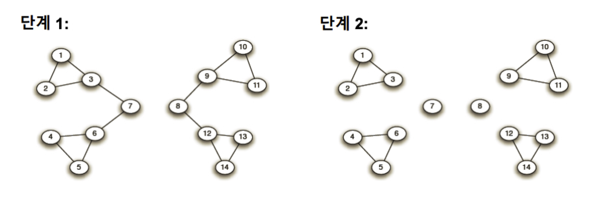

본 정리 내용은 [Naver BoostCamp AI Tech](https://boostcamp.connect.or.kr/)의 edwith에서 학습한 내용을 정리한 것입니다.  
사실과 다른 부분이 있거나, 수정이 필요한 사항은 댓글로 남겨주세요.

---

# 군집탐색

### 실제 그래프에서의 군집 사례

- 온라인 소셜 네트워크
    - 사회적 무리, 부정행위와 연관된 계정들, 분열된 조직체
- 키워드-광고주 그래프
    - 동일 주제 키워드
- 뉴런간 연결 그래프
    - 뇌의 기능적 구성 단위

그래프를 여러 군집으로 '잘'나누는 문제를 **`군집 탐색(Community Detection)`**이라고 한다.

## 군집 구조의 통계적 유의성과 군집성

### 배치모형

군집 탐색이 성공적이었는지에 대한 판단 기준으로 **`배치모형(Configuration Model)`**을 사용한다.

주어진 그래프에 대한 배치 모형은,

1. **각 정점의 연결성(Degree)을 보존한 상태**에서
2. **간선들을 무작위로 재배치**하여

얻은 그래프를 의미한다.

배치 모형에서 임의의 두 점 $i$와 $j$ 사이에 간선이 존재할 확률은 연결성에 비례한다.

### 군집성의 정의

배치모형이 주어지면, 군집탐색의 성공 여부를 판단하기 위해 그래프와 배치모형의 **`군집성(Modularity)`**을 확인한다.

$$
\frac{1}{2|E|}\sum_{s \in S}(\#edges\in s \text{\ in\ Graph}   - \mathbb{E}\#edges\in s \text{\ in\ ConfigModel})
$$

- 배치모형에서 기댓값을 사용하는 이유는, 배치모형의 간선의 수는 무작위이기 때문이다.

이 때, 배치모형과 비교하여 **그래프에서 군집 내부 간선의 수가 월등히 많을수록** 성공한 군집 탐색이다.

- 무작위로 연결된 배치모형과의 비교를 통해 통계적 유의성을 판단한다.
- 정규화하기 때문에 항상 -1~1 사이의 값을 갖는다.
- 군집성이 일반적으로 0.3 ~ 0.7정도의 값을 가질때 그래프에 존재하는 통계적으로 유의미한 군집을 찾아냈다고 할 수 있다.

### 군집 탐색 알고리즘

### Girvan-Newman 알고리즘

대표적인 하향식(Top-down) 군집 탐색 알고리즘으로, 전체그래프에서 군집들이 서로 분리되도록 **서로 다른 군집간의 bridge 간선을 순차적으로 제거**한다.

이러한 다리 간선을 찾아내기 위하여, 간선의 **`매개중심성(Betweenness Centrality)`**을 이용한다.

- 매개중심성이란, 해당 간선이 정점 간의 최단 경로에 놓이는 횟수를 의미한다.

정점 $i$로부터 $j$로의 최단 경로 수를 $\sigma_{i,j}$라고 하고, 그 중 간선 $(x,y)$를 포함한 것을 $\sigma_{i,j}(x,y)$라고 할 때, 간선  $(x,y)$의 매개 중심성은 다음 수식으로 계산된다.

$$
\sum_{i<j}\frac{\sigma_{i,j}(x,y)}{\sigma_{i,j}}
$$

그러므로, Girvan-Newman 알고리즘은 **매개중심성이 높은 간선을 순차적으로 제거하여 군집을 분리**하는 방식이다.

- 간선이 제거될 때마다, 매개 중심성을 다시 계산하여 갱신한다.
- 모든 간선이 제거될때까지 반복한다.

이 때 간선의 제거 정도에 따라 다른 입도(Granularity)의 군집구조가 나타나는데, 군집성이 최대가 되는 지점까지 제거한다. 단, 현재 연결 요소들을 군집으로 가정하되 입력 그래프에서 군집성을 계산한다.

- 군집성의 변화를 기록해두었다가, 최대가 되는 지점으로 복원한다.

## Louvain 알고리즘

대표적인 상향식(Bottom-up) 군집 탐색 알고리즘으로, 개별 정점에서 시작하여 군집을 합쳐가며 점점 큰 군집을 형성한다.

1. 개별 정점으로 구성된 크기 1의 군집들로부터 시작한다.
2. 각 정점 $u$를 기존 혹은 새로운 군집으로 이동한다. 이 때, 군집성이 최대화되도록 군집을 결정한다.
3. 더 이상 군집성이 증가하지 않을 때까지 2를 반복한다.
4. 각 군집을 하나의 정점으로 하는 군집 레벨의 그래프를 얻은 뒤 3을 수행한다.
5. 한개의 정점이 남을 때까지 4를 반복한다.

## 중첩 군집 구조

위의 Girvan-Newman 알고리즘, Louvain 알고리즘 등은 군집간의 중첩이 없다고 가정하고 있는데, 실제 그래프의 군집들은 중첩되어있는 경우가 많다. 이를 해결하기 위해 **`중첩 군집 모형`**을 따로 정의한다.

아래와 같은 중첩 군집 모형을 가정한다.

- 각 정점은 여러 개의 군집에 속할 수 있다.
- 각 군집 $A$에 대하여, 같은 군집에 속하는 두 정점은 $P_A$ 확률로 간선으로 직접 연결된다.
- 두 정점이 여러 군집에 동시에 속할 경우 간선 연결 확률은 독립적이다. 예를 들어, 군집 $A$와 $B$에 두 정점이 동시에 속할경우, 두 정점이 간선으로 연결될 확률은 $1-(1-P_A)(1-P_B)$이다.
- 어느 군집에도 함께 속하지 않는 두 정점은 낮은 확률 $\epsilon$으로 직접 연결된다.

중첩 군집 모형(각 정점들이 어떤 확률로 연결되어있는지)이 주어지면, 해당 그래프의 확률을 계산할 수 있다.

그래프의 확률은 다음 확률들의 곱이다.

1. 그래프의 각 간선이 두 정점이 (모형에 의해) 직접 연결될 확률
2. 그래프에서 직접 연결되지 않은 각 정점 쌍이 (모형에 의해)

그러나 현실에서, 대부분 중첩 그래프는 있지만, 중첩 군집 모형은 주어지지 않는 경우가 많다. **`중첩 군집 탐색`**은 역으로 **주어진 그래프의 확률을 최대화하는 중첩 군집 모형을 찾는 과정**이다.

- 통계 용어로는 **`최우도 추정치(Maximum Likelihood Estimate)`**를 찾는 과정이다.
- 이 때, 각 정점의 특정 군집 소속여부가 이산적(discrete)으로 결정되기 때문이다. 따라서 연속적인 값을 최적화하는데 사용하는 일반적인 경사하강법 등을 사용할 수 없다.

따라서, 중첩 군집 탐색을 용이하게 하기 위해 **`완화된 중첩 군집 모형`**을 사용한다. 이 모형에서는 각 정점이 각 군집에 속해 있는 정도를 0(속하지 않음)과 1(속함)으로 표시하는 것이 아니라, 실숫값으로 표현한다. 중간 상태를 표현할 수 있게 된 것이다.

- 모형의 매개변수(간선 값)들이 실수 값(연속된 값)을 가지므로, 익숙한 최적화 도구(경사하강법 등)을 수행하여 탐색할 수 있다.