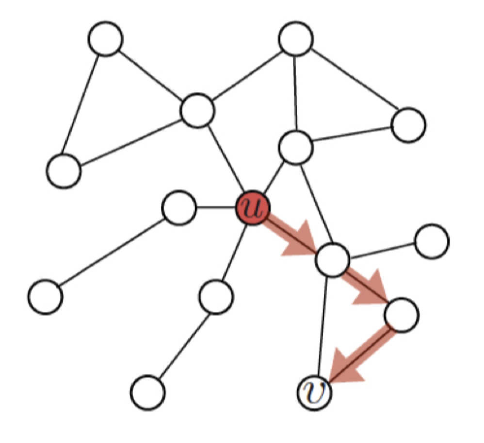

본 정리 내용은 [Naver BoostCamp AI Tech](https://boostcamp.connect.or.kr/)의 edwith에서 학습한 내용을 정리한 것입니다.  
사실과 다른 부분이 있거나, 수정이 필요한 사항은 댓글로 남겨주세요.

---

# 노드 임베딩(정점 임베딩)

## 정점 표현 학습

**`정점 표현 학습(Node Representation Learning)`**은 **그래프의 정점들을 벡터 형태로 표현하는 것**이다. 간단히 **`노드 임베딩(Node Embedding)`**이라고도 부른다.

노드 임베딩은 **벡터 형태의 표현 그 자체**를 의미하기도 한다. 정점이 표현되는 벡터 공간을 `임베딩 공간`이라고 하자.

- 정점 표현 학습의 입력은 그래프이다.
- 정점 표현 학습의 출력은 벡터표현 $z_u$로, 각 정점 $u$에 대한 임베딩을 의미한다.($\mathbb{R}_d 차원$)

### 왜 노드 임베딩을 사용하는가?

노드 임베딩을 하면 그래프의 노드들을 벡터형태로 표현할 수 있게 된다. 즉, 벡터 형태의 데이터들을 위한 도구들을 그래프에도 적용할 수 있다. 그래프를 위한 별도의 알고리즘이 아니라, 기계학습의 방식을 그래프에서 사용할 수 있는 것이다.

- 기계학습 도구들
    - Classifier(로지스틱 회귀분석, MLP 등)
- 최신 ML 기법들을 정점 분류(Node Classificaiton), 군집 분석(Community Detection) 등에 사용할 수 있다.

`K-Means`, `DBSCAN` 같은 **`군집 분석 알고리즘`**들은 **벡터형태로 표현된 사례(instance)**들을 입력으로 받는다.

### 노드임베딩의 목표

노드 임베딩은 그래프에서의 정점간 유사도를 임베딩 공간에서도 보존할 수 있도록 수행되어야한다. 이 때, 유사도로는 내적(Inner Product)를 사용한다.

임베딩 공간에서의 노드 $u$와 노드 $v$의 `유사도`는 **두 노드의 임베딩 출력값의 내적값**과 같다. 내적은 두 벡터가 클 수록, 그리고 같은 방향을 향할 수록 큰 값을 갖는다.

$$
\textrm{similarity}(u,v)\approx z^{\top}_vz_u = \Vert z_u\Vert\cdot\Vert z_v\Vert\cdot\cos(\theta)
$$

## 인접성 기반 유사도

**`인접성 기반 유사도(Adjacency-based similarity)`**에서는 **두 정점이 인접할 때 유사하다고 간주**한다. 두 정점 $u$와 $v$가 인접하다는 것은 둘을 직접 연결하는 간선 $(u,v)$가 있음을 의미한다.

이를 인접행렬(Adjacency Matrix) $A$로 표현하였을 때, 두 정점 $u$와 $v$ 사이의 간선 $(u,v)$는 $A_{u,v}$로 나타낼 수 있으며, 인접하였을 경우 이 값이 1이고 그렇지 않으면 0이다. 따라서, 인접행렬의 원소 $A_{u,v}$를 **두 정점 $u$와 $v$의 유사도**로 나타낼 수 있다.

### 손실 함수

인접성 기반 접근법의 손실 함수(Loss Function)는 다음과 같으며, 손실을 최소화하는 노드 임베딩을 찾기 위해 SGD등이 사용된다.

$$
\mathcal{L} = \sum_{(u,v)\in V\times V}\Vert \textcolor{purple}{z_u^{\top}z_v}-\textcolor{red}{A_{u,v}}\Vert^2
$$

- $\textcolor{purple}{z_u^{\top}z_v}$ : 임베딩 공간에서의 유사도
- $\textcolor{red}{A_{u,v}}$ : 그래프에서의 유사도
- 임베딩 공간의 유사도와 그래프에서의 유사도 차이가 최소가 되도록 한다.

### 한계

그러나 인접성 기반의 접근방법은 거리가 1보다 큰 정점들의 유사도를 0으로밖에 계산하지 못하므로, 정점들간의 유사도를 제대로 비교하기에는 무리가 한계가 있다. 또한, 어느 군집에 속했는가(같은 군집인지 아닌지 여부)도 유사도에 반영되지 않는다.

## 거리/경로/중첩 기반 유사도

### 거리 기반 유사도

`거리 기반 유사도(Distance-based Similarity)`에서는 **두 정점 사이의 거리가 '충분히' 가까운 경우 유사**하다고 간주한다.

- 이 때, '충분히'의 기준은 임의적이다(하이퍼파라미터)

### 경로 기반 유사도

`경로 기반 유사도(Path-based Similarity)`에서는 **두 정점 사이의 경로가 많을수록 유사**하다고 간주한다.

두 정점 $u$와 $v$ 사이의 경로 중 거리가 $k$인 것의 수는 $A_{u,v}^k$, 즉 인접행렬 $A$의 $k$제곱 행렬의 $u$행 $v$열 원소와 같다.

경로 기반 접근법의 손실함수는 다음과 같다.

$$
\mathcal{L} = \sum_{(u,v)\in V\times V}\Vert z_u^{\top}z_v-A_{u,v}^\textcolor{red}k\Vert^2
$$

### 중첩 기반 유사도

`중첩 기반 유사도(Neighborhood-based Similarity)`는 **두 정점이 많은 이웃을 공유할수록 유사**하다고 간주한다. 공유하는 이웃의 수에 비례하여 유사도가 높아진다.

정점 $u$,$v$의 이웃집합을 각각 $N(u)$, $N(v)$이라고 하자. 두 정점의 공통 이웃 수 $S_{u,v}$는 다음과 같이 정의한다.

$$
S_{u,v} = |N(u)\cap N(v)| = \sum_{w\in N(u)\cap N(v)} 1
$$

이 때 손실함수는 다음과 같다.

$$
\mathcal{L} = \sum_{(u,v)\in V\times V}\Vert z_u^{\top}z_v-\textcolor{red}{S_{u,v}}\Vert^2
$$

단순히 공통 이웃 수를 세는 것이 아니라, **자카드 유사도**나 **Adamic Adar 점수**를 사용할 수도 있다.

- `자카드 유사도(Jaccard Similarity)` : 공통 이웃의 수 대신 비율을 계산하는 방식

    $$
    0\le \frac{N(u)\cap N(v)}{N(u)\cup N(v)} \le 1
    $$

- `Adamic Adar 점수` : 공통 이웃 각각에 가중치를 부여하여 가중합을 계산하는 방식. 연결성(Degree)이 높은 노드일수록 가중치가 적다.

    $$
    \sum_{w\in N(u)\cap N(v)}\frac{1}{d_w}
    $$

## 임의보행 기반 유사도

**`임의보행 기반 유사도(Random walk-based similarity)`**는 **한 정점에서 시작하여 랜덤 워크를 할 때 다른 정점에 도달할 확률**을 유사도로 간주한다.

여기서 `랜덤워크`란, 현재 정점의 이웃 중 하나를 균일한 확률로 선택하여 이동하는 과정을 반복하는 것을 의미한다. 

이 경우 시작 정점 주변의 이웃 노드들, 각 노드의 연결성 등에 따라서 확률이 달라진다. 또, 거리기반 유사도처럼 유사도 측정의 최대거리 $k$를 제한하지 않으므로, 그래프의 모든 노드들에 대하여 계산할 수 있게 된다.

따라서, **지역적 정보**와 **그래프 전역 정보**를 모두 고려한다는 장점이 있다.

### 과정

1. 각 정점에서 시작하여 랜덤 워크를 반복 수행한다.
2. 각 정점에서 시작한 랜덤 워크 중 도달한 정점들의 리스트를 구성한다. **정점 $u$에서 시작하여 랜덤 워크 중 도달한 정점들의 리스트를 $N_R(u)$**라고 한다. 한 정점을 여러번 도달한 경우, 해당 정점은 $**N_R(u)$에 여러번 포함될 수 있다**.
3. 다음의 손실함수를 최소화하는 임베딩을 학습한다.

    $$
    \mathcal{L} = \textcolor{green}{\sum_{u\in V}}\textcolor{orange}{\sum_{v\in N_R(u)}} - \log(\textcolor{blue}{P(v|z_u)})
    $$

    - $\textcolor{blue}{P(v|z_u)}$ : $u$에서 시작한 랜덤워크가 $v$에 도달할 확률을 임베딩으로부터 추정한 결과를 의미한다. 이 (확률)값이 크면 클수록 좋다.

        $$
        \textcolor{blue}{P(v|z_u)} = \frac{\exp(z_u^\top z_v)}{\sum_{n\in V}\exp(z_u^\top z_n)}
        $$

        - 즉, 유사도 $\exp(z_u^\top z_v)$가 높을 수록 도달 확률이 높다.
    - $\textcolor{orange}{\sum_{v\in N_R(u)}}$ : 랜덤 워크 중 실제로 마주친(도달한) 모든 정점에 대하여 합산
    - $\textcolor{green}{\sum_{u\in V}}$ : 모든 시작점마다 수행하여 합산

    ### DeepWalk와 Node2Vec

    랜덤워크의 방식에 따라 **`DeepWalk`**와 **`Node2Vec`**으로 나눌 수 있다.

`DeepWalk`는 위에서 설명했던 것과 같이 균일한 확률의 랜덤워크를 수행한다.

`Node2Vec`은  **`2차 치우친 임의보행(Second-order Biased Random Walk)`**를 사용한다.

**현재 정점($v$)**과 **직전에 머물렀던 정점($u$)**을 모두 고려하여 다음 정점을 선택하며, **직전 정점의 거리를 기준으로 경우(이전의 정점과 거리가 가까워지는/유지되는/멀어지는 경우)를 구분하여 차등적인 확률을 부여**한다. 

이 차등적인 확률은 하이퍼파라미터이며, 어떻게 부여했는지에 따라 다른 임베딩을 얻는다. 아래의 그림은 Node2Vec 방식으로 K-means 군집 분석을 수행한 결과이다.

- 멀어지는 방향에 높은 확률을 부여하면, 정점의 '역할'(bridge 역할, 변두리 정점 등)이 같은 경우 임베딩이 유사해진다.
- 가까워지는 방향에 높은 확률을 부여하면, 같은 군집에 속한 정점들끼리 임베딩이 유사하게 나온다.

### 손실 함수 근사

랜덤 워크 기반의 손실함수는 정점의 수의 제곱에 비례하는 시간이 소요된다. 모든 시작점 각각에 대하여, 모든 도달점의 경우를 고려하기 때문이다.

이런 제곱합을 피하기 위해서 대부분 근사식을 사용하는데, 모든 정점에 대해 정규화하는 대신 **몇개의 정점을 뽑아 비교하는 형태**이다. 이 때 뽑힌 정점들을 Negative sample이라고 부른다.

$$
\begin{aligned}
\log\bigg(\frac{\exp(z_u^\top z_v)}{\sum_{n\in V}\exp(z_u^\top z_n)}\bigg)&\approx log(\sigma(z_u^\top z_n)) - \sum_{i=1}^k\log(\sigma(z_u^\top z_n)),n_i\\ &\sim P_V(확률분포)
\end{aligned}
$$

- $\sigma$ : sigmoid 함수
- Negative sample의 숫자가 더 많을수록 학습이 안정적이다.

## 변환식 노드 임베딩과 귀납식 노드 임베딩

지금까지 언급한 노드 임베딩 방식들은 **`변환식(Transductive) 방법`**으로, 학습의 결과로 정점의 임베딩 값 자체를 출력값으로 얻는다.

그런데, 이런 변환식 방법에는 여러 한계가 있다.

- 학습이 진행된 이후에 추가된 정점에 대해서는 임베딩을 얻을 수 없다. 다시 학습을 수행해야한다.
- 모든 정점에 대한 임베딩을 미리 계산하여 저장해두고 꺼내 써야한다.
- 정점이 속성(Attribute) 정보를 가진 경우 이를 활용할 수 없다.

따라서 이런 한계점을 극복한 노드 임베딩 방식으로, 정점을 임베딩으로 변화시키는 '함수', 즉 **인코더**를 얻는 **`귀납식(Inductive) 방법`**이 나오게 되었다. 귀납식 노드 임베딩 방식의 대표적인 방식이 **`그래프 신경망(Graph Neural Network)`**이다.