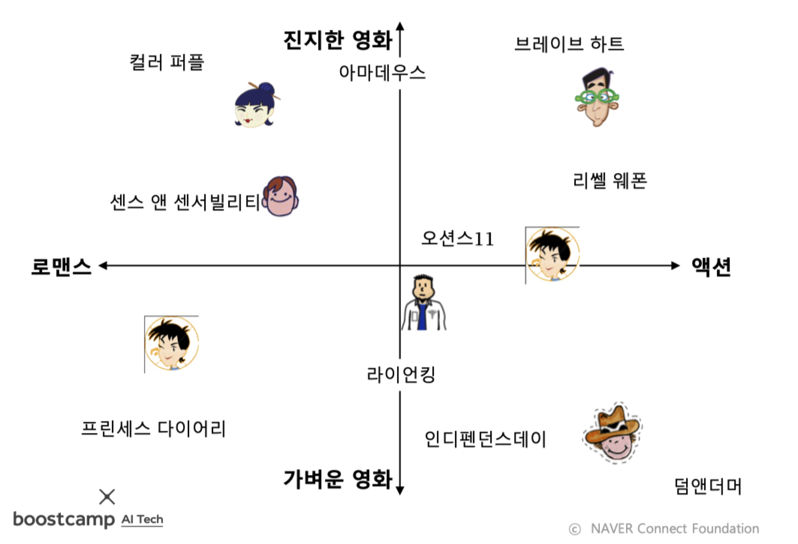
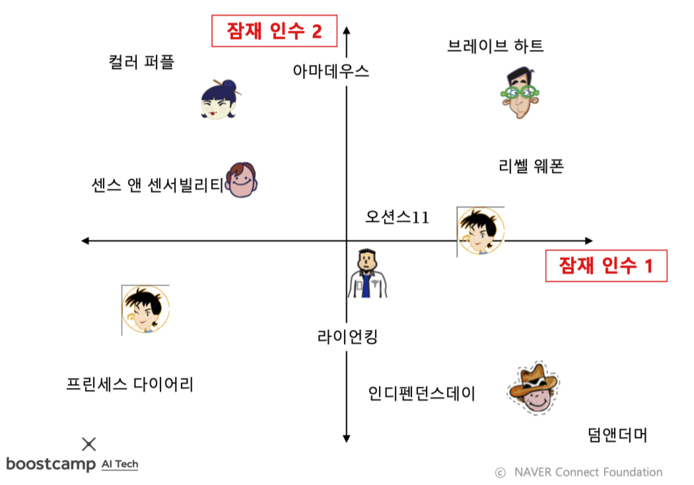
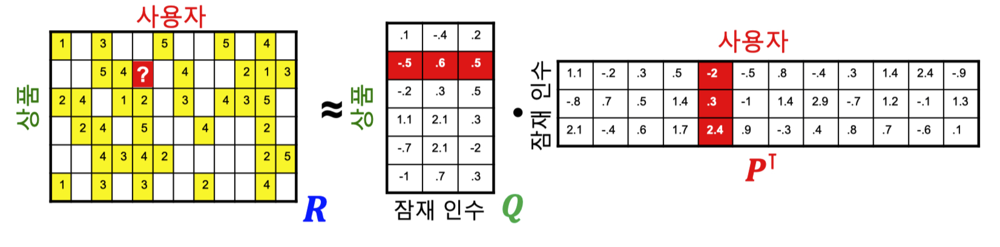

본 정리 내용은 [Naver BoostCamp AI Tech](https://boostcamp.connect.or.kr/)의 edwith에서 학습한 내용을 정리한 것입니다.  
사실과 다른 부분이 있거나, 수정이 필요한 사항은 댓글로 남겨주세요.

---

# 추천시스템 기초

아마존 고객 맞춤 상품 / 넷플릭스 영화 추천 / 유튜브 영상 추천 / 페이스북 친구 추천 등

**`추천 시스템`**은 사용자 각각이 구매/선호할만한 상품을 추천하는 기법이다.

사용자별 구매기록은 그래프로 표현 가능한데, 두가지로 나눌 수 있다.

- 암시적(Implicit) 선호 - ex)구매 기록
- 명시적(Explicit) 선호 - ex)평점

추천 시스템의 핵심은 사용자별 구매를 예측하거나, 선호를 추정하는 것인데, 그래프 관점에서 이를 풀었을 때 **"미래의 간선을 예측하는 문제"**혹은 **"누락된 간선의 가중치(선호)를 추정하는 문제"**로 해석할 수 있다.

## 내용 기반 추천시스템

**`내용 기반 추천시스템`**은 각 사용자가 구매/만족했던 상품과 유사한 것을 추천하는 방식이다.

- 동일한 장르의 영화
- 동일한 감독의 영화 혹은 동일 배우가 출연한 영화
- 동일한 카테고리의 상품
- 동갑의 같은 학교를 졸업한 사람

### 원리

1. 사용자가 선호했던 상품들의 `상품 프로필(Item Profile)`을 수집한다.
    - 상품 프로필이란, 해당 상품의 특성을 나열한 벡터이다.
    - 영화의 경우 감독/장르/배우 등의 **원-핫 인코딩**이 상품 프로필로 사용될 수 있다.
2. 사용자가 선호한 상품 프로필의 선호도를 가중평균하여 `사용자 프로필`을 구성한다.
    - 즉, 사용자 프로필 역시 벡터이다.
3. 사용자 프로필 벡터 $\overrightharpoon{u}$와 (추천할만한 다른) 상품 프로필 벡터 $\overrightharpoon{v}$의 코사인 유사도 $\frac{\overrightharpoon{u}\cdot\overrightharpoon{v}}{\Vert\overrightharpoon{u}\Vert\Vert\overrightharpoon{v}\Vert}$를 계산하여 매칭한다.
    - 즉, 두 벡터의 사이각의 코사인 값을 계산한다.(두 벡터의 내적값 / 두 벡터의 크기의 곱)
        - 두 벡터가 비슷한 방향을 바라보고 있거나, 크기가 비슷할수록 코사인 유사도가 높게 나온다.
    - 코사인 유사도가 높을수록, 해당 사용자가 선호/구매했던 물품들과 비슷한 상품이다.
4. 계산된 코사인 유사도가 가장 높은 상품을 사용자에게 추천한다.

### 장/단점

| 장점                                 | 단점                                                  |
| ------------------------------------ | ----------------------------------------------------- |
| 다른 사용자의 구매기록이 필요없음    | 부가정보가 없는 경우 사용 불가                        |
| 독특한 취향의 사용자에게도 추천 가능 | 구매기록이 없는 사용자에게는 사용 불가                |
| 새 상품에 대한 추천 가능             | Overfitting으로 지나치게 협소한 추천을 할 위험이 있음 |
| 추천의 이유를 제공할 수 있음         |                                                       |

## 협업 필터링 추천 시스템

내용 기반 추천시스템을 일부 보완하는 추천방식이다.

### 원리

**`사용자-사용자 협업 필터링`**이란, 예상 사용자에게 유사한 취향을 가진 다른 사용자들이 사용했던 상품을 추천하는 것이다.

 추천의 대상 사용자를 $x$라고 할 때,

1. $x$와 유사한 취향의 사용자들을 찾는다.
2. 유사한 취향의 사용자들이 선호한 상품을 찾는다.
3. 이 상품들을 $x$에게 추천한다.

이 때 **취향의 유사도**는 **`상관계수(Correlation Coefficient)`**를 통해 측정한다.

$$
sim(x,y) = \frac{\sum_{s\in S_{xy}}(r_{xs}-\overline{r_x})(r_{ys}-\overline{r_y})}{\sqrt{\sum_{s\in S_{xy}}(r_{xs}-\overline{r_x})^2}\sqrt{\sum_{s\in S_{xy}}(r_{ys}-\overline{r_y})^2}}
$$

- $r_{xs}$ : 사용자 $x$가 상품 $s$에 대해 매긴 평점
- $\overline{r_x}$ : 사용자 $x$가 매긴 평균 평점
- $S_{xy}$ : 사용자 $x$와 $y$가 공동 구매한 상품들
- 분모는 유사도 값을 -1과 1사이로 정규화하는 목적으로 사용한다.

구체적으로는 **취향의 유사도를 가중치로 사용한 평점의 가중 평균**을 통해 평점을 추정한다.

사용자 $x$의 상품 $s$에 대한 평점을 $r_{xs}$로 추정할 때, 상관 계수를 이용하여 상품 $s$를 구매한 사용자 중 $x$와 취향이 유사한 $k$명의 사용자 $N(x;s)$를 뽑는다.

$$
\hat{r}_{xs} = \frac{\sum_{y\in N(x;s)}sim(x,y)\cdot r_{ys}}{\sum_{y\in N(x;s)}sim(x,y)}
$$

- 취향이 유사한 $k$명이라도, 유사한 정도의 차이가 있기 때문에 가중치 $sim(x,y)$를 곱해준다.
- $r_{ys}$ : 유사한 취향의 사람 $y$가 매긴 평점

이 방식을 통해, $x$가 아직 구매하지 않은 상품들에 대해 평점을 각각 추정하고, 추정한 평점이 가장 높은 상품들을 $x$에게 추천한다.

### 장/단점

| 장점                                                | 단점                                                         |
| --------------------------------------------------- | ------------------------------------------------------------ |
| 상품에 대한 부가 정보(속성 정보)가 없어도 사용 가능 | 충분한 수의 평점 데이터가 누적되어야함                       |
|                                                     | 새 상품, 새 사용자에 대한 추천 불가                          |
|                                                     | 독특한 취향의 사용자에게 추천 불가(취향이 유사한 사람을 찾아내기 어려움) |

#

## 추천 시스템 평가

### 데이터 분리

추천시스템의 정확도를 평가하기위해서, **`데이터 분리`** 기법을 사용한다.

데이터를 훈련(Training) 데이터와 평가(Test) 데이터로 분리하고, 훈련 데이터를 이용하여 가려진 평가 데이터의 평점을 추정한다. 이후, 평가 데이터의 추정 평점과 실제 평점을 비교하여 오차를 측정하고 학습한다.

- 이 때 오차 측정 지표로는 **`MSE`**가 많이 사용된다.
- 평가 데이터 내의 평점들의 집합을 T라고 할 때, MSE는 다음과 같이 구할 수 있다.

$$
\frac{1}{|T|}\sum_{r_{xi}\in T}(r_{xi}-\hat{r}_{xi})^2
$$

- MSE에 제곱근을 씌운 **`RMSE`**도 많이 사용된다.

#

### 평가지표

이외에도 다양한 평가지표가 활용된다.

- 추정한 평점으로 순위를 매긴 후, 실제 평점으로 매긴 순위와 상관계수 계산
- 추천한 상품 중 실제 구매로 이루어진 것의 비율 측정
- 추천의 순서 혹은 다양성까지 고려하는 지표들도 사용

# 추천 시스템 심화

이전까지는 노드 임베딩을 적용시키지 않았을 때의 시스템이었다.  
노드임베딩 기법으로 기존의 그래프들을 벡터로 표시하여 좌표공간내로 옮길 수 있게 되자, ML의 도구들을 사용한 추천시스템의 비약적인 발전이 있었다.  

이러한 추천시스템 발전의 기념비적 이벤트라고 볼 수 있는 *넷플릭스 챌린지*의 예를 들어 발전 과정을 확인해보자.

## 넷플릭스 챌린지

2000년부터 2005년까지 수집한 사용자별 영화 평점 데이터를 사용하였다.

트레이닝 데이터는 48만명 사용자의 1만 8천개 영화에 대한 1억개의 평점으로, 테스트 데이터는 각 사용자의 최신 평점 280만개로 구성되어있다.

목표는 당시 넷플릭스의 추천 시스템의 성능을 10% 이상 향상시키는 것이었다(평균 제곱근 오차 0.9514→0.8563)

2006년부터 2009년까지 진행되었고, 2700개의 팀이 참여하였으며, 추천시스템의 성능이 비약적으로 발전하는 계기가 되었다.

## 잠재 인수 모형

잠재 인수 모형(Latent Factor Model)은 넷플릭스 챌린지에서 제안되어 큰 성능 개선을 이루어낸 모델로, 지금까지도 자주 사용되는 모형이다. UV 분해(UV Decompostion)이라고도 한다.

- 수학적 개념 SVD와 유사하여 SVD로도 부르곤 하지만, 정확히는 약간 차이가 있다.

Latent Factor Model의 핵심은 **사용자와 상품을 벡터로 표현하는 것**이다.

위는 사용자와 영화를 임베딩한 예시이다. 2차원 공간에 영화를 장르와 성격에 따라 배치하고, 사용자의 취향도 분석하여 같은 평면 위에 배치했다. 사용자는 이 평면 내에서 본인의 위치와 가까운 위치에 있는 영화를 추천받게 된다.

그러나, 이 방식은 영화의 [진지하고 가벼운 정도]나, [얼마나 로맨스 장르에 가깝고 얼마나 액션 장르에 가까운지]등의 모호한 개념들을 기준으로 좌표가 설정되어야한다는 어려움이 있었다. 따라서, 잠재 인수 모형은 측정하기 어려운 고정된 인수 대신 효과적인 인수를 학습하는 것을 목표로 한다. 즉, 추천을 가장 정확하게 할 수 있는 인수를 찾아 학습하는 것이다.

- 이 때 학습한 인수, 즉 임베딩 공간의 축들을 **`잠재 인수(Latent Factor)`**라고 부른다.

### 손실함수

그렇다면, 사용자와 상품을 어떻게 임베딩해야 추천시스템에 적용하기 좋도록 임베딩할 수 있는가?

**사용자-상품 임베딩의 내적(Inner Product)이 평점과 최대한 유사**하도록 하는 것이다.

이를 행렬 차원에서 이미지로 살펴보자.

- 사용자들의 임베딩(벡터)을 쌓아서 만든 사용자 행렬을 $P$라고 한다. 위의 이미지에서 $P^\top$의 각 열(세로벡터)은 사용자 한명의 임베딩을 의미한다.
- 영화들의 임베딩(벡터)을 쌓아서 만든 상품 행렬을 $Q$라고 한다. 위의 이미지에서 Q의 각 행(가로벡터)은 상품 하나의 임베딩을 의미한다.
- 사용자 수의 열과 상품 수의 행을 가진 평점 행렬을 $R$
이라고 하고, 이는 $Q \cdot P^\top$와 같다.

사용자 $x$의 임베딩을 $p_x$, 상품 $i$의 임베딩을 $q_i$라고 하고, 사용자 $x$의 상품 $i$에 대한 평점을 $r_{xi}$라고 하자. 임베딩의 목표는 $p_x^\top q_i$이 $r_{xi}$와 유사하도록 하는 것이다.

$$
\mathcal{L} = \sum_{(i,x)\in R}(r_{xi}-p_x^\top q_i)^2
$$

- 훈련 데이터($R$)에 있는 평점에 대해서만 계산한다.

그러나 위 손실함수를 사용할 경우에는 일반적인 기계학습과 마찬가지로 Overfitting이 발생할 수 있다.  훈련데이터에만 fitting된 모델이 나올 수 있는 것이다.

이를 피하기 위하여 정규화 항을 손실 함수에 더해준다.

$$
\mathcal{L} = \underbrace{ \sum_{(i,x)\in R}(r_{xi}-p_x^\top q_i)^2}_{오차} + \textcolor{red}{\underbrace{\textcolor{green}{\lambda_1}\sum_x\Vert p_x \Vert^2 + \textcolor{green}{\lambda_2}\sum_i\Vert q_i \Vert ^2}_{모형복잡도(정규화항)}}
$$

- 정규화는 손실함수를 학습할 때, 훈련데이터와의 오차만 줄이는 것이 아니라, 임베딩 값 자체도 줄이게 만든다. 임베딩 값이 너무 크면, 모델이 훈련데이터의 noise까지 완전히 학습하기 때문이다. 이렇게 모형복잡도도 최소화하여 일반화 성능을 높인다.
    - 이는 위의 임베딩 좌표 상에서 볼 때, 각 좌표들의 크기를 줄여서 벡터들이 좀 더 모여있게 하는 결과를 가져온다. 즉, 기존에는 나와 아주 가까운 영화가 아니면 추천받지 못했지만, 정규화를 하고 나면 거리가 고만고만해지기 때문에 나와 비교적 조금 가까운 영화도 추천받을 수 있는 것이다.
    - 잘 이해가 되지 않는다면, 배틀그라운드에서 에란겔과 사녹을 생각하자. 에란겔은 맵이 넓기 때문에 나와 아주 가까운 상대가 아니면 마주칠 일이 적다. 그러나, 사녹은 모두가 가까이 모여있기 때문에 조금만 가까이 있어도 마주치게 될 가능성이 높아지게 된다.
- $\textcolor{green}{\lambda_1, \lambda_2}$ : 정규화의 세기를 의미하며, 하이퍼파라미터이다. 오차와 모형복잡도 중 어느것을 더 중점적으로 최소화할지 정해주는 역할을 한다.

### 최적화

손실함수를 최소화(Optimize)하는 $P$와 $Q$를 찾기 위해서 (확률적) 경사하강법을 사용한다.

- 경사하강법은 손실함수를 안정적이지만 느리게 감소시킨다.
- 확률적 경사하강법은 손실함수를 불안정하지만 빠르게 감소시킨다.
- 실제로는 확률적 경사하강법이 더 많이 사용된다.

## 고급 잠재 인수 모형

잠재 인수모형은 추천시스템의 성능을 크게 개선했지만, 넷플릭스 챌린지의 목표인 RMSE 0.8563에는 도달하지 못했다. 따라서 이를 추가적으로 더 개선시키기 위해 몇가지 테크닉을 더한 잠재 인수 모형이 나오게 되었다.

#

### 사용자와 상품의 편향을 고려한 잠재 인수 모형

누군가 영화의 평점을 매길 때, 어떤 사람은 높은 점수를 잘 주는 경향이 있는가 하면, 어떤 사람은 눈이 까다로워 대부분의 점수를 낮게 주는 경우가 있다. 이런 사람간의 편차를 각 사용자의 **`편향`**이라고 한다.

넷플릭스 챌린지에서, 각 사용자의 편향은 **해당 사용자의 평점 평균과 전체 평점 평균의 차이**다. 해당 사용자의 평점 평균이 전체 평점 평균대비 높으면, 그 사용자는 후하게 점수를 주는 감이 있고, 오히려 낮으면, 그 사용자는 점수를 박하게 주는 편임을 알 수 있다. 이는 넷플릭스에서가 아닌 다른 상품의 추천시스템에서도 동일하게 적용된다.

따라서 개선된 잠재인수 모델에서는 평점을 **`전체 평균`**, **`사용자 편향`**, **`상품 편향`**, **`상호작용`**으로 분리한다.

$$
\underset{평점}{r_{xi}} = \textcolor{red}{\underset{전체평균}{\mu}} + \textcolor{blue}{\underset{사용자편향}{b_x}} + \textcolor{green}{\underset{상품편향}{b_i}} + \textcolor{purple}{\underset{상호작용}{p_x^\top q_i}}
$$

- 기존에는 상호작용 항만을 가지고 평점을 예측하려고 했다면, 편향을 고려한 잠재인수 모형에서는 사용자와 상품의 편향, 전체 평균을 모두 고려한다.

이 모형의 손실함수는 다음과 같다.

$$
\begin{aligned}
\mathcal{L} = &\sum_{(i,x)\in R}(r_{xi}- (\mu + b_x + b_i + p_x^\top q_i))^2 \\
&+ [\lambda_1\sum_i\Vert p_x \Vert ^2 + \lambda_2\sum_i\Vert q_i \Vert ^2 + \lambda_3\sum_xb_x^2 + \lambda_4\sum_ib_i^2]
\end{aligned}
$$

이 모형을 적용시켜 RMSE가 0.89까지 개선되었다. 그러나 여전히 목표치에는 도달하기 어려웠다.

### 시간적 편향을 고려한 잠재인수 모형

넷플릭스의 사용자별 영화 평점 데이터가 수집되었던 2000년부터 2005년 구간 사이에,  시스템의 변화를 계기로 평점 평균이 크게 상승하는 일이 있었다. 또한, 영화의 평점은 출시일 이후 시간이 지남에 따라 상승하는 경향을 띤다. 상영이 끝난 작품은 입소문을 타서/좋아하는 감독의 작품이라서 등등 긍정적인 기대로 가지고 시청하는 재유입인원이 많기 때문이다.

이런 문제를 해소하기 위해 잠재인수 모형에 시간적 편향까지 고려하게 되었다.

$$
\underset{평점}{r_{xi}} = \underset{전체평균}{\mu} + \underset{사용자편향}{b_x\textcolor{red}{(t)}} + \underset{상품편향}{b_i\textcolor{red}{(t)}} + \underset{상호작용}{p_x^\top q_i}
$$

이 결과로 RMSE 0.876까지 도달하게 되었다.

이러한 획기적인 개선 이후에 넷플릭스 챌린지에서는 Ensemble 기법을 추가적으로 도입한 몇몇팀이 최종적으로 목표치에 도달하게 되었다.