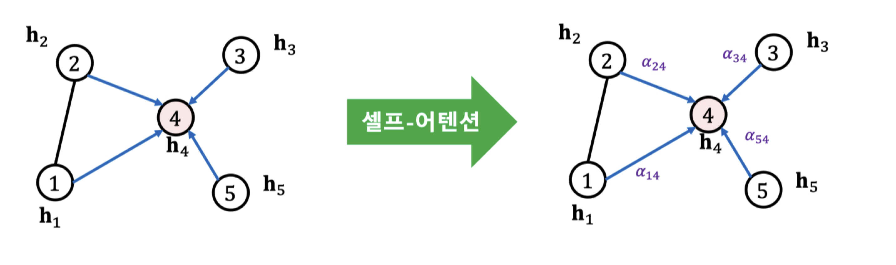

본 정리 내용은 [Naver BoostCamp AI Tech](https://boostcamp.connect.or.kr/)의 edwith에서 학습한 내용을 정리한 것입니다.  
사실과 다른 부분이 있거나, 수정이 필요한 사항은 댓글로 남겨주세요.

---

# 그래프 신경망

**`그래프 신경망(Graph Neural Network)`**은 출력으로 인코더를 얻는 `귀납식 노드 임베딩` 방법의 대표적인 사례이다.

## GNN의 구조

그래프(의 인접행렬)와 정점의 속성 정보를 입력으로 받는다.

- 인접행렬 $A$는 $(|V|\times|V|)$의 이진행렬이다.
- 각 정점 $u$의 속성(Attribute) 벡터 $X_u$는 $m$차원 벡터이고, 이 때 $m$은 속성의 수를 의미한다.
    - 속성 예시
        - 온라인 소셜 네트워크에서의 사용자 지역, 성별, 연령, 프로필 사진 등
        - 논문 인용 그래프에서 논문에 사용된 키워드에 대한 원-핫 벡터
        - PageRank 등의 정점 중심성, 군집 계수(Clustering Coefficient)

그래프 신경망은 이웃 정점들의 정보를 집계하는 것을 반복하여 임베딩을 얻는다.

- 위의 이미지에서, 정점 A의 임베딩을 얻기 위해 A.neighborhood의 정보를 다시 집계한다.
- A.neighborhood.neighborhood에서, A가 다시 등장하는 것을 확인할 수 있다.
- 이처럼, 각 집계 단계를 **`층(Layer)`** 이라 부르고, 각 층마다 임베딩을 얻는다. 각 층에서는 이웃들의 이전 층 임베딩을 집계하여 새로운 임베딩을 얻는다.
    - 0번 층, 즉 입력층의 임베딩으로는 정점의 속성 벡터를 사용한다.

이 때, 그래프에서 각 정점마다 이웃들이 다르므로 대상 정점마다 집계되는 정보가 상이하다. 이처럼 대상 정점별로 집계되는 구조를 계산 그래프(Computation Graph)라고 한다.

각 정점별 집계 정보가 다를지라도, 층 별 집계 함수는 공유된다. 정점 A나 정점 B나 0→1층에 사용되는 집계함수, 1→2층에 사용되는 집계함수는 동일하다.

- 서로 다른 층의 집계함수는 각기 다른 함수이다.
- 각 정점마다 연결성이 다르므로, 같은 집계함수를 사용하지만 입력의 수가 다를 수 있다. 즉, 집계함수는 **서로 다른 구조의 계산 그래프를 처리할 수 있어야 한다**.

### 집계 함수

집계 함수의 구조는 다음과 같다.

1. 이웃들 정보의 평균을 계산한다.
    - n개의 입력을 평균을 냄으로써 동일한 하나의 차원으로 축소할 수 있다.
2. 신경망에 적용한다.

이를 수식으로 나타내면 다음과 같다.

$$
\begin{aligned}
h_v^0 &= x_v\\
h_v^k &= \sigma\Bigg(\textcolor{green}{W_k\sum_{u\in N(v)}\frac{h_u^{k-1}}{|N(v)|}}+\textcolor{blue}{B_kh_v^{k-1}}\Bigg), \forall k \in \{1,\dots,K\}\\
z_v &= h_v^K
\end{aligned}
$$

- $h_v$는 정점 $v$의 임베딩을 의미한다.
- 0번층(입력층)의 임베딩은 정점 $v$의 속성 벡터로 초기화한다.
- $k$번층(현재층)의 임베딩은 1부터 층의 수($K$)까지의  모든 $k$에 대하여 다음을 수행한다.
    - $\textcolor{green}{W_k\sum_{u\in N(v)}\frac{h_u^{k-1}}{|N(v)|}}$ : 이전 층에서 계산한 이웃들의 임베딩 평균을 선형변환한다.
    - $\textcolor{blue}{B_kh_v^{k-1}}$ : 이전 층에서의 정점 $v$의 임베딩을 선형변환한다.
    - 두 선형변환한 값의 합을 비선형변환($\sigma$)한다.
- 마지막 층에서의 임베딩은 곧 출력 임베딩($z_v$)이다.
- $W_k, B_k$는 GNN이 학습하는 파라미터이다.

### GNN의 학습

**1 - 먼저 손실함수를 정한다. 정점간 거리를 "보존"하는 것이 목표가 될 수 있다.**

- 변환식 노드 임베딩처럼 인접성/거리 등을 기반으로 유사도를 정의하여 손실함수를 정의할 수 있다.

또는, **<U>`후속 과제(Downstream Task)`의 손실함수를 이용한 `End-to-End 학습`도 가능</U>**하다.

예를 들어, Node Classification이 최종 목표일 경우, 아래와 같은 과정으로 학습할 수 있다.

1. GNN을 이용하여 노드 임베딩을 수행하고, 임베딩 값을 얻는다.
2. 분류기의 입력으로 임베딩 값을 사용한다.
3. 각 노드의 유형을 분류한다.

이 때 Downstream Task인 Classifier의 손실함수, Cross Entropy를 전체 프로세스의 손실함수로 사용할 수 있다. 아래의 식은 이진분류를 위한  Cross Entropy 식이다.

$$
\mathcal{L} = \sum_{v\in V}\textcolor{green}{y_v}(\log(\sigma(z_v^\top\textcolor{red}{\theta})) + (1-\textcolor{green}{y_v})\log(1-\sigma(z_v^\top\textcolor{red}{\theta}))
$$

- $\textcolor{green}{y_v}$ : 정점의 실제 유형으로, 0 또는 1의 값을 갖는다.
- $\textcolor{red}{\theta}$ : Classifier의 학습 변수이다.

이처럼 Classifier의 손실함수를 토대로 Classfier뿐만 아니라 GNN 과정(Node Representation Learning)까지 역전파하여 한번에 학습할 수 있다.

End-to-End 학습을 통한 분류는 [Reductive Node Embedding(변환적 노드 임베딩) - Classifier 학습]보다 대체로 정확도가 더 높다.

**2 - 학습에 사용할 대상 노드를 결정하여 학습 데이터를 구성한다.**

- 선택한 일부 대상 노드들에 대해서만 계산 그래프를 구성한다. 이렇게 해도 되는 이유는, 집계함수가 공유되기 때문이다. 일부 노드에 대해서만 training하고, 다른 노드에 대해서 적용시킬 수 있다.

**3 - 오차역전파를 통하여 손실함수를 최소화한다.**

- 이 과정을 통해 신경망의 파라미터들을 학습한다.

**4 - 학습된 신경망을 다른 노드들에 적용하여, 학습에 사용되지 않은 노드의 임베딩을 얻을 수 있다. 또는, 아예 다른 그래프에 적용하여 임베딩을 얻어볼수도 있다.**

- 학습 이후에 추가된 노드의 임베딩 또한 얻을 수 있다.

## 그래프 신경망 변형

지금까지 보았던 GNN은 가장 기초적인 형태였고, 최근에는 이를 변형한 다양한 방법들이 대세를 이루고 있다. 가장 자주 사용되는 두 형태, 그래프 합성곱 신경망과  GraphSAGE를 알아보자.

#

### 그래프 합성곱 신경망

**`그래프 합성곱 신경망(Graph Convolution Network, GCN)`**의 집계함수는 다음과 같다.

$$
\begin{aligned}
h_v^0 &= x_v \\
h_v^k &= \sigma\Bigg(W_k\textcolor{red}{\sum_{u \in N(v)\cup v}\frac{h_u^{k-1}}{\sqrt{|N(u)||N(v)|}}}\Bigg), \forall k \in \{1,\dots,K\}\\
z_v &= h_v^K
\end{aligned}
$$

일견 기존 GNN과 큰 변화가 없어 보이지만, 다음과 같은 차이점들이 있다.

- $B_k$ 파라미터가 있던 이전 층에서의 정점 $v$의 임베딩 값을 삭제하고, 동일 신경망을 사용하며  $W_k$ 파라미터 하나만 학습을 수행한다.
- 정규화 방법($\sum$의 분모)이 기존에는 $v$의 연결성이었다면, 지금은 $v$와 $u$의 기하평균을 사용하고 있다.

#

### GraphSAGE

GraphSAGE의 집계함수는 다음과 같다.

$$
h_v^k = \sigma([W_k\cdot \text{AGG}(\textcolor{blue}{\{h_u^{k-1},\forall u \in N(v)\}}), \textcolor{green}{B_kh_v^{k-1}}])
$$

- 이웃들($N(v)$)의 모든 임베딩을 **AGG 함수**로 합친 다음,  자신의 임베딩($\textcolor{green}{B_kh_v^{k-1}}$)과 연결(Concatenation)한다.

이 때 AGG 함수는 여러가지가 사용될 수 있다.

| AGG 함수   | 수식                                                        | 비고                            |
| ---------- | ----------------------------------------------------------- | ------------------------------- |
| Mean(평균) | $$\text{AGG} = \sum_{u\in N(v)}\frac{h_u^{k-1}}{\|N(v)\|}$$ |                                 |
| Pool(풀링) | $$AGG = \\gamma(\{Qh_u^{k-1}, \forall u \in N(v)\})$$       | $\gamma$는 원소별 최댓값을 의미 |
| LSTM       | $$AGG = LSTM([h_u^{k-1},\forall u \in \pi(N(v))])$$         | $\pi$는 순서를 섞는다는 의미    |

#

## 합성곱 신경망과의 비교

그렇다면 GNN와 CNN은 어떤 유사점과 차이점이 있을까?

#

### 유사성

둘 모두 이웃의 정보를 집계하는 과정을 반복한다. 구체적으로, CNN은 이웃 픽셀의 정보를 집계한다.

#

### 차이점

CNN에서는 이웃(픽셀)의 수가 균일하지만, GNN에서는 노드별로 집계하는 이웃의 수가 다르다.

<Warning>

그래프의 인접 행렬에 CNN을 적용하면 효과적일까? 답은 '그렇지 않다'이다. \n CNN이 주로 사용되는 이미지는 인접 픽셀이 유용한 정보를 담고 있을 가능성이 높다. 그러나, 그래프의 인접행렬에서의 인접 원소는 제한된 정보만을 가진다. 특히, 인접 행렬의 행과 열 순서는 임의로 결정되는 경우가 많으므로, 인접 원소의 정보 유용성이 떨어진다. \n 따라서, 반드시 CNN이 아니라 GNN을 적용하여야 한다.

</Warning>

## 한계

GNN에서는 이웃들의 정보를 동일한 가중치로 평균을 낸다. GCN 또한 역시 단순히 연결성을 고려한 가중치로 평균을 낸다.

그러나 실제 그래프에서 모든 이웃들이 동등한 역할을 하는 것은 아니다. 실제 그래프에서는 이웃 별로 미치는 영향이 다를 수 있기 때문이다. 예를 들어 페이스북에서, 단순히 팔로우하는 친구보다 더 '친한 친구'가 있을 수 있다. 이런 것들을 고려할 수는 없을까?

## 그래프 어텐션(Attention) 신경망

### Self-Attention

Graph Attention Network(GAT)는 (이웃과의 관계) 가중치 자체도 학습한다. 이 과정에서 self-attention이 사용된다.

각 층의 정점 $i$로부터 이웃 $j$로의 가중치 $a_{ij}$는 다음과 같이 계산한다.

1. 해당 층의 정점 $i$의 임베딩 $h_i$에 신경망 $\textcolor{red}{W}$를 곱해 새로운 임베딩을 얻는다.

    $$
    \tilde{h}_i = h_i\textcolor{red}{W}
    $$

2. 정점 i와 j의 새로운 임베딩을 연결한 후, 어텐션 계수 벡터 $\textcolor{purple}{a}$ 를 내적한다. 어텐션 계수 $\textcolor{purple}{a}$는 모든 정점이 공유하는 학습변수이다.

    $$
    e_{ij} = \textcolor{purple}{a}^\top[\text{CONCAT}(\tilde{h}_i,\tilde{h}_j)] 
    $$

3. $e_{ij}$에 softmax를 적용한다.

    $$
    a_{ij} = softmax_j(e_{ij}) = \frac{\exp(e_{ij})}{\sum_{k \in N_i}\exp(e_{ik})}
    $$

이 과정에서 사용되는 $\textcolor{red}W, \textcolor{purple} a$는 모두 오류역전파를 통한 학습의 결과로 얻어지는 파라미터들이다.

### Multi-head attention

`멀티헤드 어텐션(Multi-head Attention`)으로, 여러 개의 어텐션을 동시에 학습한 뒤, 결과를 연결하여 사용할수도 있다.

$$
h'_i = \underset{1\le k\le K}{\text{CONCAT}}\sigma\Bigg(\sum_{j \in N_i}a^k_{ij}h_jW_k\Bigg)
$$

- 가중치 $a_{ij}$를 $k$개 얻어 집계한 결과를 concat하여 최종 임베딩값으로 활용한다.

GAT를 적용한 결과, GCN보다도 유의미한 성능의 향상을 볼 수 있었다.

## 그래프 임베딩

**`그래프 표현 학습`**, 혹은 **`그래프 임베딩(Graph Embedding)`**이란 그래프 전체를 벡터의 형태로 표현하는 것이다.

이는 개별 정점을 각각의 벡터로 표현하는 노드 임베딩과는 다른 개념이며, 그래프 임베딩은 벡터의 형태로 표현된 **'그래프 자체'를 의미**하기도 한다.

그래프 임베딩은 Graph Classification등에 이용되며,  그래프 형태로 표현된 화합물의 분자구조로부터 특성 예측 등에 사용될 수 있다.

### 그래프 풀링

**`그래프 풀링(Graph Pooling)`**이란 **노드 임베딩들로부터 그래프 임베딩을 얻는 과정**이다.

평균 등의 단순한 방법보다, 그래프의 구조를 고려한 방법을 사용할 경우 그래프 Classification 등의 downstream task에서 더 높은 성능을 얻는다고 알려져 있다.

**`미분가능한 풀링(Differentiable Pooling, DiffPool)`**은 군집 구조를 활용하여 임베딩을 계층적으로 집계한다.

## Over-smoothing 문제

**`지나친 획일화(Over-smoothing) 문제`**란 그래프 신경망 층의 수가 증가함에 따라 정점의 임베딩이 서로 유사해지는 현상을 말한다.

- 이는 small-world network와도 관련있다.

위의 사진을 보면, 레이어를 층층이 쌓을수록 점점 노드들이 모이는 것을 볼 수 있다. 이는, 층을 쌓을 때마다 해당 노드를 임베딩하기 위해 확인하는 이웃 노드들의 범위가 커지기 때문이다.

- 1층일 때는 해당 노드의 이웃만 확인한다.
- 2층일 때는 해당 노드의 이웃의 이웃도 확인한다.
- 3층일 때는 해당 노드의 이웃의 이웃의 이웃도 확인한다.

이 과정이 반복되면서, 한 노드로 모이는 임베딩값은 결국 그래프의 넓은 부분을 커버하게 된다. 이에 따라 각 노드들의 특성 차이는 점점 희미해지고, 모든 노드들이 그래프의 대부분을 비슷하게 커버하기 때문에 비슷한 노드로 판별된다.

이처럼 그래프 신경망의 층의 수를 늘렸을 때, over-smoothing의 결과로 downstream task에서 정확도가 감소하는 현상이 발견되었다.

- 데이터에 따라 다르지만, 일반적으로 층을 2개 혹은 3개 정도 쌓을 때가 정확도가 가장 높다.
- 잔차항(Residual)을 넣어주는 것, 즉 이전 층의 임베딩을 한번 더 더해주는 것만으로는 효과가 제한적이다.

#

### 대안

이러한 Over-smoothing problem의 대안으로 **`JK 네트워크(Jumping Knowledge Network)`**는 마지막 층의 임베딩 뿐 아니라, 모든 층의 임베딩을 최종 집계함수에 같이 넣어주어 최종 임베딩을 얻는 방식을 사용한다.

**`APPNP`**는 0번째 층을 제외하고는 신경망($W$) 없이 집계함수를 단순화하였다. 

두 방법 모두 효과가 있는 것으로 나타났으며, 특히 APPNP의 경우 node classification downstream task에서 층의 수 증가에 따른 정확도 감소 효과가 없는 것이 확인되었다.

## 그래프 데이터의 증강

**`데이터 증강(Data Augmentation)`**은 다양한 기계학습 문제에서 효과적이다. 특히 이미지 관련 문제에는 더더욱 효과적이다.

그래프에도 누락되거나 부정확한 간선이 있을 수 있는데, 이를 데이터 증강을 통해 보완할 수 있다.

- Random Walk를 통하여 정점간의 유사도를 계산한 뒤, 유사도가 높은 정점간의 간선을 연결하여 간선을 추가한 그래프를 GNN에 집어넣으면 더 효과가 좋다.

그래프에서 사용되는 데이터증강 기법으로는 HEAT, PPR 등이 있는데, 이러한 데이터 증강의 결과로 Node Classification의 정확도가 개선되는 것이 확인되었다.