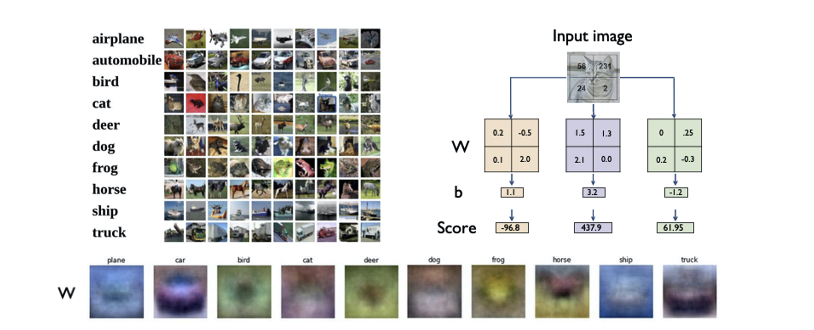
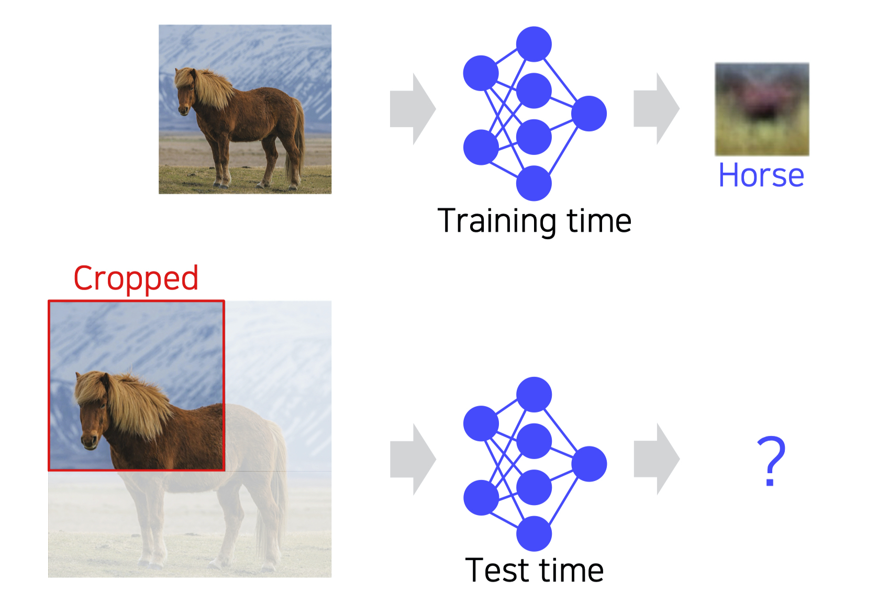
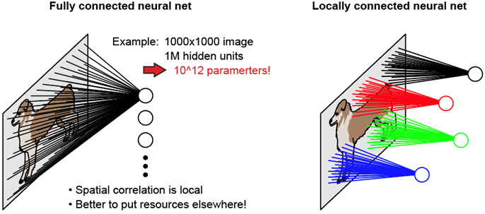

본 정리 내용은 [Naver BoostCamp AI Tech](https://boostcamp.connect.or.kr/)의 edwith에서 학습한 내용을 정리한 것입니다.  
사실과 다른 부분이 있거나, 수정이 필요한 사항은 댓글로 남겨주세요.

---

> *The theory and development of computer systems able to perform tasks that normally require human intelligence, such as visual perception, speech recognition, decision-making, and translation between languages. - from oxford dictionary*

인간의 지능을 구현하기 위해서는 가장 먼저 **다양한 지각능력(multi-modal perception)**을 구현해야한다. 지각능력은 입력(input)과 출력(output)을 통해 구현되며, 이 때 입력은 단순히 오감에서 끝나는 것이 아니라, face/touch/speech/social같은 복합적인 감각의 이해도 포함된다.

**시각적 지각능력(visual perception)**은 인간 지능의 한 부분으로 취급된다. **`컴퓨터 비젼(Computer Vision)`**은 이러한 지각능력을 재현하고자 하는 분야이다. 시각의 프로세스는 *[Visual world - Sensing device(눈) - Interpreting device(뇌) - Interpretation]* 네 단계로 이루어진다.  마찬가지로, 컴퓨터 비젼도 동일한 네 단계로 이루어진다. 다만 Sensing device가 눈이 아닌 카메라이고, Interpreting device가 뇌가 아닌 GPU와 알고리즘이라는 것만 다르다. 이를 통해 나오게 된 해석(Interpretation, representation)은 하이 레벨의 description이 된다.  이 representation을 통해 장면에 해당하는 이미지나 3D 모델을 재구현하는것을 `Computer Graphics`, 또는 `렌더링(Rendering)`이라고 한다. 거꾸로, 시각적 데이터(visual data)에서 representation을 추출하는 일을 **`Inverse Rendering`**이라고 하며, 컴퓨터 비젼의 task에 해당한다.
#
# Image Classification

분류기(Classifier)는 입력을 어떤 카테고리 값과 매핑시켜 내보내는 장치이다. 이미지 분류는 이 분류기의 입력값으로 시각적 데이터만을 사용하여 추론하는 것을 일컫는다.

극단적으로 생각해보았을 때, 모든 분류 문제는 세상의 모든 시각적 데이터를 가지고 있다면 아주 쉽게 해결된다. 그냥 모든 데이터들 사이에서 비슷한 것들끼리 모으기만 하면 된다.

즉, **K Nearest Neighbors(K-NN) 문제**로 해결할 수 있다. K-NN 문제는 단순히 이미지 레이블 데이터 값을 주위의 다른 데이터 레이블들과 비교하여 가장 비슷하다고 판단되는 후보군으로 편입시키는 문제이다. 이렇게 해결하는 분류기가 있다면, 마치 검색엔진처럼 작동한다. 그러나, 이러한 접근 방식은 불가능하다. Time/Memory Complexity 무한대일 것이라는 점과, '비슷하다'는 기준을 어떻게 잡을건지가 모호하다는 것이 결정적인 불가능 요인이다. 따라서 컴퓨터 비젼은 방대한 데이터를 제한된 complexity의 시스템(인공 신경망)이라는 분류기에 녹여넣는 것이 목표이다.

#

### Fully Connected Layer Network

이런 이미지 분류를 가장 간단한 형태의 인공 신경망 분류기, 즉 **단일 계층의 Fully Connected Layer Network**로 구현했다고 생각해보자.

기존의 이미지에 W(weight)를 내적한 것을 다시 이미지로 치환시켜보면, 아래와 같이 실제 레이블과 어느정도 관련이 있는 이미지 형상을 추출할 수 있다. 그러나 이 형태는 너무 흐릿하여 정확도가 떨어진다. **계층을 너무 얕게 쌓았기 때문에 디테일을 충분히 표현할 수 없는 것**이다. 

또, 모든 노드들이 출력층으로 전연결(fully-connect)되기 때문에, **전체적인 형상만을 학습**한다. 따라서 만약 이 사진을 잘라낸 사진을 제공하면 인식을 전혀 할 수 없게 된다.

#

## Convolutional Neural Network(CNN)

이러한 전연결 신경망의 한계점을 극복하기 위하여 **`합성곱 신경망(Convolution Neural Network, CNN)`**가 나오게 되었다. CNN은 모든 노드들을 다음 계층으로 전연결시키는 것이 아니라, **국소적인 연결(locally connect)**을 사용한다. 동일한 국소적 sliding window를 이미지의 모든 부분에 대입시켜 feature들을 뽑아냄으로써, 치우쳐 있는 이미지나 잘린 이미지라도 feature를 추출할 수 있고, 파라미터를 재활용하여 메모리도 적게 사용할 수 있다. 이런 장점 때문에 많은 CV task의 backbone으로 활용되고 있다.
#
## 이미지 분류를 위한 CNN 아키텍쳐의 종류

### 간략한 역사 개요

- `LeNet`
    - 1998년 Yann Lecun
    - 비교적 간단하며, 한 글자 정도의 손글씨를 인식하기 위해 사용되었다.
    - 구조 : Conv-Pool-Conv-Pool-FC-FC
- `AlexNet`
    - LeNet에서 모티베이션을 따왔다.
    - 파라미터와 학습 데이터를 훨씬 더 크게 늘렸다.
    - 필터 사이즈가 11x11로 아주 크다. 최근에는 이런 큰 필터를 사용하지 않는다.
    - 활성화 함수로 ReLU를 사용하고, dropout 정규화 기법을 사용했다.
    - 논문에는 메모리 문제로 두 GPU에 올려서 학습했으며, 그 당시 명암을 조정하기 위해 사용했던 LRN(Local Response Normalization) 기법은 현재는 사용하지 않는다.
    - 구조 : Conv  - Pool - LRN - Conv - Pool - LRN - Conv - Conv - Conv - Pool - FC - FC - FC
- `VGGNet`
    - 3x3의 작은 필터와 2x2 max pooling 사용, LRN 제거로 아키텍쳐가 비교적 간단해졌으나 성능은 더 좋아졌다.
    - 19 layer로 AlexNet(12 layer)보다 더 깊다.
        - 작은 필터크기임에도 불구하고, 더 깊이 층을 쌓아 receptive field의 크기를 키웠다.
    - 미리 학습된 feature를 fine-tuning하지 않고도 다른 task에 적용 가능할 정도로 일반화가 잘 되었다.

---

### Reference

[K-Nearest Neighbor(KNN) Algorithm for Machine Learning - Javatpoint](https://www.javatpoint.com/k-nearest-neighbor-algorithm-for-machine-learning)