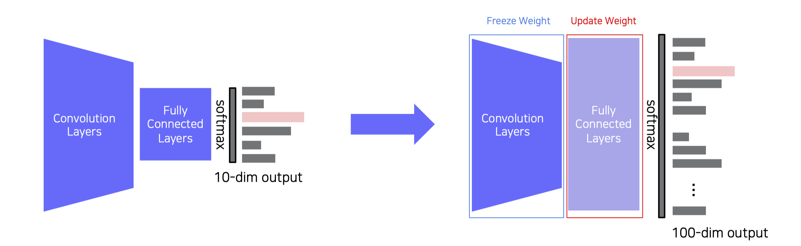
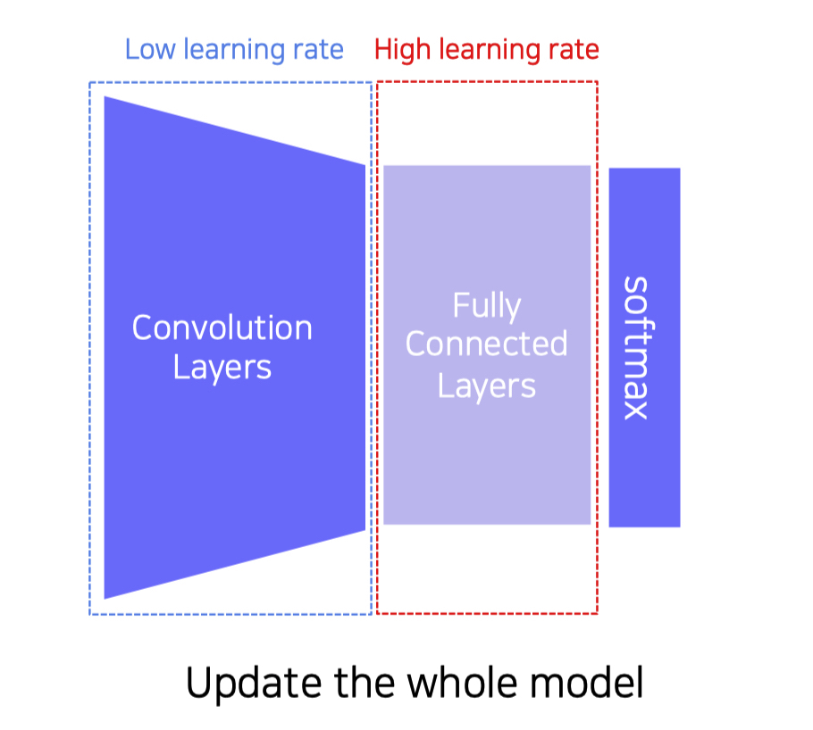
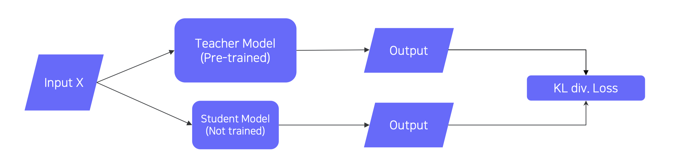
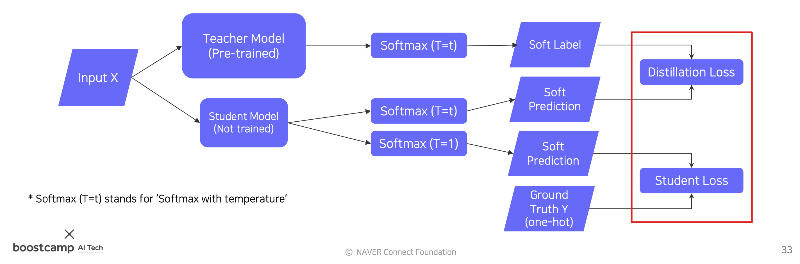
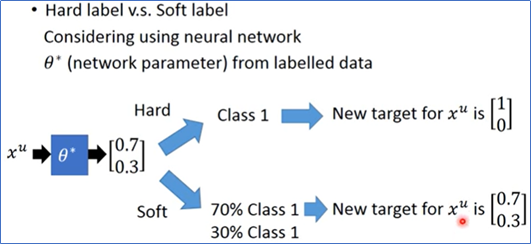
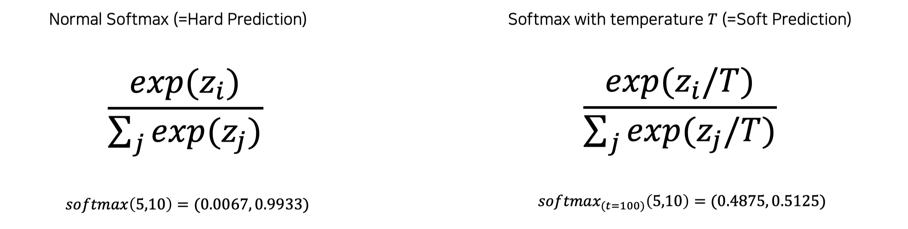
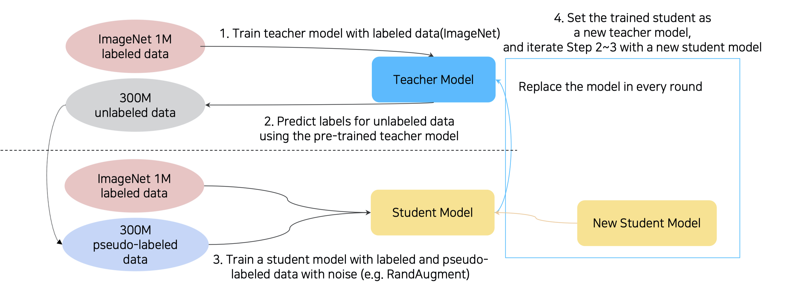

본 정리 내용은 [Naver BoostCamp AI Tech](https://boostcamp.connect.or.kr/)의 edwith에서 학습한 내용을 정리한 것입니다.  
사실과 다른 부분이 있거나, 수정이 필요한 사항은 댓글로 남겨주세요.

---

# Annotation data efficient learning

실전에서 딥러닝을 사용할 때 가장 어려운 문제는 데이터의 레이블링이다. 레이블이 잘 붙여진 대량의 고품질 데이터가 있으면 효율적인 supervised learning을 수행할 수 있겠지만, 현실에서는 그런 경우가 거의 없거나 이를 구축하는 데에 비용이 매우 많이 든다.

따라서 주어진 데이터셋만으로 실제 데이터 분포를 따라가거나, 기학습된 정보를 이용하여 새로운 데이터셋을 더 효율적으로 학습하거나, 레이블이 없는 데이터셋까지 학습하는 다양한 data annotation 기법들을 살펴보자.

## Data Augmentation

데이터셋은 항상 편향되어있다. 이미지 데이터를 예로 들자면, 구도, 사진사의 영향 등에 영향을 받기 때문에, 인간이 보기에 좋은 방향으로 치우쳐져 있다. 또 데이터셋은, 현실 데이터셋의 일부분(fractal)에 불과하므로 너무 sparse하기도 하다. 이처럼 학습에 사용되는 샘플 데이터셋과 현실 데이터셋 사이의 격차를 어떻게 메울 수 있을까?

### Image Data Augmentation methods/techniques

잘라내기(Crop), 비틀기(Shear), 밝기 조절(Brightness),  원근 변환(Perspective), 회전(Rotate), 반전(Flip), 기하학 변환 등의 다양한 이미지 변환 기법이 사용된다.

OpenCV와 NumPy 라이브러리가 이러한 방식들을 지원하고 있다.

- `밝기조절(Brightness)`
    - 각 픽셀별 RGB 값에 동일한 값을 더하거나, 적당한 값을 곱하는 등으로 scaling해준다.
- `회전/반전(Rotate/Flip)`
    - 라이브러리에서 rotate 기능을 지원한다.
- `잘라내기(Crop)`
    - 사진에서 중요한 파트에 대해 더 강하게 학습할 수 있게 만들어주는 역할을 한다.
    - 픽셀 범위 인덱싱으로 수행한다.
- 기하학 변환
    - `Affine transformation`
        - 이미지의 선(line), 길이 비율(length ratio), 평행성(parallelism)은 보존한다.
        - 이미지의 네 꼭짓점 중 세 꼭짓점을 mapping 대응쌍을 AffineTransform 함수에 넣어준다.
        - 비틀거나, 회전하거나, 옮겨주는 기하학적 방법을 warping이라고 한다.
        - `Shear` transform이라고도 부른다.
- 최근의 변환 기법들
    - `CutMix`
        - Cut과 Mix를 모두 사용하여, 잘라낸 각각의 두 사진을 이어붙여 학습데이터로 사용한다.. 이 때, 레이블도 동일한 비율로 조정한다.
        - 이를 통해 서로 다른 두 물체의 위치를 좀 더 정교하게 catch할 수 있게 된다.
    - `RandAugmentation`
        - 여러가지 가능한 영상처리 기법을 어떤 방식으로 조합할 지 탐색하는 것. 즉, best sequence of augmentation을 자동으로 탐색하는 기술
        - 파라미터 : [사용할 기법의 종류(which), 기법의 강도(magnitude) ]
            - N개의 기법들 사이에서 샘플링한 뒤 수행하여 성능을 비교한다.

#

## Leveraging pre-trained information

데이터를 적게 쓰고도 좋은 성능을 발휘하기 위해서, 다른 데이터 셋에서 학습된, 즉 pre-trained 정보를 활용 해볼 수 있다.

#

### Transfer learning

Supervised learning에 사용되는 대용량의 데이터셋은 매우 비싸기도 하고, 사람이 만들었을 때 그 퀄리티를 보장하기 어렵다. 이를 해결하기 위한 실용적인 방법의 필요성이 대두되었다.

예를 들어, 주어진 데이터셋에서 오토바이의 바퀴를 찾아내고 싶다고 하자. 그런데 오토바이의 바퀴는 자동차의 바퀴와 비교적 비슷하게 생겼다. 따라서, 자동차의 사진들을 학습하여 바퀴를 구별해 낼 수 있는 기학습된 모델이 있다면,  해당 모델의 기학습된 정보를 이용하는 것이 좋을 것이다. 이런 경우에 **`전이학습(Transfer learning)`**을 사용한다.

기학습된 모델에서 전연결 계층(Fully connected layer)과 분류출력 부분만 제거하고, 그 대신에 새로운 전연결 계층과 내가 원하는 형태로 분류해줄 출력층을 정의한다. 이렇게 마지막 파트만 바꾼 모델을 다시 학습시킨다. 이 때, 합성곱 계층부(Convolution layers)는 Weight를 고정한다. 그래야 기존에 학습된 모든 정보들을 다 가지고 있기 때문이다. **Pre-trained task에서 new task로 knowledge를 transfer하는 과정**이다.

또는, 합성곱 계층부는 낮은 학습률로, 새로 바꾼 전연결 계층부는 높은 학습률로 설정하여 전체(whole model)를 모두 업데이트시키는 **Fine-tuning 방법**도 있다. 이 경우 부분만 학습하는 방식보다 조금 더 많은 데이터가 필요하겠으나, 당연히 성능은 더 좋을 것이다.

이 두 가지의 고전적인 방법과 더불어, 최근에는 좀 더 진보된 방식이 사용되고 있다.

#

### Knowledge Distillation

**`Knowledge distillation`**은 대형 모델이 학습한 정보를 더 작은 별개의(another) 소형 모델로 전달해주는 방법이며, `Teacher-student learning`이라고도 불린다.

- 이는 모델 압축(model compression)에도 유용한 방법이다. 소형 모델이 대형 모델의 방식을 따라하기(mimicking) 때문이다.
- 최근에는 teacher model의 출력 레이블(예측)을 ground truth 레이블인 것 처럼 소형 모델에게 학습시키는 `pseudo-labeling` 방식으로도 사용되고 있다. 레이블이 없는 데이터에 가짜 레이블(pseudo-label)을 붙이기 때문에 붙여진 이름이다. 따라서 unsupervised learning의 일종으로도 볼 수 있다.

***위의 그림에서 Student Loss를 예측하는 부분은 Soft prediction이 아닌 Hard prediction으로, 오기입니다.**

만약 레이블링이 된 데이터가 어느정도 있다면 있다면, 위와 같은 방식으로 student model의 학습을 두 갈래로 나누어 실제(ground truth) 레이블 데이터의 학습 비중을 좀 더 높이는 전략을 취할수도 있다.

- `Distillation Loss` **:** pseudo-labeling을 이용한 가짜 레이블과의 Loss
    - ***KL-Divergence(***Soft label, Soft prediction)
    - Teacher 모델 추론과 Student 모델 추론의 차이
    - 즉, Teacher Network가 알고있는 knowledge를 (흉내냄으로써) 학습한다.
- `Student Loss` **:** 실제 레이블 데이터와의 Loss
    - ***CrossEntropy***(Hard label, Soft Predction)
    - Student Network의 추론과 실제 레이블간의 차이
    - 정답(right answer)을 학습한다.

두 가지 Loss를 구하는 경우 중, Distillation Loss를 구할 때에는, 학습에 있어서 hard label 대신 soft label을 사용하는 **Soft Prediction**을 수행한다.

- *Hard label(one-hot vector)* :, 해당 클래스가 '진짜' 정답인지 아닌지만을 명확히 판별하는 레이블. 일반적으로 데이터셋이 보유한 ground truth 레이블이다.
- *Soft label* : 해당 데이터에 대해 모델이 어떻게 생각하는지, 즉 모델의 knowledge를 나타내주는 레이블이다. 일반적으로 모델의 output, 즉 추론한 결과이다.

Soft Prediction을 위해서는 모델의 추론 값을 Softmax에 통과시켜야 하는데, 이 때 **T**, 즉 **Tempature**라는 새로운 개념이 등장한다. 단순히 softmax만을 취하면, 입력의 값을 극단적으로 0 또는 1에 가깝게 벌려주게 된다. 이 대신에, 입력값을 temperature라는 상수로 나누어준 뒤 softmax를 취하면 output value를 어느정도 smooth하게 만들 수 있다. 이렇게 하여 output을 어느정도 입력(teacher model의 출력)을 따라가게 만듦으로써, student model이 teacher model을 더 잘 따라하게 할 수 있다.

또한, 기존에 학습된 teacher 모델의 task는 student 모델의 task와 전혀 다르기 때문에, teacher model의 각각의feature, 즉 dimension 정보는 그다지 중요하지 않다. 즉 각각의 element(node)가 가지는 semantic한 의미가 중요하지는 않다. 그보다는 teacher 모델의 행동을 추상적으로 정의하고 흉내내는 것이 student 모델의 목적이다. (*Semantic information is not considered in distillation*)

이처럼 두 갈래로 나누어 학습하는 경우, Distillation Loss와 Student Loss를 가중합(Weighted Sum)하여 Student 모델을 학습한다.

#

## Leveraging unlabeled dataset for training

추가적인 레이블링 없이 성능을 올리는 방법에 대해서 살펴보자.

### Semi-supervised learning

레이블이 있는 데이터는 supervised로, 레이블이 없는 데이터는 unsupervised로 학습하는 방식을 가리킨다. 레이블이 없는 데이터는 labeled data로 기학습된 모델을 이용하여 레이블이 없는 데이터들을 Pseudo-labeling하고, 이를 학습시킨다.

### Self-training

위의 방법들을 잘 결합하여 새로운 지평을 연 최신 연구로, **Self-training with noisy student**라고도 한다. 기존의 Efficient Net에 비하여 큰 폭으로 성능이 향상되었다.

1. Teacher 모델이 실제 레이블을 토대로 가짜 레이블(pseudo-label)을 생성한다.
2. 생성한 가짜 레이블과 실제 레이블을 섞어서(e.g. RandAugment) Student 모델을 학습시킨다.
3. 기존의 Teacher 모델을 새로 만들어진 Student 모델로 갈아치운다. 즉, 학생이 자라서 선생이 된다.
4. 1-3을 2~4회 정도 반복한다.

기존의 Knowledge Distillation에서는 Teacher 모델이 Student 모델보다 대형의 모델이었다. 그러나 이 방식을 사용하면, **<U>각 round가 끝날때마다 Student 모델이 점점 더 커지게 된다.</U>**