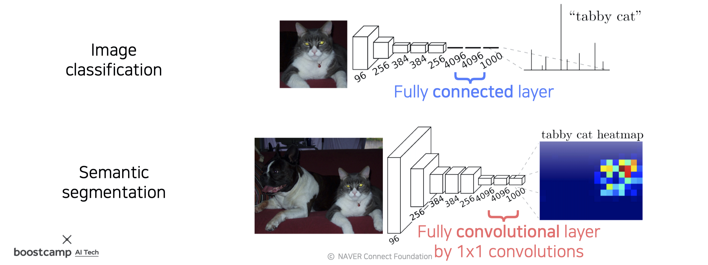
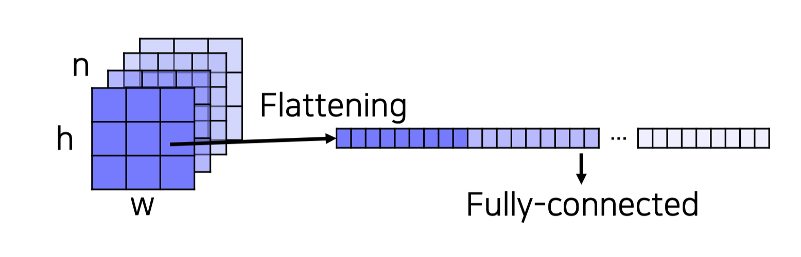
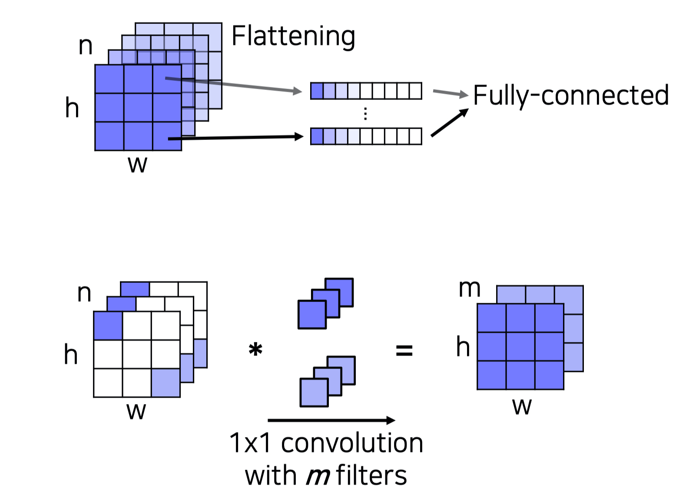
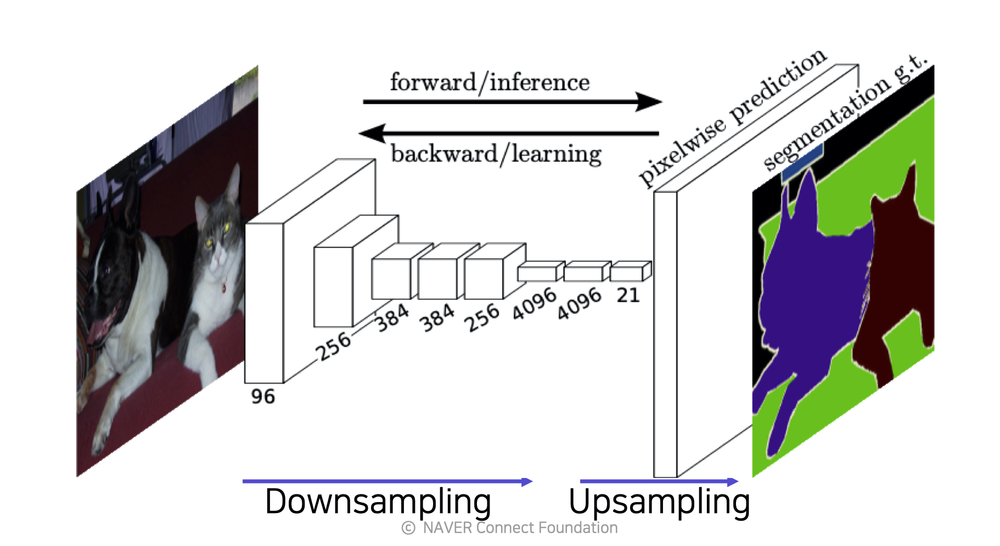
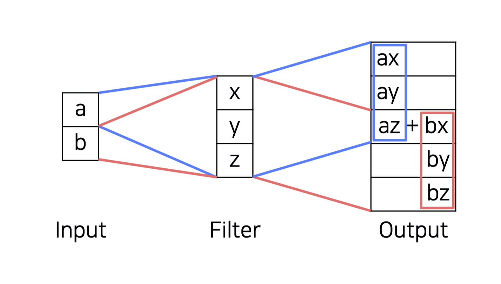
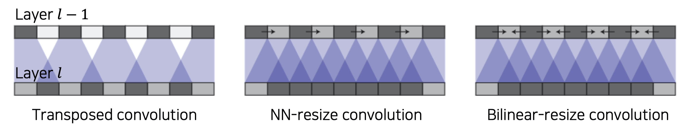
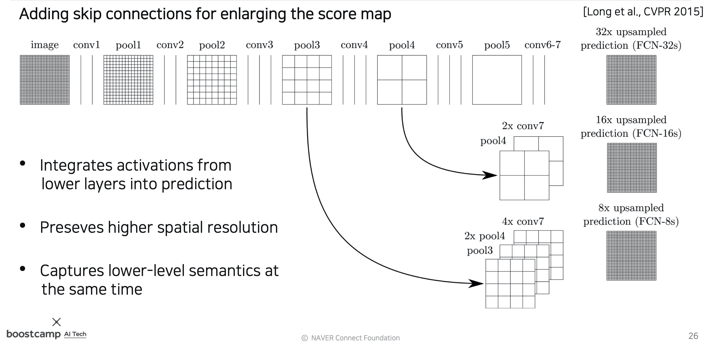
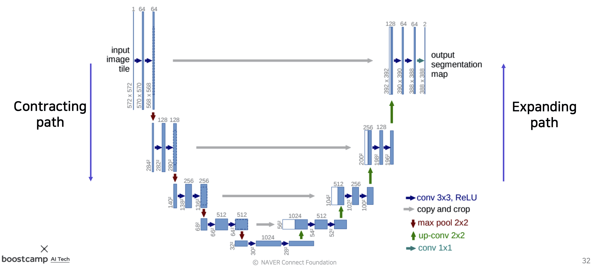
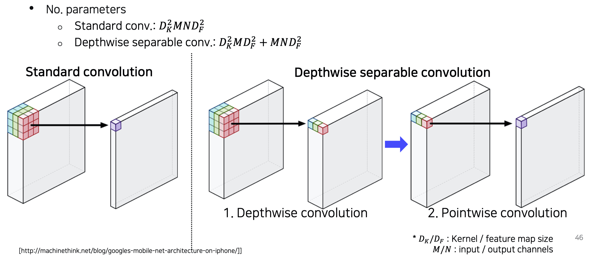

본 정리 내용은 [Naver BoostCamp AI Tech](https://boostcamp.connect.or.kr/)의 edwith에서 학습한 내용을 정리한 것입니다.  
사실과 다른 부분이 있거나, 수정이 필요한 사항은 댓글로 남겨주세요.

---

# Semantic segmentation

이미지 분류를 영상 단위가 아니라 픽셀 별로 하는 것. 단, 같은 클래스(종류)이면서 서로 다른 물체(개체)를 구분하지는 않는다.(Don't care about instances. Only care about **semantic category**.)

#

### 적용 분야

- 의료 이미지
- 자율 주행
- computational photography(object별로 조작할 수 있는 사진) 등

object의 구별이 쉬워지므로, object 별 이미지 수정을 하기 위한 인터페이스를 만드는 post-processing에 사용되기도 한다.

#

## Semantic segmentation Neural Net의 종류

### Fully Convolutional Networks(FCN)

- 최초의 end-to-end semantic segmentation NN
    - 입력과 출력 페어만 있으면 신경망 내부가 자동으로 학습되는 구조
        - 이전까지는 내부 알고리즘을 직접 작성하고 결합하여 만들었었다.
- 학습시 사용했던 이미지와 입력 이미지의 resolution이 달라도 문제없이 작동한다(호환성이 높다).

기존의 CNN은 마지막 부분에 FC layer를 몇 단 두었었는데, FCN은 FC 대신 Fully convolutional layer만 사용한다. 이러한 방식이 어떤 차이가 있을까?

- *Fully **connected** layer* : 공간 정보를 고려하지 않고, fixed vector가 input으로 주어지면, output도 fixed vector로 처리된다.
- *Fully **convolutional** layer* : 입/출력이 모두 activation map(tensor)이다. 1x1 conv layer이다.

#

Fully connected layer는 각 채널들을 일직선으로 쭉 펴서(flatten) concat한다.

이와 달리, Fully convolutional layer는 각 채널에서 같은 feature로 분류되는 vector(즉, 같은 위치의 벡터)들을 묶어 m개의 1x1 필터와 conv 연산(내적)을 수행하여, m개의 채널을 가지는 feature map을 구성한다. 이 때, conv 연산이므로 sliding window 방식을 사용하기 때문에 좀 더 spatial한 데이터가 유지된다는 장점이 있다.

이 과정에서 Pooling 계층을 여러번 통과하고, stride가 있어 FC layer에 비해 좀 더 넓은 receptive field를 가지고 있기 때문에, high-resolution의 input이 들어오더라도 결과값은 **훨씬 low-resolution의 예측 스코어(히트맵)**를 가지게 된다. 

그렇다면 Pooling과 Stride를 제거해버리면 어떨까? 만약 그렇게 한다면 receptive field 자체가 작아져서, 영상의 전체적인 context를 파악하지 못하게 될 것이다. 그건 의미가 없다.

#

### Upsampling

따라서, 이런 저해상도 문제를 피하기 위해 **`upsampling`**을 사용한다.

고해상도 이미지 input에 Conv 연산과 Pooling을 거치면서, 출력값은 자연스럽게 저해상도로 Downsampling된다. 이를 마지막에 고해상도로 키워주는 연산이 Upsampling이다. 방법은 여러가지가 있지만, 최근에는 대표적으로 2가지가 사용된다.

`Transposed convolution` : swapping the forward and backward passes of convolution

input 픽셀 각각을 filter에 곱해주어 늘리는 것이다.

잘 이해가 가지 않는다면 다음 링크를 참조해보도록 하자.

[Transposed Convolution을 이용한 Upsampling](https://gaussian37.github.io/dl-concept-transposed_convolution/)

이 때 반드시 주의해야 할 점은, ***checkboard artifact***를 조심해야한다는 것이다. 마치 체크무늬처럼 일정 간격으로 특정 격자의 색이 진하게 나오는 것을 의미한다. 이는 **<U>sliding window 기법을 사용하는 CNN의 특성 상 stride와 kernel 크기를 잘 조절하지 않으면 overlap 되는 구간이 생기기 때문에 일어난다.</U>**

위의 이미지에서도 볼수 있듯, [az + bx] 구간처럼 overlap되는 구간은 다른 구간들보다 상대적으로 출력값이 높을 수 밖에 없다. 픽셀값이 높다는 것은 곧 진한 색상을 의미하므로, 상대적으로 진한 격자가 규칙적으로 나타나게 되는 것이다. 이는 짙은 색상의 이미지일수록 더 심하다.

`Upsample and convolution` : Decompose into spatial upsampling and featrue convolutoin

이러한 문제는 upsampling(정확히는 interpolution) 과정과 convolution 과정을 분리함으로써 쉽게 해결할 수 있다. Transposed convolution은 어설프게 overlap되는 구간들이 일부만 있었다면, upsampling을 통해 중첩 문제가 없이 골고루 영향을 받게 함으로써 전체적으로 평준화시켜줄 수 있다.

- 기존의 upsampling 연산 decomposition → **[spatial upsampling + feature convolution]**
    - **spacial upsampling** : {Nearest-neighbor (NN), Bilinear sampling}같은 interpolation. 학습가능한 파라미터는 전혀 없고 그냥 해상도를 키워주는 작업.
    - **convolution 연산** : spatial upsampling 직후 수행하며, 파라미터가 있으므로 학습이 되어 전체적으로 learnable upsampling을 구현할 수 있다.

### 다시, FCN으로

그러나 아무리 Upsampling을 했다고 하더라도 한 번 떨어진 resolution을 충분히 원래대로 끌어올리기는 쉽지 않다. 연산 과정에서 잃어버린 정보들을 다시 살리는 일이기 때문이다.

결국, 목표대로 정확한 High-resolution의 output을 얻기 위해서는 두 마리 토끼를 다 잡는 미션을 수행해야 한다.

- **Fine/Low-level/Detail/Local, 미세한 각 부분의 디테일을 살리면서도**
- **Coarse/Semantic/Holistic/Global, 전체적인 context를 볼 수 있는 넓은 시야를 가져야한다.**

이 두 특징을 모두 가지기위해서 기존의 방법들을 모두 fusion한다.

1. 높은 layer의 activation map을 upsampling하여 해상도를 크게 끌어올린다.
2. 이에 맞추어 중간 layer의 activation map을 upsampling하여 가져오고, concat한다.

위에서는 FCN-8s가 가장 많은 layer들을 concat하는 형태가 된다. 이처럼 중간 layer들의 skip connection을 추가할 때 훨씬 더 명확한 이미지를 얻을 수 있다.

### FCN의 특징

- Faster
    - 직접 짠 컴포넌트(알고리즘)에 의존하지 않고 자동적으로 학습하는 end-to-end 구조이다.
- Accurate
    - feature 표현과 분류가 함께 최적화된다.

### Hypercolumn for object segmentation

FCN과 동일한 시기에 비슷한 내용의 연구도 있었는데, 이 경우 Fully convolutional network보다는 `Hypercolumn`을 강조했다.

기존의 CNN layer는 feature representation을 위해 마지막 FC layer의 출력을 사용했다. 그러나 이 방식은 한 픽셀에 모든 정보가 압축되어 있어 너무 coarse spatially했다.

이와 달리, Hypercolumn은 모든 CNN 유닛의 해당 픽셀 위치에 해당하는 값들을 stacked vector로 표현하는 방식이다.

- 초기 layer에서의 좀 더 미세한 국지적 정보들(fine localized information)을 추출할 수 있었다.
- 후기 layer에서는 더 전체적인 context를 보므로, coarse semantic information을 추출할 수 있었다.

다만 이 논문은 end-to-end가 아니라, bounding box를 구하는 sub component algorithm을 사용한 뒤 적용하는 모델로 소개되었다.

## U-Net

- FCN을 베이스로 만들어졌다.
- 낮은 층의 feature map과 높은 층의 feature map을 더 잘 결합하는 방식을 제시했다.
    - FCN의 skip connection과 유사한 방식이다.
- 좀 더 정교한 segmentation이 가능해졌다.

### 구조

기존의 CNN 파트와 conv 연산을 적용하여 전체적인 feature map(holistic context)을 뽑아내는 downsampling 부분은 거의 같다. 여기서는 `Contracting path`라고 부른다. 

- 3x3 conv를 사용한다.
- feature 채널의 숫자를 계속 doubling한다.

그러나, upsampling 파트는 차이가 있다. 여기에서는 `Expanding path`, `Decoding` 이라고 부른다.

- 한번에 upsampling 하는 대신, 채널 수를 반으로 줄여가며 점진적으로 upsampling한다(즉, Contracting path의 대응되는 layer와 채널 수를 동일하게 맞춘다.).
- 대칭되는 Contracting path의 layer에서 skip connection을 통해 대칭되는 feature map들을 가져와서 fusion(여기서는 concat)해준다.

<Warning>

이 때 input 이미지와 feature 이미지의 크기는 짝수여야 한다. 만약 홀수라면, Contracting/Expanding 파트에서 나머지 정보들이 유실된다.

</Warning>

#

## DeepLab

Sementic segmentation의 한 획을 그은 모델로, 기존 모델에 비해 다음과 같은 차이점을 가진다.

- ***CRFs*** 후처리의 존재
- **Atrous convolution**

#

### Conditional Random Fields(CRFs)

픽셀과 픽셀 사이의 관계를 다 이어주고, regular한 pixel map을 그리드로 본다.

기존의 sementic segmentation에서는 feedforward 구조이므로 피드백이 없어 굉장히 blurry한 output이 나오기 마련인데, CRFs는 기존의 이미지에서 edge같은 경계선들을 활용하여 score map이 경계에 잘 들어맞도록 확산시켜주는 역할을 한다. 이 때 물체의 background와 내부에서 동시에 확산하므로, 결과적으로 경계선이 물체 형태에 맞게 명확히 잡히게 된다.

#

### Atrous convolution

기존 convolution 필터와 달리, 필터의 수용영역 사이사이에 space를 넣어 spatial context를 캐치하는 방법이다. Dilation factor를 몇번 반복하는 것 만으로 파라미터 수는 늘리지 않으면서 receptive field는 exponential하게 키울 수 있다.

#

### Depthwise separable convolution

기존의 convolution 연산은 하나의 필터를 모든 input 채널에 대입시켰다. 

그러나 *Depthwise separable convolution*은 이 과정을 둘로 분리하였다.

1. Depthwise convolution : 채널별로 필터를 만들고, 이를 convolution하여 채널별로 activation map을 만든다.
2. Pointwise convolution : 뽑아낸 값들을 토대로 다시 1x1 conv를 사용함으로써 하나의 값으로 출력이 되도록 만들어준다.

이미지를 보면 알 수 있겠지만, convolution의 표현력은 유지하면서 계산량은 훨씬 더 줄어들게 되었다.