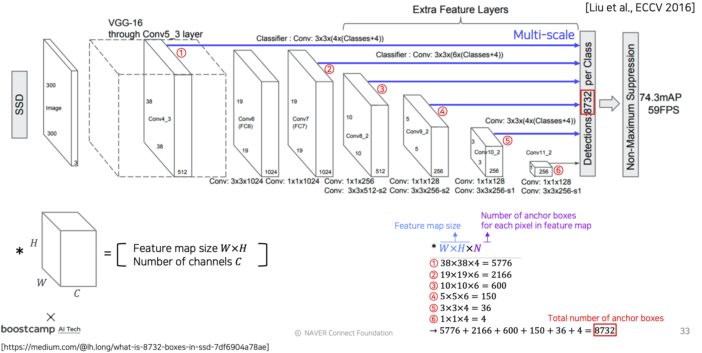
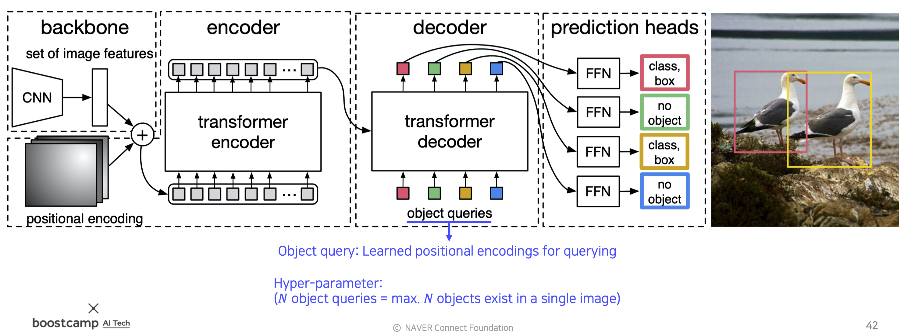

본 정리 내용은 [Naver BoostCamp AI Tech](https://boostcamp.connect.or.kr/)의 edwith에서 학습한 내용을 정리한 것입니다.  
사실과 다른 부분이 있거나, 수정이 필요한 사항은 댓글로 남겨주세요.

---

Object detection, 객체 검출은 CV에서 가장 시장수요가 높은 task 중 하나이다. 특히 자율주행(Autonomous driving), OCR(Optical Character Recognition) 등의 핵심 기술이다.

기존의 Semantic Segmentation과 [**`Instance segmentation`**, **`Panoptic segementation`**]의 차이점은, 전자는 class를 구별하지만 후자는 개체를 구별한다는 데에 있다(Instance를 구별하는가?). 예를 들어, 전자는 이미지에 나온 모든 사람들을 '사람'이라는 하나의 class로 묶어서 동일하게 취급하는데에 비하여, 후자는 Alex, Chris 등으로 각각 다른 사람으로 구별한다. 이중 Panoptic segemetation은 Instance segementation을 포함하고 있는 좀 더 큰 기술이다.

객체 검출(Object detection)은 이미지 분류(Image Classification)와 Box Localization의 조합이다. 일반 영상인식보다 좀 더 고차원의 task로, 먼저 Box의 좌표(좌상단, 우하단)를 잡아 객체를 찾아낸 뒤, 해당 객체의 카테고리를 분류한다.

# 기존 기법 : 수작업하기

## Gradient-based detector

"객체를 검출하기 위해, 경계선을 따면 좋지 않을까?"라는 생각으로 경계선 검출에 집중했다. 영역 내의 수평선/수직선 등의 분포를 모델링하고, linear classifier의 weight를 학습시켜 visualization했다. 예를 들어, '어깨부분에 사선이 많고, 팔다리 부분에 수직선이 많은 사진은 사람으로 판별하라'라는 등의 로직이다.

feature를 뽑아내는 부분은 사람이 직접 디자인하므로 매우 정교하고, 학습가능한 linear 모델의 weight부는 상대적으로 비중이 적은 셈이었다.

## Selective Search

)

최근까지도 많이 사용한 기술로, 사람이나 특정 물체 뿐만 아니라, 다양한 물체 후보군의 영역 후보군을 지정해주는 방식이다. 즉, 수많은 Bounding Box(BB)를 제안해준다.

제안받은 여러 BB중 가장 객체의 영역을 tight하게 잘 잡아내는 Box를 찾도록 학습시킨다. 딥러닝을 이용한 초기 물체 탐지에도 이 방식이 많이 사용되었다.

실제로 딥러닝 기반의 Object detection 기법들은 2014년 이후 나오기 시작했으며, 크게 두 갈래로 분류할 수 있다.

1. `Two-stage detector`
2. `Single-stage detector`

# Two-stage detector

## R-CNN

2012년 AlexNet의 Image Classification 네트워크가 압도적인 성능을 보여주자, 바로 Object detection에 응용되었다. 기존 방법 대비 압도적으로 높은 성능을 보여주며 객체 검출영역에 데뷔한 방식이다.

*Regions with CNN features*의 약자로, CNN에 Region proposal 방식을 도입하였다.

### 작동 과정

1. 이미지를 입력한다.
2. 약 2000개(2k) 이하로 region proposal(BB 후보군)을 추출한다.
3. 각 region proposal을 CNN input에 적절한 크기로 warping(이미지 사이즈 일정하게 조정)을 해준다
4. target task가 아닌 다른 task에 대해 학습된 Pre-trained CNN에 넣는다.
5. CNN의 FC layer에서 추출된 feature를 기반으로 SVM의 linear classifier만을 이용해서 클래스를 학습한다.(fine-tuning)

그러나, 이 방식은 2천개나 되는 box에 대해 일일이 다 수행을 해주므로 **굉장히 느리다**는 문제가 있었다. 또, region proposal은 selective search같은 수작업 알고리즘 기반이라, **학습이 불가능하다**는 한계가 있었다.

## Fast R-CNN

따라서 R-CNN의 단점을 보완하기 위해 영상 전체에 대한 feature를 한번에 추출하고, 미리 검출된 이 feature들을 재활용하여 객체를 검출하는 **`Fast R-CNN`**이 등장했다.

)

### 작동방식

1. 원본 이미지에서 Convolution layer까지 feature map을 미리 검출한다.
    - 이 시점의 feature map은 conv를 거쳤으므로 tensor형태(C,H,W)가 된다.
    - Fully convolutional Network는 입력 사이즈를 따로 warping하지 않아도 feature map을 추출할 수 있다.
2. 한번 뽑아놓은 feature를 여러번 재활용하기 위해 region proposal이 제시한 물체들의 후보군, 즉**`RoI(Region of Interest)`**에 해당하는 feature만을 추출한다.
3. RoI feature를 고정된 사이즈(fixed size)로 resampling한다. 이 과정을 *RoI pooling layer*라고 한다.
4. 이후, resampling된 RoI feature를 다음의 두 과정에 동시
    1. 이미지 분류 : softmax에 통과시킨다.
    2. 정확한 BB 크기 찾기 : bbox regressor에 통과시킨다.

이렇게 feature만 재활용했는데도 기존의 R-CNN에 비해 18배나 빠른 수준이었다. 그러나 region proposal은 아직도 selective search를 했으므로, 학습이 불가능한 부분이 수작업 알고리즘이 존재하여, 아무리 데이터가 많더라도 여전히 한계가 존재했다. 

## Faster R-CNN

앞선 두 R-CNN의 최대 단점인 Selective search를 제거하고, 그 부분을 NN으로 대체하였다. 따라서 object detection 분야에서 **최초의 end-to-end 모델**(모든 네트워크의 컴포넌트 NN기반)이 되었다.

### IOU와 Anchor boxes

`IOU(Intersection over Union)`는 두 영역의 overlap을 측정하는 기준을 제공하는 metric이다. 

$$
\text {IoU =}\frac{\text{Area of Overlap(교집합)}}{\text{Area of Union(합집합)}}
$$

)

`Anchor boxes`는 각 위치에서 발생할 것 같은 box를 미리 rough하게 정의해놓은(pre-defined) 후보군이다. 위치마다, 크기마다 미리 정해놓은 box들을 가져다 붙이며 쓴다. 그 중 IoU가 0.7을 넘어가는 anchor box의 경우 positive sample, 즉 정답으로 간주하고, 0.3을 넘어가지 않는 box는 negative sample로 두고 penalty를 주도록 학습했다. box의 개수와 종류는 하이퍼파라미터이지만, Faster R-CNN에서는 총 9개를 설정했다. 즉, BB에 어떻게 loss를 적용시킬 지 결정하는 기준이다.

### 작동방식

시간이 오래 걸리고, 일종의 3rd-party 알고리즘이었던 Selective search 방식을 **`Region Proposal Network(RPN)`**으로 대체하였다.

)

1. Fast R-CNN과 마찬가지로, 영상 하나에서 나오는 feature를 미리 뽑아둔다.
2. RPN에서 region proposal을 여러가지 제공한다.
3. region proposal을 바탕으로 RoI Pooling을 수행하고, 그 결과를 바탕으로 classify한다.

### RPN

)

conv feature map을 256D로 뽑아내면, 다음의 두 score를 만들어낸다

1. cls layer - object 여부를 판단하는 2k개의 classification scores
    - 각각의 anchor box에 대해 object인지/아닌지를 계산하므로 2k개
2. reg layer - k개 anchor box의 정교한 위치를 회귀하는 4k개의 bounding box regression output
    - BB 하나를 정하기 위해서 한 꼭짓점의 (x,y)좌표, 너비 w, 높이 h 총 4개의 변수가 필요하므로 4k개
    - anchor box가 아주 촘촘하면 이렇게 하지 않아도 되겠지만, 그러면 계산속도가 아주 느려질 것이다.

### Non-Maximum Suppression(NMS)

아무리 objectiveness score를 판단한다고 해도, 객체로 판단되는 BB가 너무 많을 수 있다. `NMS`는 이 중 하나를 정확히 특정하기 위해서 그럴듯한 BB를 모두 가져다놓고 다른 박스와의 IOU를 측정해 너무 많이 겹치는(ex-IoU≥50%) 것들을 모두 제거하는 방식이다. 이 기술은 딥러닝 이전의 방식에서도 대부분 사용되었지만, 딥러닝에서도 BB를 필터링하기 위해 사용되는 standard한 알고리즘이다.

# Single-stage detector

two-stage detecor와는 다르게, 정확도를 조금 포기하더라도 속도를 올리는 데에 초점을 맞춘 **real-time detector**이다. **<U>region proposal을 기반으로 한 RoI pooling을 사용하지 않고 곧바로 box regression과 classification만 사용하므로, 구조가 비교적 간단하고 속도가 훨씬 빠르다.</U>**

## You Only Look Once(YOLO)

### 작동방식

)

1. 이미지를 그리드로 나눈다.
2. 각 grid에 대해서 score를 예측한다.
    1. B개의 Bounding box마다 박스 정보 4개(x,y,w,h)와 confident score(objectiveness score) 1개를 예측한다.
    2. class score(class probability)도 따로 예측한다.
3. 최종 결과는 NMS를 통해 확정한다.

)

S : 마지막 conv layer의 해상도

B : anchor box의 개수

C : class의 개수

## Single Shot MultiBox Detector(SSD)

YOLO의 prediction은 마지막 layer에서 단 한번만 수행하기 때문에, Faster R-CNN에 비해 localization 정확도가 조금 떨어지는 아쉬움이 있었다. 이를 보완하기 위해 `SSD`가 나왔다.

SSD는 Multiscale object를 더 잘 처리하기 위하여 중간 feature map을 여러 해상도에 맞추어 출력할 수 있도록 만들었다. Conv 연산을 거치면서 각 scale마다 feature map이 출력되는데, 이를 모두 활용하여 각 scale마다 다양한 크기의 object에 맞추어 대응할 수 있도록 만들어졌다.

YOLO보다 빠른 속도와 더 좋은 성능, 심지어 Faster R-CNN까지 제쳐버리며 압도적인 퍼포먼스를 달성했다(다만 Input size가 달랐다)

# Two-stage detector vs Single-stage detector

## Focal loss

### Class imbalance problem

Single-stage detector들은 RoI Pooling을 포기했는데, 이 때문에 모든 영역에서의 loss가 계산되고 그에 따라 일정 gradient가 발생하게 된다. 일반적인 영상의 경우 검출하고자 하는 객체의 면적은 얼마 되지 않고, 나머지 대부분은 background이다. 이말은 즉, 정보가 많은 positive sample은 굉장히 적고, 유용한 정보가 없는 negative sample은 굉장히 많이 나온다는 말이다.

이런 `class imbalance` 문제를 해결하기 위해 `focal loss`라는 것이 도입되었는데, cross-entropy의 확장이라고 볼 수 있다.

$$
\begin{aligned}
\text{CE}(p_t) &= -\log(p_t) \\
\text{FL}(p_t) &= -\textcolor{red}{(1-p_t)^\gamma}\log(p_t)
\end{aligned}
$$

Cross Entropy에서 확률 term이 추가되었는데, $\gamma$는 잘 맞추었는지 여부에 따라 결정된다. 잘 맞추었을 경우 loss를 더 적게 주고, 못 맞추었을 경우 loss를 더 크게 주어 penalty를 강화하는 것이다. 즉, $\gamma$가 클수록 훨씬 더 sharp하게 변화하게 된다.

## RetinaNet

)

Low level의 특징 layer들과 High level의 특징을 둘 다 잘 활용하면서도 각 scale별로 물체를 잘 찾기위한 multi scale구조로 만들어졌다. 

중간중간 feature map들을 넘겨주고, 그 값들을 모두 더해준다(concat이 아니라 add로 fusion한다). 이후, class head와 box head가 따로 구별이 되어서 classification과 box regression을 각 위치마다 dense하게 수행된다.

SSD와 속도는 비슷하지만, 성능은 더 나은 모습을 보였다.

# Detection with Transformer

NLP에서 큰 성공을 거둔 Transformer가 컴퓨터 비젼에 접목되어서 새로운 연구 결과들이 나오고 있다.

## Detection Transformer(DETR)

페이스북에서 2020년 발표한 모델로, Objecte detection에 Transformer를 적용시킨 사례이다.

1. CNN에서 뽑아낸 feature와, input image를 각 위치의 multi dimension으로 표현한 positional encoding을 쌍으로 하여 입력 토큰을 생성한다.(position-해당 position의 feature)
2. Transformer encoder를 통과시키고, 정리된 feature들을 decoder에 넣어준다. 이 때, object queries도 같이 넣어 해당 위치에 어떤 feature가 존재하는지를 decoder의 출력값으로 받는다. 
    - object queries : 학습된 위치 인코딩(Learned positional encodings for querying)
3. 받아낸 출력값을 토대로 detection 파트(prediction heads)에서 box를 어떻게 그려야하는지 출력해주게 된다. 

이 때, 하이퍼파라미터로 N을 넣어주게 되는데, 이것은 한 이미지 내에서 검출될 수 있는 최대 object 갯수를 의미한다.

---

### Reference

[Selective Search for Object Detection | R-CNN - GeeksforGeeks](https://www.geeksforgeeks.org/selective-search-for-object-detection-r-cnn/)

[Fast R-CNN | ML - GeeksforGeeks](https://www.geeksforgeeks.org/fast-r-cnn-ml/)

[Anchor Boxes at a certain position in the feature map - fig 8](https://www.researchgate.net/figure/Anchor-Boxes-at-a-certain-position-in-the-feature-map_fig8_327392506)

[Faster R-CNN Architecture 9](https://www.researchgate.net/figure/Faster-R-CNN-Architecture-9_fig1_324549019)

[Region Proposal Network (RPN) - Backbone of Faster R-CNN](https://medium.com/egen/region-proposal-network-rpn-backbone-of-faster-r-cnn-4a744a38d7f9)

[Review: YOLOv1 - You Only Look Once (Object Detection)](https://towardsdatascience.com/yolov1-you-only-look-once-object-detection-e1f3ffec8a89)

[Review: RetinaNet - Focal Loss (Object Detection)](https://towardsdatascience.com/review-retinanet-focal-loss-object-detection-38fba6afabe4)