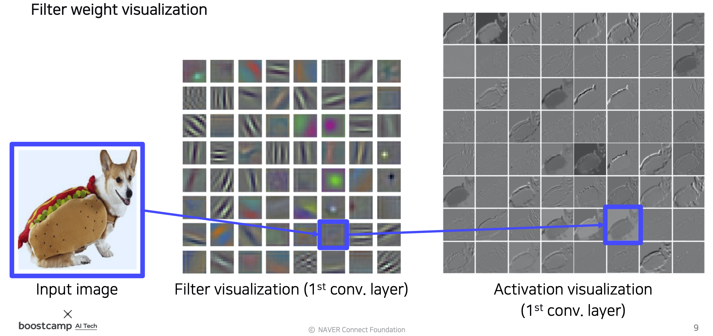
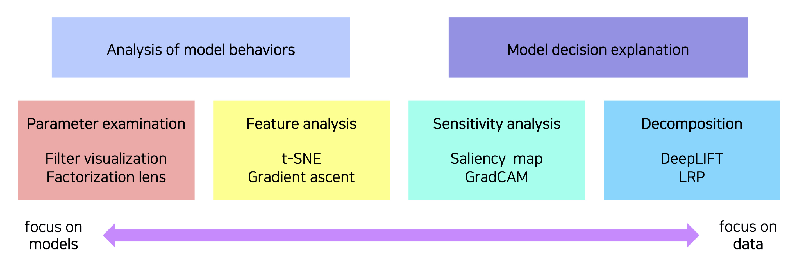
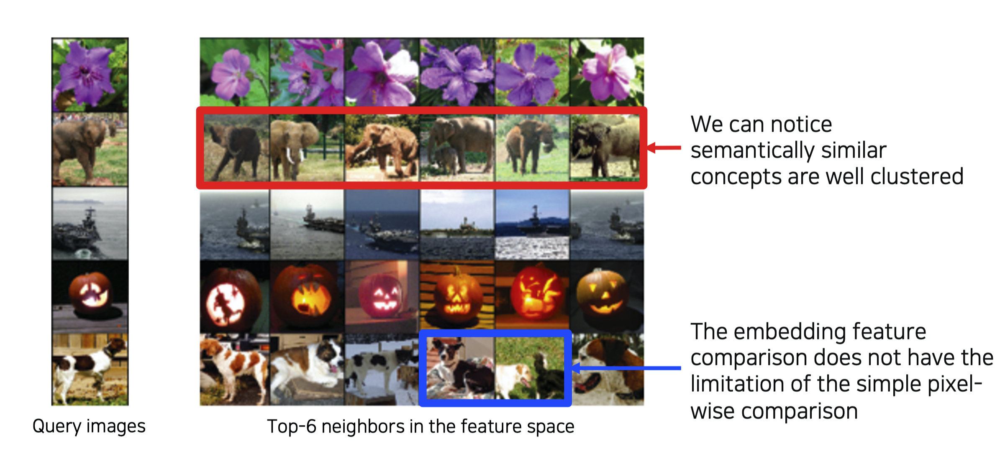
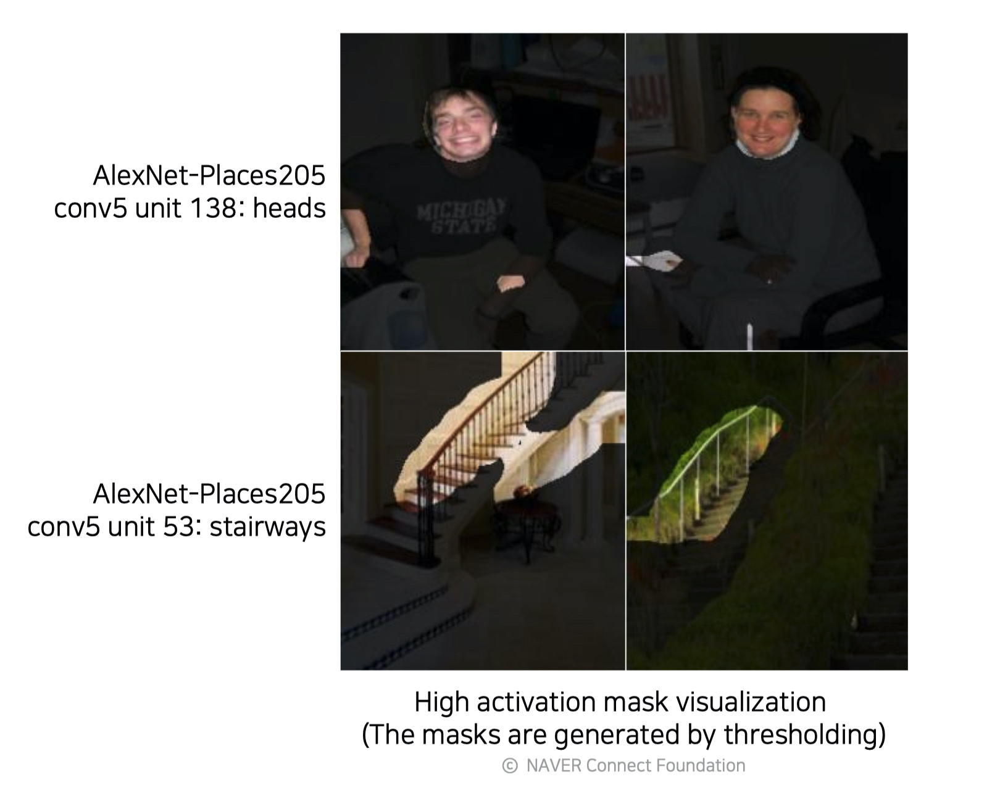
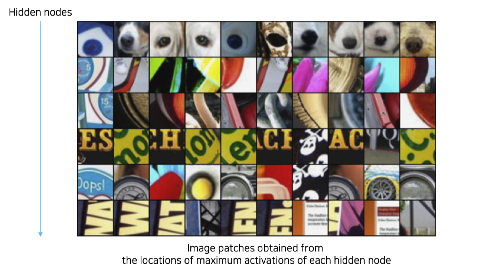
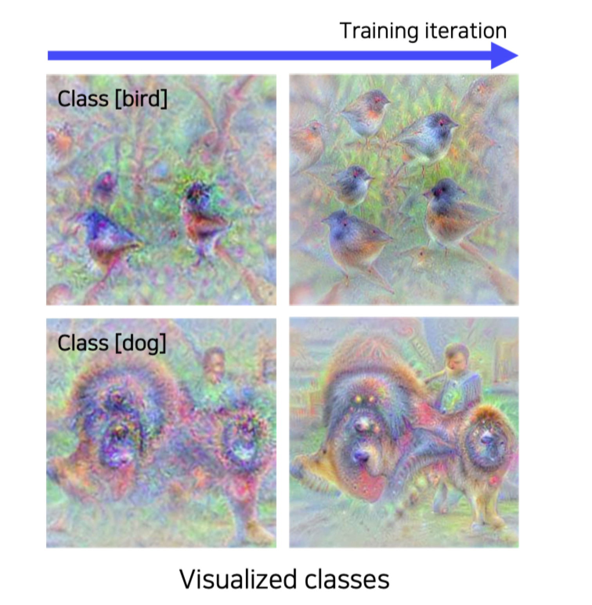
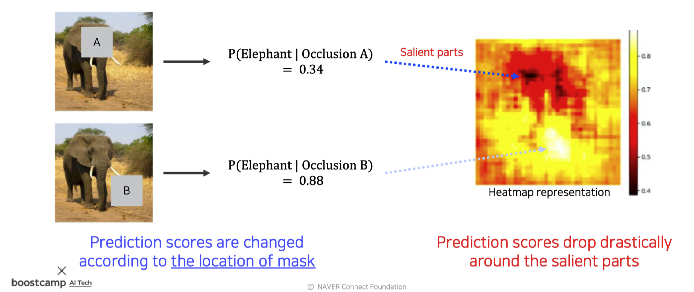
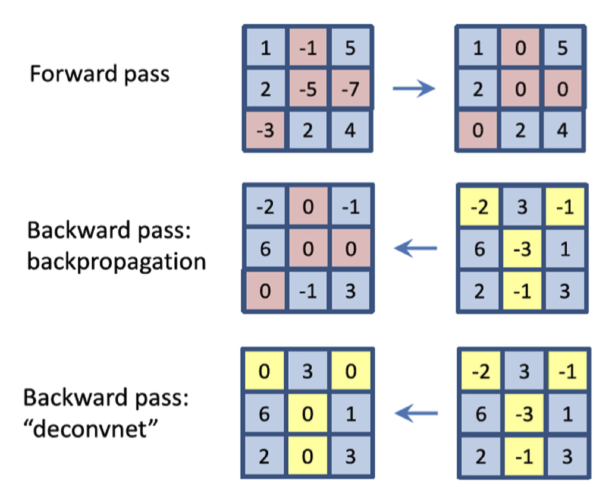
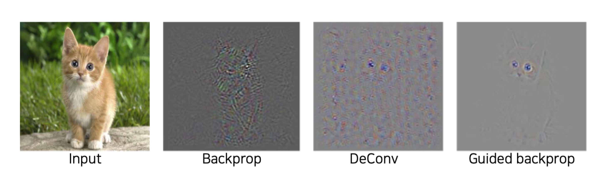
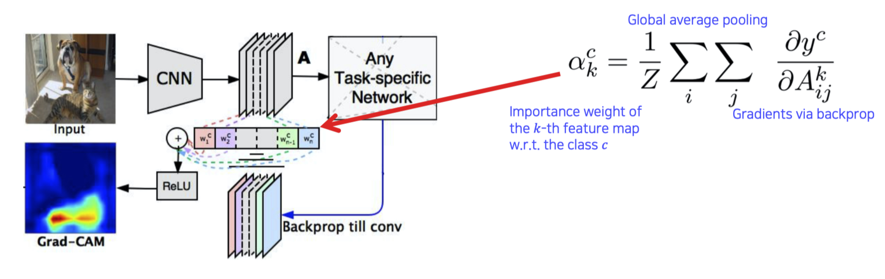

본 정리 내용은 [Naver BoostCamp AI Tech](https://boostcamp.connect.or.kr/)의 edwith에서 학습한 내용을 정리한 것입니다.  
사실과 다른 부분이 있거나, 수정이 필요한 사항은 댓글로 남겨주세요.

---

# Visualizing CNN

CNN 학습 시에 어떤 과정으로 정확한 prediction을 학습하게 되는지는 블랙박스로 남아있다. 또, 성능이 잘 나오지 않는다면 어떤 이유로 학습이 잘 되지 않았는지도 알기 어렵다. 이러한 점에서 CNN의 내부 시각화의 필요성이 생긴다. 시각화 툴은 일종의 디버깅 툴처럼 사용될 수 있다.

- *ZFNet*이 시각화 툴을 사용했던 사례

### Vanilla example : filter visualization

가장 간단한 시각화 방법으로는, 필터 자체를 시각화하거나 convolution을 취한 activation map도 시각화할 수 있다. 다만, 초기 layer에는 catch하는 영역이 명확하게 보이지만, 중-후기 layer로 갈수록 앞쪽 layer의 필터들과 합성되어서 더 추상적인 정보를 detect하므로 사실상 사람이 해석가능한 정보가 별로 없어 시각화의 의미가 없다.

### 신경망 시각화의 유형(type)

크게 `model behavior` 분석과 `model decision` 분석으로 나눌 수 있으며, 모델에 집중하느냐 데이터에 집중하느냐의 차이이다.

# Analysis of model behaviors

## Embedding feature analysis

High-level layer에서 얻는 High-level feature들을 분석하는 방법이다.

#

### Nearest neighbors(NN) in a feature space

이전에 배웠던 Nearest neighbor 방법을 활용하여, DB에 수많은 사진들을 넣어놓고 특정 Query image를 날려 해당 image와 비슷한 feature space의 images를 찾아내는지 확인한다.

이 이미지를 이용해 다음과 같이 판단할 수 있다.

1. 눈으로 직접 보고, 의미론적으로(semantically) 비슷한 이미지들이 클러스터링되어있는지 확인한다.
2. 간단하게, query image와 모델이 찾아낸 neighbor image 간을 픽셀별로 distance 계산하여 비슷한 이미지인지 확인한다.
    - 이 경우는 위치가 다르거나 포즈가 다른 이미지들을 올바르게 판단할 수 없는 경우가 많다.
    - 만약 포즈와 위치가 다른 이미지들도 명확하게 neighbor로 분류한다면, 이는 모델이 위치변화에 강인하게, 컨셉을 제대로 학습했다는 의미이므로 모델의 강건성(robustness)을 입증하는 결과가 된다.

그러나, 이 방식은 예제를 보고 판단해야 하므로 전체적인 조감도를 보기는 어렵다는 단점이 있다.

### Dimensionality reduction

너무 고차원의 feature space를 상상하거나 눈으로 확인하여 판단하기 어렵기 때문에, 차원을 축소하여 분포를 확인하는 방법이다. 대표적인 방법으로 `t-distributed stochastic neighbor embedding(t-SNE)` 가 있다.

모여있는 형태를 보고, 튀는 데이터들과 모델이 어느 클래스들을 유사하게 생각하는지 등에 대한 정보를 알 수 있다.

## Activation investigation

Middle~High level를 해석하는 해석방법이다.

### Layer activation

위의 사진을 보면, conv5 layer에서 hidden unit 중 하나를 뽑아서 thresholding하여 masking했더니 어떤 노드는 얼굴만 찾아내고, 어떤 노드는 계단만 찾아내는 것을 확인할 수 있다. 이처럼 학습 과정에서 특정 노드들이 어떤 역할을 하고있는지를 시각화하여 볼 수 있다. 이런 점을 보았을 때, CNN은 층을 쌓으면서 중간의 노드들이 여러 객체(얼굴, 계단 등)의 detection 역할을 담당하고, 결과적으로 이 detection들을 합쳐서 객체를 검출해내는 역할을 한다고 해석할 여지가 생긴다.

### Maximally activating patches

위 이미지는 CNN의 각 층에서 가장 높은 값을 가지는 hidden unit 주위의 영역을 뜯어낸 patch들의 사진인데, 이를 보면 해당 unit이 어떤 역할을 하고 있는지 확인할 수 있다. 어떤 유닛은 강아지의 코를, 어떤 유닛들은 색깔이 들어간 글자를 찾는 역할 등을 한다. 이 경우는 전반적인 큰 그림 보다는 국부적인 patch를 보므로 비교적 middle-level의 해석에 좋을 것이다.

과정은 다음과 같다.

1. 특정 layer에서 channel 하나를 고른다.
2. 예제 데이터를 backbone network에 넣어서 각 layer의 activation map을 모두 뽑고, 골랐던 채널의 activation map을 저장한다.
3. 최대 activation value 주위의 이미지 패치를 잘라낸다(crop).
    - 해당 value가 커버하는 receptive field를 찾아서 그것을 주위 영역으로 판단한다.

### Class visualization

예제 데이터를 사용하지 않고, 네트워크가 기억(내재)하고 있는 이미지를 시각화하여 판단하는 방법도 있다.

위의 이미지에서는 새(bird) 클래스와 개 클래스에 대한 네트워크의 예상치를 확인한 것이다. 이 때, 우하단을 보면 개를 제외하고도 아이의 형태가 나온것을 확인할 수 있는데, 이를 통해 클래스 분류에 단순히 해당 객체만 파악하는 것이 아니라, 주변 객체와의 연관성도 파악한다고 해석할 여지가 있다. 또한, 학습데이터에서 개가 대부분 아이와 등장했다는 것을 의미하므로, 학습 데이터의 편향성도 의심해볼 수 있다.

이 방법은 최적화를 통해 구현해야하는데, 형태는 다음과 같다.

$$
I^* = \underset{I}{\argmax}f(I) - Reg(I)\\
Reg(I) = \lambda\Vert I\Vert^2_2
$$

- $I$ : 영상 입력
- $f(I)$ : 입력이 CNN 모델을 거쳐 나온 class score(ex- 개 클래스의 score)
- $Reg(I)$ : 임의의 argmax 결과를 사용하다 보면, 추상적인 값이 공교롭게도 가장 큰 값일 때가 있다. 이를 우리가 이해할 수 있는 형태로 바꾸어주기 위하여 간단한 loss인 정규화 term을 추가한다.

이전에는 Loss를 최소화하는 gradient descent를 사용했지만, 여기서는 $f(I)$가 최대화(argmax)되도록 해야하므로 Gradient ascent를 사용한다.

Gradient ascent의 과정은 다음과 같다.

1. 임의의 영상(dummy image)을 CNN에 넣어 타겟 클래스의 prediction socre를 얻는다.
2. Backpropagation으로 입력 image의 gradient를 얻는다.
    - 입력이 어떻게 변해야 target score가 높아지는지 찾는다
3. Target score가 높아지는 방향으로 input image를 update해준다.(즉, gradient를 더해준다)
4. 업데이트된 영상을 input image로 삼아 1-3을 반복한다.

이 때 최초의 dummy image는 여러 종류를 선택할 수 있다.

- blank / monotone / noisy image 등..
- 이 때 최초에 넣어준 dummy image를 base로 입력 영상을 업데이트하므로, dummy image의 형태를 어느정도 따라가는 최종 image를 얻게된다.

# Model decision explanation

지금까지는 모델 자체의 행동을 분석했다면, 이번엔 모델이 특정 입력을 어떤 각도로 바라보고 있는지 살펴보자.

#

## Saliency test

영상이 주어졌을 때, 영상이 제대로 판정되기 위한 각 영역의 중요도를 추출하는 방법이다.

### Occlusion map

input image를 넣을 때, occlusion patch를 이용하여 가려준다. 이 때, occlusion patch를 넣은 이미지를 주었을 때 해당 이미지를 정답으로 판별할 확률(CNN score)을 계산하여, 패치가 어떤 위치를 가리고 있느냐에 따라 이 값이 바뀌는 정도를 기록해둔다.

위의 이미지로 보았을 때, score를 heatmap으로 표시하면, 어두운 영역이 물체의 검출에 민감한 요인이 되는 중요 영역임을 알 수 있다.

### via Backpropagation

gradient ascent를 이용하여 클래스 이미지를 생성했던 방법과 비슷한데, **이번엔 random image가 아니라 특정 image를 입력해 해당 image를 classification하는 데에 큰 영향을 끼친 부분을 heatmap으로 표시**한다.

과정은 다음과 같다.

1. 타겟 입력 이미지를 CNN에 넣어 class score를 얻는다.
2. Backpropagation으로 입력 이미지의 gradient를 구한다.
3. 얻어진 gradient에 절댓값을 취하거나, 제곱을 하여 절대적인 크기(magnitude)를 구한다.
    - 어느 쪽으로 바뀌는지보다 해당 영역이 얼마나 큰 영향을 끼치는가가 중요하므로, 부호를 버리고 magnitude를 측정한다.
4. 해당 gradient magnitude map을 시각화한다. 필요에 따라 1-3을 반복하여 accumulate할수도 있다.

Class visualization의 gradient ascent와 다른 것은, 아무 이미지나 넣어 해당 클래스에 대한 모델의 예상치 추측을 하는것이 아니라, **<U>특정 이미지에 대한 모델의 판단 요인을 찾는다는 것이다.</U>** 즉, 현재 데이터가 어떻게 해석되는지를 보고싶은 것이므로 data-dependent하다.

## Backpropagation-based saliency

### Deconvnet

일반적으로 CNN의 Forward에서는 Activation function으로 ReLU가 많이 사용된다. 따라서 음수가 0으로 마스킹되는데, 문제는 Backpropagation을 할 때에도 현재 값들을 기준으로 음수를 마스킹하지 않고 Forward 시에 0이하였던 unit들을 음수 마스킹해버린다는 것이다. ***Deconvnet*** 연산은 Backward 시에 Forward시점의 값 기준이 아니라 Backpropagation 시점의 값을 기준으로 음수를 마스킹한다. 이는 마치 역방향으로 ReLU를 재적용시킨 것과 같다. 이 경우 휴리스틱하게 좀 더 saliency를 잘 추출할 수 있었다고 한다.

$$
\begin{aligned}
\text{Forward Pass : }h^{l+1} &= \max(0,h^l)\\
\text{Backward - backpropagation : }\frac{\partial L}{\partial h^l} &= [(h^l>0)]\frac{\partial L}{\partial h^{l+1}}\\
\text{Backward - deconvnet:}\frac{\partial L}{\partial h^l} &= [(h^{l+1}>0)]\frac{\partial L}{\partial h^{l+1}}
\end{aligned}
$$

### Guided backpropagation

여기서 더 한발 나아가서, Backward 시에 Forward 패턴도 마스킹하고, 현재 패턴 기준으로도 마스킹하는 방식을 ***Guided backpropagation*** 이라고한다.

$$
\frac{\partial L}{\partial h^l} = [(h^l >0)\&(h^{l+1}>0)]\frac{\partial L}{\partial h^{l+1}}
$$

사실 이러한 방식은 수학적으로 크게 논리적인 방식은 아니나, 결과값으로부터 이 방식이 어떤 의미를 갖는지는 해석해볼 수 있다.

일반적인 backpropagation 방식으로 Forward 패턴의 양수(즉, 정답을 올바르게 예측하는데에 영향을 미쳤던 feature)도 참조하고, deconvnet 방식에서 Backward 패턴에서의 양수도 참조한다면, 결과적으로 두 과정에서 도움이 되는 feature들을 모아 보여주므로 조금 더 깨끗한 이미지가 나오게 되는 것이라고 해석 가능하다.

## Class Activation Mapping

### Class Activation Map(CAM)

**`CAM`** 아키텍쳐는 CNN의 일부를 개조하여 만들어진다. CNN의 conv파트를 최종적으로 통과하고 FC layer에 진입하기 전, 즉 마지막 conv feature map을 대상으로 global average pooling을 수행하여 Gap feature를 얻는다. 이후, 단 하나의 FC layer만 통과시켜 classification한다. 마지막으로 이미지 분류 task에 대해 학습을 다시 수행한다. 즉, 일종의 pretrained된 CNN 모델로부터 유도하는 아키텍쳐에 가깝다.

$$
\begin{aligned}
S_c &= \sum_kw^c_k\textcolor{blue}{F_k}\\
&= \sum_kw^c_k\textcolor{blue}{\sum_{(x,y)}f_k(x,y)} = \sum_{(x,y)}\textcolor{red}{\underbrace{\sum_kw^c_kf_k(x,y)}_{CAM_c(x,y)}}
\end{aligned}
$$

- $S_c$ : 클래스 c에 대한 score값
- $k$ : 마지막 conv layer의 채널 수.
- $w^c_k$ : 마지막 FC layer에서 클래스 c에 해당하는 weight
- $F_k$ : 채널별 conv feature map을 공간축(여러 채널)에 대하여 global average pooling한 것
    - 이 때, $F_k$는 결국 모든 픽셀 $(x,y)$에 대해서, conv feature map을 각 채널 $k$마다 평균 취한 것이다.
- $\sum_{(x,y)}$ : Global average pooling
- 모든 연산들이 선형 연산이므로 순서를 바꾸어줄 수 있다.
- $CAM_c(x,y)$는 결국 global average pooling을 적용하기 전이므로, 아직 공간에 대한 정보가 남아있다. 이것을 영상처럼 처리해서 visualization하면, 위 이미지의 하단 히트맵처럼 나오게 된다.

나오는 히트맵이 다른 방법에 비해 부드럽고 압도적으로 좋은 성능을 보여주기 때문에 자주 이용한다.

이미지 분류를 할 때, 위치에 대한 어떤 annotation 정보도 주지 않았는데도 위치까지 어느정도 찾아주기 때문에 bounding box를 만들어 object detection 등을 추가적으로 하는데에 사용되기도 한다.

이처럼 object detection과 같은 비교적 정교한 task를 좀 더 rough한 영상인식 task로 학습하여 처리하는 방식을 ***weakly supervised learning*** 이라고 부른다.

다만, CAM 적용을 위해서는 마지막 layer가 GAP과 FC layer로 이루어져야만 하며, 아키텍쳐를 바꾸고 나서 재학습을 해야한다는 단점이 있다. 이 경우 기학습된 모델에 비해 전체적 성능이 떨어지는 결과가 나올수도 있다. 최종 출력 이전에 Global average pooling과 FC layer 층이 이미 존재하므로 아키텍쳐를 수정하지 않고도 바로 CAM을 추출하기에 용이한 ResNet이나 GoogLeNet과 같은 사례들도 있다.

## Grad-CAM

CAM은 최종 층의 구조를 바꿔야 해서 모든 아키텍쳐에 적용할 수는 없다는 제약사항이 있었으므로, 구조를 변경하지 않고 기학습된 네트워크에서 CAM을 뽑을 수 있는 **`Grad-CAM`** 방식이 제안되었다.

기존 pretrained된 모델 아키텍쳐를 변경할 필요가 없기 때문에, 영상 인식 task에 한정될 필요가 없어졌다. 오로지Backbone이 CNN이기만 하면 사용할 수 있다. 

$$
\sum_k\textcolor{red}{w^c}_kf_k(x,y)
$$

기존의 CAM 식에서 알아내야 하는 부분은 $w_k^c$, 즉 importance weight 뿐이므로, 이것을 알아내는 것이 핵심이다. 

Saliency를 Backprop으로 구했던 방법을 응용해서 수행한다.

여기서의 weight는 기존의 weight와 조금 다른 개념이기 때문에 $\alpha$라고 하자.

- 기존의 Saliency test는 입력영상까지 backprop했지만, 여기에서는 원하는 activation map(즉, 특정 conv 층)까지만 backprop한다.
- 클래스 c에 대한 정답 레이블 $y^c$로부터 Loss를 구한다.
- 이렇게 구한 weight가 $a_k^c$가 된다.

$$
L^c_{Grad-CAM} = ReLU(\sum_k\alpha_k^cA^k)
$$

- 새로이 구한 weight $a_k^c$와 activation map $A^k$를 선형결합하여 ReLU를 적용한다. 따라서, 양수값만 사용한다.
- 이를 히트맵으로 표현하면 Grad-CAM이 된다.

Grad-CAM과 Guided Backprop을 결합하여 사용할 수도 있다. Grad-CAM은 rough하고 smooth한 형태를 가지고 있고, Guided Backprop은 sharp하지만 class 구분성이 조금 떨어지므로, 이 두 개를 결합한 Guided Grad-CAM을 이용하면 해당 클래스에 대해 명확한 인식을 가지면서도 sharp하게 모양을 잡아낼 수 있다.

### SCOUTER

최근에는 Grad-CAM을 좀 더 개선해서, "이 영상을 무엇으로 판단했느냐" 뿐만 아니라 "이 영상을 왜 그렇게 판단했느냐"까지 비교대조해볼 수 있는 SCOUTER 방법도 제안되었다.

---

### Reference

[Class Activation Map](http://karthink.me/journal/class-activation-map.html)

[Grad-CAM- Gradient-weighted Class Activation Mapping](https://www.google.com/url?sa=i&url=https%3A%2F%2Fmedium.com%2F%40mohamedchetoui%2Fgrad-cam-gradient-weighted-class-activation-mapping-ffd72742243a&psig=AOvVaw3libP0Oxkiv-LXBqXaTgAI&ust=1615482875580000&source=images&cd=vfe&ved=0CA0QjhxqFwoTCJD30-mcpu8CFQAAAAAdAAAAABAD)

---

개인적으로 자연어처리 LSTM 이후 역대급으로 어려웠던 파트인 것 같다. 너무 많은 내용들이 나오고 방식도 생소해 제대로 이해하고 적은게 반도 안되는 듯하다. 재공부와 필기보충이 필요하다.