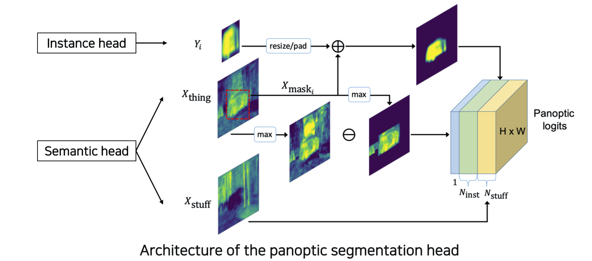
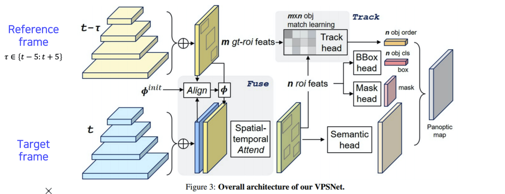
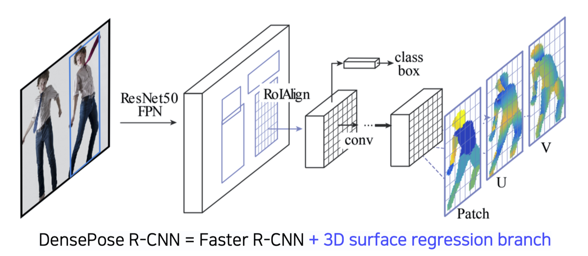

본 정리 내용은 [Naver BoostCamp AI Tech](https://boostcamp.connect.or.kr/)의 edwith에서 학습한 내용을 정리한 것입니다.  
사실과 다른 부분이 있거나, 수정이 필요한 사항은 댓글로 남겨주세요.

---

- Instance,Panoptic segmentation

    # Instance segmentation

    Semantic segmentation과의 Instance segementation이 다른 점은, 전자는 클래스만 구별하고 개체를 구별하지 않지만, 후자는 개체(Instance)까지도 구별한다는 점이다. 즉, 기존의 Semantic segmentation에서  distinguish instances라는 새로운 목표가 추가된 task이다.

    ## Mask R-CNN

    Faster R-CNN이 개량된 형태로, 큰 줄기는 비슷하다. Two-stage detector이다. 아래는 차이점들이다.

    - RoI Pooling(정수 feature) → RoIAlign(소숫점 이하의 feature까지 지원)
        - Interpolation을 통해 소수점 픽셀 레벨의 pooling을 지원하며, 이를 통해 더 정교한 feature를 뽑아 뒷단의 성능까지 향상시켰다.
    - Branch [class classification, box regression] → Branch [[class classification, box regression] + **mask branch**]
        - Mask Branch는 기존의 res를 upsampling하여 80개의 채널에 대해 binary mask로 prediction하는 구조이다.(Mask FCN predictor)
        - 이 때 어떤 mask를 사용할 것인지는 class classification 결과에 따라 다르다.

    ## YOLACT(You Only Look At CoefficienTs)

    Real-time으로 semantic segmentation이 가능한 Single-stage detector이다. 

    

    - ***FPN*** : Feature pyramid를 통해 고해상도의 Feature map을 얻는 Network
    - ***Protonet*** : Mask는 아니지만, Mask를 합성해 낼 수 있는 base가 되는 Prototypes, 즉 여러 물체의 soft segmentation component들을 생성한다. span 가능한 basis라고 볼 수 있다.
    - ***Prediction Head*** : Protonet에서 나온 Prototypes를 적절하게 합성하기 위한 계수, Mask Coefficient를 출력한다.
        - 이후 prototype들과 곱해져 적절한 detection response map(우상단)을 얻게 된다.

    Mask를 효율적으로 생성하기 위해 Mask R-CNN처럼 Prototype 개수를 80개씩 만들지 않고 훨씬더 적은 개수를 설정하는 대신에, 그 때 그 때 coefficient와의 선형결합으로 찾아냄으로써 메모리 부담을 경감시켰다.

    ## YolactEdge

    YOLOACT의 방식을 Edge computing에 접목하기 위해 계산량을 획기적으로 줄인 모델이다.

    

    - 기존의 frame 중 key frame의 feature를 다음 frame에 전달(transform)하여 계산량을 크게 줄였다.
    - 성능은 비슷하면서도 연산량이 많이 줄었기 때문에 edge device에서의 사용이 가능해졌다.

    그러나 아직까지는 마스크가 떨린다던데, 깜빡인다던지 하는 문제가 있다.

    # Panoptic segmentation

    Instance segmentation은 배경에 관심이 없고, 그 위의 물체(객체)를 인스턴스별로 검출하는 데에 탁월했다. 배경을 검출하려면 차라리 Instance segmentation보다는, 개체를 구별할 수 없지만 semantic segmentation이 더 나았다. 이 두가지의 문제점들을 상호 보완하고 동시에 해결하려는 시도로 **`panoptic segmentation`**이 나왔다.(*Stuff + Instances of Things*)

    ## UPSNet

    그야말로 Semantic segmentation과 Instance segmentation을 합친 형태이다.

    

    1. Backbone Network는 FPN으로 고해상도 feature map을 뽑는다.
    2. Semantic Head와 Instance Head가 각각의 역할을 수행한다.
    3. 마지막에, Panoptic head가 이 결과들을 융합하여 하나의 Panoptic logit으로 나타낸다.

    ### Architecture of the panoptic segmentation head

    

    - Instance Head
        - $Y_i$ : 개체 구별 Mask
    - Semantic Head
        - stuff(background) : 그대로 최종 출력(Panoptic logit)에 들어간다.
        - 물체(thing) : Instance head의 Instance response와 더해져서 최종 출력에 추가된다. 전체 출력에서 어느 위치에 해당 물체가 검출되어야하는지 찾아준다.
            - 어느 클래스로도 분류되지 않은 물체들은 Unknown class로 모두 합쳐서 1개의 층으로 최종 출력에 추가한다.

    ## VPSNet(for video)

    단순한 이미지라면 한번의 구별로 끝이나겠지만, 비디오영상이라면 시시각각으로 움직이는 객체들이 매 순간 동일한 객체로 검출되어야할 것이다. VPSNet은 이런 문제를 각 시간별로 모든 픽셀의 대응 관계, 즉 motion을 catch하여 활용하는 Network이다.

    

    1. 이전 시점의 frame(reference frame) feature map을 현재 시점 frame(target frame)에 align하여 검출 률을 높이고, 시간에 따라 smooth한 검출률을 만든다.
        - 여기서 Align한다는 것은 픽셀 단위로 Fusion한다는 의미이다.
    2. 기존 RoI들과 새로 만들어진 현재의 RoI들을 tracking하여 매치함으로써 어떤 연관이 있는지 ML 학습한다.(Track Head) → 같은 물체는 같은 id를 가질 수 있게 된다.
    3. 각 결과들을 모두 합쳐 최종 출력 panoptic map을 형성한다.

    # Landmark localization

    **`Landmark localization(Keypoint estimation)`**은 키포인트를 정의하고 추정/tracking하는 데에 사용된다.

    - 얼굴이나 사람의 포즈를 tracking

    ## Coordinate regression vs Heatmap classification

    Key points를 찾기 위해 사용할 수 있는 방법

    - Coordinate regression : 가장 간단하게 생각할 수 있는 방법으로, box regression처럼 각 포인트의 (x,y)를 사용한다. landmark가 N개라면 2N개가 나올 것이다. 그러나 이 방식은 대체로 부정확하고 일반화가 힘들다는 문제가 있었다.
    - `Heatmap classification` : semantic segmentation처럼 각 채널이 각각의 keypoint를 담당하고, 각 keypoint가 일종의 class로 분류되어서 각 픽셀별로 classification하는 방법이다. 다만 훨씬 좋은 성능을 냈지만, 연산량이 너무 많았다(모든 픽셀에 대해 수행해야하기때문에)

    ### Landmark location to Gaussian heatmap

    Heatmap classification에서 x,y 위치(픽셀)가 주어졌을 때, 이걸 히트맵으로 변환하는 방법은 다음과 같다.

    $$
    G_\sigma(x,y) = exp\bigg(-\frac{(x-x_c)^2+(y-y_c)^2}{2\sigma^2}\bigg)
    $$

    - $(x_c,y_c)$ : center location

    ## Hourglass network

    Heatmap classification을 적절하게 활용한 네트워크구조로 `Hourglass Network`가 있다.

    

    U-Net과 비슷한 구조로, 모래시계같은 형태가 여러 겹 쌓였다고해서 **Stacked Hourglass module**이라고도 부른다.

    **Hourglass 구조가 만들어진 이유**

    - 영상 전체를 작게 만들어 receptive field를 키움으로써 전반적인 context를 보고 landmark를 파악한다.
    - low-level feature에서 skip-connection을 수행해서 정확한 landmark의 위치를 파악한다.

    

    U-Net과 비슷하지만, skip connection이 **concat이 아니라 Add**라는 것이다. 따라서 매 skip connection마다 dimension이 늘지 않는다. 대신, 단순히 skip하는 것이 아니라 또다른 conv layer를 통과하여 매핑해준다. 이런 점에서는 U-Net보다 FPN에 조금 더 가까운 구조라고 볼수도 있다(Add, Conv)

    ## 더 나아가기

    ### DensePose

    신체의 모든 부위에 dense한 landmark를 찾는것 → 곧 3D surface를 얻는 것과 같다.

    `UV map`은 이러한 3D surface를 2D로 펼쳐서(flatten) 이미지 형태로 표현한 좌표 표기법이다. 즉, UV map의 2D 좌표 하나는 특정 3D 위치에 1:1로 매칭된다. 사실, UV map은 3D 모델 위에 texture map을 입히기 위해서 고안된 것이다. 이러한 좌표의 특성을 DensePose에서 차용하여 사용하고 있다.

    

    결국, 입력데이터와 출력 Patch(각 segmentation)을 잘 설계함으로써 2D 구조의 CNN으로 3D를 예측하는 방법을 고안해 낸 셈이다.

    ### RetinaFace

    Multiscale의 FPN을 이용해 다양한 task의 branch를 모두 넣어 다양한 task를 한번에 풀수 있도록 만든 모델이다(*FPN + Multi-task branches*). 또는 Multitask 학습법이라고도 부른다.

    - classification, bounding box, 5 point regression, mesh regression

    이 방식들은 조금씩 차이가 있지만 공통적으로 결국 얼굴에 대한 학습이므로, 이 모든 task들을 학습했을 때 좀 더 적은 데이터로도 backbone network 자체가 강인하게 학습되는 장점이 있다. 

    이러한 경향에서 볼 수 있는 현재 Computer Vision의 큰 흐름은, FPN에 Target-task에 해당하는 head branch만 만들어주어 다양한 응용 모델을 만드는 것이다.

    # Detecting objects as keypoints

    Bounding Box가 아닌 Key point로 object detection을 수행하는 방법에 대해 알아보자.

    ## CornerNet

    **CornerNet**은 Bounding Box가 (좌상단, 우하단) 단 두 개의 점좌표만 있으면 unique하게 결정될 수 있다는 점에 착안하여 고안되었다.

    1. Backbone network(ConvNet)에서 나온 featuremap에 Heatmap을 통하여 각 bounding box의 corner pair를 추출한다.
    2. 각 포인터가 가진 정보를 표현하는 Embedding layer를 통과시킨다. 이 때, 같은 코너에서 나온 embedding point는 서로 같은 object를 표현하는 정보임을 학습시킨다.

    성능보다는 좀 더 속도에 치중한 모델이다.

    ## CenterNet

    ### 1기

    CornerNet의 성능을 조금 더 보완하기 위한 방법으로, (좌상단,우하단) 뿐만 아니라 (중앙) 좌표값도 사용한다.

    ### 2기

    좀 더 정확하게 bounding box를 표현하기 위한 방법으로, (폭, 높이, 중앙)좌표값을 사용한다.

    ---

    ### Reference

    [YOLACT - Real Time Instance Segmentation](https://medium.datadriveninvestor.com/yolact-real-time-instance-segmentation-5cbe6fc2ba36)

    [Introduction To YolactEdge For Real-time Object Segmentation On Edge Device](https://analyticsindiamag.com/introduction-to-yolactedge-for-real-time-object-segmentation-on-edge-device/)

    [Panoptic Segmentation with UPSNet](https://towardsdatascience.com/panoptic-segmentation-with-upsnet-12ecd871b2a3)

    [Video Panoptic Segmentation](https://www.youtube.com/watch?v=AW6ZMy8TWdI&ab_channel=ComputerVisionFoundationVideos)

    [[분석] Stacked Hourglass Networks for Human Pose Estimation](https://curt-park.github.io/2018-07-03/stacked-hourglass-networks-for-human-pose-estimation/)