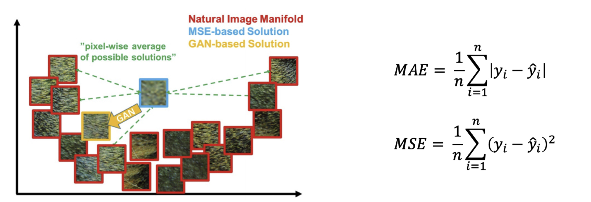
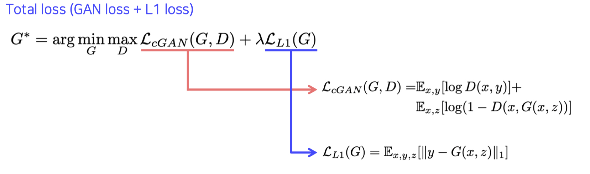
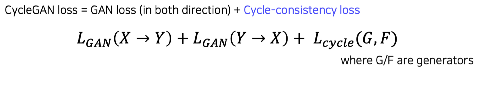
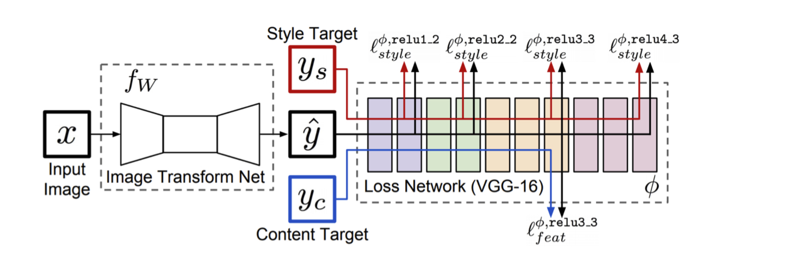
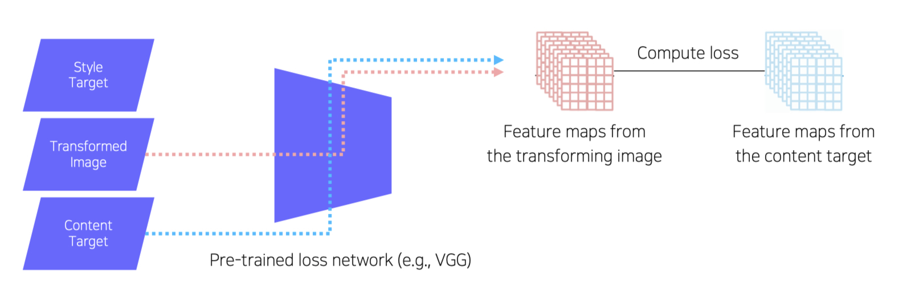

본 정리 내용은 [Naver BoostCamp AI Tech](https://boostcamp.connect.or.kr/)의 edwith에서 학습한 내용을 정리한 것입니다.  
사실과 다른 부분이 있거나, 수정이 필요한 사항은 댓글로 남겨주세요.

---

# Conditional generative model

기존의 Generative 모델은 랜덤하게 샘플링만 가능했다. 그러나 단순히 생성에서 끝나는게 아니라, 원하는 모양대로 조건(condition)을 넣어 이에 맞는 모델을 생성할 수 있다면 훨씬 더 많은 응용가능성들이 있을 것이다.

- 오디오 음질 향상, 기계번역, 제목을 이용해 뉴스 기사 작성 등

Conditional GAN은 rough하게는 기존의 GAN에서 입력 input으로 Condition을 더 추가해주는 것으로 구현할 수 있다. 이미지 변환 기법으로도 다양한 사용 사례가 있다.

- Style transfer, Super resolution(화질 향상), Colorization ...

## 예시 : Super resolution

입력으로 저해상도 영상이 주어지고, 출력으로 고해상도 영상이 나온다.

화질 향상 task는 사실 Conditional GAN으로만 해결할 수 있는 것은 아니고, 이전까지는 단순한 회귀 모델로 해결하려는 시도가 있었다. 저해상도 이미지를 넣어 generator가 고해상도 이미지를 출력하면, 실제 정답 (고해상도) 이미지와 MAE(L1) or MSE(L2) loss를 최소화하도록 학습하는 방식이었다.

일반적인 GAN의 generator '정말 진짜같은가'가 중요하기 때문에, 데이터를 넣었을 때 최대한 그 데이터에 가까운 형태를 뽑아내려고 한다. 즉, 실제 데이터셋에 너무 치우쳐서, 특정 형태의 정답 레이블과 거의 동일한 형태의 결과물을 만들어낸다. 이와 달리, **<U>MAE/MSE based regression model은 학습에 사용된 모든 데이터들에 대해 비슷한 수준의 distance를 유지하는 방식으로 학습하므로, 어떤 데이터에도 치우치지 않고 중간영역을 선택한다.</U>** 따라서 결국은 어정쩡한 average 형태의 이미지, 일종의 blurry한 이미지가 나오게 되는 것이다.

- 예를 들어, 검은색/흰색 이미지를 가지고 학습했다고 하면, MAE/MSE 회귀 모델은 두 색상과의 distance를 모두 최소화해야하므로 어정쩡한 회색(average) 출력이 나와버린다. 그러나 GAN은 검은색이면 검은색, 흰색이면 흰색, 한 레이블에 치우쳐진 결과가 나올 것이다. 그렇게 해야 주어졌던 정답 레이블과 동일한 이미지를 만들 수 있기 때문이다.

Super resolution task에 이와 같은 MAE/MSE based regression model을 적용한 것이 **SRResNet**이고, GAN 방식을 적용한 것이 `SRGAN`이다.

# Image translation GANs

## Pix2Pix

**`Pix2Pix`**는 Conditional Generative Model 중 하나로, 어떤 이미지를 다른 도메인의 상응하는 이미지로 생성하는 모델을 의미한다. 이미지 변환은 input과 output의 출력해상도가 유지되는 task인데, 이런 task를 CNN 기반으로 처음 해결한 방법이다.

- 스타일 변환, segment to image, coloring 등...

`GAN Loss`와 `L1(MAE) Loss`를 모두 쓴다. 이유는 다음과 같다.

1. GAN Loss는 입력된 두개의 pair(input image와 정답 레이블)의 오차를 비교하는 것이 아니라, 단순히 real/fake 여부만 판단하기 때문에 y(정답 레이블)와 비슷하게 학습할 수 없다. 이러한 문제를 보완하기 위해 L1 Loss를 곁들여 쓴다. L1 Loss는 정답과의 차이를 최소화하고, GAN Loss는 실제같음을 추구한다.
2. GAN의 학습은 다른 모델에 비해 불안정하고 어려운 면이 있다. blurry한 이미지를 만들게 되거나, 학습이 잘 되지 않을 경우를 대비하여 L1 Loss도 같이 사용한다.

## CycleGAN

Pix2Pix에서는 supervised learning이 들어가기 때문에, "pairwise data"가 필요했다. 그렇지만 pairwise dataset을 확보하는 것은 어렵다. 그래서 짝이 없는 데이터들도 활용할 수 있는 방법으로 **`CycleGAN`**이 제안되었다.

CycleGAN은 1:1 대응관계가 존재하지않는 데이터셋만으로도 traslation이 가능하도록 만든 모델이다.

- 모네의 그림 ↔ 사진, 말 ↔ 얼룩말

Loss는 양방향의 GAN Loss와 ***cycle-consistency loss***를 모두 사용한다.

- GAN Loss : 양방향으로 변환이 가능해야 하므로, X→Y, Y→X로 가는 방향 모두에 대해 동시에 학습을 수행한다.

    $$
    L(D_X)+L(D_Y)+L(G)+L(F)
    $$

    - $G,F$ : Generator
    - $D_X,D_Y$ : Discriminator
- Cycle-consistency Loss : 이미지를 translation하고, 그 결과물을 다시 원래 방향으로 translation했을 때 원본과 동일한 형태를 가지는가?

만약 GAN Loss만 사용한다면 어떻게 될까? 어떤 input이 들어가든지 현실과 비슷한 이미지를 생성만 해낸다면 Real로 판단할 것이므로, Input 이미지는 어떤 의미도 없어진다. 마치 local minimum에 빠지게 되는 것과 비슷하다.

따라서 단순히 실사와 비슷한 이미지를 생성하는것 뿐만 아니라, 'input 이미지라는 조건을 고려해야한다'라는 제약을 두기 위해 Cycle-consistency Loss를 사용한다(preserve contents). 이 방식은 애초에 supervise가 필요하지 않다. 즉, self-supervised learning이다. 정답 레이블 자체가 자기자신이기 때문이다. Input 이미지를 변환시켜 돌아왔을 때 자기 스스로와 비교한다.

## Perceptual loss

GAN은 학습이 어렵다. 학습의 결과를 평가하기도 어렵고, 가장 쉬운 방식으로 자꾸 빠져버리는, 최빈값 함몰 문제(Mode Collapse)가 있기 때문이다. Alternating traing도 필요하다. 한번의 학습마다 Generator, Disciriminator를 각각 하나씩 만들어주어야 한다. 그럼에도 불구하고 GAN을 사용하는 이유는 퀄리티때문이다. L1 Loss나 L2 Loss를 사용하는 모델에 비해 훨씬 더 고퀄리티의 아웃풋을 낸다.

GAN을 사용하지 않고도 그 정도의 퀄리티를 내는 모델은 없을까? Perceptual loss는 그런 고퀄리티 아웃풋을 만들기 위해 나오게 된 loss이다.

- GAN Loss
    - 학습시키기 어렵고, 코딩이 복잡하다.(Alternating training)
    - **Pre-trained Network가 필요하지 않다.** 학습과정에서 알아서 균형을 맞추기 때문이다.
    - 기학습된 네트워크가 필요하지 않기 때문에 다양한 곳에 적용시킬 수 있다.
- Perceptual Loss
    - **학습과 코딩(구현)이 쉽다. 간단한 순전파&역전파로 학습한다.**
    - 다만, loss를 measure하기 위해서 pre-trained network가 필요하다. 이를 learned loss라고 한다.

Pre-trained classifier의 필터 response가 인간의 시각적 지각과 유사하다는 관찰 결과가 있었다. 기학습된 네트워크의 초기 layer filter값을 보면, edge를 캐치하는 부분이나 color를 캐치하는 부분이 있다. 인간의 시각도 이와 마찬가지로 시각의 초기 단계에서 이런 부분들을 캐치한다고 한다. 따라서, Perceptual loss는 이미지를 인간이 세상을 바라보는 방식, perceptual space로 변환해서 바라볼 수 있지 않을까?라는 관점에서 시작되었다.

- perceptual space는 인간이 시각 정보를 중요한 것과 중요하지 않은 것으로 구별하는 것처럼, 중요한 정보와 그렇지 않은 것이 나누어진 공간이다.

이런 Perceptual loss를 사용하면, GAN과 같이 복잡한 방식을 사용하지 않고도 loss 하나만 추가를 해서 style transfer가 가능한 Generator를 학습할 수 있다.

- Image Transform Net : 주어진 input 데이터에 의존하여 (이를 토대로) 출력물을 생성한다.
- Loss Network : 이미지 분류 문제로 **기학습된 네트워크**를 사용하여, Image Transform Net의 출력물로부터 feature를 뽑아낸다. 이후 `Style Target/Content Target`을 이용하여 출력물과의 loss를 토대로 각자 학습하여 새로운 스타일로 변환시켜준다.
    - **Image Transform Net이 학습 중일때에는 Fix 되어있다(파라미터 update를 하지 않는다).**

### Feature reconstruction loss

Image Transform Net의 출력물(transformed image) $\hat{y}$를 추가적으로 변환하는 과정에서, **Content target**과 비교하여 input 이미지 x에 있던 content를 그대로 유지하고 있는지 확인시켜주는 loss를 `Feature reconstruction loss`라고 한다.

Content target에서 온 feature maps, transformed image에서 온 feature maps 두 개를 비교한 loss로 backpropagation을 수행한다. VGG Net 중간에서 얻어지는 feature map들은 어느정도 semantic한 의미를 담고있는 정보들이기 때문에, Input 이미지와 의미론적으로 비슷한지 체크할 수 있다.

### Style reconstruction loss

이번에는 변환시키고 싶은 형태의 image를 넣었을 때, 그 이미지의 Style feature map을 뽑고, 이를 통해 **Gram matrix**를 만든다. 현재 이미지의 Gram matrix와 원하는 스타일 이미지의 Gram matrix를 비교한 Loss를 `Style reconstruction loss`라고 한다. Feature reconstruction loss는 각 Feature map의 직접적인 비교를 통해 얻어냈지만, Style reconstruction loss는 Gram matrices를 비교한다는 데에서 차이점이 있다.

- Gram matrix가 왜 style을 비교하는 데에 쓰일 수 있는지에 대해서는 [이 게시물](https://www.facebook.com/groups/TensorFlowKR/permalink/512281009112962/)을 참고하도록 하자.
- 간략하게 말해서, Gram matrix는 **feature map에서 spatial information를 배제하고, 이미지 전체의 전반적인 특징인 statistic만 포함하도록 만들었다**고 생각하면 된다.

이런 Style reconstruction loss를 아예 사용하지 않고, Feature reconstruction loss + L2 loss 등을 이용하여 스타일 변환없이 퀄리티 향상을 하는 경우도 있다. 이 경우 content는 동일하게 유지한 상태로, 스타일은 변하지 않는다.

- Super resolution 등

# Various GAN Applications

## Deepfake

GAN이나 Generative Model의 응용사례 중 가장 성공적인 사례는 Deepfake이다. 이미지나 비디오에서 사람의 얼굴, 목소리를 생성할 수 있는 기술이다.

그러나 Deepfake의 발전에 따라 윤리적 위험성이 크게 증가하여, 이를 detection하거나 예방할 수 있는 방법에 대한 많은 연구도 진행되고 있다.

## Face de-identification

GAN의 좋은 사례로, 사람의 익명성/privacy를 보호하는 가짜 이미지를 생성할 수도 있다. 사람의 얼굴을 조금만 변형하여, 사람들은 육안으로 누구인지 구별할 수 있지만 컴퓨터는 구별하지 못하는 가짜 얼굴을 만들 수 있다.

이를 응용하여, 올바른 패스워드를 넣었을 때에만 올바른 얼굴(original image)을 보여주고, 그렇지 않으면 변형된 다른 이미지를 넘겨주는 사례도 있다.(Face anonymization with passcode). 개인정보를 보호하는데에 사용된다.

## Video translation

- Pose transfer : A의 외형과 B의 포즈를 차용하여 B의 포즈를 취하고 있는 A의 영상을 만들어내기
- Video-to-Video translation : semantic segmentation map을 주면, 이에 상응하는 실사 영상을 만들어주는 것 → 게임에 활용 가능!