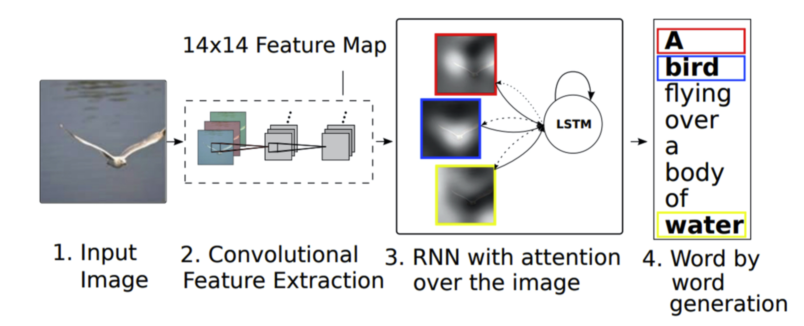
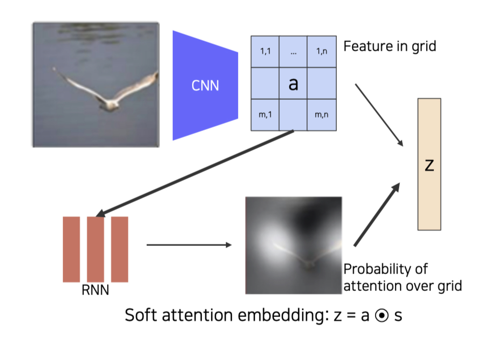
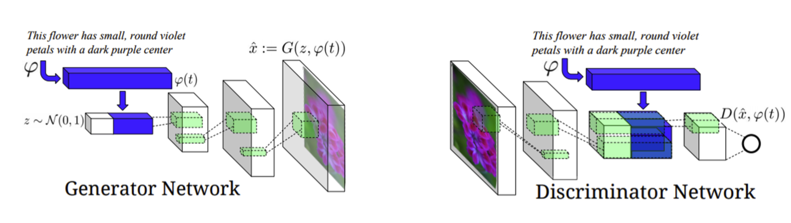
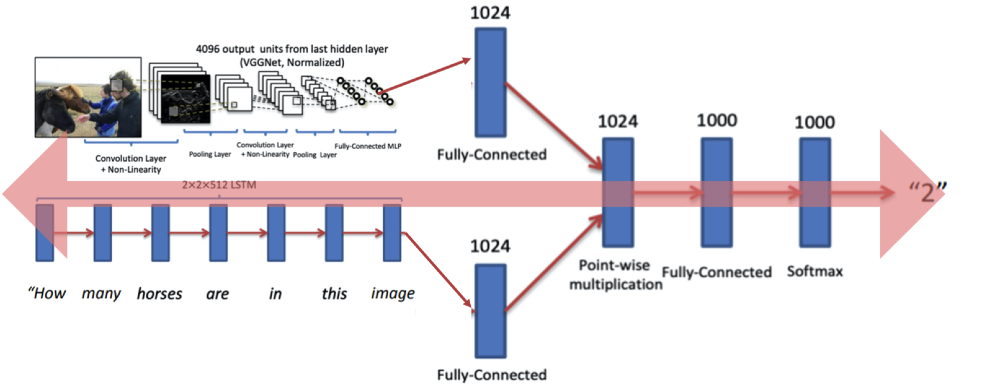
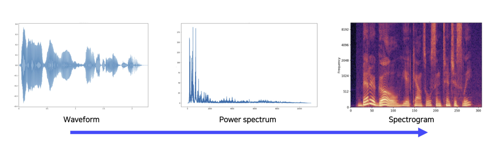
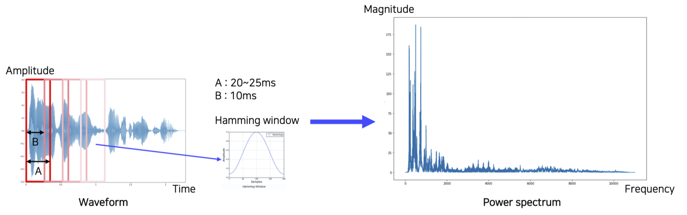

본 정리 내용은 [Naver BoostCamp AI Tech](https://boostcamp.connect.or.kr/)의 edwith에서 학습한 내용을 정리한 것입니다.  
사실과 다른 부분이 있거나, 수정이 필요한 사항은 댓글로 남겨주세요.

---
# Multi-modal learning

기계 학습에 사용되는 데이터의 종류는 다양하다. 일반적으로 이 데이터 중 특정 형태의 데이터만을 모아 학습시키는 것이 기존의 unimodal learning이었지만, **`multi-modal learning`** 에서는 각기 다른 여러 종류의 데이터를 모두 사용하여 학습한다.

서로 다른 데이터 양식(modalities)을 사용할 때 문제점이 몇 가지 생긴다.

1. 표현하는 방법이 다르다.
    - 음성은 파형, 이미지는 픽셀별 matrix, 텍스트는 워드 임베딩 벡터 등...
2. 서로 다른 형태에서 오는 정보의 양(feature spaces)도 unbalance하다.
    - 어떤 텍스트를 주고 그에 맞는 이미지를 달라고 했을 때, 텍스트의 요구사항을 만족하는 이미지는 N개가 존재한다. 거꾸로, 그 이미지 중 하나를 텍스트로 바꿀수는 없다. 1:1 대응관계가 아니라 1:N이기 때문이다.
3. 여러 데이터를 넣더라도, 학습과정에서 모델이 사용하기 쉬운 데이터에 편향된 학습을 진행해 모델의 성능이 잘 나오지 않을 수 있다.
    - 영상 데이터에서 소리를 듣지 않고 입모양으로도 말한다는 것을 catch할 수 있다면, 데이터를 모두 넣어줬더라도 소리 데이터를 비교적 적게 참조하고 영상 데이터의 학습 중 참조 비중이 커질것이다.

그럼에도 불구하고 기존의 학습 한계점들을 해결할 수 있는 방법이기때문에 연구가 활발히 지속되고 있다.

multi-modal을 사용하는 task들의 패턴은 다음과 같다.

1. **`Matching`** : 서로 다른 modality의 data를 공통된 영역으로 가져가 비교하여 매칭한다.
2. **`Translating`** : 하나의 modality data를 다른 modality data로 translation한다.
3. **`Referencing`** : A modality에서 B modality로 출력하고싶을 때, B와 같은 형식의 B'를 참고하여 출력한다.

# Multi-modal tasks : Image & text

## Matching

Visual data & text data를 matching하는 사례를 살펴보자.

### Text embedding

text 데이터는 word 단위로 dense vector로 임베딩한다. 임베딩된 dense representation들을 학습하면 일반화 성능이 생긴다.

임베딩 방식은 `word2vec(Skip-gram model)`을 사용한다. 

1. text 내 한 단어의 원-핫벡터를 한 row로 하는 입력을 넣는다.
2. W를 곱하여 얻은 hidden-layer의 벡터가 워드 임베딩 벡터가 된다.
3. 특정 단어의 워드임베딩 벡터를 중심으로 하여, 주위의 단어들을 예측한다. 중심 단어의 워드 임베딩 벡터에 W'를 곱하여서 만들어낸 많은 y들이 주위 단어들이다.

Skip-gram 모델은 학습 시 단어들간의 관계를 알기 위하여 N개의 이웃하는 단어들을 예측하도록 학습한다.

### Joint embedding

Matching을 하기 위한 공통의 임베딩 벡터들을 학습하는 방식이다. Image Tagging의 사례를 생각해보자. 이미지가 주어지면 그 이미지를 표현하는 여러 단어들을 작성하도록 할 수도 있고, 여러 단어들을 주고 이에 해당하는 이미지를 찾을수도 있을 것이다.

각 pre-trained unimodal model들을 가져와서 각 형식의 데이터를 feature vector 형태로 표시한다. 이때, 두 모델의 output dimension은 동일한 크기로 고정한다(같은 space를 공유하도록). 이후, Joint embedding 부분에서 만약 두 output이 다르면(이미지와 단어가 잘 맞지않으면) 큰 distance를 주고, 그렇지 않으면 작은 distance를 주어 학습시킨다. 이런 방식으로 크고 작은 distance를 부여하여 학습시키는 방법을 `metric learning`이라고 한다.

- 신기하게도, 이렇게 학습을 시킨 joint embedding은 visual 데이터와 text 데이터 사이의 multi-modal analogy relationship까지 모두 가지고 있다. 개 이미지에서 개(단어)를 빼고, 고양이(단어)를 추가하면 고양이 이미지가 나온다.
- 이처럼 이미지와 단어의 관계까지 학습하고 있다보니, 요리 이미지를 넣었을 때 레시피(재료+요리방법)를 주거나 레시피를 넣었을 때 해당 레시피로 만든 요리 이미지를 주는 모델을 만드는 등의 응용도 가능하다. 재료와 요리 방법을 각각 다른 워드 임베딩 모델로 임베딩하여 얻어낸 feature map을 concat하고, 이미지 feature map과 dim을 맞추어 joint-embedding하면 된다.
    - cosine similarity loss로 joint embedding을 학습하고, semantic regularization loss를 사용하여 high-level semantic(예를 들어 레시피와 이미지가 정확히 맞진 않더라도, '튀김요리'라는 카테고리 정도는 맞으면 좋겠다는 식의 가이드)을 학습한다.

## Translating : Cross modal translation

대표적인 translation의 사례는 Image captioning이 있다. Image를 문장으로 바꾸거나(CNN), 문장을 이미지로 바꾸어(RNN) caption 관계를 만들 수 있다. 결국은 CNN과 RNN을 잘 합쳐야한다는 말이다.

### Show and tell

ImageNet에서 pre-train된 CNN 모델을 인코더로 사용하고, 디코더로 LSTM 모듈을 사용한다. 하나의 fixed dimensional 벡터에서 이미지 캡션 전체를 한번에 prediction 한다.

### Show, attend, tell

캡셔닝을 할 때, 좀 더 주목해야하는 단어들이 있기 마련이다. 예를 들어 공 놀이를 하는 소년의 사진이라면, '공'과 '소년'의 이미지에 주목하여 이미지를 생성해야한다.  *Show, attend, tell* 모델은 attention을 사용하여 좀 더 정확한 의미로 캡셔닝을 수행하도록 한다.

CNN이 fixed vector을 출력하지 않고, 공간 정보를 유지하고있는 14x14 feature map을 출력하여 RNN에 넣어준다. 단어 생성시마다 이 feature map을 referencing한다.

- spartial한 feature map이 RNN으로 들어오면, condition을 줘서 어디를 reference해야하는지 heat map을 만들고, 이 **heat map과 feature map을 inner product한 weighted sum z 벡터**를 만든다.
    - attention weight는 probaility가 되고, featrue map은 weight가 된다.

### Text-to-image by generative model

이미지에서 캡셔닝을 하는것이 아니라, 텍스트에서 이에 맞는 이미지를 찾아내는 것은 어떨까? 이 경우, 하나의 텍스트에 대응되는 이미지는 여러 장이 존재한다. 이처럼 1:N의 관계로 출력물을 내야하는 경우 자연스럽게 Generative Model을 사용해볼 수 있다.

Generative Model(인코더)을 학습할 때, fixed dimensional vector로 만들어주는 네트워크에 Gaussian random code를 붙여서 diverser한 output을 만들 수 있도록 해준다. Condition, Input, Sentence 정보가 모두 Generator에 들어가는 모델이다.

Discriminator Model(디코더)는 Generative model이 생성한 이미지를 받아서, row dimensional spatial vector를 뽑아내고, Generative model이 사용했던 sentence를 받아 이미지와의 정합성을 판단하도록 학습한다.

## Referencing : Cross modal reasoning

### Visual question answering

영상과 질문이 주어지면 그에 맞는 대답을 하는 task이다. 텍스트는 RNN으로, 이미지는 Pre-trained NN으로, 각각의 fixed dimensional vector로 만들어준다. 이후 두 벡터들을 Point-wise multiplication으로 두 임베딩 feature가 서로 interaction 할 수 있게 만들어준다. 일종의 joint embedding space라고 볼 수 있다. 이 과정을 end-to-end로 학습시킨다.

이외에도 어텐션 메커니즘을 사용하여 cross modal reasoning을 수행할수도 있다. 각각의 modal을 referencing하며 해결하는 형태이다.

# Multi-modal tasks : Audio

## Sound Representation

Sound는 원래 wave 데이터 형태로 존재하는데, ML/DL에서 사용할 때는 Power spectrum이나 Spectogram, MFCC같은 Acoustic feature들로 변환해서 사용한다. 이런 변환 방식에 대해 알아보자.

### Short-time Fourier transform(STFT )

시그널 프로세싱에서 가장 많이 사용되는 푸리에 변환을 변형시킨 방식이다. 시간 축(t) 전체를 그냥 주파수형태로 모두 옮겨버리면, 시간에 따른 변화를 파악할 수 없다. 그래서 제안된 것이 STFT이다.

위의 그림처럼 슬라이딩 윈도우로 시간축에 따른 표시를 하되, 튀는 부분들을 자르고 가운데 부분들을 강조하는 형태로 windowing을 시킨다(Hamming window).  자르는 크기와 시간등은 하이퍼파라미터이다.

다만, 윈도우를 완전히 겹치는게 아니라 너무 dense하지 않는 선에서 적당히만 overlap 시켜가며 찍어 spectogram으로 만들어준다.

푸리에 변환을 왜 할까? 시간 축의 input signal이 있을 때, 푸리에 변환을 통해 주파수의 삼각함수의 성분을 분해할 수 있기 때문이다. Power spectrum에서 각 feature 별로 frequency를 파악할 수 있게 된다.

- ex - 남성의 목소리는 저주파에 있고, 여성의 목소리는 상대적으로 고주파에 있다.

spectogram은 시간축에서 spectrum들이 쌓인 것인데, 특정 성분이 많을 경우 밝은 흰색으로 표시된다. 이를 통해 특정 시간에 어떤 성분들로 이루어져있는지를 확인할 수 있다.

- 요새는 딥러닝 신경망을 사용할 때, spectogram을 바로 사용하는 경우도 많고, dimension을 조금 낮춰서 melspectogram을 사용하는 경우도 있다. MFCC도 검색해보자.

## Joint embedding

### Sound tagging

현재 소리가 어느 장소(ex - 해변, 교실 등)에서 들리는 소리인지를 파악하는 task이다.

SoundNet은 입력 이미지를 받아 두 개의 Pretrained ImageNet을 통해 Object distribution과 Scene(Place) Distribution을 출력한다. 또한, raw audio를 wave 데이터 형태로 추출해 CNN 구조에 넣어주어, 두개의 head를 최종 층에 두고 각각의 distribution을 사용하여 Place 구성을 따라하고, Object recognition을 수행하도록 한다(KL divergence minimize).

- 이 때 spectogram 대신 waveform을 쓴 것은 특별한 사유가 있는건 아니고, 이 논문이 나왔을 무렵 아직 spectogram 같은 변환 데이터가 자주 사용되지 않았기 때문이다.

이 방식은 기학습된 ImageNet을 fix해두고, 그 분포를 따라가도록 조그마한 CNN 모델을 학습시키는 것이기 때문에 Teacher-student 모델이라고 할 수 있다.

원하는 target task에 pre-trained 모델을 응용할수도 있을텐데, 이 경우 CNN 모델의 Pool5 feature를 뽑아서 classifier를 올려 그 부분만 target task에 대해 학습하도록 한다. 이렇게 하는 이유는 Teacher 모델의 object/scene에 너무 특화되지 않도록, generalization하기 위해서이다.

## Cross modal translation

### Speech2Face

음성을 듣고 그 사람의 얼굴을 상상해내는 네트워크이다. Spectogram이 input으로 들어가고, fixed dimensional vector가 들어오면 Face Decoder에 들어가서 얼굴을 생성해준다.

Speech2Face 모델은 여러 모델을 잘 조합시킨 Module Network라고 할 수 있다. Face Recognition 모델로 VGG-Face Model, Face feature를 정규화된 이미지로 reconstruction하는 Face Decoder, Spectogram을 Voice로 바꾸어주는 Voice Encoder등으로 구성되어있다. Face 벡터가 Voice를 따라하도록 된 구조이다.

### Image-to-speech synthesis

이미지를 넣으면 음성을 만들어주는 방식이다.

이미지에서 단어를 바로 추출하는 것은 아니고, sub-word라고 불리는 유닛(토큰) 형태로 변환하는 Image-to-Unit 모델과, 유닛에서 음성으로 변환하는 Unit-to-Speech 모델 두개의 조합으로 이루어져있다.

### Sound source localization

소리를 input으로 넣고 이미지를 주었을 때, 이미지의 어느 부분에서 이 소리가 나는지 위치를 짚어주는 task이다. 소리의 context를 파악하고, 이 소리의 semantic한 의미와 이미지의 semantic context를 추출하여 비교할 수 있어야 한다.

Visual Network에서 공간정보를 얻고, Audio Network의 출력을 Attention Network에서 내적하여 관계를 규명한다.

Ground truth가 있다면 supervised learning을 수행할 수 있다. 그러나 일반적으로 video는 sound를 동반하므로, 그냥 video을 annotation처럼 활용하여 unsupervised learning도 가능하다. Audio network의 출력물과 attention network의 출력물 visual feature을 metric learning한다.

## Cross modal reasoning

### Looking to listen at the cocktail party

하나의 비디오에서 여러 사람이 말하는 것을 분리하는 task이다. 이 경우 train data를 찾기 힘들다. 마땅한 pairwise data가 잘 없기 때문이다. 그래서 조금 더 smart한 방법으로, 한 사람이 말하는 비디오 여러 개를 합성하여 train dataset을 만든다.

### Lip movements generation

sound source로부터 특정 사람의 목소리, 얼굴, 입모양을 생성해내는 task이다.

9강 실습 미완

---

### Reference

[The architecture of Skip-gram Model](https://www.researchgate.net/figure/The-architecture-of-Skip-gram-model-20_fig1_322905432)