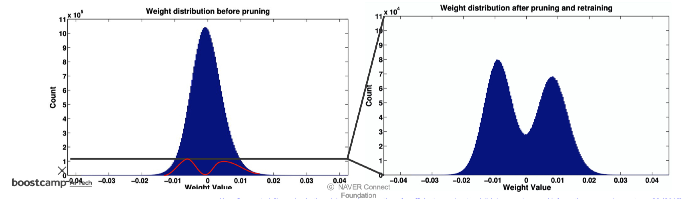
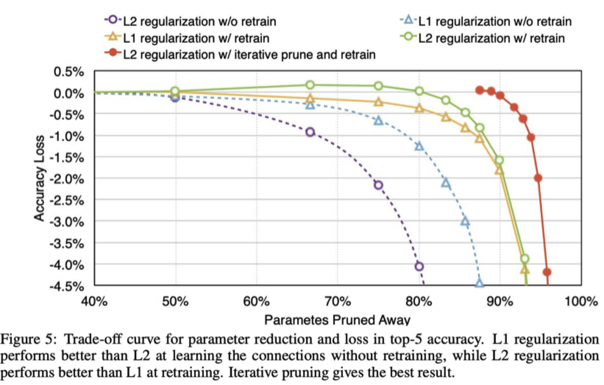
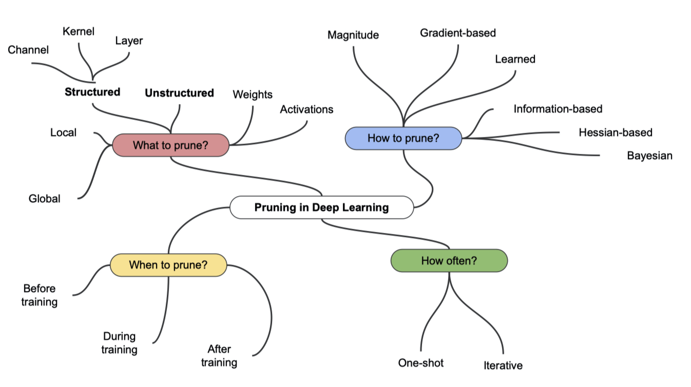
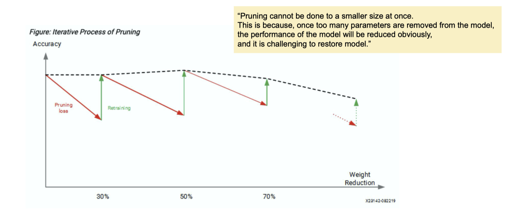
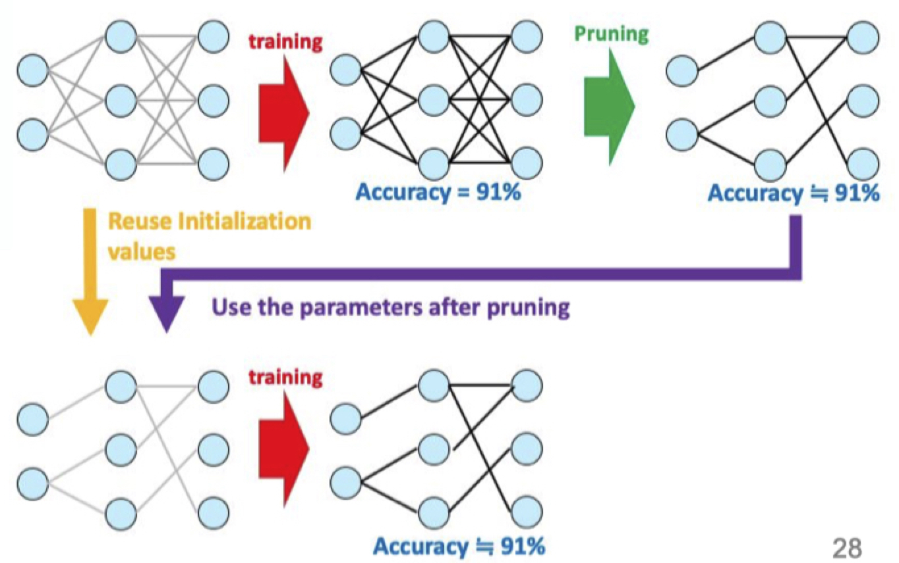
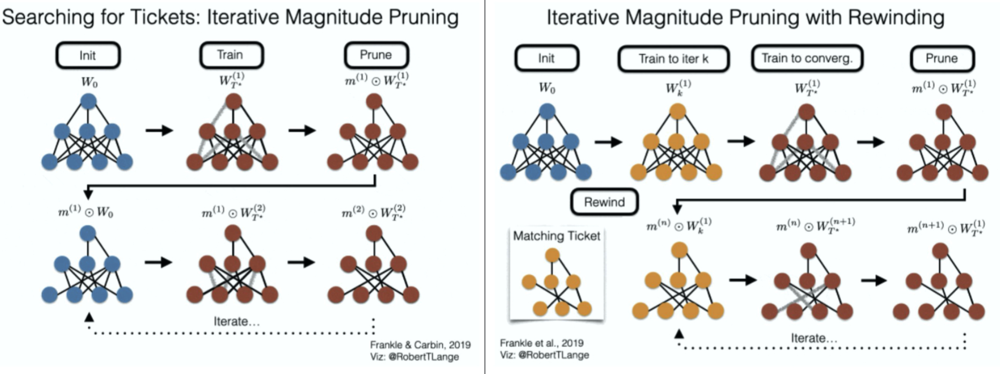

본 정리 내용은 [Naver BoostCamp AI Tech](https://boostcamp.connect.or.kr/)의 edwith에서 학습한 내용을 정리한 것입니다.  
사실과 다른 부분이 있거나, 수정이 필요한 사항은 댓글로 남겨주세요.

---

# Pruning for network compression

모델 학습 시 중요한 파라미터는 살리고 그렇지 않은 파라미터는 덜어내는(가지치기하는) 경량화 테크닉이다.

## Weighted sum

**가중 평균.**

*Decision theory*에서, 중요한 것은 더 반영하고, 중요하지 않은 것은 덜 반영하는 것을 의미한다. 즉, 가중치를 두어서 평균을 내는것(value에 반영하는것)을 의미한다.

## Pruning이란?

Neural Network뿐만 아니라 decision tree에서도 많이 사용되는 방법이다.

- 장점
    - 추론 속도가 빨라진다(파라미터가 줄어드므로)
    - Regularization(모델 복잡도를 줄인다)이 일반화 성능을 높인다.
- 단점
    - 정보의 손실이 생긴다
    - 입자도(granularity, 세밀함)가 하드웨어 가속 디자인의 효율성에 영향을 미친다.
        - 너무 sparse하게 만들어버리면 하드웨어 가속 효율이 떨어진다.

위의 사진을 보면 pruning 이후에 0주위의 weight distribution이 대폭 축소(outline이 10^5→10^4)된 것을 알수 있다. 이는 별로 의미가 없다고 여겨지는 0주위의 정보들을 다 잘라내는 것이다.

그런데 pruning과 이전에 배웠던 dropout 기법은 일견 비슷해 보인다. pruning과 dropout은 무엇이 다른가?

- Dropout도 regularization을 위해 쓴다.
- Dropout은 앙상블 효과를 낼 수 있다. 즉, 어떤 뉴런을 하나 끄고 학습할 때마다 서로 다른 structure의 네트워크를 여러 개 중복해서 학습하는 효과가 있다.
- **`Pruning`은 한번 잘라낸 뉴런을 보관하지 않는다**. 그러나 **`Dropout`은 regularization이 목적이므로 학습 시에 뉴런들을 랜덤으로 껐다가 (보관해두고) 다시 켜는 과정을 반복한다.** 추론 시에는 모든 뉴런을 켜고 수행한다.

과정은 [pruning으로 mask 업데이트 → fine-tune으로 weight 업데이트]를 반복적으로 수행함으로써 이루어진다.

### Regularization

- randomly initialized weight $\theta$에서 시작해서 training을 한다.
- 만약 $\lambda = 0$이라면, regularization을 수행하지 않는다는 말이다. 그러면 파란색 점 $\theta^*$로 수렴한다.
- 그러나 만약 $\lambda > 0$이면, loss에 기존의 weight L2 노름 제곱을 더해준다. 즉, 원래 weight가 크면 클수록 loss가 커지므로 penalty를 먹는다.
    - 따라서 자연스럽게 학습은 weight를 최소화하는 방향으로 간다. 그래서 초록점쪽으로 이동하게 된다.
    - 결과적으로 둘 사이의 어중간한 빨간 점에서 멈추게 된다.

그런데 Pruning은 weight를 직접적으로 잘라내는 것이기 때문에, regularization term에 직접적으로 영향을 미친다.

위의 그래프를 보면, L2 regularization은 retrain을 했을 때와 그렇지 않을때의 차이가 극적으로 나는 것을 확인할 수 있다. L2 regularization은 곧 weight가 0이지 않으면 페널티를 먹인다는 것과 같은 말이므로, weight의 크기를 줄여 영향력을 최소화하는 것이다.

이처럼 크기가 큰 weight를 줄여 overfitting을 막고 generalize하면, pruning 기법을 수행했을 때 90%나 되는 모델의 weight를 모두 잘라버려도 남은 weight들이 충분히 일반화되어있기 때문에 accuracy에 별 차이가 없어진다. 자르기전이나, 자른 후나 weight들의 형태가 고만고만하기 때문이다.

## 여러 Pruning 기법

- 무엇을 잘라낼 것인가?(What to prune?)
    - **unstructured** : 무작위로 개개의 weight들을 잘라내기
    - **structured** : 단위를 잡아서 한번에 잘라내기
- 어떻게 잘라낼 것인가?(How to prune?)
- 언제 잘라낼 것인가?(When to prune?)
- 얼마나 자주 잘라낼 것인가?(How often?)

Pruning은 한번에 수행되지 않고, 가지치기 이후 retraining(fine tuning이나 from scratch)과정을 몇번씩 거친다. 한번에 수행되면 weight들이 다 잘려나가 성능이 급격히 떨어진다. 그보다는, 여러번 반복하여 성능을 복원했다가 야금야금 pruning하는 방법이 주로 사용된다.

## Lottery ticket hypothesis

2015년에 제안되었으며, research 트렌드를 주도했던 논문이다.

위의 이미지를 보면, pruning 전에 traning을 수행한 네트워크의 accuracy와, pruning 후에 training을 수행한 accuracy가 동일함을 알 수 있다. 즉, **<U>기존의 네트워크에서 정말로 accuracy에 영향을 미치는 부분 네트워크는 따로있다는 것</U>**이다. 이런 가설을 제시했던 것이 `lottery-ticket hypothesis`이다.

subnetwork는 original 네트워크보다 파라미터도 적고, epoch을 적게 돌면서도 accuracy는 같거나 더 높은, '로또' 네트워크이다. 이 때 로또 네트워크는 반드시 original 네트워크의 random initializing을 따라가야 효과가 있는 subnetwork이다.

- **Searching for Tickets**
    - 반복적으로 Magnitude(weight의 크기) 가지치기 - 가장 낮은 것부터 일정 부분을 잘라냄
    - random initialization한 네트워크를 가지고 pruning 하고, 다시 잘라낸 뒤의 네트워크를 초기 값(random initialization 했던 값)으로 다시 가지치기하고...
    - 이걸 계속 반복하여 로또 티켓이 되는 노드들만 남긴 네트워크를 찾는 것.
- Iterative Magnitude Pruning with Rewinding
    - 반복적으로 Magnitude(weight의 크기) 가지치기 - 가장 낮은것부터 일정 부분을 잘라냄
    - Searching for Tickets와 다른점은, pruning 이후 재 학습시 매번 초기값이 아니라 어느정도 학습시켜놓은(iteration k 시점의) weight로 초기화한다. → 되감기하는 것 같아서 rewinding이라고 한다.