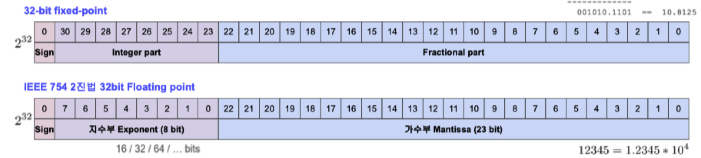
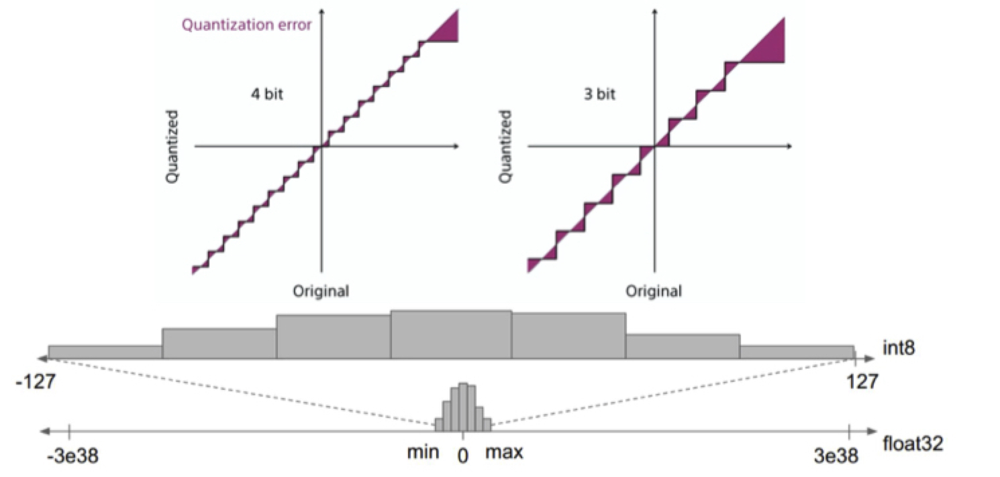
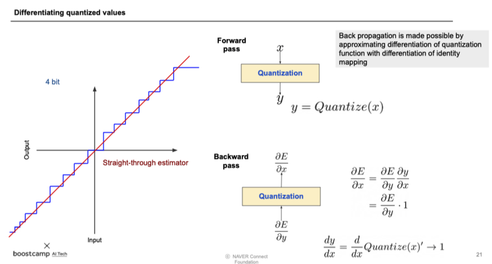
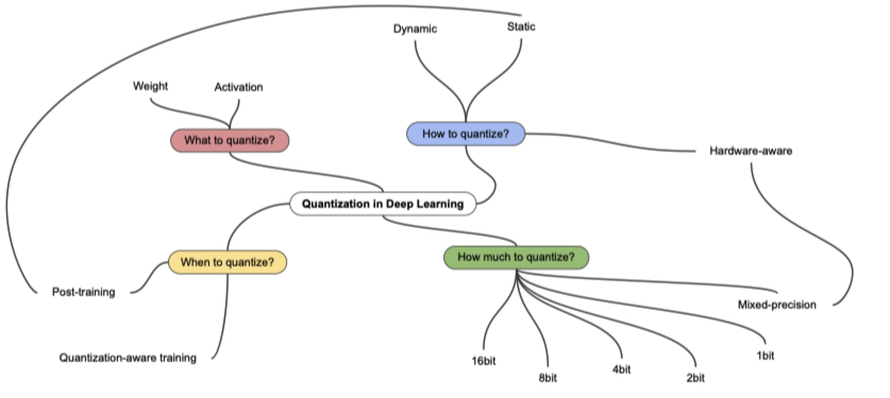

본 정리 내용은 [Naver BoostCamp AI Tech](https://boostcamp.connect.or.kr/)의 edwith에서 학습한 내용을 정리한 것입니다.  
사실과 다른 부분이 있거나, 수정이 필요한 사항은 댓글로 남겨주세요.

---

# Quantization

## Fixed-point & Floating-point

- **Fixed Point**
    - 정수부와 실수부를 나누어 표기한다.
    - 소수 표기 등이 쉽고, floating point에 비하여 훨씬 더 빠르고 효율적이다.
    - 그러나 커버하는 범위가 적다.
- **`Floating Point`**
    - 지수부와 가수부로 나눈다.
    - 자릿수를 바꿀 때, 지수부만 변경하면 된다. 따라서 정확성을 얼마 잃지 않고 훨씬 더 넓은 숫자 범위를 커버할 수 있다. **<U>단, 정보의 표현능력은 같다(2^bit개만 표현할 수 있다)</U>**
    - 대부분의 시스템에서 사용된다.
    - FPU(Floating Point Unit)은 정수나 fixed-point 연산보다 하드웨어(특히 ARM-Mobile/IoT)에서 구현하기 훨씬 더 어렵다.

회로 공간이나 메모리 요구량에서 Integer보다 floating-point number가 더 많은 리소스를 요구한다.

### Precision & Accuracy

- Precision : 분산(variance)개념. 얼마나 몰려있느냐?
- Accuracy : 편향(bias)개념. 목표치에서 얼마나 벗어나 있느냐?

사격으로 치면 영점이 잘맞는 것이 Accuracy가 높은 것, 탄착군 형성 시 Precision이 높다고 생각할 수 있다.

## Quantization이란

- 모델 사이즈 축소(reduction) - 표현능력은 조금 줄어든다.
- 메모리 bandwidth 요구치를 맞추는 데에 도움이 된다.(감소시켜서)
- on-device의 int8 연산이 float32(FLU 사용) 연산보다 더 빠르다.
- **`양자화(Quantization)`**란, 추론 속도를 높이는 테크닉을 주로 말한다(양자 연산은 forward pass만 지원한다).
    - **<U>즉, 주 목적은 training time을 줄이는게 아니라 inference time을 줄이는 것이다.</U>**

양자화는 float32를 최대 256개까지밖에 표현할 수 없는 int8형태로 바꾸는 것이기 때문에, lossy conversion이다. 원래의 정보를 어느정도 잃을 수 밖에 없다.

DL은 지금까지 가장 나은 예측(highest precision)을 보여주기 위한 방법으로 사용해왔는데, 그렇다면 굳이 양자화하는 등의 low precision을 사용해야하는 필요성은 무엇인가?

→ 딥러닝은 연산량이 굉장히 많아 알고리즘으로 치면 효율이 아주 좋지 않은 기법이다. 너무 많은 파라미터를 학습해야 하므로, 어느정도 정보를 손실하고서라도 이를 줄일 가치가 있다.

### Affine quantization

우리가 지금까지 배워왔던 $y=\sigma(wx+b)$ 형태의 변환을 `Affine 변환`이라고 한다. Affine 변환의 특징은, 변환 전 x와 y의 차이가 변환후 $f(x)-f(y)$의 차이로 그대로 맵핑될 수 있다는 것이다.

- $m_f(x-y) = f(x)-f(y)$
- 이 경우, distance는 그대로 보존되지 않지만, distance의 ratio는 보존된다.

### quantized value 미분

그런데 문제는 forward pass하면서 quantization하다보면, backward pass시에 미분불가능한 점들이 생겨버리므로 역전파가 불가능해진다.

- 이 때 $\frac{\partial y}{\partial x}$를 quantize 되기 전의 값으로 집어넣어 계산한다. 그러면 그냥 항등함수라 미분이 제대로 되지는 않지만, 일단 backward pass를 통과할수는 있다.
- 또는, quantization이 안된 값과 완전 quantization 된 값들의 중간을 취해 부드러운 계단식으로 만들어서(smoothing) 미분가능하게 하여 통과시키는 방법도 있다.

## Quantization의 종류

- How to quantize?
    - Dynamic : weight만 quantization하고 있다가 inference 시점에만 activation quantize함
- When to quantize?
    - Post-training(PTQ, static) : 학습 이후에 quantization 하는것
    - quantization-aware training(QAT) : 학습 과정에서 quantization을 가정하고 시뮬레이션을 같이 돌림

하드웨어(CPU, GPU, TPU 등)나 라이브러리마다 지원하는 quantization 종류가 다르다. 그 때 맞추어 적절하게 사용해야한다.

## Quantization 결과 테이블 읽기

---

강의 자료가 굉장히 유용하다. 더 정확하게 이해하고싶다면 PDF의 reference를 모두 들어가 보자.