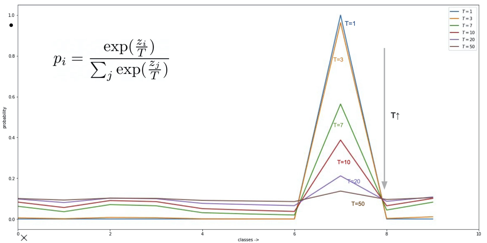

본 정리 내용은 [Naver BoostCamp AI Tech](https://boostcamp.connect.or.kr/)의 edwith에서 학습한 내용을 정리한 것입니다.  
사실과 다른 부분이 있거나, 수정이 필요한 사항은 댓글로 남겨주세요.

---

# Knowledge Distillation

## Knowledge

- Data → Information → Knowledge → Wisdom순으로 Data가 정제된다.
- Knowledge distillation은 이 중 knowledge를 뽑아내는 기술이다.

추가 레퍼런스

[[logit과 sigmoid, softmax의 관계]](https://opentutorials.org/module/3653/22995)

## Knowledge distillation

소금물에서 증류하여 소금을 얻어내듯이, **`지식 증류(knowledge distillation)`**는 커다란 Teacher 모델에서 엑기스(지식)만 뽑아내어 작은 Student 모델로 전달하는 방식이다.

Transfer Learning과 Knowledge Distillation의 차이는 이렇게 비유할 수 있다. 지식을 전달한다는 점에서는 둘 모두 동일하지만, 지식 증류는 사이즈를 줄이는데에 목적이 있다.

- Transfer learning - ex) 영어에서 배운 지식을 프랑스어에 적용시키는 것(도메인이 다름)
- Knowledge distillation - ex) 선생님이 학생에게 역사 지식을 가르쳐주는 것(도메인은 같음)

## Teacher-Student networks & Hinton loss

전체적인 과정은 다음과 같다.

- $t$ = 1일 경우 익히 알고있는 softmax function이므로, 가장 큰 값(즉 가장 확신하는 값)을 제외하고는 다 버린다.
- $t$가 1보다 큰 어떤 상수가 될 경우 $p_i$가 soften 되어 '덜 확신하는' 값이 된다.(soft prediction).
    - 정답이라고 생각하는 값만 중요한 게 아니라, 확신의 과정에서 어느 클래스와 어느 클래스가 더 비슷하다고 생각했는지같은 것도 모두 정보의 일종이다. 이러한 개념을 제프리 힌튼 교수가 처음으로 제시했다.(*"The relative probablities of the incorrect outputs tell us a lot about how the model tned to generalize."*)
- 자세한 설명은 [[이전의 글]](https://blogik.netlify.app/BoostCamp/U_stage/38_annotation_data_efficient_learning/#knowledge-distillation)을 참조해보자.

이 상수 $t$가 어떻게 바뀌느냐에 따라 이렇게 바뀌게된다.

## Zero-mean assumption

- `Zero-mean assumption`
    - logit값들이 zero-mean이 아닌 distillation은 Model compression이라고 부르기 어렵다는 것을 의미한다.
    - 유도 과정은 [[여기]](https://drive.google.com/file/d/1N8lOUoAAIodT7IuRIRRG5i9I2Ltpbxh9/view?usp=sharing)에 있다.

즉, distillation ≠ compression임을 이야기한다.