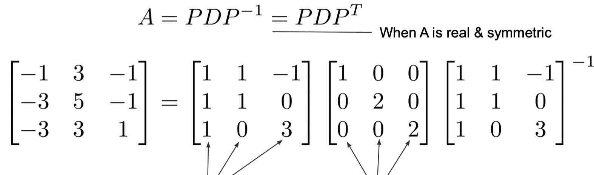

본 정리 내용은 [Naver BoostCamp AI Tech](https://boostcamp.connect.or.kr/)의 edwith에서 학습한 내용을 정리한 것입니다.  
사실과 다른 부분이 있거나, 수정이 필요한 사항은 댓글로 남겨주세요.

---
# 행렬 분해(Low-rank approximation)

행렬 분해라고 했지만, **`Low-rank approximation`**은 단순히 행렬(matrix)만 다루는 것이 아니기 때문에 **저차원(저랭크) 분해(decomposition)** 정도로 볼 수 있다.

- Filter / Kernel / Matrix decompostion
- Matrix / Tensor / Low-rank Factorization
- Low-rank Approximation
- 위 용어들은 대부분 비슷한 의미로 사용된다.

## Three maps

### Map 1 : Matrix(Tensor) is a data modeling tool

전체 구성은 이렇다.

- $A_{nn}$ 행렬은 **Eigenvalue(Spectral) decompostion**과 **Diagonalization**으로 나타낼 수 있다.
- 정사각 행렬이 아닌 $A_{mn}$행렬로 일반화하면, **Singular value decompostion**이 된다.
- 이 개념을 행렬이 아니라 3차원 이상의 Tensor까지 확장하면 **CP decompostion**이나 **Tucker decompostion**을 적용시킬 수 있다(Tucker decompostion이 좀 더 일반적인 방식이다).

### Map 2 : Matrix(Tensor) is a linear transformation(map)

선형변환(map)이란, 차원 축의 이동을 의미한다.

좀 더 formal한 definition으로는, 변환 전과 변환 후의 덧셈과 scalar를 보존하는 변환을 의미한다.

### Map 3 : terminology

강의 슬라이드를 참조하자. 선형대수학적인 용어들이 연결되어있다. 특히 노란색 박스는 꼭 숙지하자.

### Gaussian elimination

가우스 소거법은 행렬의 1차방정식(row)들을 적절하게 조작하여 미지수를 소거하고, 남은 미지수에 대한 선형 결합(1차 방정식)들로 표현하는 기법이다. 이 과정에서 남은 1차 방정식들을 **`basis(기저)`**라고 할 수 있다. 기저는 공간 축을 나타낸다.

n차원 실수 공간 $\mathbb{R}^n$의 하위 공간인 $S$가 있다고 하자. $S$는 벡터들의 집합인데, 이 벡터들은 1. $S$의 span이면서 2.선형독립적이다. 1번은 해당 벡터가 기저의 변형이라는 말이고, 2번은 그 벡터가 내포한 원형 기저가 다른 벡터의 원형 기저와 다른 기저라는 의미이다. 겹치면(dependant) 동일한 기저가 될테니, 사실상 의미없는 벡터가 될 것이다.

- 잘 이해가 되지 않으면, $x+2y=2$와 $2x+4y=4$를 생각해보자. 두 식은 분명 다른 식이지만, 두 식의 기저, 즉 공간은 동일하다.

가우스 소거법을 행하면서 벡터를 소거하기 때문에, **기존의 rank를 축소하게 된다.**

## Kernel method

**`Kernel`**이란 말은 원래 알맹이, 핵심을 의미한다. 대수학에서는 V→W로 이동할 때 W의 중심으로 매핑되는 원소들의 집합을 커널이라고 한다. OS에도, 이미지 프로세싱에도 동일한 용어가 사용되어서 혼선이 있다(umbrella term). 느슨하게 말하자면 central essential part라고 볼 수 있다.

기존의 차원에서는 classify하기 힘든 정보들이, 차원을 높이면 조금 더 분리하기 쉬워질 수 있다. 위의 이미지에서처럼 2차원의 데이터들을 3차원 공간으로 이동시키면, 이들을 가르는 더 명확한 decision surface를 얻을 수 있다(항상 그런것은 아니다).

그러나, 이처럼 차원을 높여 분리하면, 두 점 $x,y$ 간의 거리를 얻기 위해 dot product를 할 때 늘어난 차원의 벡터도 추가로 계산해야 하여 연산량이 과중해진다(computationally expensive).

**`Kernel method`**는 이러한 문제점을 막기 위한 방법으로, 고차원에서 dot product한 결과를 가지고 있는 함수 $K(x,y)$를 토대로 결과를 내되, 기존의 차원에서 dot product하여 연산을 줄이는 기법이다.

- Essential한 part는 $K(x,y)$가 되고, $K(x,y)$에서 이미 구한 부분은 불필요하니 구하지 않겠다는 방식이다.

### Low-rank approximation in model compression

ML 모델에서 filter를 decompose한다.

<Warning>

kernel이 아니라 filter임을 유의하자. kernel은 (WxH)의 2D array이고, filter는 채널까지 포함한 3D array를 일컫는다.

</Warning>

Depth-wise separable Convolution을 통하여 원래의 Regular Convolution에 비하여 Computing 비용을 줄여준다. 다만 Kernel method처럼 원래의 결과와 완전히 동일하지는 않고, approximate하다.

### Low-rank tensor approximation

기존의 모델은 텐서로 이루어져있다. 텐서 모델을 low-rank로 decompose하여 낮은 랭크의 텐서들로 분해시켜 근사(approximate)한다. 이 때 분해하여 얻어낸 텐서들은 essential part이므로 일종의 kernel이라고 볼수도 있다. Convolution의 그 커널과는 다른 의미이다.

대표적인 data-free 방법이다. 이미 학습된 모델을 추가데이터 없이 분해하여 사용하는 방식이기 때문이다.

## Matrix decompostion

$n\times m$의 matrix를 $(n\times r)\cdot(r\times m)$으로 분해한다. 또는 matrix를 잘라내어서(truncate) 사용하기도 한다.

### Eigenvalue Decompostion

**`고유벡터(Eigenvalue)`**란, 어떤 선형변환을 취했을 때 방향은 바뀌지 않고 크기만 변하는 벡터를 의미한다. 

실수이면서 대칭인 (정방)행렬 A가 있다면, $P^{-1}=P^T$가 성립한다.

### Singular Value Decompostion(SVD)

Eigenvalue Decompostion의 케이스를 그대로 들고와서, 정방행렬이 아닌 $n\times m$행렬에도 적용시킬 수 있다. 

슬라이드를 다시 읽어보자.

### (Truncated) SVD ⇒ Principal Component Analysis(PCA)

`PCA`는 SVD에서 한걸음 더 나아가서, 기존의 SVD에서 비교적 더 중요한 eigenvalue들, 즉 principal component들만 남기고 다 제거해버리는것이다.

이외에도 CPD, NMF, TKD 등의 여러 방법들이 있다.

## Tensor decompostion

기존의 모델은 텐서로 이루어져있다. 텐서 모델을 low-rank로 decompose하여 낮은 랭크의 텐서들로 분해시켜 근사(approximate)한다. 이 때 분해하여 얻어낸 텐서들은 essential part이므로 일종의 kernel이라고 볼수도 있다. Convolution의 그 커널과는 다른 의미이다.

대표적인 data-free 방법이다. 이미 학습된 모델을 추가데이터 없이 분해하여 사용하는 방식이기 때문이다.