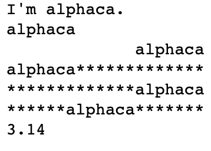

본 정리 내용은 [Naver BoostCamp AI Tech](https://boostcamp.connect.or.kr/)의 edwith에서 수강한 내용을 정리한 것입니다.  
사실과 다른 부분이 있거나, 수정이 필요한 사항은 댓글로 남겨주세요.

---

1주차

# 파이썬 개요

## Python

- 플랫폼 독립적인 인터프리터 언어(Interpreted Language)

|항목|컴파일러 언어|인터프리터 언어|
|---|:-:|:-:|
|작동방식| **소스코드를 기계어로 먼저 번역** , 해당 플랫폼에 최적화되어 프로그램 실행 |별도의 번역과정 없이 **소스코드를 실행시점에서 해석**|
|장점|실행속도가 빠름|간단히 작성, 메모리 필요량 적음|
|단점|한번에 많은 메모리 필요|실행속도가 느림|
|주요 언어|`C`, `JAVA`, `C++`, `C#`|`Python`, `Scala`|

- 객체지향 동적 타이핑 언어
    - **실행순서가 아닌 단위 모듈(객체) 중심으로 프로그램 작성**
    - method와 attribute를 가지고 있음
- 동적 타이핑 언어
    - 프로그램 **실행 시점에** 프로그램이 사용해야 할 **데이터에 대한 타입을 결정**함

# 파이썬/AI 개발환경 준비하기

## 파이썬 인터프리터

- 2.7과 3.X 버전이 존재 : 현재는 3.X 기준으로 모든 시스템이 작동됨 → 2020년부터 `Tensorflow`에서 python 2 deprecated
- 기존 라이브러리 사용 여부에 따라 버전 선택(아직 아마존에서는 python 2를 사용하는 부서가 있다고..)
- `Anaconda` : 일반적인 파이썬 인터프리터와 달리 다양한 과학계산용 모듈들을 묶어서 패키지한 인터프리터

## 코드 편집기

- 어플리케이션형
    - `VSCode`, `Anaconda`, `PyCharm`
    - 이 중 `Anaconda`는 ML의 사실상 표준
- 웹 기반 인터랙티브 편집기
    - `Jupyter`, `CoLab`
        - 편집기라기보다는 데이터 분석 도구의 느낌이 강함

## Jupyter

- IPython 커널 기반 대화형 python shell
- 일반적인 터미널 shell + 웹 기반 데이터 분석 Notebook 제공
- 미디어, 텍스트, 코드, 수식 등의 하나의 문서로 표현 가능
- 사실상 데이터분석 Interactive Shell의 표준
- **Ju**lia + **Pyt**hon + **R**

## Colab

- 구글이 개발한 클라우드기반 jupyter notebook
- Google Drive + GCP + jupyter 등이 합쳐져서 사용자가 손쉽게 접근
- 초기 모듈들이 세팅되어있다는 장점
- Google Drive 파일 업로드하여 사용 가능
- VSC 연결하여 사용 가능
- V100 이상의 GPU 무료 사용 가능

### 커맨드 정리

- `conda activate [가상환경]` - conda 가상환경 실행(디폴트 설치 가상환경 base)
- `conda deactivate` - conda 가상환경 종료
- `jupyter notebook` - jupyter 웹 즉시 실행. 커맨드 실행 폴더가 root dir
- Jupyter 커맨드
    - `cmd + return` - 셀 수행(메모리 적재)
    - `opt + return` - 새로운 셀 생성 후 전환
    - `shift + tap` - 툴팁
    - `cmd + <,>` - 들여쓰기, 내어쓰기
    - 작성 중 `esc` - 코멘트 모드 (작성중은 에디터 모드)
        - `b` - 아래쪽에 셀 추가
        - `a` - 위쪽에 셀 추가
        - `ii` - 실행 중지
        - `dd` - 셀 삭제
        - `z` - 셀 지우기 취소
        - `shift  + m` - 셀 병합
        - `x` - 셀 오려두기
        - `v` - 새 셀 생성 후 붙여넣기
        - `mm` - 마크다운 변환
        - `yy` - 코드로 변환
        - `h` - 단축키 확인
- Colab 커맨드
    - 미묘하게 Jupyter와 다르니 자료를 보고 학습할 것
- VSC 커맨드
    - 드래그 후 `cmd + d` - 드래그한 코드와 같은 코드들을 일괄 지정하여 수정 가능
    - `opt + click` - 다중 커서 설정
    - `opt + up/down` - 드래그 X 시 해당 라인만, 드래그 O 시 해당 범위 통째로 코드 이동
    - `opt + shift + up/down` - 드래그  X 시 해당 라인만, 드래그 O시 해당 범위 통째로 복사하여 코드 이동
    - `opt + shift + i` - 드래그 한 모든 줄의 끝부분에 다중 커서 생성
    - `opt + shift + 드래그` - 현재 커서 위치 기준으로 드래그한 모든 라인에 다중 커서 생성
    - `cmd + return` - 현재 커서 위치와 관계없이 다음 줄로 커서 이동(엔터)
    - `cmd + u` - 이전 커서 위치로 이동
    - `cmd + b` - 프로젝트 디렉토리 사이드바 토글
    - `cmd + p` - 파일 퀵 오픈
    - `cmd + ,` - 유저 세팅 오픈
    - `cmd + k + s` - 단축키 확인

---

# 파이썬 기초

## 변수

`var = value` 에서 value는 var에 저장되는데, var는 어디에 저장될까?

변수는 값을 저장하는 장소이며, 변수도 메모리 주소를 가지고 있다. 따라서 **변수에 들어가는 값은 메모리 주소에 할당**된다.

따라서 `var = value` 의 의미는 "A는 8이다"가 아닌, 
**"A라는 이름을 가진 메모리 주소에 8을 저장하라"**의 의미와 같다.

## Dynamic Typing

코드 실행시점에 데이터의 Type을 결정하는 방법. 파이썬과 같은 **동적 언어들의 장점이자 단점**.

할당시킬 value를 보고 변수의 타입을 결정하기 때문에, 일반적인 정적 언어(`JAVA`,`C` 등)처럼 일일이 타입 명을 붙여주지 않아도 되고, 계산 중간에 변수의 타입을 바꿀수도 있다.

그러나 역으로, 타입을 추론해야하므로 정적 언어에 비해 느릴 뿐만 아니라 예상치못한 타입에러를 뿜는 경우가 종종 있다. 경험상으로는, `None` type등 알맞지 않은 value를 받아도 에러가 나지 않고 여러 함수를 거친 뒤에야 문제가 터져 tracing이 굉장히 힘들었던 경험이 있다.

이러한 문제 때문에 `JavaScript`는  `TypeScript`라는 새로운 정적 타이핑형 variable이 생겨났고, `Python`에서도 3.5 이후에 PEP 484에 기반하여  `typing`과 같은 타입 힌트 모듈이 생겨나는 계기가 되었다.

## 부동소수점

Python3 에서는 발생하지 않지만, Python2 까지는 부동소수점 문제가 발생한다.

컴퓨터는 **모든 수를 이진수로 바꾸어서 저장**하는데, 실수 또한 마찬가지이다.

실수를 이진수 변환한다고 생각할 때, 정확히 1로 나누어떨어지지 않는 문제 때문에 **소수점 이하 이진법 자릿수가 무한히 늘어나게 된다.** 이 경우의 반올림 오차는 그리 크지 않다.

예를 들어 0.1을 이진수 변환하면 다음과 같다.

$0.1 = 0.00011001100110011....._{(2)}$

<Info>

컴퓨터는 실리콘 반도체로 구성되어있다. 반도체는 특정 자극을 줬을 때 전류가 통하는데, 전류의 흐름을 제어하여 흐르는 상태를 1, 흐르지 않는 상태를 0으로 표현할 수 있다. 이처럼 표현할 수 있는 형태가 0, 1 두가지밖에 존재하지 않기 때문에, 반도체로 구성된 컴퓨터도 결국은 모든 수와 형태를 0과 1로 표현하게 된다. 이런 한계를 벗어나기 위해 최근에 양자컴퓨터와 같은 새로운 형태의 컴퓨터 도입을 연구하고 있다.

</Info>

## 리스트

### 패킹과 언패킹

- 패킹 : 한 변수에 여러개의 데이터를 넣는 것
- 언패킹 : 한 변수의 데이터를 각각의 변수로 변환

```python
p = [1,2,3] # 패킹
a, b, c = p # 언패킹, a=1, b=2, c=3
```

### 이차원 리스트 복사

일반적으로 리스트를 참조하지 않고 복사하고 싶을때는 `list1 = list2[:]` 의 방식을 많이 사용하곤 한다.

그러나 이는 일차원 리스트의 포인터에 한정된 개념이라, 이차원 리스트의 겉 포인터만 바뀌고 내부의 리스트 포인터는 그대로인 상태이다. 이러한 참조 상태를 피하고 싶다면, `copy` 모듈의 `deep_copy()`를 사용한다.

```python
import copy

origin = [[1,2,3], [4,5,6]]
clone = origin[:] 
clone2 = copy.deepcopy(origin)

clone[0][3] = 7

print(clone) # [[1,2,7], [4,5,6]]
print(origin) # [[1,2,7], [4,5,6]] --> 내부 리스트는 그대로 참조되어있으므로 변경됨
print(clone2) # [[1,2,3], [4,5,6]] --> 내부 리스트까지 모두 포인터가 바뀌어있으므로 변경되지 않았음
```

## 함수

어떠한 일을 수행하는 코드의 덩어리.

다음과 같은 장점을 가진다.

- 반복적인 수행을 1회만 작성 후 호출
- 코드를 논리적 단위로 분리
- 캡슐화 : 인터페이스만 알면 타인의 코드를 사용할 수 있음

따라서 코드를 **하나의 개조식, 글로 생각하고 타인이 보기쉽도록 만들어야 한다**.

### parameter와 argument

- parameter : 함수의 입력 값 인터페이스(추상화 형태)
- argument : 실제 파라미터에 대입된 값

## Console I/O

### f-string

python 3.6 이후, PEP498에 근거한 formatting 기법

```python
name = "alphaca"
print(f"I'm {name}.")
print(f'{name:20}') # 왼쪽정렬이 기본, 총 20칸 할당
print(f'{name:>20}') # 오른쪽 정렬, 총 20칸 할당
print(f'{name:*<20}') # 왼쪽 정렬, 총 20칸 할당, 문자가 없는 공간에 * 채우기
print(f'{name:*>20}') # 오른쪽 정렬, 총 20칸 할당, 문자가 없는 공간에 * 채우기
print(f'{name:*^20}') # 가운데 정렬, 총 20칸 할당, 문자가 없는 공간에 * 채우기

number = 3.141592653589793
print(f'{number:.2f}') # 실수형, 소수점 이하 2자리
```



## 조건문


### 비교 연산자 is, is not

일반적으로 자주 사용되는 `==` , `!=` 연산자는 두 var의 **값을 비교**한다.

python에는 이와 비슷하게 보이지만, **객체 메모리주소(id)를 비교**하는 비교연산자 `is` 와 `is not` 이 있다.

```python
a = 300
b = 300
c = a
print(a==b) # True, 값이 같음
print(a is b) # False, 서로 다른 객체(메모리 주소)임
print(a is c) # True, 서로 같은 객체(메모리 주소)임

# 예외 1
d = 5
e = 5
c = a
print(d==e) # True
print(d is e) # True, -5~255 까지는 python에서 정적메모리로 판단하여, 같은 객체로 연결시켜줌
print(d is f) # True

# 예외 2
print(nan is nan) # True
print(nan == nan) # False
```

자세한 내용은 StackOverflow의 해당 링크를 참조한다.

[Is there a difference between “==” and “is”?](https://stackoverflow.com/questions/132988/is-there-a-difference-between-and-is)


## 스크립트 파일과 모듈의 시작점

```python
if __name__ == "__main__": # 인터프리터에서 해당 모듈을 호출하였을경우
```

`__name__` 변수를 통해 현재 스크립트파일이 시작점인지 모듈인지 확인할 수 있다. 이 중 인터프리터는 해당 변수 value가 `__main__` 으로 존재한다.

자세한 내용은 코딩도장의 해당 파트를 참고하자.

[모듈와 시작점 알아보기](https://dojang.io/mod/page/view.php?id=2448)

## 함수 호출 방식 - Call by Object Reference

python은 함수로 argument를 넘길 때 객체의 주소를 전달한다.

전달된 객체를 **참조하여 변경**시 호출자에게 영향을 미치지만, **새로운 객체로 할당할경우** 호출자에게 영향을 주지 않는다.

```python
def decide_lunch(lunch):
	lunch.append('Milk') # 기존의 호출자를 참조 변경하므로 영향을 미침
	lunch = ['Bibimbap'] # lunch 새로운 객체를 생성한 것이므로 함수 스코프에 그침

lunch = ['Sandwich']
decide_lunch(lunch)
print(decide_lunch) # ['Sandwich', 'Milk]
```

---

# 파이썬 자료 구조(Data Structure)

## Dictionary

### Dict 활용(Lab-dict)

- Command Analyzer
    - 서버에 사용자가 명령어를 입력한 기록을 확인할 수 있음
    - `{command : id}` 형태

## Collections

### deque

- Stack과 Queue를 지원하는 모듈
- **List에 비해 시간복잡도가 효율적인 자료 저장 방식** - <U>일반적인 pop, append연산도 더 빠르게 수행한다</U>
- `rotate` , `reverse` 등 `Linked List` 의 특성을 지원함

`%timeit [측정할 함수()]`  : Jupyter Notebook 내장 속도 측정 

### defaultdict

- 하나의 지문에 각 단어가 몇 개나 있는지 세고 싶을 경우
- Text-mining 접근법 - Vector Space Model

### Counter

- List를 인자로 받을시
    - List 내부의 원소 갯수를 세어 dict 형태로 저장
- (키, 횟수)쌍의 dict를 인자로 받을 시
    - `list(Counter.elements())`를 통해 다시 리스트 형태로 변환 가능
- **Set 연산들을 지원함(Set의 확장형)**

### namedtuple

- Tuple 형태로 **Data 구조체**를 저장하는 방법
- 저장되는 data의 variable을 사전에 지정해서 저장함

```python
from collections import namedtuple
Point = namedtuple('Point', ['x', 'y']) # namedtuple(구조체명, 구조체변수)
p = Point(11, y=22) # x=11, y=22
x,y = p

print(p[0] + p[1]) # 33
print(x,y) # 11 22
print(p.x + p.y) # 33
print(Point(x=11, y=22)) # Point(x=11, y=22)
```

---

# Pythonic Code

- **파이썬 특유의 문법**을 활용하여 효율적으로 코드 표현
- 그러나 최근에는 많은 언어들이 서로의 장점을 채용하면서 스타일이 희석됨

## List Comprehension

- 기존 List를 사용하여 간단히 다른 List를 만드는 기법
- 파이썬에서 가장 많이 사용되는 기법 중 하나
- 일반적으로 for + append보다 속도가 빠름

```python
s1 = "abc"
s2 = "123"

# s1과 s2에서 각각 한 원소들을 뽑아서 조합
result1 = [i+j for i in s1 for j in s2]
print(result1)
# ['a1', 'a2', 'a3', 'b1', 'b2', 'b3', 'c1', 'c2', 'c3']

# s2의 한 원소를 기준으로 s1의 각 원소들 조합, 이를 하나의 리스트로 묶음
result2 = [[i+j for i in s1] for j in s2]
print(result2)
# [['a1', 'b1', 'c1'], ['a2', 'b2', 'c2'], ['a3', 'b3', 'c3']]
```

## enumerate

- List의 element를 추출할 때  번호를 붙여서 추출

```python
# 텍스트 정제에서 다음의 테크닉이 자주 사용됨
text = 'Alphaca lives in Seoul'
print({v : i for i, v in enumerate(text.split())})
# {'Alphaca': 0, 'lives': 1, 'in': 2, 'Seoul': 3}
```

## zip

- <U>두개의 List 값을 병렬적으로 추출함</U>

```python
alist = ['a1', 'a2', 'a3']
blist = ['b1', 'b2', 'b3']
for a, b in zip(alist, blist): # 병렬적으로 값을 추출
	print(a,b)
'''
출력값
a1 b1
a2 b2
a3 b3
'''
```

## lambda

- 함수 이름 없이 함수처럼 쓸 수 있는 익명함수
- 수학의 람다 대수에서 유래함

```python
f = (lambda x, y : x + y)
f(10, 50) # 60

(lambda x, y : x+y)(10, 50) # 60
```

- Python 3부터는 공식적으로 권장하지 않지만(PEP 8).. 아직 쓰이는 곳은 많음.
    - 어려운 문법
    - 테스트의 어려움
    - 문서화 docstring의 지원 미비
    - 코드 해석의 어려움
    - 이름이 존재하지 않는 함수의 출현

## map

- function을 List의 각 원소에 적용
- 두 개 이상의 List에도 사용 가능, if filter도 사용 가능
- python 3부터는 iteration 반환 → List 형변환 해야 List로 사용가능
    - iteration은 실행 시점의 값을 생성하므로 메모리가 효율적이다

```python
ex = [1,2,3,4,5]
f = lambda x, y : x + y
print(list(map(f, ex, ex)))
# [2,4,6,8,10]
# 그냥 map함수를 반환할 경우 generator 반환
```

- lambda와 마찬가지로 최근에는 map보다 list comprehension을 사용하는 것을 더 권장함

## reduce

- `map` function과 달리 <U>List에 똑같은 함수를 적용해서 **통합(누적, 축적)**</U>
- 이전 계산의 결과값을 x로 다시 잡고, 다음 원소를 y로 잡음

```python
from functools import reduce
print(reduce(lambda x, y: x+y, [1,2,3,4,5]))
# 15
# (((1+2)+3)+4)+5 -> 15
```

## iterable objects

- sequence 자료형에서 데이터를 순서대로 추출하는 object
- 내부적 구현으로 `__iter__`과 `__next__`가 사용됨
- `iter()`와 `next()` 함수로 iterable object로 바꾸어 사용

```python
cities = ['Seoul', 'Paris', 'Tokyo']
goto = iter(cities)
print(next(goto)) # 'Seoul'
print(next(goto)) # 'Paris'
print(next(goto)) # 'Tokyo'
print(next(goto)) # Exception : Stop Iteration 
```

## generator

- iterable object를 특수한 형태로 사용해주는 함수
- **<U>element가 사용되는 시점에 값을 메모리에 반환</U>**
    - yield를 사용해 한번에 하나의 메모리만 반환

```python
def generarator_list(value):
	result = []
	for i in range(value):
		yield i

for a in generator_list(50):
	print(a) # a 호출시마다 생성하여 전달 -> 메모리 절약
```

- 다음의 경우에 generator를 사용하자
    - **List 타입의 데이터를 반환해주는 함수**
        - 읽기 쉽기도 하고, 중간 과정에서 loop가 중단될 수 있다면 더 효율적이다
    - **큰 데이터를 처리할 때**
        - 데이터가 커도 (메모리 적재 효율이 좋아) 처리의 어려움이 없다
    - **파일 데이터를 처리할 때**

## arguments 전달 방법

### keyword argument

- 함수에 입력되는 parameter의 변수명을 사용
- arguments를 넘김

### default argument

- parameter의 기본 값을 사용, 입력하지 않을 경우 기본 값 출력

### variable-length argument

- **개수가 정해지지 않은 변수**를 함수의 parameter로 사용
    - 다항 방정식, 마트 물건 계산 함수
    - argument가 몇 개나 들어올 지 모름
- Asterisk(*) 기호를 사용하여 parameter 표기
- 입력된 값은 **tuple type**으로 사용가능
- 가변인자는 **오직 한개**만, **맨 마지막 parameter 위치**에 사용 가능
- 일반적으로 `*args` 를 변수명으로 사용

### parameter 기재 순서

`**def 함수명(p1, p2, *args, **kwargs)**`

### asterisk unpacking

- asterisk(*)는 곱 연산, 제곱 연산, 가변인자에도 쓰이지만, unpacking에도 사용된다.
- tuple, dict 등 자료형 안에 들어가 있는 값을 unpacking한다.
- 함수의 입력값, zip 등에 유용하게 사용 가능하다.

```python
# 사용법 1 - 가변인자에 언패킹해서 arguments 넘기기
def asterisk_test1(a, *args):
	print(a, args) # 언패킹된 다수의 arguments들이 하나의 튜플 args로 묶임
	print(type(args))

asterisk_test1(1, *(2,3,4,5,6))
# 1 (2,3,4,5,6)
# <class 'tuple'>

def asterisk_test2(a, args):
	print(a, *args) # 패킹되어 넘겨진 args가 언패킹되어 다수의 varaible로 출력
	print(type(args))

asterisk_test2(1, (2,3,4,5,6))
# 1 2 3 4 5 6
# <class 'tuple'>
```

```python
# zip과 함께 사용하는 경우
# 각 리스트의 첫 원소와 두 번째 원소만 따로 묶어 각각 리스트로 만들고 싶다면

ex = ([1,2], [3,4], [5,6])
for value in zip(ex):
	print(value)
'''
출력값
([1,2], )
([3,4], )
([5,6], )
'''

for value in zip(*ex): # 튜플 언패킹
	print(value)
'''
출력값
(1,3,5)
(2,4,6)
'''
```


---

환경 설정 기록

`miniconda 4.8.2` - brew cask install

`VSC`