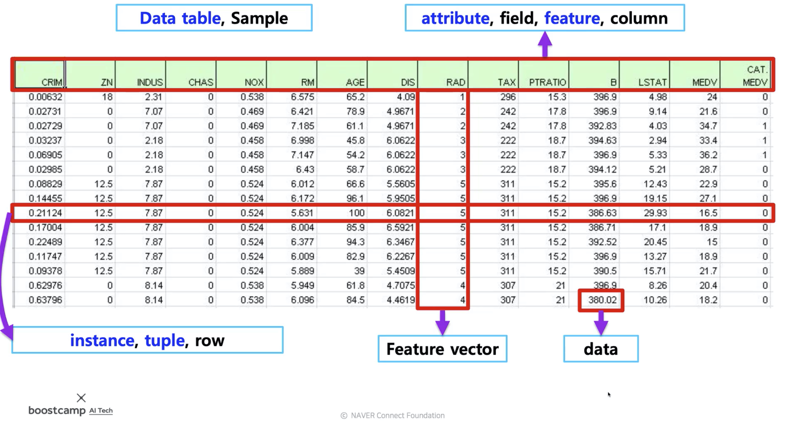
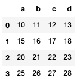
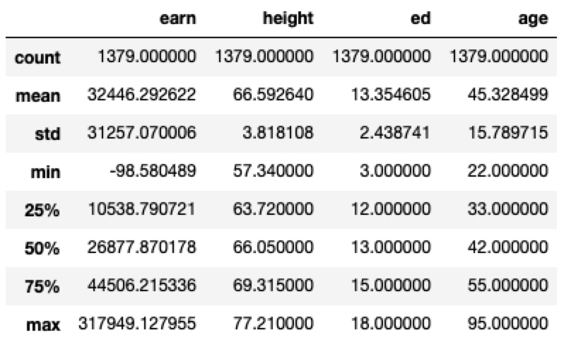

본 정리 내용은 [Naver BoostCamp AI Tech](https://boostcamp.connect.or.kr/)의 edwith에서 수강한 내용을 정리한 것입니다.  
사실과 다른 부분이 있거나, 수정이 필요한 사항은 댓글로 남겨주세요.

---

# Pandas

`panel datas`에서 나온 이름으로, **구조화된 데이터의 처리를 지원**하는 Python의 라이브러리이다. Python의 엑셀이라고 할 수 있다.

- 고성능 array 계산용 라이브러리인 numpy와 통합하여 강력한 스프레드시트 처리 기능을 제공한다.
- 인덱싱, 연산용 함수, 전처리 함수 등을 제공한다.
- 데이터 처리 및 통계 분석을 위해 사용된다.
- Tabular 데이터(테이블형 데이터)를 다루는 데에 최적화되어있다.



이 중, Data Table 전체를 포함하는 객체를 **`DataFrame`**, Column 하나에 해당하는 데이터셋 객체를 **`Series`**라고 한다.

## Series

```python
list_data = [1,2,3,4,5]
example_obj = Series(data = list_data)
example_obj
'''
0    1
1    2
2    3
3    4
4    5
dtype: int64
'''
```

#

`data` 파라미터를 받아 객체를 생성하며, `Numpy` 의 `ndarray` 를 기반으로 만들어진, `Pandas` 에서 사용하기 위한 wrapper 객체라고 볼수도 있다.(Subclass of `numpy.ndarray`)

특이한 점은, 위와 같이 `[1,2,3,4,5]` 라는 데이터만 들어가는것이 아니라, 이 데이터의 인덱스 값 `[0,1,2,3,4]` 도 같이 저장된다. 이 인덱스값은 **<U>문자열로도 지정 가능</U>**하다.

<Primary>

Series 객체를 생성할 때, Index를 기준으로 생성하므로 만약 data가 없는 index가 있다면 NaN값이 채워진다.

</Primary>

- data와 index를 따로 명시하는 대신 dict 타입을 넣어 한번에 지정할 수도 있다.
- `name`으로 `Series` 객체 자체의 이름을 정해줄 수 있다.
- `index.name` 으로 인덱스의 이름을 지정해줄 수 있다.
- `as_type` 으로 데이터 타입을 변경할 수 있다.

#

```python
# 인덱스 문자열로 바꾸기
list_data = [1,2,3,4,5]
list_name = ["a","b","c","d","e"]
example_obj = Series(data = list_data, index=list_name)
example_obj
'''
a    1
b    2
c    3
d    4
e    5
dtype: int64
'''

# dict 타입으로 생성하기
dict_data = {"a":1, "b":2, "c":3, "d":4, "e":5}
example_obj = Series(dict_data, dtype=np.float32, name="example_data")

# series 객체 이름 지정
example_obj.name = "number"

# index 이름 지정
example_obj.index.name = "alphabet"

# 데이터 타입(dtype) 변경하기
example_obj = example_obj.astype(int)
```

#

## Dataframe

`Numpy` 의 2차원 `ndarray` 와 비슷한 객체이며, `Series` 와 달리 (row) index 뿐만 아니라 **column index**도 있다. 각 컬럼은 **다른 데이터 타입**을 가질 수 있으며, 컬럼을 떼고 붙일 수 있으므로 **데이터프레임의 전체 사이즈는 mutable**하다.

<Primary>

Series 객체를 생성할 때처럼, Index를 기준으로 생성하므로 만약 data가 없는 row 또는 column index가 있다면 NaN값이 채워진다.

</Primary>

- 인덱싱으로 `loc` 과 `iloc` 을 사용할 수 있다. (`Series` 객체도 통용)
    - `loc` 은 실제 index name과 일치하게 사용해야한다. (숫자, 문자열)
    - `iloc` 은 index의 position 값을 사용한다.(0부터 n까지의 숫자)
    - 두 인덱싱 모두 row와 column을 모두 지정해줄 수 있다.
- column에 새로운 데이터를 할당할 수 있다.
    - comparison 등으로 boolean 값을 넣을 수도 있다. (`Numpy` 의 `fancy index` )
- `df.T` 로 row와 column 인덱스를 바꿀 수 있다.
- `values` 를 사용하여 데이터 `ndarray`를 뽑아낼 수 있다.
- 컬럼을 삭제할 때, 두가지 방법을 이용할 수있다.
    - 컬럼 삭제 시, `del df['컬럼명']` - 메모리 주소까지 삭제
    - `df.drop('컬럼명', axis=n)` 원본 데이터 프레임은 변경하지 않고, 해당 컬럼을 삭제한 데이터프레임을 반환한다.

#

```python
raw_data = {'first_name': ['Jason', 'Molly', 'Tina', 'Jake', 'Amy'],
        'last_name': ['Miller', 'Jacobson', 'Ali', 'Milner', 'Cooze'],
        'age': [42, 52, 36, 24, 73],
        'city': ['San Francisco', 'Baltimore', 'Miami', 'Douglas', 'Boston']}
df = pd.DataFrame(raw_data, columns = ['first_name', 'last_name', 'age', 'city'])

df.first_name # == df["first_name"], series 데이터형

# 인덱싱
s = pd.Series(np.nan, index=[49,48, 1, 2])
s.loc[:1] # 인덱스 이름이 1인 row 까지만
'''
49   NaN
48   NaN
1    NaN
'''
s.iloc(:1] # 인덱스 위치가 1인 row까지만
'''
49   NaN
'''

# column에 새로운 데이터 할당
df.debt = df.age > 40 # column 'debt'에 comparison의 T/F 값 입력하여 붙임
```

#

## Selection & Drop

### Selection 방식

- 데이터의 타입을 체킹할 때 `head().T` 를 사용하여 컬럼에 올바른 값이 들어갔는지 확인하기도 한다.
- n개의 컬럼명을 리스트로 지정하여 해당 컬럼 데이터들을 뽑아올 수 있다.
- 컬럼명을 지정하지 않았을 시, index number로 해당 row를 뽑아올 수 있다.
- `Numpy`의 `fancy index`처럼, 조건식을 넣어 사용할 수도 있다.
- Index name 변경도 가능하다.

#

```python
# 컬럼 데이터 타입 확인
df.head(3).T

# 컬럼명 지정
df["a"].head(2)
df[["a", "b", "c"]].head(3)

# 컬럼명 없이 사용하는 인덱스 지정은 row를 표시한다.
df[:3] # == df[[0,1,2]], 0,1,2 row 표시

# 조건식 넣어 selection
df[20 < "age" < 40]

```

#

### `loc`, `iloc` 을 활용한 selection

`loc`, `iloc`을 활용한 selection도 확인해보자.

- 기본 방식
    - **컬럼명**을 명시하고, **index number**를 넣어 row의 개수를 지정한다.
- `loc`
    - **index name**을 넣어 row를 지정한 뒤, **컬럼명**을 명시한다.
- `iloc`
    - **컬럼 number**를 지정한 뒤, **index number**를 지정해 row도 명시한다.

#

```python
# basic
# 컬럼명과 row index 숫자
df[["name","street"]][:2]

# loc
# row index 명과 컬럼명
df.loc[['c','e'],["name","street"]]

# iloc
# 컬럼 숫자와 row index 숫자
df.iloc[:2,:2]
```

#

### Index 재구성

두 가지 방식이 있다.

1. 직접 지정
2. `reset_index` 함수 사용

#

```python
# 직접 지정해주기
df.index = list(range(0,10))

# 디폴트 인덱스를 추가한 데이터 프레임을 반환
# 기존 인덱스를 대체하고싶다면 drop=True 옵션
df.reset_index(drop=True)
# 단, inplace=True 옵션을 사용하면 원본 데이터 프레임 변환을 '적용'시킨다.
```

#

<Info>

일반적으로 데이터프레임은 원본을 유지하는것이 컨벤션이지만, 부득이하게 변경해야할 경우 inplace=True 옵션을 사용하여 변환상태를 '적용'시킨다.

</Info>

#

### Drop

- `df.drop(n)` 은 인덱스를 지정하여 해당 row를 삭제한 데이터프레임을 반환한다.
- `axis=1` 옵션을 지정하여 column을 삭제할 수 있다.
- 마찬가지로, `inplace=True` 옵션을 사용하여 원본 데이터프레임을 수정할 수 있다.

#

```python
# 1번 row 삭제
df.drop(1)

# 'city' column 삭제
df.drop("city",axis=1)
```

#

### 매트릭스 변환

이외에도, `as_matrix()` 함수로 `Numpy` `ndarray` 형태로 변환할 수 있다.

#

```python
matrix = df.as_matrix()
```

#

## Operations

### Series Operation

모든 연산은 (row) index를 기준으로 연산을 수행한다.

따라서 겹치는 index가 없을 경우 `NaN`값을 반환한다.

#

```python
s1 = Series(range(1,6), index=list("abcde"))
s2 = Series(range(5,11), index=list("bcdefg"))
# 겹치는 index는 b,c,d,e

s1 + s2 # == s1.add(s2)
'''
a     NaN
b     7.0
c     9.0
d    11.0
e    13.0
f     NaN
g     NaN
dtype: float64
'''
```

#

### Dataframe Operation

`Series` 는 index만 체크했지만, `Dataframe`은 column값과 index를 같이 본다.

겹치는 셀이 없을 경우 `NaN` 을 반환하지만, `fill_value=` 옵션을 사용해 다른 값을 디폴트로 지정할 수 있다.

#

```python
df1 = DataFrame(
    np.arange(9).reshape(3,3), 
    columns=list("abc"))
df2 = DataFrame(
    np.arange(16).reshape(4,4), 
    columns=list("abcd"))
# df2.loc[3]과 df2["d"]가 겹치지 않음

# df1 + df2
df1.add(df2,fill_value=0) # 겹치지 않아 NaN 값이 들어갈 위치를 0으로 채움
```

#

### Series + Dataframe

`Series`와 `Dataframe` 은 다른 타입이므로 같은 colum을 가진 것이 아니라면 모든 데이터가 NaN으로 채워져 제대로 연산이 되지 않는다.

`axis=` 옵션을 명시해주어야 해당 축을 기준으로 **broadcasting을 수행**한다.

```python
df = DataFrame(
    np.arange(16).reshape(4,4), 
    columns=list("abcd"))
s = Series(
    np.arange(10,14), 
    index=list("abcd"))
s2 = Series(np.arange(10,14))

# Series가 Dataframe의 column과 같은 index을 가져 바로 row로 변환되는 경우
df + s

# Series가 Dataframe의 column과 다른 index을 가져 row로 변환되지 않는 경우
df + s2 # 모든 값이 NaN으로 채워짐

# axis를 기준으로 row broadcasting 수행
df.add(s2, axis=0)
```



#

## lambda, map, apply

#

### map

`pandas`의 `Series` type 데이터에는 `map` 함수를 사용할 수 있다.

이 때, `lambda`와 조합할 수 있고, function 대신 dict, sequence 형 자료 등으로 대체도 가능하다.

비슷한 기능으로 `replace` 가 있다. `map` 함수의 기능 중 **데이터 변환기능**만 담당한다. **<U>즉, `map` 처럼 함각 데이터에 함수를 적용할 수 없고, dict에서 정해진 value값으로 바꿔주기만 한다.<U>**

#

```python
# number_df의 값들을 제곱하는 mapping
number_df.map(lambda x: x**2).head(5)

# str 성별값을 0,1 코드값으로 바꾸어 sex_code 컬럼에 추가하는 mapping
df["sex_code"] =  df.sex.map({"male":0, "female":1})

# str 성별값을 0,1 코드값으로 변환하여 출력 - replace
df.sex.replace({"male":0, "female":1}).head()

# to_replace=변환할 키값(from), value=변환하여 저장할 값(to)
# to_replace에 해당하는 값을 value에 있는 값으로 변환시키겠다
df["race"].replace(to_replace=key, value=value, inplace=True)
```

#

### apply

`map` 함수와 달리,  **`Series` 전체 단위에 해당 함수를 적용**한다.

- 입력값을 `Dataframe`, `Series` 모두 받을 수 있다.
- 스칼라 값 이외에 `Series` 값의 반환도 가능하다.

#

```python
df_info = df[["earn", "height","age"]]

f = lambda x : x.max() - x.min()
df_info.apply(f)
'''
earn      318047.708444
height        19.870000
age           73.000000
dtype: float64
'''

# Series 값 반환
def f(x):
    return Series([x.min(), x.max(), x.mean()], 
                    index=["min", "max", "mean"])
df_info.apply(f)
'''
earn	height	age
min	-98.580489	57.34000	22.000000
max	317949.127955	77.21000	95.000000
mean	32446.292622	66.59264	45.32849
'''
```

### applymap

`apply`와는 다르게, `Series` 단위가 아닌 **element 단위로 함수를 적용**한다.

- <U>`apply`를 `dataframe` 이 아닌 `Series` 에 적용시키면, `applymap`과 동일한 기능을 수행한다.</U>

```python

f = lambda x : -x
df_info.applymap(f).head(5)

# 위의 코드는 아래 코드와 동일한 기능을 수행한다.

# f = lambda x : -x
# df_info["earn"].apply(f).head(5)

```

## Pandas Built-in Function

### describe

Numeric Type 데이터들의 요약정보를 보여준다.

#

```python
df.describe()
```

#



### unique

`Series` 데이터에 있는 유일한 값(중복을 제외한 값)들을 list로 반환한다.

#

```python
df.race.unique()
'''
array(['white', 'asian', 'hispanic', 'black', 'other'], dtype=object)
'''
```

#

### sum

기본적인 column 또는 row 값의 합연산을 지원한다.

이외에도 비슷한 기능의 함수들이 많다.

- `sub` , `mean`, `min`, `max` , `count`, `median` , `mad`, `var` 등

#

```python
# 컬럼별 합
df.sum(axis=0)

# row별 합
df.sum(axis=1)
```

#

### isnull

column 또는 row 값 중 `NaN` (null) 값의 index를 반환한다.

- `sum` 함수를 체이닝하여 Null인 셀이 몇개 있는지 확인할 수도 있다.

#

```python
# null인 data의 index를 반환
df.isnull()
# Null인 셀 개수 확인
df.isnull().sum()
```

### sort_values

column 값을 기준으로 데이터를 정렬한다.

- 옵션을 명시해 오름차순, 내림차순등을 지정할 수 있다.

#

```python
# ascending=False 시 내림차순
df.sort_values(["age","earn"], ascending=True).head()
```

#

### Correlation & Covariance

상관계수와 공분산을 구해준다.

- `corr` , `cov` , `corrwith`

#

```python
# df.[컬럼1].함수(df.[컬럼2])
df.age.corr(df.earn)
df.age.cov(df.earn)
df.corrwith(df.earn)

# 모든 컬럼들간의 상관관계를 다 보여준다
df.corr()
```

#