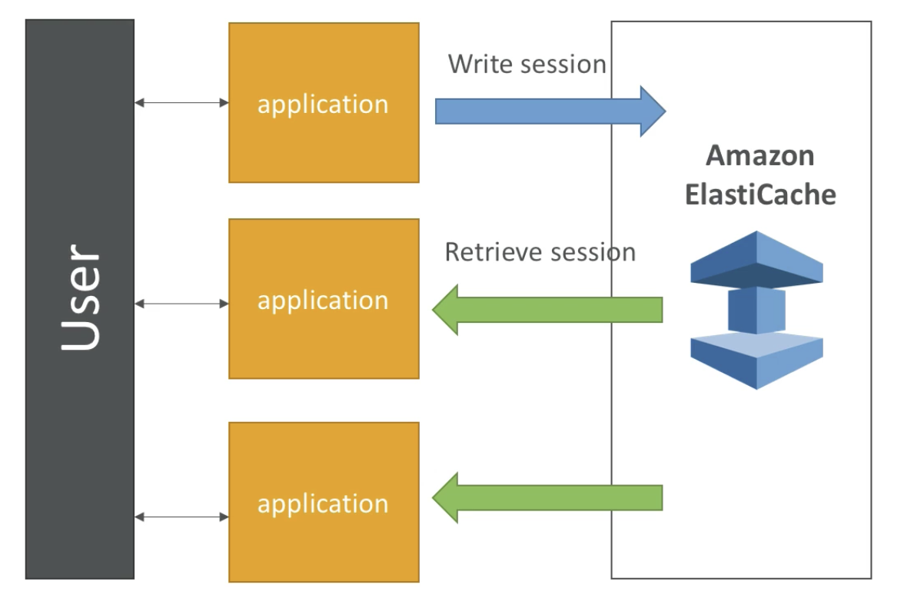

# Relational Database Service(RDS)

AWS 클라우드에서 managed database를 생성할 수 있으며, SQL query language를 사용한다.

- Postgre
- MySQL
- MariaDB
- Oracle
- Microsoft SQL Server
- Aurora

## DB in instance에 비한 RDS의 이점

- Managed Service이다
  - 자동화된 프로비져닝, OS patching을 제공한다.
  - Point in Time Restore이라는 특정 타임스탬프가 기록되어, 지속적으로 backup해두고 해당 시점으로 restore할 수있다.
  - 모니터링 대시보드 제공
  - Read performance를 위해 Read replica 제공
  - 재해 복구(DR)를 위해 Multi AZ 셋업을 제공한다.
  - 업그레이드를 위한 maintenance windows를 제공한다.
  - Vertical/Horizontal Scaling이 가능하다.

<Warning>
  AWS는 SSH로 직접 RDS에 접근하는 것을 제한하고 있다. RDS에 접속하고싶다면
  Endpoint를 사용하자!
</Warning>

## Backups

RDS의 백업은 **자동으로** 다음과 같이 수행된다.

- maintenance window가 켜져있는동안 daily full backup을 수행한다.
- 5분마다 RDS에 Transaction log가 기록된다.
- 따라서, 특정 상태에서 최대 5분전까지의 지점으로 restore 가능하다.
- backup 정보는 7일동안 보관된다(35일까지 늘릴 수 있다)

이와 달리, `DB Snapshot`은 **수동으로** 수행되는 backup이다.  
Snapshot은 원하는 기간만큼 보관해 둘 수 있다.

## Read Replica

원본 RDS 인스턴스의 읽기/쓰기 부하량 분산을 위해, 원본을 snapshot 뜬 복제 RDS를 만들어 읽기 작업을 처리한다.  
즉, <U>**read scalability를 위한 기능**</U>이다.

이 때, 최대 5개의 레플리카까지 생성 가능하며, 같은 AZ나, 다른 AZ나, 다른 region에도 만들 수 있다.

주의할 점은, Replication이 <U>**비동기적**</U>이라는 것이다.
Application은 레플리카들을 원본과 동일하도록 변경(leverage)시키기 위하여 connection string을 업데이트해야한다.
업데이트를 주기적으로 수행되어 결과적으로는 동일해지지만(eventually consistency), 업데이트 이전까지는 정보에 차이가 있을 수 있다.

또한, 이런 방식으로 복제해 낸 replica를 승격시켜 독립된 새 DB로서 사용할 수도 있다.

<Info>
  통계분석을 위한 reporting Application을 사용하는 경우를 예로 들 수 있다.
  기존의 애플리케이션 load에 reporting app load까지 더해진다면 overload 될 수
  있으므로, 이 경우 replica를 사용해 reporting app에 read를 제공한다.
</Info>
<Warning>
  Read Replica는 오직 SELECT 기능만 수행한다. 따라서 INSERT, UPDATE, DELETE
  쿼리는 수행할 수 없다.
</Warning>
Read Replica를 메인 인스턴스와 다른 AZ에 만들 시, data update시마다 network 비용이 과금된다.
따라서, 이를 줄이기 위해서는 replica를 메인 인스턴스와 같은 AZ에 만들어야한다.

## Multi AZ(Disaster Recovery)

Read Replica와 달리, **동기적**인 replication이다.

특정 AZ에 있는 메인 RDS 인스턴스는 다른 AZ의 대기(standby) 인스턴스에 동기적으로 복제된다.
이 인스턴스들은 하나의 DNS name을 가지고 있어, 메인 인스턴스에 대한 요청이 failover할 경우 요청이 대기 인스턴스로 전환된다.
또한, 메인 인스턴스가 있는 AZ가 통째로 날아가거나, network failure가 발생할 경우 자동으로 대기 인스턴스가 메인 인스턴스로 승격된다.
이러한 과정은 완전히 자동수행된다.

또한, 데이터 복구를 위한 옵션이므로 <U>**대기 인스턴스는 일체의 읽기/쓰기 작업등이 불가능**</U>하다.
따라서 가용성(availability)를 확보하는 방법으로, scaling을 위한 방법이 아니다.

<Info>
  Read Replica가 DR을 위한 Multi AZ 인스턴스로 설정될 수 있다. 시험 단골문제기도
  하다.
</Info>

## Security

### Encryption

- 저장 상태 암호화(Encryption) - 전송되거나 이동하지 않고 저장되어있는 상태의 DB 정보 암호화

  - `AWS KMS`(Key Management System)로 원본/read replica들을 AES-256 암호화할 수 있다
  - 인스턴스 런칭시에 설정해주어야 한다
  - **원본 인스턴스가 암호화 되어있지 않으면 read replica도 암호화할 수 없다**
  - Oracle과 SQL Server는 Transparent Data Encryption(TDE)라는 암호화를 따로 제공한다

- 이동 상태 암호화(In-flight encrpytion) - 전송 중인 데이터를 암호화하는 기술
  - SSL 인증서 사용 가능
  - DB에 연결할 때 신뢰할만한 SSL 인증서 제출 옵션을 켤 것
  - **모든 이용자에게 SSL 사용을 강제할것**
    - PostgreSQL : AWS Console Parameter Group에서 `rds.force_ssl=1`
    - MySQL : DB에 `GRANT USAGE ON *.* TO 'mysqluser'@'%' REQUIRE SSL;` 쿼리 사용

### RDS 암호화 Operations

- RDS 백업 암호화

  - RDS snapshot의 암호화 여부는 원본 RDS DB의 암호화 여부를 따라간다.
  - 그러니까 DB를 암호화 시킨 뒤 snapshot을 뜨면 된다

- 비암호화된 RDS를 암호화하기
  1. 비암호화된 RDS의 snapshot을 뜬다.
  2. 해당 snapshot을 복제하면 복제된 snapshot을 암호화할 수 있다.
  3. 암호화된 snapshot을 바탕으로 암호화된 RDS를 restore한다.
  4. 새 DB로 App들을 migrate하고, 기존의 DB를 삭제한다.

### Network & IAM

- 네트워크 보안

  - RDS는 일반적으로 public subnet이 아닌 private subnet에 배포된다.
  - RDS는 EC2 인스턴스와 동일하게 security group에서 어떤 IP/SG이 RDS와 communicate가 가능한지 설정할 수 있다.

- Access Management
  - IAM policies로 누가 RDS API로 RDS를 manage할 것인지 설정할 수 있다.
  - DB에 로그인하기 위해서는 기존의 Username과 Password가 필요하다.
  - MySQL & PostgreSQL RDS 한정으로 IAM-based Authentication으로 DB 로그인이 가능하다.
    - 15분짜리 auth token으로 password 없이 로그인 가능
    - 이점
      - Network In/Out이 반드시 SSL로 암호화되도록 강제
      - DB 자체적인 관리가 아니라 IAM에서 user를 관리하므로 중앙화된 authentication 가능
      - IAM Roles와 EC2 instance 프로필을 활용하여 easy integration

### Security Checklist

- DB SG의 inbound rules에 ports / IP / SG 체크
- DB 자체적으로 user를 creation하고 permission할 것인가? 아니면 IAM을 사용할 것인가?
- DB의 public access 허용여부
- parameter group이나 DB 세팅은 SSL 연결을 통해서만 할 수 있도록 강제하기

반면, AWS가 다 알아서 해주므로 이런 것은 걱정할 필요없다.

- SSH access 필요 없음
- 수동 DB patching 필요 없음
- 수동 OS patching 필요 없음
- underlying instance를 audit(특정 DB 작업 모니터링, 기록정보 수집/추적)할 필요 없음

## Aurora

AWS 전용 RDS 서비스이다.  
Postgres와 MySQL 드라이버를 모두 지원하므로 해당 DB인것 처럼 사용 가능하다.

AWS Cloud에 특화된 서비스로, RDS MySQL 대비 약 5배의 성능, Postgres의 약 3배 성능을 제공한다.

스토리지는 10GB씩 자동으로 grow하며, 최대 64TB까지 지원한다.
또한, MySQL이 5개의 Read Replica를 지원하는 것과 달리 최대 15개의 Read Replica를 지원하며, replication process도 더 빠르다(10ms 이하)

클라우드 기반이므로 고가용성이고, Faileover 처리가 instantaneous하여 타 RDS보다 처리가 훨씬 빠르다.

RDS보다 20%가량 비싸지만, 효율적인 서비스.

### Aurora의 High Availability, Read Scaling

- 3 AZ간에 6개의 복사본을 저장

  - 4/6 쓰기, 3/6 읽기 [쿼럼](https://aws.amazon.com/ko/blogs/korea/amazon-aurora-under-the-hood-quorum-and-correlated-failure/)
  - peer-to-peer replication으로 자동 복구(회복) 기능
  - 스토리지가 약 100 여개의 볼륨에 [스트라이핑](https://m.blog.naver.com/PostView.nhn?blogId=limoremo&logNo=220059411083&proxyReferer=https:%2F%2Fwww.google.com%2F)된다.

- 메인 인스턴스에 대하여 30초 내로 automated failover - 아주 빠름
- **메인 인스턴스 failover 시 임의의 Read Replica를 메인 인스턴스로 승격시킬 수 있다**
- Cross Region Replication을 지원한다.

### Aurora DB Cluster

Aurora의 스토리지와 Read Replica는 auto scaling된다.

이 때, 5개도 아니고 총 15개나 되는 read replica scaling을 제공하므로, 이 모든 인스턴스를 일일이 추적하거나 연결하기는 어렵다.  
따라서 RDS와 달리 메인 인스턴스에 대한 _Writer Endpoint_, Read Replica들에 대한 *Reader Endpont*를 제공한다.  
Reader Endpoint는 각 레플리카들에 대한 connection과 load balancing을 제공한다(lb in connection level, not state level)

### Features

- Automatic fail-over
- Backup and Recovery
- Isolation and security
- Industry compliance
- Push-button scaling
- Automated Patching with Zero Downtime
- Advanced Monitoring
- Routine maintenance
- Backtrack : 백업 없이, 언제든 돌아가고 싶은 시점으로 restore 가능

### Security

MySQL, Postgres와 같은 엔진을 쓰므로 RDS security와 비슷하다.  
**IAM authentication을 제공한다.**

### Aurora Serverless

Aurora 사용 기록에 맞추어 자동으로 database instantiation과 auto scaling을 제공해주는 서비스이다.

자주 사용하지 않고(Infrequent), 간헐적(Intermittent)이거나, 예상하기 힘든(Unpredictable) workload에 효율적이다.

capacity planning 할 필요가 없으며, 초 당 부과하므로 cost-effective할 수 있다.

Aurora는 client와 DB 사이에 Proxy Fleet를 두어서, Aurora DB의 managing과 scaling을 조절한다.

### Global Aurora

- Aurora Cross Region Read Replicas
  - Disaster Recovery에 유용
  - 설정하기 쉬움
- Aurora Global Database(recommended)
  - 1 개의 1차 Region(읽기/쓰기)
  - 최대 5개의 2차 Region(읽기), replication lag 1초 이하
  - 2차 region마다 최대 16개까지 Read replica 생성 가능
  - 따라서 latency를 줄이는 데에 효과적
  - 메인 region에 문제가 있어(DR) 다른 region에 promote할 경우 복구시간 1분 이하

---

# ElastiCache

`RDS`가 RDBMS와 관련된 서비스라면, `ElastiCache`는 Redis나 Memcached에 관련된 서비스이다.  
즉, <U>**Cache([OS 참조](https://github.com/SeongIkKim/TIL/blob/master/OperatingSystem/200414_OS_2.md#caching))**</U>를 위한 RDS\*\*라고 보면 될듯.

<Info>
  캐시(Cache)는 극도로 높은 성능과 낮은 지연율을 가진 in-memmory DB이다.
</Info>

## 특징

- read intensive workload 감소
- [stateless](https://junshock5.tistory.com/83) application 가능
- [샤딩(Sharding)](https://nesoy.github.io/articles/2018-05/Database-Shard)을 이용한 쓰기 scaling
- Read Replica를 이용한 읽기 scaling
- Multi AZ로 Failover Capability 확보
- AWS가 OS maintenance / patching, 최적화, 셋업, 환경설정, 모니터링, failure recovery, 백업

## Solution Architecture - 유저 세션 저장

어떤 애플리케이션이 있고, ElastiCache를 공유하는 그 애플리케이션의 여러 인스턴스가 있다고 하자.

유저가 한 인스턴스에 로그인하면, 해당 인스턴스는 ElastiCache에 session을 write한다.  
이후, 그 유저가 다른 인스턴스에 접속하면, 해당 인스턴스는 먼저 ElastiCache를 확인하여 session을 retrive한다.  
그러면 유저는 다른 인스턴스에 접속했음에도 세션이 유지되어 자동으로 로그인 상태가 된다.

## Redis vs Memcached

Redis는 RDS와 비슷하고, Memcached는 퓨어 cache에 가까움.

**Redis**

- **Multi AZ** with Failover
- **Read Replica**로 읽기 scaling 지원, **고가용성**
- [AOF(Append Only File)](https://mozi.tistory.com/370) persistence를 사용한 Data Durablity
- **백업과 복구 기능**

**Memcached**

- Data Partitioning에 멀티노드 사용(sharding)
- **Non Persistance**
- **백업, 복구 없음**
- 멀티쓰레드 아키텍쳐

## Caching Implementation Considaration(Best Practice)

[AWS Doc을 참고할것!](https://aws.amazon.com/caching/best-practices/)
