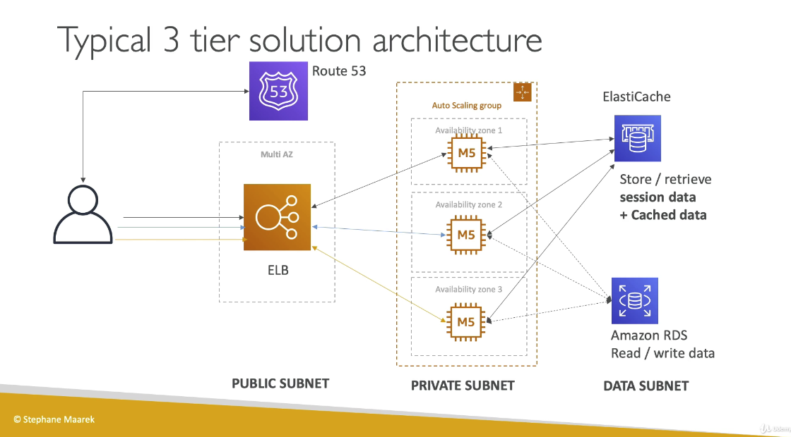

포스팅에 포함된 모든 슬라이드의 출처는 Stephane Maarek의 Udemy 강의입니다. 혹시 틀린 설명이 있을 경우 댓글로 남겨주시면 감사하겠습니다.

# Virtual Private Network(VPC)

`VPC`는 <U>region 내에서</U> 리소스를 배포하는 사설 망이다.

`Subnet`은 <U>AZ 종속적이며</U>, VPC 내부에 리소스들의 구획을 나눌 수 있도록 해준다 .

- Subnet은 인터넷 접근 가능 여부(`Route Table`의 유무)에 따라 분류된다.
  - Public Subnet : 인터넷에서 접속이 _가능한_ 서브넷
  - Private Subnet : 인터넷에서 접속이 _불가능한_ 서브넷. private하고 secure한 환경 구성을 위해 사용된다.

## Internet Gateway & NAT Gateway

`Internet Gateway`

- VPC 인스턴스와 인터넷을 연결시켜주는 게이트웨이
- Public Subnet은 Internet Gateway로 통하는 route를 가지고 있다.

`NAT Gatway(AWS-managed) & NAT Instances(self-managed)`

- Private Subnet이 SW업데이트 등의 이유로 인터넷에 연결해야 할 때, 이를 처리해주는 게이트웨이
- NAT Gateway를 사용하면 Private 상태를 유지한 채로 인터넷에 접속할 수 있다.

## Network ACL & Security Group

`Network ACL(NACL)`

- **Subnet**을 드나드는 모든 트래픽을 제어하는 방화벽
- ALLOW, DENY 룰을 가질 수 있다
  - 이 때, 룰은 IP 주소만 포함할 수 있다
- **Subnet 레벨**로 붙인다.
- stateless : 반환 트래픽은 룰에 의해 명시적으로 허용되어야 한다.

`Security Groups`

- **ENI(Ethernet Networking Interface)와 EC2 인스턴스**를 드나드는 모든 트래픽을 제어하는 방화벽
- ALLOW 룰만 존재
  - 이 때, 룰은 IP 주소뿐만 아니라 다른 Security Group도 포함할 수 있다
- 즉, VPC/Subnet/EC2 인스턴스 형태로 구성된다면, EC2 인스턴스로 접근하는 트래픽은 **1차적으로 NACL을 통과 후 2차적으로 Security Group을 통과해야한다.**
- statefull : 반환 트래픽은 룰과 관계없이 자동적으로 허용된다.

[보안 그룹 및 네트워크 ACL 비교(AWS Docs)](https://docs.aws.amazon.com/ko_kr/vpc/latest/userguide/VPC_Security.html#VPC_Security_Comparison)

## Flow Logs

인터페이스로 접근하는 모든 IP 트래픽의 정보를 저장하여 로그로 남길 수 있다.
구체적으로 캡쳐하는 로그는 다음과 같다.

- VPC Flow Logs
- Subnet Flow Logs
- Elastic Network Interface Flow Logs

이 로그를 이용하여 연결 이슈를 모니터링하고, 트러블슈팅할 수 있게 된다.

예를 들어서, 왜 서브넷이 인터넷에 접속할 수 없는지(Subnet to Internet),
왜 한 서브넷과 다른 서브넷이 연결되지 않는지(Subnet to Subnet),
왜 인터넷에서 왜 서브넷으로 접속할 수 없는지(Internet to Subent) 등의 경우를 해결하기에 효과적이다.

또한, `VPC Flow Log`를 이용하여 AWS managed Interface(Elastic Load Balancer, ElastiCache, RDS, Aurora)의 네트워크 정보도 수집할 수 있다.

`VPC Flow Log`는 S3나 CloudWatch Logs에도 저장할 수 있다.

## Peering

AWS 네트워크를 사용하여 2개의 VPC를 연결하여 마치 하나의 네트워크인것처럼 동작하게 할 수 있다.

<Warning>
  VPC Peering 시에, CIDR(IP 주소 범위)가 겹치지 않도록 하는 것이 중요하다.
  하나의 네트워크로 합쳐졌을 때 CIDR이 겹쳐져 있다면, 어느 쪽으로 가야하는 지 알
  수 없기 때문.
</Warning>
<Warning>
  VPC A,B,C가 있을때, A-B를 Peering하고, B-C를 Peering한다고 해서 A-C가
  연결되지는 않는다. 서로 다른 VPC가 연결되려면 반드시 둘 사이에 직접적인
  Peering이 되어야한다. 이를 transivity가 성립하지 않는다고 말한다.
</Warning>

## VPC Endpoint

`VPC Endpoint`는 public www 네트워크 대신에 private network를 통하여 AWS 리소스에 접근하도록 허용한다.

따라서, 보안 수준을 높이고 AWS 서비스 연결 시 지연속도를 낮춰준다.

- `VPC Endpoint Gateway` : S3 & Dynamo DB
- `VPC Endpoint Interface` : 이외의 다른 서비스들

S3, Dynamo DB와 같은 서비스는 Endpoint Gateway를 통하여 VPC 내부의 인스턴스와 연결할 수 있고,
이외의 다른 서비스들은 ENI를 가진 Endpoint Interface를 통하여 VPC 내부에서 외부로 pravate access가 가능하다.

#

<U>
  VPC Endpoint는 VPC 내부에서 VPC 외부의 다른 리소스들과 private
  access(connect)가 필요할 때 사용한다.
</U>

## Site to Site VPN & Direct Connect

기존에 존재하던 on-premise 데이터 센터 VPN과 AWS VPC를 연결하고 싶을 경우, 두 가지 방법을 사용할 수 있다.

- `Site to Site VPN`
  - Public www를 통하여 VPC와 연결한다.
  - 단, 보안을 유지하기 위해 연결은 암호화된다.
- `Direct Connect(DX)`
  - on-premise 데이터 센터와 AWS에 physical connection을 만든다.
  - private network를 통하므로, priavate하고, 안전하며 빠르다.
  - 설치하는데에 최소 한 달이 걸린다.

그러나, <U>두 방식 모두 VPC Endpoint에 액세스할 수 없다.</U>
VPC Endpoint는 VPC 내부에서 AWS의 리소스에 접근할 때 사용할 수 있기 때문이다.

#

---

## 일반적인 3티어 솔루션 아키텍쳐

위의 그림은 AWS 솔루션 아키텍쳐의 일반적 사용으로, 3티어로 서브넷을 분리하여 아키텍쳐를 구성하는 예시이다.

과정은 다음과 같다.

1. 유저는 `Route 53`을 통해 도메인 네임에 해당하는 IP주소를 받는다.
2. 받은 IP 주소를 이용하여 유저는 `ELB`로 요청을 보낸다.
3. [Public Subnet] `ELB`는 Private Subnet에 있는 `Auto Scaling Group`에 요청을 전달한다.
4. [Private Subnet] `ASG` 내부의 AZ들에는 각각 인스턴스들이 있고, 이 인스턴스들은 `ElastiCache`, `RDS`와 데이터를 주고받는다.
5. [Data Subnet] `ElastiCache`는 세션데이터와 캐시 데이터를 저장/참조하고, `RDS`는 데이터 읽기/쓰기를 지원한다.

이처럼 Public-Private-Data Subnet으로 이뤄지는 3 티어의 Subnet사용이 가장 보편적이고 간단한 솔루션 아키텍쳐 중 하나이다.

## LAMP Stack on EC2

LAMP란 *L*inux - *A*pache - *M*ySQL - *P*HP의 앞 글자를 딴 말로, 가장 보편적으로 사용되었던 서버 구성 스택을 일컫는다.

이를 `EC2`에 적용시키면,

- Linux : `EC2`의 OS로 설정
- Apache : `EC2` 리눅스 위에 돌아가는 Web Server로 설치
- MySQL : `EC2`에 연결된 `RDS`
- PHP : `EC2`의 Application logic

여기에 추가하여 Redis / Memcached (`ElastiCache`)를 포함시켜 캐싱을 가능하게 할 수도 있고,  
로컬 앱 데이터나 SW를 저장하기 위해 `EBS` 드라이버를 사용할 수도 있다.

~~요새도 LAMP를 많이들 쓰는지 모르겠다. 내가 새내기였을 때도 LAMP는 점점 안쓰는 추세였다.~~
