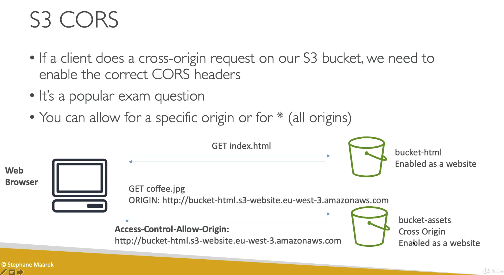

포스팅에 포함된 모든 슬라이드의 출처는 Stephane Maarek의 Udemy 강의입니다. 혹시 틀린 설명이 있을 경우 댓글로 남겨주시면 감사하겠습니다.

# S3

`Bucket`에 `Object`(파일)를 보관하는 서비스

Bucket은 region 종속적이지만, <U>globally unique name</U>을 가져야 한다.  
Bucket의 naming convention은 다음과 같다.

- 대문자를 사용하지 않음
- 언더스코어(\_)를 사용하지 않음
- 3-63자 길이
- IP가 아니어야 함
- 소문자나 숫자로 시작해야함

---

## Object(files)

Object는 Key를 가지고 있으며, Key는 버킷 내에서 **해당 파일의 FULL PATH**를 의미한다.

예를 들어, my-bucket이라는 이름의 Bucket내부에 my_file.txt가 있다고 하면, 해당 파일의 경로는 다음과 같이 표시할 수 있다.

- `S3://my-bucket/my_folder1/another_folder/my_file.txt`
- 이 때, my-bucket/ 이하의 full path를 Key라고 일컫는다.
- Key는 prefix와 object name으로 이루어져있다. 따라서 위의 경로에서..
  - Key : `my_folder1/another_folder/my_file.txt`
  - prefix : `my_folder1/another_folder/`
  - object_name : 'my_file.txt'

### Object 구성

- `value` : body의 내용물
  - 단일 Object의 최대 저장 가능 사이즈는 5TB(5000GB)
  - 만약 단일 PUT의 용량이 5GB를 넘어가면, **multi-part upload**를 사용해야한다.
    - Multi-part Upload는 5MB부터 5TB의 경우까지 사용할 수 있다.
  - 버킷 자체에는 용량 제한이 없다(infinity)
- `meta-data` : 시스템이나 유저 정보에 관한 키값 쌍 리스트
- `tags` : 최대 10개까지 저장할 수 있는 유니코드 키값 쌍. 보안이나 라이프사이클에 유용하다.
- 'version ID' : 버져닝이 활성화되어있을 경우에 존재한다

## Versioning

Bucket 레벨에서 Versioning 옵션을 활성화 할 수 있다.  
Versioning 옵션이 켜져 있을 경우, 동일한 파일을 저장할 때 그대로 덮어씌워지는 것이 아니라 1,2,3 씩 변경사항을 적용시킨 버전을 모두 보관해둔다.

버킷 Versioning을 설정 해놓는 것이 best practice.

- 의도치 않게 삭제하는 것을 방지할 수 있다(버전 복구 기능을 이용하면 된다)
- 이전 버전으로 롤백이 쉽다.

<Info>
  Versioning을 켜기 이전, 버전이 존재하지 않는 파일들은 'null' 버전이 표시된다.
  또한, Versioning을 비활성화하여도 이전에 저장된 버전들은 사라지지 않는다.
</Info>

---

## Object 암호화

S3의 Object를 암호화하는 방식은 총 4가지가 있다.

1. **SSE-S3** : AWS에 의해 관리/핸들링 되는 키(S3 Managed Data Key)를 사용해 암호화하기
2. **SSE-KMS** : 암호화 키 관리에 `AWS Key Management Service` 이용하기
3. **SSE-C** : 직접 암호화 키를 관리하고 싶을 때
4. Client Side Encryption

상황에 맞추어 네 가지 방식을 적절히 사용하는 것이 중요하다.

### SSE-S3

암호화에 S3 Managed Data Key를 이용한다.

- 서버 사이드 암호화
- AES-256 암호화 알고리즘 사용
- HTTP 헤더에 `"x-amz-server-side-encryption" : "AES256"`을 붙여야 한다.

각 오브젝트는 unique한 데이터 키로 암호화되며, 이 데이터키는 정기적으로 교체되는 마스터키가 암호화한다.
S3 자체적으로 생성하는 키들.

### SSE-KMS

암호화에 KMS의 키를 이용한다.

- 다른 계정의 KMS master key를 사용할 수도 있다(ARN을 입력하면 된다)
- 장점 : 키 유저를 컨트롤할 수 있고, 감사 추적(audit trail)이 가능하다.
  - 감사 추적이란, 리소스 사용에 따라 기록된 사용 내역을 의미한다.
- 서버사이드 암호화
- HTTP 헤더에 `"x-amz-server-side-encryption" : "aws:kms"`을 붙여야 한다.

SSE-KMS의 aws/s3 key 옵션은 SSE-S3 방식과 다르다.  
KMS는 `customer master key(CMKs)`라고 불리는, KMS가 생성한 키를 이용하여 S3를 암호화한다.  
따라서 <U>마스터 키를 사용할 수 없다</U>.

#

모든 키의 사용과 관리가 KMS를 통해 중앙적으로 제어되므로, audit과 logging 등도 가능하다.
자세한 내용은 [S3 Data Protection 관련 블로그 글](https://jayendrapatil.com/tag/sse-kms/)을 참조한다.

### SSE-C

AWS 외부의 Customer가 관리하는 데이터 키를 이용한다.

- 서버사이드 암호화
- S3는 Customer가 제공하는 키를 저장하지 않는다(저장하면 보안사고..)
- 통신 중 키가 탈취되지 않도록 보안에 유의해야 하므로 **반드시 HTTPS를 사용**한다.
- 암호화 키가 매 HTTP요청마다 헤더에 붙어야한다.

### Client Side Encryption

Customer가 직접 `Amazon S3 Encryption Client`같은 클라이언트 암호화 라이브러리를 이용한다.

- S3에 파일을 올리기 전에 암호화 해야한다.
- S3에서 파일을 내려받은 이후 복호화 해야한다.
- Customer가 키와 암호화 사이클을 완전히 관리한다.
- HTTP/HTTPS를 모두 사용할 수 있다(이미 암호화 된 파일이므로)

---

## 전송 암호화(SSL/TLS)

S3는 다음과 같은 엔드포인트 선택지를 제공한다.

- HTTP endpoint : 암호화되지 않음, public
- HTTPS endpoint : 전송 중 암호화 처리 --> Encrpytion in flight은 SSL/TLS라고도 불린다.

둘 중 어느것을 사용해도 되지만, HTTPS 엔드포인트를 사용하는것이 권장된다.  
대부분의 클라이언트들은 HTTPS 엔드포인트를 디폴트로 사용하고 있다.
또한, SSE-C에서는 HTTPS 엔드포인트만을 사용할 수 있다.

---

## S3 Security

- User based
  - IAM policy - IAM policy로 특정 User가 S3에 접근하는 것을 허용
- Resource based
  - <U>
      Bucket Policies
    </U> - S3 콘솔에서 bucket단위로 통하는 룰 --> cross account를 허용한다!
  - Object Access Control List (ACL) - 각 Object에 대하여 Access Rule을 설정하는 것(finer grain)
  - Bucket Access Control List (ACL) - Bucket에 대하여 Access Rule을 설정하는 것(less common)

이 때, 다음과 같아야만 IAM principal이 S3 오브젝트에 접근할 수 있다.

- 유저 IAM permission에서 이를 허용 <U>OR</U> 리소스 policy가 이를 허용
- <U>AND</U> 해당 유저에 대한 명시적인 bucket policy DENY가 없어야 한다.

### S3 Bucket Policies

S3 버킷 폴리시는 다음과 같은 이유로 사용한다.

- 버킷에 대한 public access를 허용하기 위하여
- 오브젝트가 업로드될 때 암호화하도록 강제하기 위하여
- 다른 계정의 액세스를 허용하기 위하여(Cross Account)

JSON based polices의 구성

- Resources : 버킷과 오브젝트
- Actions : Allow 또는 Deny에 대한 API Set
- Effect : Allow 또는 Deny
- Principal : 해당 policy를 적용할 계정이나 유저

<Info>
  JSON - Resources를 작성할 때, 모든 오브젝트에 관해 적용시키고 싶다면 반드시
  버킷 ARN뒤에 `/*`을 붙이자. 이를 명시하지 않으면 리소스를 제대로 명시하지
  않았다는 오류가 뜬다.
</Info>

### Bucket settings for Block Public Access

버킷에 대한 Public Access를 막는 세팅은 총 4 종류가 있다.

- 버킷과 오브젝트에 대한 퍼블릭 액세스를 모두 막되,
  - _new_ access control list(ACLs)의 방식만 허용
  - _any_ access control list(ACLs)의 방식만 허용
  - _new_ publick bucket 또는 access point policies만 허용
- _any_ public bucket 또는 access point policies로 버킷과 오브젝트에 대한 public, cross-acount access 막기

### 그 외에..

- Networking : VPC 엔드포인트를 지원함(인터넷을 통하지 않은 인스턴스끼리의 통신)
- Logging and Audit
  - Access Log를 다른 S3 버킷에 저장할 수 있음
  - API 콜은 `AWS CloudTrail`에 저장될 수 있음
- User Security
  - MFA Delete: 버져닝된 버킷에서 오브젝트를 지울때 MFA를 요구하도록 설정할 수 있음
  - Pre-Signed URLs : 한정된 시간동안만 유효한 URL 생성 가능(ex - 로그인 유저에게 서비스되는 프리미엄 비디오 같은 경우)

## S3 Websites

S3로 정적 웹사이트를 호스팅하고, 인터넷에서 접속 가능하게 만들 수 있다.

URL은 아래의 둘 중 하나의 방식으로 구성된다.

- `<bucket-name>.s3-website-<AWS-region>.amazonaws.com`
- `<bucket-name>.s3-website.<AWS-region>.amazonaws.com`

<Info>
  403 에러가 뜬다면, bucket policy가 public reads를 허용하고있는지 확인하자!
</Info>

---

## CORS

**Origin**은 scheme(프로토콜), host(도메인), port를 의미한다.  
예를 들어 `https://www.example.com`이라는 URL은 다음과 같은 Origin 정보를 내포하고 있다.

- 프로토콜 : HTTPS
- 호스트 : example.com
- 포트 : 443(HTTPS)(, 80(HTTP))

CORS(Cross-Origin Resource Sharing)는 다른 Origin에서 Resource를 공유하려고 시도했다는 뜻이다.

#

웹브라우저는 기본적으로 main origin 내에 있는 다른 origin만 방문 할 수 있도록 보안처리(Web-based Security)되어있다.

- 같은 origins의 예시 : **http://example.com**/app1 & **http://example.com**/app2
- 다른 origins의 예시 : `http://www.example.com` & `http://other.example.com`

한 Origin이 request를 보냈을 때,

<U>
  다른 Origin이 CORS header(ex:Access-Control-Allow-Origin)를 이용한 request를
  allow하고 있어야만
</U> 받아들여진다.

주의할 점은,  
요청을 보내는 쪽의 버킷이 아니라,

<U>
  Cross Origin(교차 참조 요청을 받는) 버킷에 올바른 CORS Header의 형식이
  설정되어있어야 한다
</U>는 것이다.

#

---

## Consistency Model

- S3 내에서, 오브젝트의 PUT(write, 업로드)가 끝나야만 GET(read)을 할 수 있다.
  - 새로운 오브젝트가 write되면, retrive할 수 있다.
    - ex) PUT 200 -> GET 200
  - 만약 object가 exist(write 완료)한 것을 확인하기 전에 GET요청을 한다면, retrive가 정상적으로 되지 않는다.
    - ex) GET 404 -> PUT 200 -> GET 404
    - 이를 `eventually consistent(결과적,최종적 일관성)`라고 한다.
- 이미 존재하는 오브젝트에 대한 DELETES, PUTS의 `Eventual Consistency`
  - 오브젝트를 업데이트한 후에 읽으려면, 구 버전의 오브젝트를 삭제해야한다
    - ex) PUT 200 -> PUT 200 -> GET 200(이럴 때 구버전을 GET하는 경우가 생긴다)
  - 오브젝트를 삭제하더라도, 잠시동안은 retrive할 수 있다
    - ex) DELETE 200 -> GET 200

<Info>S3에서 'Strong Consistency(강한, 즉각적 일관성)'를 가진 API는 없다.</Info>
<Info>
  Eventual Consistency와 Strong Consistency는 자주 비교되는 대상으로, 국내에서
  오역/의역이 많은 용어이다. Eventual Consistency의 경우 변경 직후 잠시동안은
  변경사항이 적용되지 않은 상태로 제공되었다가, 추후에 업데이트 값이 반환되어
  최종적으로는 변경사항이 모두 적용되는 것을 일컫는다. 반대로, Strong
  Consistency는 데이터 변경 즉시 모든 변경사항이 적용되고, 누구나 이를
  즉각적으로 확인할 수 있는 것을 일컫는다. 쉽게 말하자면 Eventual Consistency는
  '업데이트가 제대로 적용되는 데에 시간이 좀 걸리는 군', Strong Consistency는
  '변경하자마자 바로 업데이트되었군' 정도로 볼 수 있다.
</Info>
